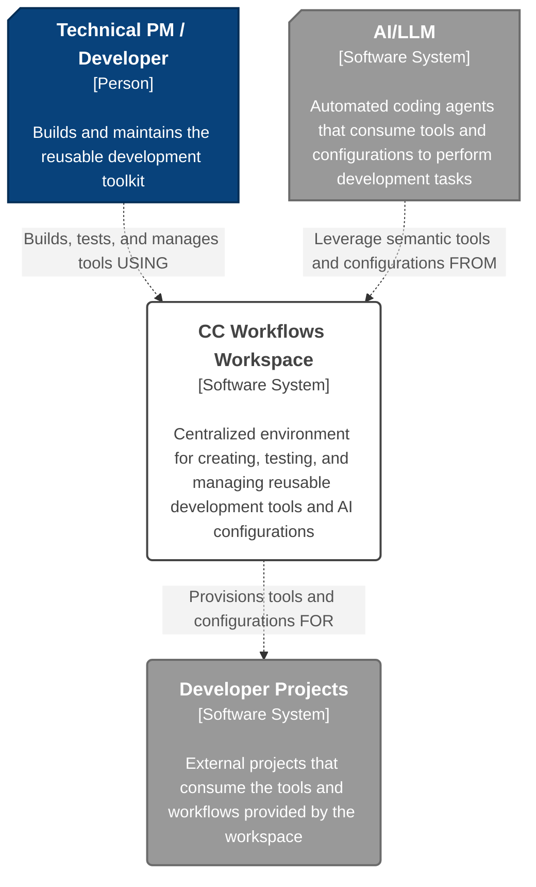

# CC Workflows Workspace - Architecture

<critical-instruction>
**Critial LLM Initialization Instructions**: When first reading this file, you MUST IMMEDIATELY run citation manager to extract base paths: `npm run citation:extract:content {{this-file-path}}`
</critical-instruction>

**Purpose**:
- Provide a **centralized** **workspace** that acts as a **single source of truth** for development tools by establishing shared infrastructure for testing and builds.
- Accelerate development by providing a refined and repeatable platform for building new tools and workflows.

**User Value Statement:** Eliminates the manual and repetitive effort of porting workflow improvements across different projects, significantly reducing time spent on "meta-work".

> **Note**: This document is intended to be a living document. Update the document immediately when code changes affect architecture.

## Target Users

**Primary User**s:
- **Technical Product Manager** (Wesley) - Eliminating fragmented workflow development and establishing a refined, repeatable framework for building AI-assisted development tools
- **AI Coding Assistants** - Leveraging centralized semantic tools, testing frameworks, and standardized configurations to deliver consistent, reliable automation across development workflows

**Secondary Users**:
- **Future Team Members**: Learning established patterns and contributing to the centralized toolkit
- **AI-Assisted Developers**: Understanding architecture that scales beyond simple projects and supports complex semantic tooling
- **Community Members**: Adapt patterns for their own workflows

---
## Core Architectural  Style and Principles

The system's design is guided by core principles that prioritize **simplicity, maintainability, and extensibility** through a **modular, CLI-first architecture.**

Read [ARCHITECTURE-PRINCIPLES](ARCHITECTURE-PRINCIPLES.md) %% force-extract %%

### TypeScript Strengthens Core Principles

**TypeScript as Architecture Enabler:**

- **Data-First Design**: TypeScript enforces explicit type contracts for all data structures, making data schemas first-class citizens that serve as living documentation and compile-time validation.

- **Fail Fast**: TypeScript surfaces type errors at compile-time rather than runtime, catching contract violations before code executes and reducing debugging cycles.

- **Self-Contained Naming**: Type annotations provide immediate inline documentation, reducing cognitive load and making interfaces self-documenting without external lookup.

- **Modular Design**: TypeScript's type system enforces explicit API boundaries between modules, preventing accidental coupling and ensuring each component's contract is clearly defined.

**Implementation**: TypeScript compilation (`tsc`) is integrated into the build pipeline, with strict type checking enabled to maximize these benefits. Type definitions (`.d.ts`) are generated alongside compiled output, enabling type-safe consumption by other tools and projects.

### Architectural and System Design

- **Architecture Pattern:** Monorepo (multi-package workspace) — a single repo acting as a [centralized, single source of truth](ARCHITECTURE-PRINCIPLES.md#^foundation-reuse) for multiple, distinct development utilities. The first tool is the `citation-manager`.

- **System Design:** tooling monorepo hosting a multi-command CLI with shared packages for test/build. This is a toolkit of independent tools that consume common services like [testing (FR2)](design-docs/features/20250928-cc-workflows-workspace-scaffolding/cc-workflows-workspace-prd.md#^FR2)and [builds (FR3)](design-docs/features/20250928-cc-workflows-workspace-scaffolding/cc-workflows-workspace-prd.md#^FR3)—not a single linear pipeline.

#### Architectural Pattern Implementations
- `Monorepo` implemented via `npm workspaces` ([NPM Workspaces vs Alternatives](<design-docs/features/20250928-cc-workflows-workspace-scaffolding/research/content-aggregation-research.md#2.1 NPM Workspaces vs Alternatives>))
- `cli multi-command` implemented via `commander` (initial). Clear upgrade path to `oclif` if/when plugin-based extensibility is required.
- `TypeScript` as primary development language with strict type checking
- `Vite` for shared development infrastructure (HMR, dev server, bundling)

### Key Software Design Patterns

- [**Modular Component Design**](ARCHITECTURE-PRINCIPLES.md#^modular-design-principles-definition): - each tool (e.g., citation-manager) is isolated for independent evolution and migration, while shared utilities live in shared packages.

### Key Characteristics
- **Primary Language**: TypeScript with strict type checking, compiled to JavaScript for execution
- **Interaction Style**: CLI-based, with commands executed via root-level NPM scripts
- **Runtime Model**: Local, on-demand execution of compiled Node.js tool scripts from `dist/` directories
- **Development Model**: Vite provides HMR and dev server for rapid iteration during development
- **Build Pipeline**: TypeScript compilation (`tsc`) for type checking and JavaScript generation, with `.d.ts` type definitions
- **Deployment Model**: Fully self-contained within a version-controlled repository; no external deployment required
- **Scaling Approach**: Scales by adding new, isolated tool packages to the workspace, with a clear migration path to more advanced tooling if the package count grows significantly. Start with `npm workspaces`; if growth demands, adopt `Nx/Turborepo` for caching & task orchestration.

### Rationale
- [**Simplicity First:**](ARCHITECTURE-PRINCIPLES.md#^simplicity-first) Native Node.js + npm integration minimizes tooling overhead.
- **Right-Sized Performance:** Optimized for ~5–10 tools/packages—fast installs/builds without premature complexity.
- **Less Meta-Work:** Shared dependencies and scripts reduce coordination cost while keeping each tool|package independently maintainable.
- [ADR-001: NPM Workspaces for Monorepo Management](#ADR-001%20NPM%20Workspaces%20for%20Monorepo%20Management)

---
## Document Overview

This document captures the baseline architecture of the CC Workflows Workspace to enable centralized development, testing, and deployment of semantic and deterministic tooling. When implementing improvements or new capabilities, this baseline serves as the reference point for identifying which containers, components, and code files require modification.

### C4 Methodology

The C4 model decomposes complex architecture by drilling down through four levels: **Context** (system boundaries), **Containers** (deployable units), **Components** (grouped functionality), and **Code** (implementation details). This structured approach enables understanding of the system at appropriate levels of detail, from high-level system interactions down to specific file and class implementations.

---
## Level 1 - System Context Diagram
This diagram shows the **CC Workflows Workspace** as a central system used by developers to create and manage a toolkit of reusable components. These components are then consumed by external **Developer Projects** and automated **AI Coding Assistants**. The workspace itself relies on Git for version control and NPM for managing its internal dependencies.

### System Context Diagram



---
## Level 2 - Containers

### Container Diagram

```mermaid
graph LR
    subgraph systemBoundary ["CC Workflows Workspace"]
        direction LR
        style systemBoundary fill:#fafafa, stroke:#555555

        subgraph infrastructure ["Infrastructure"]
            direction TB
            style infrastructure fill:transparent, stroke:#555555

            workspace["<div style='font-weight: bold'>Workspace</div><div style='font-size: 85%; margin-top: 0px'>[Node.js, NPM Workspaces, Vitest, Biome]</div><div style='font-size: 85%; margin-top:10px'>Infrastructure platform managing dependencies, orchestrating execution, and enforcing quality</div>"]
            style workspace fill:#438dd5,stroke:#2e6295,color:#ffffff
        end

        subgraph tools ["Tools"]
            direction TB
            style tools fill:transparent, stroke:#555555

            toolPackages["<div style='font-weight: bold'>Tool Packages</div><div style='font-size: 85%; margin-top: 0px'>[Node.js, Commander]</div><div style='font-size: 85%; margin-top:10px'>CLI tools for workflow automation (citation-manager, etc.)</div>"]
            style toolPackages fill:#438dd5,stroke:#2e6295,color:#ffffff
        end

        
    end

    developer["<div style='font-weight: bold'>Developer</div><div style='font-size: 85%; margin-top: 0px'>[Person]</div><div style='font-size: 85%; margin-top:10px'>Builds and maintains the reusable development toolkit</div>"]@{ shape: circle }
    style developer fill:#08427b,stroke:#052e56,color:#ffffff

    aiAssistants["<div style='font-weight: bold'>AI Coding Assistants</div><div style='font-size: 85%; margin-top: 0px'>[Software System]</div><div style='font-size: 85%; margin-top:10px'>Automated agents that consume tools and configurations</div>"]@{ shape: notch-rect }
    style aiAssistants fill:#999999,stroke:#6b6b6b,color:#ffffff

    devProjects["<div style='font-weight: bold'>Developer Projects</div><div style='font-size: 85%; margin-top: 0px'>[Software System]</div><div style='font-size: 85%; margin-top:10px'>External projects that consume the tools and workflows</div>"]
    style devProjects fill:#999999,stroke:#6b6b6b,color:#ffffff
 
    developer-. "<div>Builds, tests, and manages tools USING</div><div style='font-size: 85%'>[CLI commands]</div>" .->workspace
    aiAssistants-. "<div>Builds, tests, and manages tools USING</div><div style='font-size: 85%'>[CLI commands]</div>" .->workspace
    
    workspace-. "<div>Manages (orchestration, testing, quality, build)</div><div style='font-size: 85%'>[npm]</div>" .->toolPackages
    
    tools<-. "<div>IS USED BY</div><div style='font-size: 85%'>[CLI commands]</div>" .->devProjects

    linkStyle default color:#555555

    classDef softwareSystemFocus stroke-width:2px, fill:transparent
    class workspace,toolPackages softwareSystemFocus
```



### CC Workflows Workspace
- **Name:** CC Workflows Workspace
- **Technology:** `Node.js`, `TypeScript`, `NPM Workspaces`, `Vite`, `Vitest`, `Biome`
- **Technology Status:** Production
- **Description:** Development infrastructure platform that:
  - Manages dependencies and workspace configuration via NPM Workspaces
  - Provides TypeScript compilation and type checking via shared `tsconfig.base.json`
  - Provides Vite development infrastructure for HMR and dev server capabilities
  - Orchestrates tool execution through centralized npm scripts
  - Runs automated tests for all tools via shared Vitest framework
  - Enforces code quality standards via Biome linting and formatting (JavaScript + TypeScript)
  - Provides monorepo directory structure (`tools/`, `packages/`) for tool isolation
- **User Value:** Centralized workspace with shared infrastructure vs. scattered tools across projects, eliminating duplicated effort and reducing "meta-work" tax
- **Interactions:**
  - _is used by_ Developer (synchronous)
  - _manages_ Tool Packages (orchestration, testing, quality, build) (synchronous)
  - _provides tools and configurations for_ Developer Projects and AI Assistants

### Tool Packages
- **Name:** Tool Packages
- **Technology:** `Node.js`, `TypeScript`, `Commander` (varies by tool)
- **Technology Status:** Production
- **Description:** Individual CLI tools for development workflow automation:
  - Written in TypeScript with strict type checking
  - Compiled to JavaScript in tool-specific `dist/` directories
  - Type definitions (`.d.ts`) generated for type-safe consumption
  - Markdown validation and processing
  - Content transformation and extraction
  - Code analysis and formatting
  - _Citation Manager is the first production tool in this container_
- **User Value:** Reusable, type-safe, tested tools vs. scattered, inconsistent scripts across projects
- **Interactions:**
  - _is used by_ Developer and AI Assistants

---

## Level 3 - Components

Component-level architecture (C4 Level 3) is defined within each tool's own architecture documentation, not at the workspace level. This approach enforces our **Modular Design Principles** by treating each tool as a self-contained container, keeping the workspace architecture focused on system-level boundaries.

See the [content-aggregation-architecture](tools/citation-manager/design-docs/.archive/features/20251003-content-aggregation/content-aggregation-architecture.md)  for a reference implementation.

---
## Component Interfaces and Data Contracts

Component interfaces and data contracts are internal details of each tool container. To maintain a clean separation of concerns and treat each tool as a "black box," these specifications are defined within the respective tool's architecture document and are intentionally excluded from the parent workspace architecture.

---
## Level 4 - Code

This level details the initial organization of the workspace, its file structure, and the naming conventions that will ensure consistency as the project grows.

### Code Organization and Structure

#### Directory Organization

The workspace is organized as a monorepo using NPM Workspaces. The structure separates documentation, shared packages, and individual tools into distinct top-level directories.

```plaintext
cc-workflows/
├── design-docs/                      # Project documentation (architecture, PRDs, etc.)
├── packages/                         # Shared, reusable libraries (e.g., common utilities)
│   └── shared-utils/               # (Future) For code shared between multiple tools
├── tools/                            # Houses the individual, isolated CLI tools
│   └── citation-manager/             # The first tool being migrated into the workspace
│       ├── src/                      # Source code for the tool
│       ├── test/                     # Tests specific to the tool
│       └── package.json              # Tool-specific dependencies and scripts
├── biome.json                        # Root configuration for code formatting and linting
├── package.json                      # Workspace root: shared dependencies and top-level scripts
└── vitest.config.js                  # Root configuration for the shared test framework
```

#### Cross-Cutting Documentation Organization

**Cross-cutting features** affect the entire workspace (e.g., Claude Code skills, workspace-level tooling, shared conventions) rather than a single tool. These features live at the workspace root and follow the same [Feature Organization Patterns](#Feature%20Organization%20Patterns) documented below.

**Workspace root location:**

```plaintext
design-docs/                           # Workspace-level (cross-cutting)
└── features/
    └── {{YYYYMMDD}}-{{feature-name}}/
        └── user-stories/              # Same epic/user-story patterns
            ├── epic{{X}}-{{epic-name}}/           # Fast/simple features
            └── us{{X.Y}}-{{story-name}}/          # Slow/complex features
```

**Tool-specific location (for comparison):**

```plaintext
tools/citation-manager/
└── design-docs/                       # Tool-specific features
    └── features/
        └── {{YYYYMMDD}}-{{feature-name}}/
            └── user-stories/          # Same epic/user-story patterns
```

The key difference is **location** (workspace root vs tool directory), not structure. See [Tool/Package Documentation Organization](#Tool/Package%20Documentation%20Organization) below for complete pattern details.

#### Tool/Package Documentation Organization

Each tool or package maintains its own `design-docs/` folder structure following the same pattern as the project root, enabling self-contained documentation and feature management.

##### Feature Organization Patterns

The workspace supports two documentation patterns based on feature complexity:

**Fast/Simple Pattern (Epic-Level)**: For straightforward features with limited scope, low risk, and quick delivery timelines:
- Roll all user stories into a single epic-level design and implementation plan
- Used when: Feature is well-understood, has minimal dependencies, or requires rapid iteration
- Example: `epic1-router-implementation/` in the fast-slow-skill-variants feature

**Slow/Complex Pattern (User-Story-Level)**: For complex features with multiple dependencies, high risk, or requiring thorough validation:
- Break down into individual user stories, each with its own design and implementation plans
- Used when: Feature requires staged delivery, has unclear requirements, or needs isolated validation
- Example: Individual user stories in content-aggregation feature

**Decision Criteria**:
- **Use Epic-Level (Fast)** when: Straightforward implementation, limited scope (<5 days), low risk, team has domain expertise
- **Use User-Story-Level (Slow)** when: Complex implementation, multiple dependencies, high risk, requires staged validation

##### Directory Structure

```plaintext
tools/citation-manager/
├── design-docs/                      # Tool-level design documentation
│   ├── Overview.md                   # Tool baseline overview
│   ├── Principles.md                 # Tool-specific principles
│   ├── Architecture.md               # Tool baseline architecture
│   └── features/                     # Tool-specific features
│       └── {{YYYYMMDD}}-{{feature-name}}/
│           ├── {{feature-name}}-prd.md              # Feature PRD
│           ├── {{feature-name}}-design-plan.md      # Feature architecture and design plan
│           ├── {{feature-name}}-implement-plan.md   # (Optional) For smaller features that don't need epics and user stories
│           ├── research/                            # Feature research
│           └── user-stories/                        # Epic or user story implementations
│               ├── epic{{X}}-{{epic-name}}/         # FAST/SIMPLE: Epic-level organization
│               │   ├── epic{{X}}-{{epic-name}}-design.md
│               │   ├── epic{{X}}-{{epic-name}}-plan.md
│               │   └── tasks/                             # Task implementation details (optional)
│               │       └── task-{{task-number}}-dev-results.md
│               └── us{{X.Y}}-{{story-name}}/        # SLOW/COMPLEX: User-story-level organization
│                   ├── us{{X.Y}}-{{story-name}}.md
│                   ├── us{{X.Y}}-{{story-name}}-design-plan.md
│                   └── us{{X.Y}}-{{story-name}}-implement-plan.md
├── src/                              # Source code
├── test/                             # Tests
├── README.md                         # Quick start and tool summary
└── package.json                      # Package configuration
```

**Rationale**: This flexible structure enables appropriate documentation rigor based on feature complexity while maintaining consistent organizational patterns. Fast features benefit from reduced documentation overhead, while complex features get the detailed planning they require.

#### File Naming Patterns

**Action-Based Organization:** Following our [Action-Based File Organization](ARCHITECTURE-PRINCIPLES.md#^action-based-file-organization-definition) principle, files should be named by their primary transformation or operation on data.

##### Core File Types

- **Tool Scripts**: Executable entry points for tools must use **`kebab-case.ts`** (e.g., `citation-manager.ts`)
- **Source Modules**: Implementation files should use **`camelCase.ts`** following transformation naming (e.g., `parseMarkdown.ts`, `validateCitations.ts`, `generateReport.ts`)
- **Data Contracts**: Type definition files use **`camelCase.ts`** with `Types` suffix (e.g., `citationTypes.ts`, `validationTypes.ts`)
- **Test Files**: Test files mirror the module name with **`.test.ts`** suffix (e.g., `parseMarkdown.test.ts`)
- **Configuration Files**: TypeScript configs use `.ts` extension (`vitest.config.ts`, `vite.config.ts`), standard configs remain unchanged (`package.json`, `biome.json`, `tsconfig.json`)
- **Compiled Output**: JavaScript files in `dist/` directory mirror source structure with `.js` extension and accompanying `.d.ts` type definitions

##### Action-Based Naming Patterns

- **Transformation Naming**: Name files by their primary operation using verb-noun or noun-verb patterns:
  - `parseMarkdown.ts` - parses markdown to AST
  - `validateCitations.ts` - validates citation references
  - `extractContent.ts` - extracts content from documents
  - `calculateMetrics.ts` - calculates metrics from data

- **Primary Export Pattern**: Each file exports one main function matching (or closely related to) the file name:
  - `parseMarkdown.ts` → `export function parseMarkdown()`
  - `validateCitations.ts` → `export function validateCitations()`

- **Helper Co-location**: Supporting functions stay in the same file as their primary operation:
  - `parseMarkdown.ts` contains helper functions like `normalizeWhitespace()`, `tokenizeLine()`

- **Type Separation**: Extract shared types to dedicated `*Types.ts` files to prevent circular dependencies:
  - `citationTypes.ts` - interfaces and types used across citation validation, parsing, and reporting
  - `validationTypes.ts` - interfaces and types used across multiple validation modules
  - TypeScript interfaces and type aliases provide compile-time contracts without runtime overhead

##### Structural Patterns

- **Component Folders**: Group related operations by level 3 component:
  - `src/core/MarkdownParser/` - all parsing operations
  - `src/core/CitationValidator/` - all validation operations
  - `src/service/Logger/` - all logging operations. IN `service/` since it is cross-cutting

- **Strategy Subfolders**: Extract variants when using strategy patterns:
  - `src/parsing/strategies/` - markdown, html, json parsers
  - `src/validation/rules/` - different validation rule implementations

---
## Development Workflow

To ensure a consistent, traceable, and agent-friendly development process, all feature work will adhere to the following workflow and organizational structure. This process creates a **single source of truth** for each user story, from its definition to its implementation details.

### Development Lifecycle

The implementation of a user story follows four distinct phases:
1. **Elicitation**: The process begins with the high-level **Architecture Document** and the **Product Requirements Document (PRD)**, which together define the strategic context and goals.
2. **Decomposition**: A specific **User Story** is created as a markdown file. This file acts as the central orchestration document for all work related to the story.
3. **Tasking**: Within the User Story file, the work is broken down into a checklist of discrete **Tasks**, each representing a verifiable step toward completing the story's acceptance criteria.
4. **Specification**: Each task in the story file links to a self-contained **Implementation Details** markdown file, which provides the specific, detailed instructions for a development agent to execute that task.

### TypeScript Development Workflow

TypeScript introduces additional validation steps in the development workflow:

1. **Type Checking**: Run `tsc --noEmit` before committing to catch type errors
2. **Build Verification**: Run `npm run build` to ensure TypeScript compiles successfully
3. **Test Execution**: Tests run against TypeScript source with integrated type checking
4. **Development Mode**: Use `npm run dev` for HMR during active development
5. **Pre-Commit Validation**: Biome checks + TypeScript type checking must pass

### Directory Structure Convention
All artifacts for a given user story must be organized within the `design-docs/features/` directory using the following hierarchical structure, which prioritizes discoverability and temporal context.
- **Pattern**:

 ```Plaintext
 design-docs/features/{{YYYYMMDD}}-{{feature-short-name}}/user-stories/us{{story-number}}-{{story-full-name}}/
 ```

- **Example**:

 ```Plaintext
 design-docs/features/20250926-version-based-analysis/user-stories/us1.1-version-detection-and-directory-scaffolding/
 ```

### Feature Documentation Structure

Complete feature documentation follows this hierarchical organization:

```plaintext
design-docs/features/{{YYYYMMDD}}-{{feature-short-name}}/
├── {{feature-short-name}}-prd.md              # Product Requirements Document
├── {{feature-short-name}}-architecture.md     # Architecture (impact to baseline)
├── research/                                   # Feature research and analysis
│   └── {{research-topic}}.md
└── user-stories/                              # User story implementations
    └── us{{story-number}}-{{story-full-name}}/
        ├── us{{story-number}}-{{story-full-name}}.md
        └── tasks/                             # Task implementation details (optional)
            └── us{{story-number}}-t{{task-number}}-{{task-name}}.md
```

**Example**:

```plaintext
design-docs/features/20250928-cc-workflows-workspace-scaffolding/
├── cc-workflows-workspace-prd.md
├── cc-workflows-workspace-architecture.md
├── research/
│   └── content-aggregation-research.md
└── user-stories/
    └── us1.1-establish-workspace-directory-structure-and-basic-config/
        └── us1.1-establish-workspace-directory-structure-and-basic-config.md
```

### File Naming Conventions

#### Feature-Level Files

- **Feature PRD**: Product requirements document for the feature
  - **Pattern**: `{{feature-short-name}}-prd.md`
  - **Example**: `cc-workflows-workspace-prd.md`

- **Feature Architecture**: Architecture document showing impact to baseline
  - **Pattern**: `{{feature-short-name}}-architecture.md`
  - **Example**: `cc-workflows-workspace-architecture.md`

- **Research Documents**: Analysis and research supporting feature decisions
  - **Pattern**: `{{research-topic}}.md`
  - **Example**: `content-aggregation-research.md`

#### Epic-Level Files (Fast/Simple Pattern)

Use for straightforward features with limited scope (<5 days), low risk, and minimal dependencies.

- **Epic Design Document**: Design and architecture for the entire epic
  - **Pattern**: `epic{{X}}-{{epic-name}}-design.md`
  - **Example**: `epic1-router-implementation-design.md`

- **Epic Implementation Plan**: Implementation plan and pseudocode for the entire epic
  - **Pattern**: `epic{{X}}-{{epic-name}}-plan.md`
  - **Example**: `epic1-router-implementation-plan.md`

#### User-Story-Level Files (Slow/Complex Pattern)

Use for complex features requiring staged delivery, unclear requirements, or isolated validation.

- **User Story File**: The central orchestration document for the story
  - **Pattern**: `us{{X.Y}}-{{story-full-name}}.md`
  - **Example**: `us1.1-establish-workspace-directory-structure-and-basic-config.md`

- **User Story Design Plan**: Design plan bridging requirements to technical details
  - **Pattern**: `us{{X.Y}}-{{story-full-name}}-design-plan.md`
  - **Example**: `us1.1-establish-workspace-directory-structure-and-basic-config-design-plan.md`

- **User Story Implementation Plan**: Implementation plan with pseudocode
  - **Pattern**: `us{{X.Y}}-{{story-full-name}}-implement-plan.md`
  - **Example**: `us1.1-establish-workspace-directory-structure-and-basic-config-implement-plan.md`

- **Task Implementation Details File**: Self-contained specification for a single task (optional)
  - **Pattern**: `tasks/us{{X.Y}}-t{{task-number}}-{{full-task-name}}.md`
  - **Example**: `tasks/us1.1-t2.1.1-directory-manager-interface-test.md`

---
## Coding Standards and Conventions

This project follows JavaScript/TypeScript naming conventions with one strategic exception for test methods, aligned with our [Self-Contained Naming Principles](ARCHITECTURE-PRINCIPLES.md#^self-contained-naming-principles-definition).

### TypeScript Naming Conventions

This project follows TypeScript naming conventions aligned with our [Action-Based File Organization](ARCHITECTURE-PRINCIPLES.md#^action-based-file-organization-definition) principle.

- **Files**: File naming depends on purpose:
  - **Tool Scripts** (executable entry points): Use **kebab-case.ts** (e.g., `citation-manager.ts`, `ask-enhanced.ts`)
  - **Implementation Modules** (transformation operations): Use **camelCase.ts** named by their primary transformation (e.g., `parseMarkdown.ts`, `validateCitations.ts`, `extractContent.ts`)
  - **Rationale**: File names describe operations that transform data, following [Transformation Naming](ARCHITECTURE-PRINCIPLES.md#^transformation-naming)

- **Functions & Variables**: Use **camelCase** for all functions and variables (e.g., `parseMarkdown`, `extractContent`, `validationResult`)
  - **Primary Exports**: Each file's main export should match or closely relate to the file name ([Primary Export Pattern](ARCHITECTURE-PRINCIPLES.md#^primary-export-pattern))
  - **Type Annotations**: Include explicit type annotations for function parameters and return types

- **Constants**: Use **UPPER_SNAKE_CASE** for constants (e.g., `MAX_DEPTH`, `DEFAULT_ENCODING`)

- **Classes**: Use **TitleCase** for class names (e.g., `CitationValidator`, `MarkdownParser`)

- **Interfaces**: Use **TitleCase** with `I` prefix optional (e.g., `Citation` or `ICitation`, `ValidationResult` or `IValidationResult`)
  - **Rationale**: Modern TypeScript convention omits `I` prefix; use team preference consistently

- **Type Aliases**: Use **TitleCase** for type aliases (e.g., `ValidationError`, `CitationTarget`)

- **Type Files**: Use **camelCase.ts** with `Types` suffix for shared type definitions (e.g., `citationTypes.ts`, `validationTypes.ts`)
  - **Rationale**: Separates data contracts (WHAT) from operations (HOW) per [Data Contracts Separate](ARCHITECTURE-PRINCIPLES.md#^data-contracts-separate)

- **Enums**: Use **TitleCase** for enum names and **UPPER_SNAKE_CASE** for enum values (e.g., `enum LogLevel { DEBUG = "DEBUG", INFO = "INFO" }`)

- **Test Descriptions**: Use **natural language with spaces** for test descriptions in `it()` methods (e.g., `it('should validate citations with valid references', () => {...})`)
  - **Rationale**: Test descriptions serve as executable specifications requiring maximum clarity per our **"Names as Contracts"** philosophy

#### Interface Segregation for Dependencies

Components define their own dependency interfaces inline. This enforces the [Interface Segregation](ARCHITECTURE-PRINCIPLES.md#^interface-segregation) principle: each component declares only the methods it needs.

**Decision Tree:**
- **1 component needs it:** Define interface inline in that component
- **2 components need it:** Copy the interface definition to each component (keep them independent)
- **3+ components need the exact same contract:** Promote to `src/types/interfaces.ts` as a shared type

**Example:** `CitationValidator` needs only `resolveParsedFile()` from the cache. It defines `ParsedFileCacheInterface` inline with that single method. If `ContentExtractor` later needs cache access, it defines its own interface—even if identical—to remain decoupled from `CitationValidator`.

**Anti-Pattern:** Never import a dependency interface from another component (e.g., `ContentExtractor` importing from `CitationValidator`). This creates nonsensical coupling where one component breaks when another changes its requirements.

### TypeScript Type Safety Standards

**NEVER use `any` type** - Using `any` defeats the entire purpose of TypeScript by disabling type checking. Instead:

- **Use proper type definitions** - Define explicit interfaces or types for your data structures
- **Use type guards** - Create runtime type guards with `is` predicates for unknown types
- **Use `unknown` with type narrowing** - For truly unknown values, use `unknown` and narrow with type guards
- **Use generic types** - Parameterize types to maintain type safety across transformations

**Type Guards Over Type Assertions:**
- Prefer runtime type guards (`is` predicates) over type assertions (`as` casts)
- Type assertions bypass type checking and can hide bugs
- Type guards provide runtime validation that aligns with compile-time types

**Explicit Types for Public APIs:**
- All exported functions must have explicit parameter and return type annotations
- All exported classes must have explicit property type annotations
- Internal/private code may use type inference when the type is obvious

**Strict TypeScript Configuration:**
- All projects use `strict: true` in `tsconfig.json`
- `noExplicitAny` rule is enforced in `biome.json`
- These settings catch maximum number of type errors at compile time

### Formatting Conventions

- **Indentation**: Use **tabs** for indentation (configured via Biome)
  - **Rationale**: Tabs allow developers to configure visual width to their preference while maintaining smaller file sizes. The existing codebase uses tabs consistently, and Biome is configured to enforce this standard.

### Code Organization

- **Modular Structure**: Each module should have a single, clear responsibility ([Single Responsibility](ARCHITECTURE-PRINCIPLES.md#^single-responsibility))
- **Interface Boundaries**: Define clear APIs between components ([Black Box Interfaces](ARCHITECTURE-PRINCIPLES.md#^black-box-interfaces))
- **Error Handling**: Implement fail-fast principles with clear error messages ([Fail Fast](ARCHITECTURE-PRINCIPLES.md#^fail-fast))

### Documentation Requirements

- **Self-Documenting Code**: Names should provide immediate understanding without lookup ([Immediate Understanding](ARCHITECTURE-PRINCIPLES.md#immediate-understanding))
- **Inline Comments**: Include contextual comments for complex logic ([Contextual Comments](ARCHITECTURE-PRINCIPLES.md#contextual-comments))
- **Function Documentation**: Use docstrings to document public APIs and their contracts

---

## Testing Strategy

### Philosophy and Principles

- **MVP-Focused Testing**: We will maintain a lean **target test-to-code ratio of 0.3:1 to 0.5:1**. The primary goal is to **prove that functionality works** as specified in the user story's acceptance criteria, not to achieve 100% test coverage.
- **Integration-Driven Development**: We start by writing a **failing integration test** that validates a user story, then build the minimum code required to make it pass.
- **Real Systems, Fake Fixtures**:
  - _Real Systems:_
    - Tests will run against the **real file system**, execute **real shell commands**, and inject real **Components**
  - _Fake Fixtures:_
    - Test fixture files (not production documents). You can copy a production document into the fixture folders
    - We have a zero-tolerance policy for mocking.
    - Static, Not Dynamic: Fixtures created once and checked into repo

### Workspace Testing Approach

The workspace provides a **shared Vitest configuration** and **common testing principles**, but each tool maintains its own independent test suite. Fulfills the requirement for a shared, centralized testing framework [FR2](design-docs/features/20250928-cc-workflows-workspace-scaffolding/cc-workflows-workspace-prd.md#^FR2)

**Test Files:**
- Test files use **`.test.ts`** extension (TypeScript)
- TypeScript type checking integrated into test execution
- Tests run against TypeScript source without requiring pre-compilation

**Type Safety in Tests:**
- All test code uses TypeScript with strict type checking
- Type errors caught at compile-time before test execution
- IDE provides autocomplete and inline documentation during test development

**Browser Testing:**
- For browser-based testing needs, use the **`superpowers-chrome`** MCP tool
- Playwright is NOT used in this workspace (CLI-first tooling focus)
- Browser testing via `superpowers-chrome` when validating web-based workflows

**Current State:**
- No shared test utilities or helpers
- Each tool creates its own fixtures and test infrastructure
- Tools are completely self-contained

**Future State:**
- Shared test utilities will be promoted to workspace-level when patterns emerge across multiple tools
- Will follow cross-cutting testing investment level (comprehensive coverage of shared infrastructure)

### Testing Categories

Our strategy distinguishes between cross-cutting workspace functionality and tool-specific functionality, allowing us to invest testing effort appropriately.

#### Cross-Cutting Testing (Validating Shared Infrastructure)
- **Scope**: Shared workspace functionality that multiple tools depend on, such as configuration management, dependency resolution, or future shared utilities.
- **Goal**: To prove shared infrastructure is **rock-solid and trustworthy**. The focus is on testing the component's public API, success paths, and expected failure modes.
- **Investment Level**: Test **every public method or function** against its defined behavior—primary success path, known failure modes, and critical edge cases.
- **Current Status**: As of MVP, the workspace has minimal cross-cutting functionality (Vitest config, Biome config, NPM workspace setup). Cross-cutting test patterns will be documented as shared workspace infrastructure emerges.

#### Tool-Level Testing (Outcome Validation)
- **Scope**: Validation of tool-specific functionality and user story acceptance criteria.
- **Goal**: To **prove the tool's functionality works as specified**. Treat the tool as a system and verify it produces expected results.
- **Investment**: Minimal and focused, adhering to the lean **0.3:1 to 0.5:1 test-to-code ratio.**
- **Reference Implementation**: See citation-manager test suite as the established pattern for tool-level testing.

### Test Implementation and Conventions

#### Testing Naming Conventions

Test method names follow our [Self-Contained Naming Principles](ARCHITECTURE-PRINCIPLES.md#^self-contained-naming-principles-definition) with a specific exception to optimize for readability and clarity:

##### Test Description Naming: Natural Language Convention
- **Convention**: Use **natural language with spaces** for test descriptions in `it()` method strings
- **Examples**:
  - `it('should authenticate user with valid credentials', () => {...})`
  - `it('should reject payment processing with insufficient funds', () => {...})`
  - `it('should run migrated test suite from root test command', () => {...})`

**Rationale:**
- **Maximum Readability**: Natural language with spaces reads exactly like documentation
- **Self-Documenting**: Test descriptions serve as executable specifications that anyone can understand immediately
- **Immediate Understanding**: Test descriptions benefit from natural sentence structure per our **"Names as Contracts"** philosophy
- **String Literal Context**: Since test descriptions are string literals in `it()` methods, they can use spaces without language constraints

**Implementation Examples:**

```javascript
// Preferred: Natural language with spaces for clear test intent
describe('PaymentProcessor', () => {
  it('should succeed when processing payment with valid card', () => {
    // Given: Valid payment data and authenticated user
    // When: Payment is processed through gateway
    // Then: Transaction succeeds and receipt is generated
  });

  it('should retry when timeout occurs during gateway communication', () => {
    // Given: Network timeout simulation
    // When: Payment gateway times out
    // Then: System retries with exponential backoff
  });
});
```

This naming convention aligns with our **"Names as Contracts"** philosophy ([Descriptive Labels](ARCHITECTURE-PRINCIPLES.md#^descriptive-labels), [Immediate Understanding](ARCHITECTURE-PRINCIPLES.md#^immediate-understanding)) by prioritizing communication clarity and natural readability.

#### BDD-Style Test Structure (Given-When-Then)

All tests **must** be structured with comments that follow the Behavior-Driven Development (BDD) style of **Given-When-Then**. This practice makes the intent of each test unambiguous and serves as clear documentation.
- **Given**: This block describes the initial context or preconditions. It sets up the state of the system before the action under test occurs.
- **When**: This block describes the specific action, event, or operation being tested. It should ideally be a single, focused action.
- **Then**: This block contains the assertions that verify the expected outcome, result, or state change.

**Code Example:** _This is how the convention should be applied within a Vitest test file_

```javascript
describe('MyUtility', () => {
  it('should return true when conditions are met', () => {
    // Given: A specific setup or initial state.
    const utility = new MyUtility({ config: 'enabled' });
    const input = 'valid_input';

    // When: The method under test is called.
    const result = utility.checkConditions(input);

    // Then: The outcome is asserted.
    expect(result).toBe(true);
  });
});
```

#### Testing Examples

The workspace uses two complementary testing approaches based on what's being validated:

##### CLI Integration Testing (No DI Required)

When testing CLI entry points, use `execSync()` to test the entire system from the outside. No dependency injection needed - the CLI creates its own components.

```javascript
import { strict as assert } from 'node:assert';
import { execSync } from 'node:child_process';
import { join } from 'node:path';
import { describe, test } from 'node:test';

describe('Citation Manager Integration Tests', () => {
  test('should validate citations in valid-citations.md successfully', async () => {
    // Given: A markdown file with valid citations exists in test fixtures
    const testFile = join(__dirname, 'fixtures', 'valid-citations.md');

    // When: The validate command executes against the test file
    // Note: No DI needed - CLI creates its own components internally
    const output = execSync(
      `node "${citationManagerPath}" validate "${testFile}"`,
      { encoding: 'utf8' }
    );

    // Then: The validation report confirms all citations are valid
    assert(output.includes('✅ ALL CITATIONS VALID'), 'Should report all citations as valid');
    assert(output.includes('Total citations:'), 'Should show citation count');
    assert(output.includes('Validation time:'), 'Should show validation time');
  });
});
```

**When to use:** Testing user-facing behavior and acceptance criteria.

###### Technical Debt: CLI Subprocess Testing Buffer Limits

**Issue**: The current CLI integration testing pattern using `execSync()` to spawn subprocesses creates a 64KB stdio pipe buffer limit on macOS. When CLI output exceeds this limit (e.g., large JSON validation results with 100+ citations producing 92KB+ output), the data gets truncated, resulting in malformed JSON and test failures.

**Root Cause**: Node.js `child_process` stdio pipes have OS-level buffer limits (~64KB on macOS). Tests that spawn the CLI as a subprocess are subject to these limits, while production CLI usage (writing directly to terminal stdout) is not affected.

**Current Workaround**: Shell redirection to temporary files bypasses pipe buffers but adds complexity to test infrastructure.

**Recommended Mitigation**: Refactor tests to import CLI functions directly instead of spawning subprocesses:
- Import `validateFile()`, `formatAsJSON()` from CLI Orchestrator component
- Reserve subprocess testing for true E2E scenarios (argument parsing, exit codes)
- Aligns test architecture with production architecture (both use same code path)

**Reference**: [Bug 3: Buffer Limit Resolution](tools/citation-manager/design-docs/.archive/features/20251003-content-aggregation/user-stories/us1.8-implement-validation-enrichment-pattern/bug3-buffer-limit-resolution.md)

###### CLI Testing: stdout/stderr Separation Pattern

**Architectural Decision**: CLI tools must maintain strict separation between data output (stdout) and diagnostic messages (stderr). This separation ensures:
- JSON output remains parseable (no warnings/errors mixed in)
- Real-world CLI usage patterns work correctly (piping, redirection)
- Tests accurately reflect production behavior

**Implementation Pattern**:

CLI tools should route output based on type:
- **stdout**: Structured data (JSON), primary command output
- **stderr**: Warnings, diagnostics, validation errors, progress messages

**Test Helper Pattern**:

The `cli-runner.ts` helper supports both capture modes:

```typescript
// For JSON output - capture only stdout (default: captureStderr=true)
const output = runCLI(
  `node dist/citation-manager.js validate file.md --format json`,
  { captureStderr: false }  // Don't mix stderr into stdout
);
const result = JSON.parse(output); // Clean JSON parsing

// For text output - capture both streams
const output = runCLI(
  `node citation-manager.js validate file.md`,
  { captureStderr: true }  // Merge stderr for full output
);
expect(output).toContain('Validation errors found'); // Check errors
```

**Example - Citation Manager**:

```javascript
// Production code correctly separates streams
if (options.format === 'json') {
  console.log(JSON.stringify(result, null, 2));  // stdout
} else {
  console.log(formatTextReport(result));         // stdout
}
console.error('Validation errors found:');       // stderr
```

**Test Pattern**:

```javascript
it('should validate with JSON format', () => {
  // Given: Test file with citations
  const testFile = join(FIXTURES_DIR, 'test.md');

  // When: Execute with JSON format (stderr not captured)
  const output = runCLI(
    `node citation-manager.js validate "${testFile}" --format json`,
    { captureStderr: false }
  );

  // Then: Clean JSON can be parsed without warnings
  const result = JSON.parse(output);
  expect(result.summary.total).toBeGreaterThan(0);
});
```

**Rationale**: This pattern matches real-world usage where users pipe JSON to other tools (`citation-manager validate file.md --format json | jq .summary`) or redirect output (`citation-manager validate file.md > report.txt 2> errors.log`). Tests must verify this separation works correctly.

##### Component Integration Testing (DI Required)

When testing component collaboration, use constructor dependency injection to pass in real dependencies (not mocks).

**Note:** This example represents the target architecture after refactoring citation-manager to implement DI ([technical debt](<tools/citation-manager/design-docs/.archive/features/20251003-content-aggregation/content-aggregation-architecture.md#Dependency Management>)) and factory pattern ([mitigation strategy](#Constructor-Based%20DI%20Wiring%20Overhead)).

**Production Code - USES Factory:**

```javascript
// File: tools/citation-manager/src/citation-manager.js (CLI entry point)
import { createCitationValidator } from './factories/componentFactory.js';

const validator = createCitationValidator(scopeDirectory);
const results = await validator.validateFile(filePath);
```

**Test Code - DEFAULT USES Factory:**
Use factory as the default. This aligns with our integraiton testing strategy

```javascript
// File: tools/citation-manager/test/validation.test.js
import { join } from 'node:path';
import { describe, it, expect } from 'vitest';
import { createCitationValidator } from '../src/factories/componentFactory.js';

describe('CitationValidator Integration Tests', () => {
  it('should validate citations using factory-created dependencies', () => {
    // Given: Factory creates validator with standard production dependencies
    const validator = createCitationValidator(join(__dirname, 'fixtures'));
    const testFile = join(__dirname, 'fixtures', 'valid-citations.md');

    // When: Validator processes file using factory-created components
    const result = validator.validateFile(testFile);

    // Then: Integration of real components produces expected result
    expect(result.isValid).toBe(true);
    expect(result.citations).toHaveLength(5);
    expect(result.errors).toHaveLength(0);
  });
});
```

**Test Code - Option 2: BYPASSES Factory:**
Use only when you need to mock a dependency for more comprehensive unit testing (i.e. a cross cutting concern). Otherwise, we favor integration testing to deliver quickly.

```javascript
// File: tools/citation-manager/test/validation.test.js
import { join } from 'node:path';
import { describe, it, expect, beforeEach } from 'vitest';
import { CitationValidator } from '../src/CitationValidator.js';
import { MarkdownParser } from '../src/MarkdownParser.js';
import { FileCache } from '../src/FileCache.js';

describe('CitationValidator Integration Tests', () => {
  let validator;

  beforeEach(() => {
    // Given: Real component dependencies created explicitly (bypass factory)
    const parser = new MarkdownParser();  // Real parser, not mock
    const cache = new FileCache(join(__dirname, 'fixtures'));  // Real cache, not mock

    // Direct constructor injection for explicit dependency control
    validator = new CitationValidator(parser, cache);
  });

  it('should validate citations using explicitly injected dependencies', () => {
    // Given: Test fixture with known citation structure
    const testFile = join(__dirname, 'fixtures', 'valid-citations.md');

    // When: Validator processes file using explicitly injected dependencies
    const result = validator.validateFile(testFile);

    // Then: Integration of real components produces expected result
    expect(result.isValid).toBe(true);
    expect(result.citations).toHaveLength(5);
    expect(result.errors).toHaveLength(0);
  });
});
```

**The ONLY difference:** How the validator is created. The factory just wires dependencies - assertions are identical.

**Factory Location:** Tool-level (`tools/citation-manager/src/factories/`). Only promotes to workspace-level when multiple tools share component instantiation patterns.

**Key Distinction:** CLI tests use `execSync()` to test from outside (no DI needed). Component tests use constructor injection to validate collaboration with real dependencies (DI required).

### Citation-Manager: Reference Test Structure

The citation-manager tool provides the established pattern for tool-level testing within the workspace. See [Citation Manager Testing Strategy](<tools/citation-manager/design-docs/.archive/features/20251003-content-aggregation/content-aggregation-architecture.md#Testing Strategy>) for complete test structure and principles.

---

## Technology Stack

|Technology/Library|Category|Version|Module|Purpose in the System|Used By (Container.Component)|
|---|---|---|---|---|---|
|**Node.js**|**Runtime**|>=18.0.0|`node`|Provides the JavaScript execution environment for all tools and scripts.|All Containers|
|**TypeScript**|**Primary Language**|>=5.3.0|`typescript`|Primary development language with strict type checking, compiles to JavaScript for execution. Generates `.d.ts` type definitions for type-safe consumption.|All Tool Packages|
|**NPM Workspaces**|**Build & Dependency Management**|npm 7+|`npm` (CLI)|The core mechanism for managing the monorepo, handling dependency hoisting, and enabling script execution across packages.|Workspace Infrastructure|
|**Vite**|**Development Infrastructure**|>=5.0.0|`vite`|Provides shared development infrastructure including HMR, dev server, and bundling capabilities for rapid iteration.|Workspace Infrastructure|
|**Vitest**|**Testing Framework**|>=4.0.0|`vitest`|Provides the shared testing framework for running TypeScript unit and integration tests across all packages in the workspace.|All Tool Packages|
|**Biome**|**Code Quality**|>=1.9.0|`@biomejs/biome`|Enforces consistent code formatting and linting standards for both JavaScript and TypeScript across the entire monorepo from a single, root configuration.|All Containers|

---
## Cross-Cutting Concerns
These are system-wide responsibilities that affect multiple components and tools within the workspace.

### Configuration Management
Workspace behavior is configured through root-level configuration files that provide shared infrastructure for all tools. This centralized approach ensures consistency and avoids configuration duplication.

- **Workspace Structure**: The root `package.json` file defines the monorepo structure using the `workspaces` array, which specifies glob patterns (`tools/*`, `packages/*`) for package discovery. NPM automatically hoists shared dependencies to the root `node_modules/` directory.
- **TypeScript Configuration**: The `tsconfig.base.json` file provides shared TypeScript compiler settings that all tools extend, ensuring consistent type checking and compilation behavior across the workspace.
- **Vite Configuration**: The `vite.config.ts` file provides shared development infrastructure (HMR, dev server, bundling) for all tools.
- **Testing Framework**: The `vitest.config.ts` file defines test discovery patterns, the execution environment, and coverage settings for the entire workspace with TypeScript support.
- **Code Quality**: The `biome.json` file centralizes all linting and formatting rules for both JavaScript and TypeScript, ensuring that any tool in the workspace inherits these standards automatically.

**Key settings within `tsconfig.base.json`:**

| Key | Type | Description |
|-----|------|-------------|
| `compilerOptions.target` | `string` | ECMAScript target version (ES2022). Modern JavaScript features for Node.js >=18. |
| `compilerOptions.module` | `string` | Module system (ES2022). Native ESM support. |
| `compilerOptions.strict` | `boolean` | Enables all strict type checking options for maximum type safety. |
| `compilerOptions.declaration` | `boolean` | Generates `.d.ts` type definition files alongside compiled JavaScript. |
| `compilerOptions.sourceMap` | `boolean` | Generates source maps for debugging compiled code. |

**Key settings within `vite.config.ts`:**

| Key | Type | Description |
|-----|------|-------------|
| `build.lib.formats` | `array(string)` | Output formats (es, cjs). Supports both ESM and CommonJS consumers. |
| `build.target` | `string` | Build target (node18). Optimized for Node.js runtime. |
| `resolve.conditions` | `array(string)` | Module resolution conditions (node). Ensures Node.js-compatible resolution. |

**Key settings within `biome.json`:**

| Key | Type | Description |
|-----|------|-------------|
| `formatter.indentStyle` | `string` | Indentation standard (tabs). Allows developer preference configuration while maintaining smaller file sizes. |
| `javascript.formatter.quoteStyle` | `string` | String quote convention (double quotes). Ensures consistency across all JavaScript and TypeScript files. |
| `linter.rules.recommended` | `boolean` | Enables Biome's recommended ruleset for code quality enforcement (JavaScript + TypeScript). |
| `organizeImports.enabled` | `boolean` | Automatic import sorting and organization on format operations. |
| `files.include` | `array(string)` | Glob patterns defining which files Biome processes (includes `.ts` files). |
| `files.ignore` | `array(string)` | Directories excluded from linting (node_modules, dist, build artifacts). |

**Key settings within `vitest.config.ts`:**

| Key | Type | Description |
|-----|------|-------------|
| `test.environment` | `string` | Execution environment (node). Optimized for file system and CLI testing. |
| `test.include` | `array(string)` | Test discovery patterns supporting `.test.ts` files in workspace packages. |
| `test.pool` | `string` | Process isolation strategy (forks). Ensures proper module isolation. |
| `test.globals` | `boolean` | Disables global test functions (false). Requires explicit imports for clarity. |
| `coverage.provider` | `string` | Coverage collection tool (c8). Native Node.js coverage without instrumentation overhead. |

### Code Quality and Consistency

All code quality enforcement is centralized through **Biome**, which provides both **linting and formatting** from a single tool. Quality checks are run from the repository root and apply to all workspace packages.

- **Formatting Standards**: The workspace enforces **tab indentation** and **double-quote strings** to reduce file size and allow for developer-specific display preferences.
- **Linting Enforcement**: Biome's recommended ruleset is enabled to detect common errors and enforce consistent coding patterns in both JavaScript and TypeScript.
- **Type Checking**: TypeScript compiler (`tsc`) provides additional validation beyond linting, catching type errors at compile-time.
- **Validation Pattern**: Quality checks are run via `npx biome check .` for linting/formatting and `tsc --noEmit` for type checking from the repository root.

### Build Pipeline

The workspace provides a **TypeScript-first build pipeline** that compiles source code to JavaScript with type definitions for distribution.

- **TypeScript Compilation**: The `tsc` compiler transforms TypeScript source (`.ts`) to JavaScript (`.js`) with accompanying type definitions (`.d.ts`) in tool-specific `dist/` directories.
- **Type Checking**: Strict type checking runs during compilation, catching type errors before code execution.
- **Source Maps**: Generated source maps enable debugging of compiled code with TypeScript source line numbers.
- **Build Commands**:
  - `npm run build` - Builds all workspace packages
  - `npm run type-check` - Type checks without emitting files
  - Tool-specific builds via `npm run build:citation` for individual tools
- **Vite Integration**: Vite provides additional bundling capabilities and HMR during development, complementing TypeScript compilation.

### Development Infrastructure

The workspace provides **Vite-based development infrastructure** for rapid iteration during tool development.

- **Dev Server**: Vite dev server (`npm run dev`) provides HMR for instant feedback during development.
- **Hot Module Reloading (HMR)**: Code changes reflect immediately without full restart, accelerating development cycles.
- **Build Watch Mode**: Continuous compilation during development via `npm run dev` in tool directories.
- **TypeScript Integration**: Vite natively supports TypeScript, providing seamless development experience with type checking and HMR.

### Testing Infrastructure

The workspace provides a **shared Vitest testing framework** that discovers and executes TypeScript tests across all packages from a single root command, fulfilling the requirement for a centralized testing framework.

- **Test Discovery**: Vitest is configured with glob patterns to discover `.test.ts` files in workspace packages (`tools/**/test/**/*.test.ts`, `packages/**/test/**/*.test.ts`).
- **TypeScript Support**: Tests run against TypeScript source without pre-compilation, with type checking integrated into test execution.
- **Testing Principles**: All tests must adhere to the **"Real Systems, Fake Fixtures"** principle, which mandates a zero-tolerance policy for mocking application components and favors testing against real file system operations. Tests must also follow the **BDD Given-When-Then** comment structure.

### Dependency Management

**NPM Workspaces** manages all dependencies through a centralized installation process that **hoists** shared packages to the root level while supporting package-specific requirements.

- **Hoisting Strategy**: Shared development dependencies like `vitest` and `@biomejs/biome` are installed once at the root `node_modules/` directory to ensure version consistency and reduce installation overhead.
- **Installation Process**: A single `npm install` command from the repository root installs dependencies for all workspace packages. The root `package-lock.json` file ensures deterministic dependency resolution across the entire workspace.

### CLI Execution Pattern

The workspace establishes a consistent pattern for executing tool CLIs through **root-level npm scripts**, providing centralized command discovery and parameter passing.

- **Root Script Orchestration**: The root `package.json` defines npm scripts that execute workspace package CLIs from compiled output via `node` commands (e.g., `"citation:validate": "node tools/citation-manager/dist/citation-manager.js validate"`). This makes all tool commands discoverable via `npm run`.
- **Compilation Requirement**: Tools must be compiled (`npm run build`) before execution, as CLIs run from `dist/` directories containing compiled JavaScript.
- **Parameter Passing**: CLI arguments are passed to the target script using the standard `--` separator convention (e.g., `npm run citation:validate -- file.md`).

#### Bin Configuration (TypeScript Tools)

TypeScript tools configure their `bin` field to point directly to the compiled output with a shebang:

**Pattern:**
- **Compiled Output** (`dist/src/tool-name.js`): TypeScript compilation target with shebang (`#!/usr/bin/env node`)
- **Bin Configuration**: Points directly to compiled output

**Implementation:**

```typescript
// src/citation-manager.ts (source)
#!/usr/bin/env node
// CLI implementation
```

**Package.json Configuration:**

```json
{
  "main": "dist/src/citation-manager.js",
  "bin": {
    "citation-manager": "./dist/src/citation-manager.js"
  },
  "scripts": {
    "postbuild": "chmod +x dist/src/citation-manager.js"
  }
}
```

**Rationale:**
- Direct bin-to-dist linking is the 2025 best practice (2ality.com)
- No wrapper needed - TypeScript preserves shebangs in compiled output
- Simpler pattern with fewer files to maintain
- Postbuild script ensures executable permissions

**Test Pattern:**
Tests reference the dist file directly (e.g., `node tools/citation-manager/dist/src/citation-manager.js --help`)

### Error Handling and Logging

The current workspace establishes foundational error handling at the infrastructure level, with individual tools remaining responsible for their own specific error management. A more comprehensive, centralized logging strategy is planned for the future.

- **Configuration Validation**: Schema validation for configuration files occurs at tool startup. For instance, schema issues in `biome.json` were discovered and corrected during the Story 1.1 implementation.
- **Test Execution Errors**: Vitest provides detailed reporting for test failures, including stack traces and assertion messages.
- **CLI Error Reporting**: Individual tools are expected to handle their own errors and report them to `stderr` with appropriate non-zero exit codes, a pattern that enables reliable script composition.

### Dependency Injection and Testing Strategy

Use **Dependency Injection (DI)** as a foundational pattern to achieve a modular architecture. DI is the practice of providing a component with its dependencies from an external source, rather than having the component create them internally. This approach is the primary mechanism for supporting our core principles of **Modularity**, **Replaceable Parts**, and **Dependency Abstraction**. By decoupling components, we make them easier to test, reuse, and replace without causing ripple effects across the system.

While DI makes it possible to inject mock dependencies for isolated unit testing, our testing philosophy explicitly prioritizes integration tests that verify real component interactions. Therefore, the workspace adheres to the **"Real Systems, Fake Fixtures"** principle, which includes a **"zero-tolerance policy for mocking"** application components. Our strategy is to use DI to inject _real_ dependencies during testing to gain the highest confidence that our components work together correctly.

For example, the `CitationValidator` should receive its `MarkdownParser` dependency via its constructor. During testing, we will pass in the _real_ `MarkdownParser` to ensure the validation logic works with the actual parsing output. This gives us confidence that the integrated system functions as expected. The existing `citation-manager` code, which does not fully use DI, has been [identified as technical debt](<tools/citation-manager/design-docs/.archive/features/20251003-content-aggregation/content-aggregation-architecture.md#Dependency Management>) to be refactored to align with this principle.

### Tool Distribution and Linking

The workspace supports sharing tools with external projects through **npm link**, enabling local development workflows where external projects can consume workspace tools without publishing them to a registry. This pattern is particularly valuable for iterating on tools while testing them in real-world usage contexts.

#### npm link Pattern

**Use Cases:**
- Local development iteration across multiple projects
- Testing tool changes in external projects before release
- Sharing tools with projects outside the workspace (e.g., cc-workflows-site, ResumeCoach)

**Implementation:**

The npm link pattern creates symlinks in two steps:

1. **Create Global Link** (from tool directory):

   ```bash
   cd /path/to/cc-workflows/tools/citation-manager
   npm link
   ```

   Creates symlink: `/opt/homebrew/lib/node_modules/@cc-workflows/citation-manager` → tool directory

2. **Link to External Project** (from consuming project):

   ```bash
   cd /path/to/external-project
   npm link "@cc-workflows/citation-manager"
   ```

   Creates symlink: `node_modules/@cc-workflows/citation-manager` → global package

**Result:** Changes to the tool in cc-workflows workspace are immediately available in the external project without rebuilding or republishing.

#### Symlink Execution Detection

**Technical Implementation:** Workspace tools must properly detect when executed via symlink (npm link or `node_modules/.bin`). The CLI entry point uses `realpathSync()` to resolve symlinks before comparing execution paths:

```javascript
// citation-manager.js
import { realpathSync } from "node:fs";
import { pathToFileURL } from "node:url";

const realPath = realpathSync(process.argv[1]);
const realPathAsUrl = pathToFileURL(realPath).href;

if (import.meta.url === realPathAsUrl) {
  program.parse();
}
```

**Rationale:** The naive comparison `import.meta.url === \`file://${process.argv[1]}\`` fails with symlinks because `process.argv[1]` contains the symlink path while `import.meta.url` resolves to the real path. Using `realpathSync()` ensures proper detection regardless of how the tool is invoked.

**Test Coverage:** The `cli-execution-detection.test.ts` test suite validates symlink execution for all command types (help, validate, extract) to prevent regression.

**Reference:** See [Linking CC-Workflows Tools to External Projects](design-docs/guides/linking-cc-workflows-tools-to-external-projects.md) for complete setup guide, troubleshooting, and alternative patterns.

---
## Known Risks and Technical Debt

---

## Architecture Decision Records (ADRs)

### ADR-001: NPM Workspaces for Monorepo Management

- **Status**: Accepted
- **Date**: 2025-09-25
- **Context**: The project requires a monorepo structure to centralize multiple development tools and eliminate code duplication, starting with the `citation-manager`. The solution needed to have low initial overhead and strong performance for a small number of packages (5-10) while integrating natively with the Node.js ecosystem.
- **Decision**: We will use **NPM Workspaces** as the foundational technology for managing the `cc-workflows` monorepo. It will be the primary mechanism for handling shared dependencies, running scripts across packages, and linking local packages together.
- **Consequences**:
  - **Positive**: The approach has **low overhead**, as it requires no third-party dependencies and aligns with our **Simplicity First** principle.
  - **Positive**: The performance is **well-suited for our scale**, with research confirming excellent installation and build times for repositories with 5-10 packages.
  - **Positive**: It provides a **streamlined developer experience** with a unified installation process (`npm install`) and simple script execution (`npm run <script> --workspaces`).
  - **Negative**: The solution has **known scaling limitations**, with research indicating potential performance degradation if the workspace grows beyond 70+ packages. ^cc-workflows-workspace-adr-001
  - **Negative**: It **lacks advanced features** like built-in task dependency graphing and computation caching, which may require supplemental tooling (e.g., Nx, Turborepo) if future complexity increases.

### ADR-002: TypeScript as Primary Development Language

- **Status**: Accepted
- **Date**: 2024-11-12
- **Context**: The workspace reached a stable foundation with established testing patterns and operational tooling. As complexity grows and more tools are added, the risk of runtime type errors increases. JavaScript's dynamic typing provides flexibility but defers error detection to runtime or test execution, increasing debugging cycles. The citation-manager tool has ~58 files (10 source, 48 tests) with complex data flows between components, making it an ideal candidate for type safety validation before expanding the workspace further.
- **Decision**: Adopt **TypeScript as the primary development language** for all workspace tools, with strict type checking enabled. All new tools must be written in TypeScript, and existing tools will be migrated following the Infrastructure-First pattern validated with citation-manager as the pilot.
- **Alternatives Considered**:
  - **JSDoc + Type Checking**: Provides gradual typing without compilation step, but offers weaker type guarantees and inferior IDE support
  - **Flow**: Facebook's type system with similar capabilities, but smaller ecosystem and uncertain long-term support
  - **Continue with JavaScript**: Lowest friction, but accumulating technical debt as codebase complexity increases
- **Consequences**:
  - **Positive**: **Compile-time error detection** catches type violations before code executes, reducing debugging cycles
  - **Positive**: **IDE autocomplete and inline documentation** via type information improves developer experience
  - **Positive**: **Explicit type contracts** serve as living documentation without manual maintenance
  - **Positive**: **Refactoring confidence** through compiler-verified type safety during large-scale changes
  - **Positive**: **Architecture principle alignment** - strengthens Data-First Design, Fail Fast, and Self-Contained Naming principles
  - **Negative**: **Build step required** - adds compilation before execution, though mitigated by HMR during development
  - **Negative**: **Learning curve** for team members unfamiliar with TypeScript (minimal for experienced JavaScript developers)
  - **Negative**: **Migration effort** - 58 files in citation-manager require conversion, though Infrastructure-First approach minimizes risk

### ADR-003: Vite for Development Infrastructure

- **Status**: Accepted
- **Date**: 2024-11-12
- **Context**: The workspace lacked unified development infrastructure for rapid iteration. Developers manually restarted processes after code changes, slowing development cycles. TypeScript compilation added a build step, making instant feedback even more critical. The workspace needed a development server with Hot Module Reloading (HMR) to maintain fast iteration while supporting TypeScript. The cc-workflows-site project successfully demonstrated Vite with TypeScript + Vitest integration, providing a validated reference pattern.
- **Decision**: Adopt **Vite as the shared development infrastructure** for HMR, dev server capabilities, and bundling. Vite complements TypeScript compilation by providing instant feedback during development while supporting production builds when needed.
- **Alternatives Considered**:
  - **Webpack**: Mature bundler with extensive ecosystem, but complex configuration and slower HMR
  - **esbuild**: Extremely fast builds, but limited plugin ecosystem and less mature dev server
  - **No dev server**: Simplest option, but forces manual restarts and slow iteration cycles
  - **ts-node-dev**: TypeScript-specific watch mode, but limited to Node.js and no bundling capabilities
- **Consequences**:
  - **Positive**: **Hot Module Reloading** provides instant feedback during development without full restarts
  - **Positive**: **Native TypeScript support** eliminates separate transpilation configuration
  - **Positive**: **Fast cold starts** due to native ESM and esbuild-powered transforms
  - **Positive**: **Unified tooling** - Vite integrates with Vitest (already in use) for consistent dev experience
  - **Positive**: **Flexible output** - supports both ESM and CommonJS for diverse consumers
  - **Positive**: **Validated pattern** - cc-workflows-site project demonstrates successful integration
  - **Negative**: **Build complexity** - adds another tool to the stack, though benefits outweigh overhead
  - **Negative**: **Not required for CLI tools** - dev server less critical for CLI-focused workspace, but HMR valuable during development
  - **Negative**: **Learning curve** - team must understand Vite configuration, though simpler than alternatives

---

## Appendices

### Glossary

**Semantic Tools:** AI agent definitions and configurations that require evaluation frameworks rather than traditional unit testing

**Deterministic Tools:** Standard code-based utilities that can be tested with conventional testing frameworks

**Meta-Work Tax:** The 2-4 day overhead of planning, impact analysis, and manual file management required before any actual feature development can begin

**Centralized Workspace:** Single repository containing all reusable development tools, shared testing infrastructure, and common build processes

### References & Further Reading

**Related Architecture Documents:**
- [TypeScript + Vite Migration PRD](design-docs/features/20251112-typescript-vite-migration/typescript-vite-migration-prd.md): Requirements document for TypeScript and Vite adoption
- [CC Workflows PRD](design-docs/features/20250928-cc-workflows-workspace-scaffolding/cc-workflows-workspace-prd.md): Product requirements and epic breakdown for MVP implementation
- [Content Aggregation Research](design-docs/features/20250928-cc-workflows-workspace-scaffolding/research/content-aggregation-research.md): Industry patterns and technical recommendations for workspace management
- [C4 Model Framework Overview](/Users/wesleyfrederick/Documents/ObsidianVaultNew/Technical KnowledgeBase/AI Coding Assistants/Concepts/C4 Framework Overview.md): Architectural documentation methodology used in this document
- [Psuedocode Style Guide](<design-docs/Psuedocode Style Guide.md>): Pseudocode syntax reference used in this document
- [citation-guidelines](../../agentic-workflows/rules/citation-guidelines.md): Citation and reference formatting standards used in this document
- [WORKSPACE-SETUP](../../WORKSPACE-SETUP.md): Validated workspace patterns for workspace configuration and development

**External References:**
- [TypeScript Documentation](https://www.typescriptlang.org/docs/): Official TypeScript language and compiler documentation
- [TypeScript Handbook](https://www.typescriptlang.org/docs/handbook/intro.html): Comprehensive TypeScript guide and best practices
- [Vite Documentation](https://vitejs.dev/): Official Vite build tool and dev server documentation
- [Vitest Documentation](https://vitest.dev/): Official Vitest testing framework documentation (Vite-native)
- [NPM Workspaces Documentation](https://docs.npmjs.com/cli/v7/using-npm/workspaces): Foundation pattern for package management
- [C4 Model Documentation](https://c4model.com/): Architectural documentation methodology used in this document

### Architecture Change Log

| Date       | Version | Level          | Change Description                                            | Author |
| ---------- | ------- | -------------- | ------------------------------------------------------------- | ------ |
| 2025-09-23 | 1.0     | System Context | Initial baseline architecture through Level 1 context diagram | Wesley |
| 2025-10-04 | 2.0     | Baseline       | Copied from workspace feature to Baseline arch doc            | Wesley |
| 2024-11-12 | 3.0     | Baseline       | TypeScript + Vite adoption - comprehensive architecture update reflecting TypeScript as primary language, Vite for dev infrastructure, updated all sections (principles, containers, code org, testing, tech stack, cross-cutting concerns, ADRs) | Application Tech Lead |
| 2025-01-13 | 3.1     | Code Organization | Added dual documentation patterns (epic-level vs user-story-level) to Tool/Package Documentation Organization and File Naming Conventions sections. Epic-level pattern for fast/simple features (<5 days, low risk), user-story-level pattern for slow/complex features (staged delivery, high risk). Includes decision criteria and examples from fast-slow-skill-variants feature. | Application Tech Lead |
