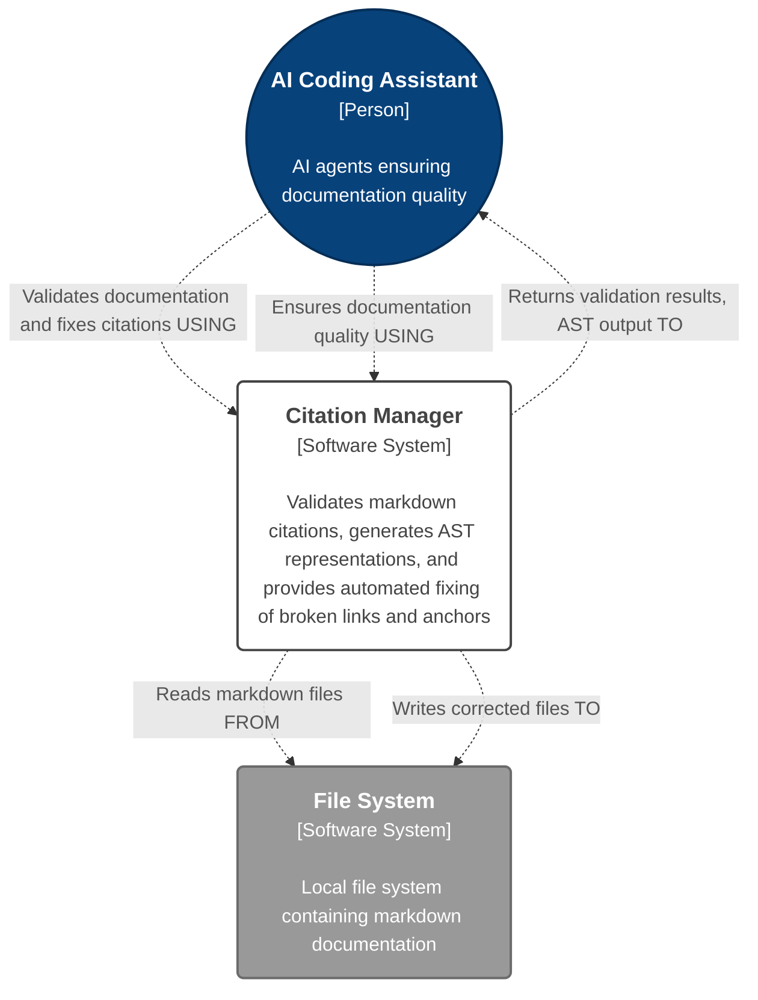
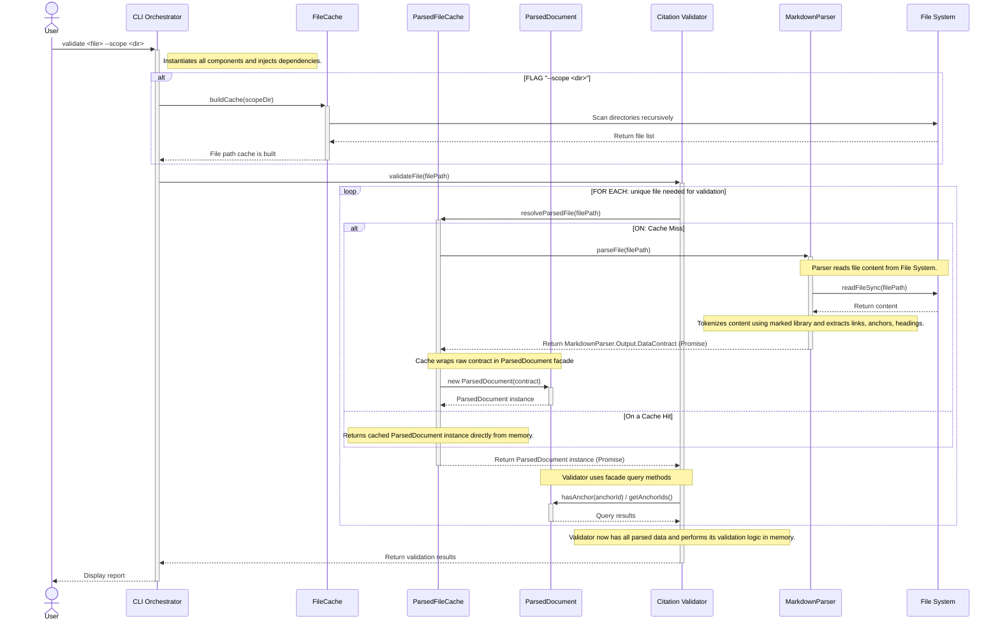
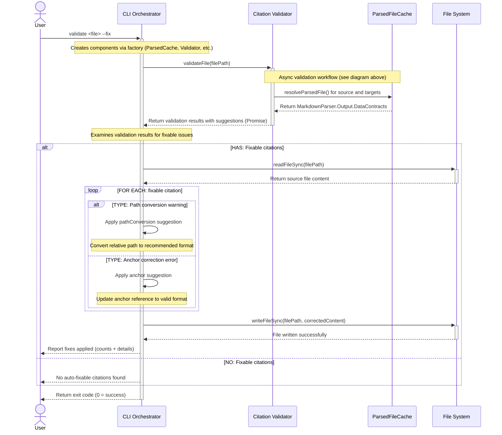

# Citation Manager - Tool Architecture

<critical-instruction>
**Critial LLM Initialization Instructions**: When first reading this file, you MUST IMMEDIATELY run citation manager to extract base paths: `npm run citation:extract:content {{this-file-path}}`
</critical-instruction>

**Status**: Production

**Parent Architecture**: [Workspace Architecture](../../../ARCHITECTURE.md)

---

## Tool Overview

**Purpose**: Citation-manager validates markdown citation links, generates abstract syntax trees of citation relationships, and provides auto-fix capabilities for broken citations and anchors.

**User Value**:
- Eliminates manual citation validation in documentation
- Prevents broken links and invalid anchors before commits
- Provides automated citation correction and path resolution
- Enables AI agents to understand documentation structure through AST output

**Workspace Role**: First tool migrated into CC Workflows workspace, serving as validation for workspace architecture patterns and shared testing infrastructure.

---

## Level 1: System Context Diagram

This diagram shows the **Citation Manager** as the central system used by developers and AI coding assistants to maintain documentation quality through automated citation validation and correction.

### System Context Diagram



---

## Level 2: Container Context

**Container Classification**: Citation-manager is a **Tool Package Container** within the [Level 2 - Containers](../../../ARCHITECTURE.md#Level%202%20-%20Containers) software system.

**Container Details**:
- **Name**: Citation Manager
- **Technology**: Node.js, Commander.js, ESM modules
- **Deployment**: CLI tool executable via workspace npm scripts
- **Process Model**: Single-process command execution

**Workspace Integration**:
- Testing: Shared Vitest framework from workspace root
- Quality: Shared Biome configuration from workspace root
- Dependencies: Managed via workspace package.json hoisting
- Execution: Via workspace root npm scripts (`npm run citation:validate`, etc.)

---

## Level 3: Components

### Citation Manager Components

#### Citation Manager.CLI Orchestrator

- **Path(s):** `tools/citation-manager/src/citation-manager.js`
- **Technology:** `Node.js` class, `Commander.js` CLI framework, ESM modules
- **Technology Status:** Production
- **Description:** CLI entry point orchestrating all citation management operations. Parses commands (`validate`, `ast`, `base-paths`, `fix`, `extract links`, `extract header`, `extract file`), coordinates workflow execution, formats output for CLI/JSON display, and implements auto-fix logic for broken citations and paths. Orchestrates distinct workflows for different extraction modes: **`extract links`** discovers links via validator from source files, while **`extract header`** and **`extract file`** create synthetic links internally for direct content extraction. Delegates to [**`ContentExtractor`**](#Citation%20Manager.ContentExtractor) for all extraction workflows and outputs JSON results to stdout. See [ContentExtractor Workflow Component Interaction](component-guides/ContentExtractor%20Component%20Guide.md#ContentExtractor%20Workflow%20Component%20Interaction) for extraction orchestration patterns.
- **Implement Guide**: [CLI Orchestrator Implementation Guide](component-guides/CLI%20Orchestrator%20Implementation%20Guide.md)

##### Interactions
- _creates and coordinates_ [**`Markdown Parser`**](#Citation%20Manager.Markdown%20Parser), [**`File Cache`**](#Citation%20Manager.File%20Cache), [**`ParsedFileCache`**](#Citation%20Manager.ParsedFileCache), [**`ParsedDocument`**](#Citation%20Manager.ParsedDocument), [**`Citation Validator`**](#Citation%20Manager.Citation%20Validator), and [**`ContentExtractor`**](#Citation%20Manager.ContentExtractor) components (synchronous).
- _injects_ dependencies such as the [**`File Cache`**](#Citation%20Manager.File%20Cache) and [**`ParsedFileCache`**](#Citation%20Manager.ParsedFileCache) into components like the [**`Citation Validator`**](#Citation%20Manager.Citation%20Validator) at instantiation (synchronous).
- _delegates factory creation_ of [**`ParsedDocument`**](#Citation%20Manager.ParsedDocument) instances to [**`ParsedFileCache`**](#Citation%20Manager.ParsedFileCache) via constructor injection (synchronous).
- _delegates to_ the [**`Markdown Parser`**](#Citation%20Manager.Markdown%20Parser) for the `ast` command (asynchronous).
- _ast command_ continues to access raw `MarkdownParser.Output.DataContract` directly for debugging purposes, bypassing [**`ParsedDocument`**](#Citation%20Manager.ParsedDocument) facade.
- _delegates to_ the [**`Citation Validator`**](#Citation%20Manager.Citation%20Validator) for the `validate` command (asynchronous).
- **`extract links` workflow:** _calls_ `citationValidator.validateFile(sourceFile)` to discover and validate links, then _passes_ enriched links to `contentExtractor.extractContent(enrichedLinks, cliFlags)` (asynchronous).
- **`extract header/file` workflow:** _creates_ synthetic LinkObjects internally (Level 4 implementation detail via LinkObjectFactory helper), _validates_ synthetic links via `citationValidator.validateSingleCitation()`, then _passes_ validated links to `contentExtractor.extractContent()` (asynchronous).
- _reads and writes_ markdown files directly for the `--fix` operation (synchronous).
- _uses_ internal SessionCache helper for `extract links --session` cache deduplication via `checkExtractCache()` and `writeExtractCache()` (synchronous).
- _outputs_ formatted results to stdout/stderr (synchronous).

##### Boundaries
The component's primary responsibility is to orchestrate workflow coordination between specialized components. For extraction workflows, it implements two distinct orchestration patterns: **(1) Link Discovery** - calls validator to discover links from source files (`extract links`), and **(2) Synthetic Link Creation** - creates unvalidated LinkObjects internally and validates them before extraction (`extract header`, `extract file`). The component makes a specific exception for the **`--fix`** operation, where it contains the application-level logic to read a file, apply suggestions generated by the `CitationValidator`, and write the corrected content back to disk. This boundary exception is the basis for the [Scattered File I/O Operations](#Scattered%20File%20I/O%20Operations) Tech Debt.

##### Level 4 Implementation Details

**LinkObjectFactory** (Internal Helper):
- **Purpose**: Constructs unvalidated LinkObjects from CLI command parameters for `extract header` and `extract file` subcommands
- **Location**: `tools/citation-manager/src/factories/LinkObjectFactory.js`
- **Scope**: Level 4 code detail - internal helper for CLI Orchestrator, NOT a separate Level 3 component
- **Methods**: `createHeaderLink(targetPath, headerName)`, `createFileLink(targetPath)`
- **Boundaries**: Creates LinkObject structures, handles path normalization, does NOT validate or extract content
- **Justification**: Factory's only role is adapting CLI string inputs into LinkObject data contract for orchestration workflows

**SessionCache** (Internal Helper):
- **Purpose**: Session-scoped deduplication for `extract links` via file-based marker cache
- **Location**: `tools/citation-manager/src/cache/checkExtractCache.ts`
- **Scope**: Level 4 code detail - internal helper for CLI Orchestrator, NOT a separate Level 3 component
- **Functions**: `checkExtractCache(sessionId, filePath, cacheDir)`, `writeExtractCache(sessionId, filePath, cacheDir)`
- **Boundaries**: Checks/writes marker files only, does NOT perform extraction
- **Implementation Guide**: [SessionCache Component Guide](component-guides/SessionCache%20Component%20Guide.md)

##### Input Public Contract
1. **Command-line arguments** (`process.argv`), provided by the user, which define the requested command and its options.
2. Access to the **component factory** to instantiate and wire together all necessary downstream components.

##### Output Public Contract
1. A **formatted string** (human-readable report for `validate` command, JSON for `extract` subcommands) written to `stdout`.
2. An **exit code** (`0` for success, non-zero for failure) to signal the outcome of the operation to the calling process.
3. **File system modifications**, which occur only when the `--fix` command is used.

#### Citation Manager.Markdown Parser
- **Path(s):** `tools/citation-manager/src/MarkdownParser.js`
- **Technology:**
  - `Node.js` class
  - `marked` markdown tokenizer library
  - ESM modules
- **Technology Status:** Production
- **Description:** Parses markdown files to extract AST representation of document structure. Identifies cross-document links (multiple pattern types), extracts headings and anchors (including Obsidian block refs and caret syntax), generates single anchor per header with dual ID properties (raw text and URL-encoded) for Obsidian compatibility (US1.6). This component's output (`MarkdownParser.Output.DataContract`) is encapsulated by the `ParsedDocument` facade before being consumed by other components.
- **Implementation Guide**: [MarkdownParser Component Guide](component-guides/MarkdownParser%20Component%20Guide.md) for the detailed data contract schema and examples

##### Interactions
- _reads_ markdown files directly from file system (synchronous)
- _tokenizes_ markdown content using `marked` library (synchronous)
- _provides_ structured AST data to `CLI Orchestrator` and `Citation Validator` (synchronous)

##### Boundaries


The component is exclusively responsible for transforming a raw markdown string into the structured **MarkdownParser.Output.DataContract**. Its responsibilities are strictly limited to syntactic analysis. The component is **not** aware of the `ParsedDocument` facade that wraps its output. The component is **not** responsible for:
- Validating the existence or accessibility of file paths.
- Verifying the semantic correctness of links or anchors.
- Interpreting or executing any code within the document.

#### Citation Manager.File Cache
- **Path(s):** `tools/citation-manager/src/FileCache.js`
- **Technology:** `Node.js` class, ESM modules
- **Technology Status:** Production
- **Description:** Maintains an in-memory cache mapping short filenames to absolute file paths within a given directory scope. It handles symlink resolution to avoid duplicates, detects duplicate filenames, and provides fuzzy matching capabilities for common typos.

##### Interactions
- _scans_ directories recursively to build its internal cache upon request (synchronous).
- _provides_ filename-to-absolute-path resolution to the `Citation Validator` (synchronous).
- _warns_ about duplicate filenames to stderr during the cache build process (synchronous).

##### Boundaries
The component is exclusively responsible for mapping short filenames to their absolute file paths within a given directory scope. Its file system access is limited to the initial directory scan when `buildCache()` is called. It is **not** responsible for reading, parsing, or caching the **content** of any files; it only manages their paths.

##### Input Public Contract
1. A **File System interface** and a **Path Module interface**, provided at instantiation.
2. A **`scopeFolder`** (string), provided to its `buildCache()` method to initialize the cache.
3. A **`filename`** (string), provided to its `resolveFile()` method to perform a lookup.

##### Output Public Contract
The component's primary output is from the `resolveFile()` method, which returns a **Resolution Result object**. This object indicates whether a file was `found`, its absolute `path` if successful, and contextual information such as the `reason` for failure (e.g., 'duplicate', 'not_found'). The `buildCache()` method returns a statistics object summarizing the state of the cache after a scan.

#### Citation Manager.Citation Validator
- **Path(s):** `tools/citation-manager/src/CitationValidator.js`
- **Technology:**
  - `Node.js` class
  - ESM modules
- **Technology Status:** Production
- **Description:** Validates `Link Objects` by consuming `ParsedDocument` facade instances from the `ParsedFileCache` It classifies citation patterns (caret syntax, cross-document, wiki-style), resolves file paths using multiple strategies (relative paths, symlinks, Obsidian absolute paths, cache lookup), uses `ParsedDocument` query methods to check for target and anchor existence, generates validation results with actionable suggestions.
- **Implementation Guide**: [CitationValidator Implementation Guide](component-guides/CitationValidator%20Implementation%20Guide.md) for public contracts and data objects

##### Interactions
- _uses_ the `ParsedFileCache` to retrieve `ParsedDocument` instances for target files (asynchronous).
- _uses_ `ParsedDocument` query methods (`hasAnchor()`, `getAnchorIds()`, `findSimilarAnchors()`) instead of direct data structure access (synchronous).
- _uses_ the `FileCache` for filename resolution when a scope is provided (synchronous, optional dependency).
- _validates_ file existence directly via the file system as a fallback (synchronous).
- _returns_ validation results with status and suggestions to the `CLI Orchestrator` (asynchronous).

##### Boundaries
- The component is exclusively responsible for the semantic validation of `Link Objects` (e.g., "does this link point to a real target?").
- It is **not** responsible for parsing markdown (delegated to `MarkdownParser` via the cache) or navigating parser output structures (delegated to `ParsedDocument` facade).
- It is **not** responsible for managing the efficiency of parsing operations (delegated to `ParsedFileCache`).
- It does **not** perform file modifications; it only generates suggestions.

#### Citation Manager.ParsedFileCache
- **Path(s):** `tools/citation-manager/src/ParsedFileCache.js`
- **Technology:**
  - `Node.js` class
  - ESM modules
- **Technology Status:** Implemented
- **Description:** Maintains an in-memory cache of `ParsedDocument` facade instances for the duration of a single command run. Wraps `MarkdownParser.Output.DataContract` objects in the `ParsedDocument` facade before returning them, ensuring each file is read from disk and parsed by the `MarkdownParser` at most once.
- **Implementation Guide**: [ParsedFileCache Implementation Guide](component-guides/ParsedFileCache%20Implementation%20Guide.md) for public contracts and data objects

##### Interactions
- _is consumed by_ the `CitationValidator` and `ContentExtractor` to retrieve `ParsedDocument` instances (asynchronous).
- _delegates to_ the `MarkdownParser` to parse files that are not yet in the cache (asynchronous).
- _creates_ `ParsedDocument` facade instances by wrapping `MarkdownParser.Output.DataContract` before returning (synchronous).
- _is instantiated by_ the `CLI Orchestrator` (via its factory) (synchronous).

##### Boundaries
- The component's sole responsibility is to manage the in-memory lifecycle of `ParsedDocument` facade instances. It acts as a key-value store mapping file paths to `ParsedDocument` instances.
- It is **not** responsible for the parsing logic itself (which is delegated) or for any direct file system operations.

##### Error Handling & Cache Correctness
- **Promise Rejection Pattern**: When a parse operation fails (e.g., file not found, permission error), the cache MUST synchronously remove the failed promise before propagating the rejection. This ensures subsequent requests can retry without being blocked by stale failed promises.
- **Retry Support**: Removing failed promises from cache enables retry on transient errors (temporary permission issues, network drive timeouts).
- **Implementation Critical**: The `.catch()` handler must execute `cache.delete(key)` synchronously to prevent race conditions between error handling and new requests.

#### Citation Manager.ParsedDocument

- **Path(s):** `tools/citation-manager/src/ParsedDocument.js`
- **Technology:**
  - `Node.js` class
  - ESM modules
- **Technology Status:** Implemented (US1.7)
- **Description:** Facade providing a stable, method-based query interface over `MarkdownParser.Output.DataContract`. Encapsulates internal data structure access and navigation complexity, decoupling consumers from parser internals. Implements anchor query methods (`hasAnchor()`, `findSimilarAnchors()`), link query methods (`getLinks()`), and content extraction methods (`extractFullContent()`, `extractSection()`, `extractBlock()`).
- **Implementation Guide**: [ParsedDocument Implementation Guide](component-guides/ParsedDocument%20Implementation%20Guide.md)

##### Interactions
- _is created by_ the `ParsedFileCache` when wrapping `MarkdownParser.Output.DataContract` (synchronous).
- _wraps_ the `MarkdownParser.Output.DataContract` to provide stable interface (synchronous).
- _is consumed by_ the `CitationValidator` for anchor and link queries (synchronous).
- _is consumed by_ the future `ContentExtractor` for content extraction operations (synchronous).

##### Boundaries
- The component is exclusively responsible for providing a stable query interface over parser output. It encapsulates all direct access to `MarkdownParser.Output.DataContract` internal structures.
- It is **not** responsible for parsing markdown (delegated to `MarkdownParser`) or caching parsed results (delegated to `ParsedFileCache`).
- It is **not** responsible for validation logic (delegated to `CitationValidator`) or content aggregation logic (delegated to `ContentExtractor`).
- **Known Limitation**: CitationValidator helper methods still access `_data.anchors` directly for type filtering and rawText operations (lines 528, 560, 570-578). Full encapsulation deferred to Epic 2.

##### Input Public Contract
1. A **`MarkdownParser.Output.DataContract`** object, provided to the constructor.

##### Output Public Contract
The facade exposes query methods that return transformed/filtered data from the wrapped contract:
- **Anchor Queries**: `hasAnchor(anchorId)`, `findSimilarAnchors(anchorId)`
- **Link Queries**: `getLinks()`
- **Content Extraction**: `extractFullContent()`, `extractSection(headingText)`, `extractBlock(anchorId)`

#### Citation Manager.ContentExtractor
- **Path(s):** `tools/citation-manager/src/core/ContentExtractor/ContentExtractor.js`
- **Technology:**
  - `Node.js` class
  - ESM modules
- **Technology Status:** ✅ Implemented (US2.2 Complete - 2025-10-23), ✅ Enhanced (US2.2a Complete - 2025-10-28)
- **Description:** Orchestrates content extraction and deduplication workflow for pre-validated links. Receives enriched LinkObjects from CLI (containing validation metadata), filters out internal links (scope='internal') before processing (US2.2 AC15), analyzes link eligibility using Strategy Pattern, retrieves content from target documents via `ParsedDocument` facade methods, and deduplicates extracted content using SHA-256 content-based hashing (US2.2a). Returns `OutgoingLinksExtractedContent` object with indexed content structure that minimizes token usage by storing identical content only once.
- **Implementation Guide**: [ContentExtractor Component Guide](component-guides/ContentExtractor%20Component%20Guide.md)

##### Interactions
- _is consumed by_ the `CLI Orchestrator` via `extractContent(enrichedLinks, cliFlags)` method to perform content aggregation (asynchronous).
- _receives_ pre-validated enriched LinkObjects from CLI (links already contain validation metadata from CitationValidator).
- _uses_ the `ParsedFileCache.resolveParsedFile()` to retrieve `ParsedDocument` instances for target documents (asynchronous).
- _uses_ `ParsedDocument` content extraction methods (`extractSection()`, `extractBlock()`, `extractFullContent()`) with normalized anchors to retrieve content (synchronous).
- _analyzes eligibility_ using injected `ExtractionStrategy` chain to filter links by precedence rules (synchronous).

##### Boundaries
- The component's responsibilities are: (1) analyzing extraction eligibility via Strategy Pattern for pre-validated links, (2) extracting content from target documents via `ParsedDocument` facade methods, (3) deduplicating extracted content using content-based hashing, and (4) aggregating results into `OutgoingLinksExtractedContent` structure for CLI output.
- It is **not** responsible for link discovery or validation (receives pre-validated links from CLI orchestrator).
- It is **not** responsible for parsing markdown (delegated to `MarkdownParser`) or navigating parser output structures (delegated to `ParsedDocument` facade).
- It is **not** responsible for reading files from disk (delegated to `ParsedFileCache`).
- It is **not** responsible for final output formatting or file writing (delegated to `CLI Orchestrator`).

### `validate` Command Component Sequence Diagram



#### Workflow Characteristics
- **Component Creation**: The `CLI Orchestrator` (via its factory) creates instances of all components at runtime.
- **Dependency Injection**: Dependencies are injected at instantiation (`fileSystem` into `Parser`, `ParsedFileCache` into `Validator`), decoupling components.
- **Dual Caching Strategy**: The workflow uses two distinct caches: `FileCache` for mapping short filenames to absolute paths, and `ParsedFileCache` to store in-memory ==`ParsedDocument` facade instances==.
- **Facade Pattern**: `ParsedFileCache` wraps `MarkdownParser.Output.DataContract` in `ParsedDocument` facade before returning, providing stable query interface.
- **Layered Data Retrieval**: The `CitationValidator` is decoupled from the `MarkdownParser`; it requests `ParsedDocument` instances from the `ParsedFileCache`, which delegates to the `Parser` on cache misses.
- **Query-Based Access**: Consumers use `ParsedDocument` query methods (`hasAnchor()`, `getLinks()`) instead of direct data structure access, decoupling from parser internals.
- **Asynchronous Data Flow**: Core validation operations are **asynchronous** (`Promise`-based). `ParsedFileCache.resolveParsedFile()` and `CitationValidator.validateFile()` both return Promises.
- **File System Access**: `FileCache` scans directories, `MarkdownParser` reads file content synchronously (`readFileSync`), and `CLI Orchestrator` writes file modifications for the `--fix` operation.
- **Fix Logic Location**: The `fix` logic remains within the `CLI Orchestrator`, operating on the final validation results.

### `extract` Command Component Sequence Diagram


### Facade Pattern at npm Script Level (US2.7)

The base-paths functionality is implemented as a facade at the package.json level rather than in application code. The npm script pipes validate output through jq for path extraction.

**Architectural Decision**: This demonstrates the Adapter pattern at an unconventional level - the package manager layer. Benefits:
- Preserves user-facing interface (backward compatibility)
- Eliminates code duplication (single source of truth in validate)
- Documents migration path (users can see new pattern in package.json)
- Enables eventual removal if usage declines (localized to package.json)

This pattern is appropriate for deprecation without breaking existing workflows.

### Auto-Fix Workflow

The `--fix` flag enables automatic correction of broken citations. This workflow executes after async validation completes, applying corrections based on validation suggestions.



**Auto-Fix Characteristics**:
- **Trigger**: Runs when `--fix` flag provided with `validate` command
- **Timing**: Executes after async validation completes and returns results
- **Input**: Validation results object containing suggestions for fixable issues
- **Fixable Issues**:
  - Path conversions (relative → absolute, etc.) from warnings with `pathConversion` property
  - Anchor corrections (invalid → valid format) from errors with `suggestion` property
- **File Operations**: Synchronous read and write operations on source file only
- **Atomicity**: Reads entire file, applies all corrections, writes once
- **Safety**: Original file content replaced only after all corrections computed
- **Scope**: Modifies only the source file being validated, never target files

### Component Architecture Notes
- **Cross-Cutting Infrastructure**: All components use Node.js `fs` and `path` modules directly for file I/O operations. There is no centralized File System Manager abstraction - this follows a pragmatic approach prioritizing simplicity over layered architecture for this tool's scope.
- **Interaction Style**: Validation workflow is asynchronous (Promise-based) post-US1.5. `CitationValidator.validateFile()` returns Promise, `ParsedFileCache.resolveParsedFile()` returns Promise. MarkdownParser uses synchronous file reads internally but is wrapped in async cache layer.
- **Component Mapping**: Each component corresponds to exactly one source file containing one class (1:1 mapping), following simple modular design principles.

#### Path Normalization Strategy

**ParsedFileCache Approach**:
- Uses Node.js built-in normalization: `path.resolve(path.normalize(filePath))`
- Simple, predictable, no external dependencies
- Handles relative paths, `./` prefixes, redundant separators
- Does NOT handle symlinks (documented limitation)

**Design Rationale**:
- Maintains "Simplicity First" principle - no separate PathResolver component
- Cache needs basic key normalization, not complex multi-strategy resolution
- CitationValidator's 4-strategy resolution (symlinks, Obsidian paths, FileCache) remains separate concern
- Future: If path logic centralization becomes needed, extract PathResolver component

**Trade-offs Accepted**:
- Symlinks: Different symlink paths to same file create separate cache entries
- Mitigation: Users can pass absolute paths if symlink normalization needed
- Real-world impact: Minimal for documentation file use case

---

## Level 4: Code Organization

### Current File Structure

**Source Code Location** (post-US1.5):

```text
tools/citation-manager/
├── src/
│   ├── citation-manager.js          # CLI entry point (async workflow)
│   ├── CitationValidator.js         # Validation logic (async, cache-integrated)
│   ├── MarkdownParser.js            # Parser (MarkdownParser.Output.DataContract)
│   ├── FileCache.js                 # Filename-to-path resolution cache
│   ├── ParsedFileCache.js           # Parsed file object cache (US1.5)
│   ├── cache/
│   │   └── checkExtractCache.ts     # SessionCache: session dedup marker files (Level 4)
│   ├── core/
│   │   └── ContentExtractor/        # ContentExtractor component (US2.2)
│   │       ├── ContentExtractor.js              # Main orchestrator class
│   │       ├── analyzeEligibility.js            # Eligibility analysis operation
│   │       └── eligibilityStrategies/           # Strategy pattern implementations
│   │           ├── ExtractionStrategy.js
│   │           ├── StopMarkerStrategy.js
│   │           ├── ForceMarkerStrategy.js
│   │           ├── SectionLinkStrategy.js
│   │           └── CliFlagStrategy.js
│   └── factories/
│       └── componentFactory.js      # Component instantiation with DI (US1.4b)
├── test/
│   ├── parser-output-contract.test.js    # Parser schema validation (US1.5)
│   ├── parsed-file-cache.test.js         # Cache unit tests (US1.5)
│   ├── integration/
│   │   ├── citation-validator-cache.test.js   # Cache integration (US1.5)
│   │   └── end-to-end-cache.test.js           # E2E cache workflow (US1.5)
│   ├── factory.test.js                   # Factory pattern tests (US1.5)
│   ├── validation.test.js                # Core validation tests
│   ├── enhanced-citations.test.js        # Citation feature tests
│   ├── auto-fix.test.js                  # Auto-fix functionality
│   ├── warning-validation.test.js        # Warning detection
│   ├── path-conversion.test.js           # Path resolution
│   ├── story-validation.test.js          # Story-specific validation
│   ├── cli-warning-output.test.js        # CLI display tests
│   └── fixtures/                         # 16+ test fixture files
│       ├── valid-citations.md
│       ├── broken-links.md
│       ├── multiple-links-same-target.md # Cache test fixtures (US1.5)
│       └── [additional fixtures]
└── design-docs/
    ├── features/
    │   └── 20251003-content-aggregation/
    │       ├── content-aggregation-architecture.md  # This file
    │       ├── content-aggregation-prd.md
    │       └── component-guides/
    │           ├── CitationValidator Implementation Guide.md
    │           ├── Markdown Parser Implementation Guide.md
    │           ├── ParsedFileCache Implementation Guide.md
    │           └── Content Extractor Implementation Guide.md
    └── [additional documentation]
```

### ContentExtractor File Structure

**Current Implementation** (US2.2a Complete):

```text
tools/citation-manager/
└── src/
    ├── core/
    │   └── ContentExtractor/
    │       ├── ContentExtractor.js              # Main orchestrator class (thin wrapper)
    │       ├── extractLinksContent.js           # PRIMARY operation: extraction workflow with inline deduplication
    │       ├── generateContentId.js             # Utility: SHA-256 content-based hashing
    │       ├── analyzeEligibility.js            # Supporting operation: eligibility analysis
    │       ├── normalizeAnchor.js               # Utility: anchor normalization
    │       └── eligibilityStrategies/           # Strategy pattern implementations
    │           ├── ExtractionStrategy.js
    │           ├── StopMarkerStrategy.js
    │           ├── ForceMarkerStrategy.js
    │           ├── SectionLinkStrategy.js
    │           └── CliFlagStrategy.js
    └── factories/
        └── componentFactory.js                  # createContentExtractor() with DI
```

**Architecture Decisions Implemented:**
- **Action-Based File Organization**: `extractLinksContent.js` follows verb-noun naming convention
- **Utility Extraction**: `normalizeAnchor.js` created with `normalizeBlockId()` and `decodeUrlAnchor()` utilities
- **Content-Based Hashing**: `generateContentId.js` provides SHA-256 hashing for deduplication (US2.2a)
- **Thin Orchestrator**: `ContentExtractor.js` delegates to operation files, maintains minimal surface area
- **Dependency Injection**: Constructor accepts `eligibilityStrategies`, `parsedFileCache`, and `citationValidator`
- **Inline Deduplication**: Single-pass processing builds deduplicated output structure (US2.2a)

**Key Changes Post-US1.5**:
- **ParsedFileCache.js**: New component providing in-memory cache of parsed file objects
- **componentFactory.js**: Factory pattern for DI-based component instantiation
- **Async Architecture**: CitationValidator and CLI orchestrator use Promise-based async flow
- **Test Expansion**: 31 new tests added (cache unit, integration, factory, E2E, contract validation)
- **Implementation Guides**: ParsedFileCache guide added for cache contract documentation

### Module System

**Type**: ECMAScript Modules (ESM)
- Uses `import`/`export` syntax
- Explicit `.js` extensions in import paths

**Import Pattern Example**:

```javascript
import { CitationValidator } from "./src/CitationValidator.js";
```

### Coding Standards

Follows workspace coding standards defined in [Coding Standards and Conventions](../../../ARCHITECTURE.md#Coding%20Standards%20and%20Conventions)

---

## CLI Commands

**Available Commands**:
- `validate` - Validate citation links in markdown files
- `ast` - Generate abstract syntax tree of citations
- `base-paths` - Extract base paths from citations (facade over validate)
- `extract links` - Extract content from outgoing links in a source file
- `extract header` - Extract specific header section from a target file
- `extract file` - Extract full file content from a target file
- `--fix` - Auto-fix broken citations and anchors (use with validate)
- `--help` - Display help menu

**Execution Pattern**:

```bash
# Validation
npm run citation:validate <file-path> [options]
npm run citation:validate <file-path> --fix
npm run citation:validate <file-path> --scope <directory>

# AST and base paths
npm run citation:ast <file-path> [options]
npm run citation:base-paths <file-path> -- --format json

# Content extraction
npm run citation:extract links <source-file-path> [--full-files]
npm run citation:extract header <target-file-path> <header-text>
npm run citation:extract file <target-file-path>
```

---

## Testing Strategy

### Framework

**Test Framework**: Vitest (shared workspace framework)
- Configuration: Root `vitest.config.js`
- Execution: `npm test` from workspace root
- Discovery Pattern: `tools/**/test/**/*.test.js`

### Test Organization

**Test Location** (post-US1.5):

```text
tools/citation-manager/test/
├── parser-output-contract.test.js    # Parser schema validation (US1.5)
├── parsed-file-cache.test.js         # Cache unit tests (US1.5)
├── factory.test.js                   # Factory pattern tests (US1.5)
├── integration/
│   ├── citation-validator-cache.test.js   # Cache integration (US1.5)
│   ├── citation-validator.test.js         # Validator integration
│   └── end-to-end-cache.test.js           # E2E cache workflow (US1.5)
├── validation.test.js                # Core validation tests
├── enhanced-citations.test.js        # Enhanced citation tests
├── auto-fix.test.js                  # Auto-fix feature tests
├── warning-validation.test.js        # Warning system tests
├── path-conversion.test.js           # Path resolution tests
├── story-validation.test.js          # Story-specific validation
├── cli-warning-output.test.js        # CLI output tests
└── fixtures/                         # Test fixture files
    ├── valid-citations.md
    ├── broken-links.md
    ├── multiple-links-same-target.md # Cache fixtures (US1.5)
    ├── shared-target.md              # Cache fixtures (US1.5)
    └── [additional fixtures]
```

### Test Categories

**Contract Validation Tests** (12 tests - US1.5 + US1.6):
- Validate MarkdownParser.Output.DataContract schema compliance
- Test LinkObject structure (`linkType`, `scope`, `anchorType`, `source`, `target`)
- Test AnchorObject structure (`anchorType`, `id`, `urlEncodedId`, `rawText`) - US1.6 dual ID schema
- Verify enum constraints and required fields
- Verify single anchor per header with no duplicates (US1.6)
- Reference: [MarkdownParser Component Guide](component-guides/MarkdownParser%20Component%20Guide.md)

**Cache Unit Tests** (6 tests - US1.5):
- Cache hit/miss behavior
- Concurrent request handling with single parse guarantee
- Error propagation and cache cleanup on parse failure
- Path normalization for consistent cache keys
- Multiple independent file caching

**Cache Integration Tests** (4 tests - US1.5):
- Single-parse-per-file guarantee when multiple links reference same target
- CitationValidator cache usage for source and target files
- Multi-file validation scenarios with cache efficiency

**Factory Pattern Tests** (7 tests - US1.5):
- Component instantiation with correct DI wiring
- ParsedFileCache creation and injection into CitationValidator
- Factory method parameter validation

**End-to-End Tests** (6 tests - US1.5):
- Complete validation workflow with ParsedFileCache integration
- CLI integration with async validator and cache
- Real-world multi-file validation scenarios

### Testing Principles

Follows workspace testing strategy from [Testing Strategy](../../../ARCHITECTURE.md#Testing%20Strategy):
- **MVP-Focused**: Target 0.3:1 to 0.5:1 test-to-code ratio (achieved: 0.4:1)
- **Integration-Driven**: Real file system operations, no mocking
- **BDD Structure**: Given-When-Then comment structure required
- **Real Systems**: Zero-tolerance policy for mocking application components

### Async Testing Patterns (Post-US1.5)

**Promise-Based Validation**:

```javascript
it('should validate file asynchronously using cache', async () => {
  // Given: Factory-created validator with ParsedFileCache
  const validator = createCitationValidator(scopeDir);

  // When: Async validation executes
  const result = await validator.validateFile(testFile);

  // Then: Results returned via Promise
  expect(result.isValid).toBe(true);
  expect(result.citations).toBeDefined();
});
```

**Cache Integration Testing**:

```javascript
it('should parse file only once when multiple links reference it', async () => {
  // Given: Validator with cache, file with multiple links to same target
  const validator = createCitationValidator();

  // When: Validation processes multiple links to same file
  await validator.validateFile(fixtureWithMultipleLinksToSameTarget);

  // Then: Target file parsed exactly once (verified via cache hit logging)
  expect(parseSpy).toHaveBeenCalledTimes(1);
});
```

**Key Patterns**:
- Test async `resolveParsedFile()` method returns Promises
- Verify Promise caching (cache stores Promises, not resolved values)
- Test concurrent async requests to same file resolve to single parse
- Use `async/await` syntax throughout async test code

### Process Management

Citation-manager test suite uses CLI integration testing via `execSync()`, which can leave Vitest worker processes in memory after test completion.

**Quick Cleanup**:

```bash
# Kill hanging Vitest worker processes
pkill -f "vitest"
```

---
## Technology Stack

| Technology                   | Version  | Purpose                                                    | Source                                                          |
| ---------------------------- | -------- | ---------------------------------------------------------- | --------------------------------------------------------------- |
| **Node.js**                  | ≥18.0.0  | Runtime environment                                        | [Technology Stack](../../../ARCHITECTURE.md#Technology%20Stack) |
| **Commander.js**             | ≥14.0.1  | CLI command parsing and argument handling                  | Tool-specific dependency                                        |
| **marked**                   | ≥15.0.12 | Markdown tokenization and AST generation                   | Tool-specific dependency                                        |
| **Vitest**                   | latest   | Testing framework (shared)                                 | [Technology Stack](../../../ARCHITECTURE.md#Technology%20Stack) |
| **Biome**                    | latest   | Linting/formatting (shared)                                | [Technology Stack](../../../ARCHITECTURE.md#Technology%20Stack) |
| **Node.js built-in modules** | native   | File I/O (fs), path operations (path), URL utilities (url) | Node.js standard library                                        |

---

## Cross-Cutting Concerns

As a tool within the CC Workflows Workspace, the Citation Manager inherits all of its cross-cutting architectural patterns from the [Cross-Cutting Concerns](../../../ARCHITECTURE.md#Cross-Cutting%20Concerns).

### Code Quality and Consistency
All source code within the `citation-manager` package must adhere to the shared `biome.json` configuration located at the workspace root. This includes standards for **tab indentation** and **double quotes** for strings.

### Testing Infrastructure
The tool's test suite, located in `tools/citation-manager/test/`, is executed by the shared **Vitest framework**. Tests are discovered via the `tools/**/test/**/*.test.js` glob pattern and must follow the workspace's established testing principles, including the **"Real Systems, Fake Fixtures"** approach, BDD-style comments, and `snake_case` test naming.

### Dependency Management
The tool's dependencies, such as `commander` and `marked`, are declared in its local `package.json` but are managed and hoisted by **NPM Workspaces** at the root level.

---

## Design Principles Adherence

This tool follows workspace design principles defined in [Architecture Principles](../../../ARCHITECTURE-PRINCIPLES.md):

**Key Principles**:
- [**Modular Design**](../../../ARCHITECTURE-PRINCIPLES.md#Modular%20Design%20Principles): Component-based architecture with clear boundaries
- [**Deterministic Offloading**](../../../ARCHITECTURE-PRINCIPLES.md#Deterministic%20Offloading%20Principles): Predictable, mechanical citation processing
- [**Safety-First**](../../../ARCHITECTURE-PRINCIPLES.md#Safety-First%20Design%20Patterns): Backup creation before auto-fix, dry-run capability
- [**Self-Contained Naming**](../../../ARCHITECTURE-PRINCIPLES.md#Self-Contained%20Naming%20Principles): Descriptive command and component names

---

## Known Risks and Technical Debt

### Scattered File I/O Operations

**Risk Category**: Architecture / Maintainability
**Description**: Currently, multiple components perform direct file system operations. The `MarkdownParser` reads files, the `CitationValidator` checks for file existence, and the `CLI Orchestrator` reads and writes files for the `--fix` command. This scatters a core cross-cutting concern throughout the application, violating the Single Responsibility Principle.

**Impact**:
- **High**: This makes the components harder to test in isolation, as the Node.js `fs` module must be mocked or managed in multiple places. It also increases the risk of inconsistent error handling for I/O operations and makes the overall system more brittle.
- **Scope**: Affects `MarkdownParser`, `CitationValidator`, and `CLI Orchestrator`.

**Rationale for Accepting Risk**: This pattern is a remnant of the tool's original, simpler design. Formally separating file I/O is a refactoring effort that was not prioritized over the foundational DI and caching work, which are direct blockers for new feature development.

**Mitigation Strategy**: Create a dedicated **`FileSystemManager`** component. This component would centralize all file system interactions (`readFile`, `writeFile`, `exists`, etc.). It would be instantiated by the factory and injected as a dependency into all components that need to interact with the disk.

**Resolution Criteria**:
- A new `FileSystemManager` component is created and integrated via the component factory.
- All direct `fs` module usage is removed from `MarkdownParser`, `CitationValidator`, and `CLI Orchestrator`.
- These components are refactored to use the injected `FileSystemManager` for all file I/O operations.

**Timeline**: Address after Epic 2 is complete. This is a valuable refactoring for long-term maintainability but does not block the current feature roadmap.
**Status**: Documented technical debt, medium priority.

### Incomplete Facade Encapsulation for Advanced Queries

**Risk Category**: Architecture / Maintainability

**Status**: Created (2025-10-15) - Technical debt created by US1.7

**Description**: CitationValidator helper methods partially bypass ParsedDocument facade for advanced anchor queries, directly accessing `_data.anchors` for type filtering and rawText access (CitationValidator.js lines 528, 560, 570-578). While core validation uses facade methods (`hasAnchor()`, `findSimilarAnchors()`), error reporting and advanced matching still couple to internal anchor schema.

**Impact**:
- **Maintainability Risk**: Error message generation breaks if anchor schema changes
- **Facade Violation**: ParsedDocument's encapsulation promise partially bypassed
- **Missing Abstractions**: Type-specific queries (header vs block) not exposed by facade
- **Scope**: Limited to error reporting and advanced matching - doesn't affect validation correctness

**Root Cause**:
ParsedDocument facade (US1.7) initially designed for core validation queries. Advanced use cases discovered during integration:
- Type filtering for error messages (`anchorType === "header"` vs `"block"`)
- RawText access for human-readable anchor suggestions
- Full anchor object metadata for flexible matching algorithms

**Code Locations**:
- Line 528: `suggestObsidianBetterFormat()` needs anchor objects with `anchorType`, `rawText` properties
- Line 560: `findFlexibleAnchorMatch()` needs anchor objects with `rawText` for markdown-aware matching
- Lines 570-578: Suggestion generation needs anchor objects filtered by type

**Resolution Strategy**:
Extend ParsedDocument facade with additional public methods:
- `getAnchorsByType(anchorType)` - Returns filtered anchor metadata
- `getAllAnchorsWithMetadata()` - Returns all anchors with id, rawText, anchorType, urlEncodedId

Refactor CitationValidator helper methods (`suggestObsidianBetterFormat()`, `findFlexibleAnchorMatch()`) to consume facade methods instead of `_data` access.

**Priority**: Low
- Isolated to error reporting code paths
- Zero impact on validation correctness
- No test failures or functional regressions
- Can be addressed incrementally without breaking changes

**Timeline**: Address in Epic 2 or dedicated refactoring story
**Status**: Documented technical debt (2025-10-15), low priority

### ParsedFileCache Memory Characteristics

**Risk Category**: Performance / Resource Management
**Description**: The `ParsedFileCache` stores complete `MarkdownParser.Output.DataContract` objects in memory, including the full file content string. For large architectural documents or multi-file validation runs, this creates measurable memory overhead.

**Memory Profile**:
- **Typical Document**: 50KB per cached file
- **Large Document**: 500KB per cached file
- **Validation Run Example**: 100 files = 5-50MB in memory
- **Additional Overhead**: Token arrays, link objects, anchor objects per file

**Impact**:
- **Low**: Acceptable for CLI tool with ephemeral per-command lifecycle
- **Scope**: Memory released automatically when command process exits
- **Scale Limits**: No production concerns identified for documentation file use cases

**Rationale for Accepting Risk**: The ParsedFileCache follows an ephemeral, per-command caching strategy where the cache exists only during a single CLI command execution. Since the Node.js process exits after command completion, the operating system automatically reclaims all memory. This simple approach eliminates the need for complex memory management (LRU eviction, cache size limits, TTL) while meeting MVP requirements.

**Monitoring Strategy**: If Epic 2 content aggregation shows memory pressure exceeding 100MB during normal operations, consider optimization strategies:
- Lazy content loading (cache metadata without full content)
- LRU eviction policy for large validation runs
- Content streaming for extraction operations

**Resolution Criteria**: No action required unless real-world usage demonstrates memory issues. Current design sufficient for documented use cases.

**Timeline**: Monitor during Epic 2 implementation; optimize only if empirical evidence demonstrates need.
**Status**: Documented architectural characteristic, acceptable trade-off for MVP scope.

### Deferred: Configuration File Layer

**Risk Category**: Feature Completeness / User Experience
**Description**: The MVP implements 3-layer configuration (defaults → CLI flags → per-link markers) but does not include file-based configuration support (`citation-manager.config.json`). This means users cannot save project-specific or user-specific extraction preferences, requiring repetitive CLI flag usage.

**Missing Layer**: File-based configuration that would slot between defaults and CLI flags in the precedence hierarchy.

**Current Implementation**:
1. Defaults (section=extract, full-file=skip)
2. CLI flags (`--full-files`)
3. Per-link markers (`%%extract-link%%`, `%%stop-extract-link%%`)

**Reference Implementation**: [Repomix hierarchical config pattern](https://github.com/yamadashy/repomix/blob/main/src/config/configLoad.ts)
- Layered precedence: defaults → file → CLI → (markers - our addition)
- Zod schema validation for type safety
- Config file discovery strategy (project root → user home)

**Technical Requirements (Future Story)**:
1. **Config File Discovery**: Search project root, then user home directory
2. **Schema Validation**: Zod schema for extraction rules, fail fast on invalid config
3. **Merge Logic**: Preserve precedence hierarchy when combining config layers
4. **Path-Based Rules**: Glob patterns for include/exclude (e.g., `"design-docs/**": { "fullFiles": true }`)

**Design Considerations**:
- **Schema Design**: Define extraction rules schema (global defaults + path-specific overrides)
- **File Format**: JSON (simplicity) vs YAML (human-friendly) vs JS (programmable)
- **Merge Strategy**: Deep merge vs shallow merge for nested objects
- **Validation UX**: Clear error messages for invalid config

**Migration Path**:
- Backward compatible: New layer slots between defaults and CLI
- Existing CLI + marker behavior unchanged
- Users can migrate gradually: CLI → file config → markers as needed

**ROI Analysis**:
- **Value**: Reduces repetitive CLI flags for projects with consistent extraction patterns
- **Cost**: Config discovery, validation, testing complexity (~8-16 hours implementation)
- **Decision**: Defer until user demand validated (can achieve similar results with shell aliases)

**Impact**:
- **Low**: MVP delivers 80% of value with CLI + markers alone
- **Scope**: File config adds complexity without proportional user value for initial release
- **Workaround**: Users can create shell scripts/aliases wrapping CLI commands

**Rationale for Deferring**: Following [simplicity-first](../../../ARCHITECTURE-PRINCIPLES.md#^simplicity-first) principle - don't build features until user demand demonstrates necessity. The current 3-layer system provides sufficient control for MVP validation.

**Resolution Criteria**:
- User feedback indicates repetitive CLI flag usage is a pain point
- Multiple users request project-level configuration capabilities
- Implementation includes full schema validation and comprehensive test coverage

**Timeline**: Revisit after MVP validation shows repetitive CLI usage patterns across projects.
**Status**: Backlog (deferred from Epic 2 MVP scope).

### Test Suite Edge Cases (CLI Display and URL Encoding)

**Risk Category**: Quality / Testing

**Description**: 7 tests in the citation manager test suite fail with pre-existing edge case issues unrelated to core functionality. These failures represent technical debt in CLI display formatting and URL-encoded anchor handling that accumulated before US1.5 implementation.

**Failing Tests**:
1. **CLI Warning Output Formatting** (3 tests) - Display logic issues in warning section formatting
2. **URL-Encoded Anchor Handling** (3 tests) - Edge case in anchor matching when anchors contain URL-encoded characters (e.g., spaces as `%20`)
3. **Wiki-Style Link Classification** (1 test) - Edge case in pattern detection for wiki-style links

**Impact**:
- **Low**: Core functionality works correctly. Issues affect edge cases in display formatting and specific anchor encoding patterns.
- **Scope**: Affects CLI display logic and anchor matching edge cases
- **Test Suite Status**: 44/51 tests passing (86%)

**Rationale for Accepting Risk**: These edge case failures were identified during US1.5 validation but are unrelated to cache implementation. All schema validation tests (8/8) pass, confirming Phase 1 parser contract objectives met. Core parsing and validation functionality works correctly.

**Mitigation Strategy**: Create dedicated user story to address edge cases in CLI warning display formatting and URL-encoded anchor handling.

**Resolution Criteria**:
- All 7 failing tests updated or refactored to pass
- CLI warning output formatting matches expected format
- URL-encoded anchors (e.g., spaces as `%20`) handled correctly in anchor matching
- Wiki-style link classification edge cases resolved

**Timeline**: Low priority - address after Epic 2 Content Aggregation implementation complete.
**Estimated Effort**: 2-3 tasks, ~4-6 hours total
**Status**: Documented technical debt, low priority.

## Architecture Decision Records (ADRs)

### ADR-001: Phased Test Migration Strategy

- **Status**: Accepted
- **Date**: 2025-10-04
- **Context**: Analysis of US1.4 scope revealed that test migration involves two distinct, separable work streams with different risk profiles:
 1. **Test Framework Conversion**: Migrating 1,863 lines across 7 test files from `node:test` to Vitest with `expect()` assertions
 2. **Component DI Refactoring**: Restructuring CitationValidator, MarkdownParser, and FileCache for constructor-based dependency injection with factory pattern implementation

 Combining both efforts creates compound risk: test conversion failures could mask DI refactoring issues, and vice versa. Additionally, Epic 2 architecture design will establish DI patterns for new components (ContentExtractor), making it more effective to refactor existing components after new patterns are proven.

- **Decision**: Split US1.4 into two sequential stories:
  - **US1.4a - Test Migration**: Convert test suite to Vitest, update assertions to expect(), fix paths to workspace structure. Accept non-DI component instantiation as temporary technical debt.
  - **US1.4b - DI Refactoring**: Implement constructor-based DI, create factory pattern, update tests for DI usage, add integration tests. Resolves documented technical debt.

- **Alternatives Considered**:
  - **Comprehensive US1.4**: Do both simultaneously - rejected due to compound risk and delayed Epic 2 delivery
  - **Minimal US1.4 with indefinite debt**: Accept non-DI architecture permanently - rejected as violates workspace architecture principles

- **Consequences**:
  - **Positive**: Risk isolation - test conversion validated independently before component refactoring begins
  - **Positive**: Faster Epic 2 start - US1.4a unblocks architecture design for new components
  - **Positive**: Better DI patterns - Epic 2 design informs US1.4b refactoring approach
  - **Positive**: Incremental validation - clear gates between test migration and DI implementation
  - **Negative**: Temporary architectural non-compliance during US1.4a execution (mitigated by time-boxed technical debt)
  - **Negative**: Two-phase migration overhead (mitigated by reduced compound risk)

- **Implementation Timeline**:
  - US1.4a: Immediate (Epic 1 completion)
  - US1.4b: After Epic 2 architecture design, before US2.1 implementation

---
## Related Documentation

- [Architecture Principles](../../../ARCHITECTURE-PRINCIPLES.md) - Design principles and patterns

---
## Whiteboard
