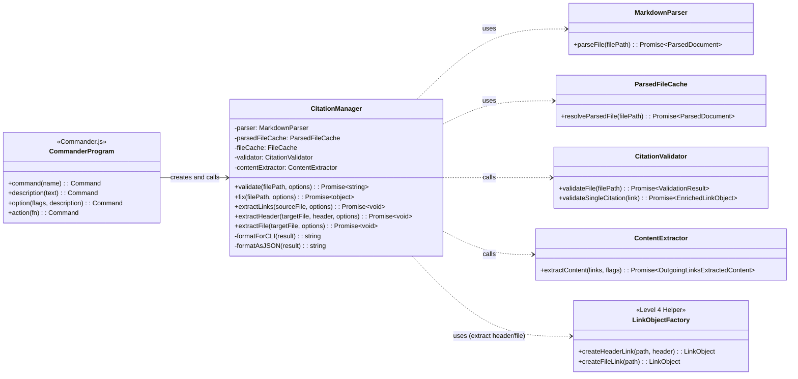

# CLI Orchestrator Implementation Guide

Coordinates citation validation and extraction workflows from command-line arguments, formatting results as CLI tree or JSON for consumption by users and automation.​​​​​​​​​​​​​​​​

## Problem

The Citation Manager tool requires a presentation layer that:
- Parses command-line arguments and translates user intent into component method calls
- Coordinates workflows between specialized components (Parser, Validator, Extractor)
- Formats output for both human (CLI tree) and machine (JSON) consumption
- Manages process exit codes to signal success/failure states
- Handles the special case of auto-fix logic that requires direct file manipulation

Without a dedicated orchestration layer, business logic components would need to know about CLI concerns (argument parsing, output formatting, exit codes), violating separation of concerns.

## Solution

The **CLI Orchestrator** (implemented as the `CitationManager` class in `citation-manager.js`) serves as the presentation layer. It uses Commander.js for command definition, instantiates components via factory pattern with dependency injection, and orchestrates distinct workflows for each command.

**Key Architectural Patterns:**
- **Orchestration Pattern**: CLI coordinates workflow phases without containing business logic
- **Factory Pattern**: Component instantiation with DI for testability
- **Separation of Concerns**: Validator validates, Extractor extracts, CLI coordinates
- **Fix Logic Exception**: Fix command contains application logic (documented tech debt)
- **Help Documentation Pattern**: jq-style layout using Commander.js `.addHelpText()` (US2.6)

**Epic 2 Extract Command Architecture:**
- **extract links**: CLI calls validator.validateFile() → passes enriched links to extractor
- **extract header/file**: CLI creates synthetic LinkObject → calls validator.validateSingleCitation() → passes validated link to extractor

## Structure

The CLI Orchestrator is the main entry point (`citation-manager.js`) that defines commands using Commander.js and delegates to business logic components.



### Semantic Suggestion Map

The CLI includes a `semanticSuggestionMap` constant that maps common user mistakes to correct commands/options:

```javascript
const semanticSuggestionMap = {
 // Command synonyms
 check: ['validate'],
 verify: ['validate'],
 lint: ['validate'],
 parse: ['ast'],
 // ... etc
};
```

Custom error handler uses this map via `program.configureOutput()` to provide helpful suggestions:

```text
$ citation-manager check file.md
Unknown command 'check'
Did you mean: validate?
```

**Design Decision**: Uses Commander.js native error handling hooks rather than custom error classes. Keeps CLI layer thin and focused on presentation.

---

## File Structure

### Current Implementation

```text
tools/citation-manager/
└── src/
    ├── citation-manager.js              # CLI entry point & CitationManager orchestrator
    └── factories/
        ├── componentFactory.js          # Component DI factories
        └── linkObjectFactory.js         # Synthetic link creation (US2.4/2.5)
```

### Ideal Structure (Future Refactoring)

Following the Component Folder pattern from [File Naming Patterns](../../../../../design-docs/Architecture%20-%20Baseline.md#File%20Naming%)

```text
tools/citation-manager/
├── src/
│   ├── core/
│   │   └── CitationManager/            # Level 3 component folder (PascalCase)
│   │       ├── CitationManager.js      # Main orchestrator class (PascalCase)
│   │       ├── validateCommand.js      # Command operations (camelCase)
│   │       ├── fixCommand.js
│   │       ├── extractLinksCommand.js
│   │       ├── extractHeaderCommand.js
│   │       ├── extractFileCommand.js
│   │       └── formatOutput.js         # Output formatting operations
│   └── factories/
│       ├── componentFactory.js         # Component DI factories
│       └── linkObjectFactory.js        # Synthetic link creation (US2.4/2.5)
│
├── test/
│   ├── cli-integration/
│   │   ├── validate-command.test.js    # Validate command tests
│   │   ├── fix-command.test.js         # Fix command tests
│   │   ├── extract-links.test.js       # Extract links tests (US2.3)
│   │   ├── extract-header.test.js      # Extract header tests (US2.4)
│   │   └── extract-file.test.js        # Extract file tests (US2.5)
│   └── fixtures/
│       └── cli/                        # CLI-specific test fixtures
│
└── design-docs/
    └── component-guides/
        └── CLI Orchestrator Implementation Guide.md  # This document
```

**Refactoring Pattern** (aligns with ContentExtractor structure):
- **Component Folder**: `CitationManager/` (PascalCase matching Level 3 component name)
- **Main Class File**: `CitationManager.js` (PascalCase matching folder)
- **Operation Files**: `validateCommand.js`, `fixCommand.js` (camelCase transformation naming)
- **Factory Helpers**: `linkObjectFactory.js` (camelCase, not a main component)

**LinkObjectFactory Location**: `tools/citation-manager/src/factories/linkObjectFactory.js`

**Architectural Justification** (PRD Epic 2 Whiteboard, lines 614-648):
- C4 Level 4 (Code) - Implementation detail of Level 3 CLI Orchestrator Component
- Factory's only role: Adapt CLI string inputs → LinkObject data contract
- Only CLI Orchestrator uses this factory (not exposed as public API)
- Should NOT appear as separate component in Level 3 architecture diagrams

---

## Public Contracts

### Input Contract: Command-Line Interface

The CLI defines commands using Commander.js with the following interface:

#### Validate Command

```bash
citation-manager validate <file> [options]

Arguments:
  file                      Markdown file to validate

Options:
  --format <type>          Output format: cli (default) or json
  --lines <range>          Validate specific line range (e.g., "10-50")
  --scope <folder>         Limit file resolution to folder
  --fix                    Auto-fix broken citations

Exit Codes:
  0  All citations valid (no errors)
  1  Validation errors found (fixable issues)
  2  System error (file not found, permission denied)
```

#### AST Command

```bash
citation-manager ast <file>

Arguments:
  file                      Markdown file to parse

Output:
  JSON representation of MarkdownParser.Output.DataContract

Exit Codes:
  0  Parse successful
  2  System error
```

#### Base-Paths Command

```bash
citation-manager base-paths <file> [options]

Arguments:
  file                      Markdown file to analyze

Options:
  --format <type>          Output format: cli (default) or json

Output:
  Distinct target file paths from all citations

Exit Codes:
  0  Extraction successful
  1  System error

Note: Marked for deprecation in US2.7. After Validation Enrichment Pattern (US1.8),
      users can obtain base paths via: validate --format json | jq '.links[].target.path.absolute'
```

#### Extract Links Command (US2.3)

```bash
citation-manager extract links <source-file> [options]

Arguments:
  source-file               Markdown file containing citations

Options:
  --scope <folder>         Limit file resolution to folder
  --format <type>          Output format (reserved for future)
  --full-files             Enable full-file link extraction

Output:
  JSON OutgoingLinksExtractedContent structure to stdout

Exit Codes:
  0  At least one link extracted successfully
  1  No eligible links or all extractions failed
```

#### Extract Header Command Contract (US2.4)

```bash
citation-manager extract header <target-file> "<header-name>" [options]

Arguments:
  target-file               Markdown file to extract from
  header-name               Exact header text to extract

Options:
  --scope <folder>         Limit file resolution to folder

Output:
  JSON OutgoingLinksExtractedContent structure to stdout

Exit Codes:
  0  Header extracted successfully
  1  Header not found or validation failed
```

#### Extract File Command (US2.5)

```bash
citation-manager extract file <target-file> [options]

Arguments:
  target-file               Markdown file to extract

Options:
  --scope <folder>         Limit file resolution to folder

Output:
  JSON OutgoingLinksExtractedContent structure to stdout

Exit Codes:
  0  File extracted successfully
  1  File not found or extraction failed
```

### Output Contract: Format Specifications

#### CLI Format (Tree Visualization)

```text
CRITICAL ERRORS:
├─ Line 45: [Broken Link](missing-file.md)
│  └─ File not found: missing-file.md
└─ Line 67: [Invalid Anchor](#non-existent)
   └─ Anchor not found
   └─ Suggestion: Did you mean #existing-anchor?

WARNINGS:
├─ Line 12: [Relative Path](../file.md)
│  └─ Consider using: [[file]]
└─ Line 89: [Obsidian Format]([[note#section]])
   └─ Path conversion recommended

VALID CITATIONS:
├─ Line 3: [Valid Link](file.md#anchor)
├─ Line 15: ^FR1
└─ Line 23: [[#internal-anchor|Display Text]]

Summary:
  Total Citations: 7
  Valid: 3
  Warnings: 2
  Errors: 2

VALIDATION FAILED - Please fix errors before committing
```

#### JSON Format

```json
{
  "summary": {
    "total": 7,
    "valid": 3,
    "warnings": 2,
    "errors": 2
  },
  "links": [
    {
      "linkType": "markdown",
      "scope": "cross-document",
      "anchorType": "header",
      "target": {
        "path": {
          "absolute": "/path/to/file.md",
          "raw": "file.md"
        },
        "anchor": "section"
      },
      "line": 3,
      "column": 5,
      "validation": {
        "status": "valid"
      }
    }
  ]
}
```

#### Extraction Output Format (US2.2a)

See [Content Extractor Implementation Guide - OutgoingLinksExtractedContent Schema](ContentExtractor%20Component%20Guide.md#OutgoingLinksExtractedContent%20Schema) for complete structure.

**Summary:**
- **extractedContentBlocks**: Index mapping contentId (SHA-256 hash) to deduplicated content
- **outgoingLinksReport**: Array of processed links with extraction status and source metadata
- **stats**: Aggregate statistics (totalLinks, uniqueContent, duplicates, tokensSaved, compressionRatio)

### Output Contract: Exit Codes

| Exit Code | Meaning | Commands |
|-----------|---------|----------|
| 0 | Success - No errors | All commands |
| 1 | Validation/extraction errors - Fixable issues | validate, extract* |
| 2 | System error - File not found, permission denied | All commands |

**Exit Code Strategy (ADR-CLI03):**
- **0**: Successful execution with no errors
- **1**: Expected failures (validation errors, missing anchors, ineligible links)
- **2**: Unexpected failures (file system errors, parser crashes, invalid arguments)

---

## Pseudocode

### CitationManager Class Structure

```tsx
// The CLI Orchestrator class - presentation layer coordinator
class CitationManager is
  private field parser: MarkdownParser
  private field parsedFileCache: ParsedFileCache
  private field fileCache: FileCache
  private field validator: CitationValidator
  private field contentExtractor: ContentExtractor

  constructor CitationManager(dependencies: object) is
    // Pattern: Accept optional dependencies for DI, use factories for defaults
    this.parser = dependencies.parser || createMarkdownParser()
    this.parsedFileCache = dependencies.parsedFileCache || createParsedFileCache(this.parser)
    this.fileCache = dependencies.fileCache || createFileCache()
    this.validator = dependencies.validator || createCitationValidator(this.parsedFileCache, this.fileCache)
    this.contentExtractor = dependencies.contentExtractor || createContentExtractor(this.parsedFileCache, this.validator)
```

### Validate Command

```tsx
  // Validates citations in a markdown file
  // Returns formatted string (CLI tree or JSON)
  public async method validate(filePath: string, options: object): Promise<string> is
    // Decision: Build FileCache only if --scope provided
    if (options.scope) then
      await this.fileCache.buildCache(options.scope)

    // Pattern: Delegate validation to validator component
    field validationResult = await this.validator.validateFile(filePath)

    // Decision: Apply line range filtering if specified
    if (options.lines) then
      validationResult = this.filterByLineRange(validationResult, options.lines)

    // Boundary: Format output based on requested format
    if (options.format == "json") then
      return this.formatAsJSON(validationResult)
    else
      return this.formatForCLI(validationResult)

    // Note: Exit code set by CLI action handler based on validation summary
```

### Fix Command

```tsx
  // Auto-fixes broken citations using validator suggestions
  // Returns detailed fix report
  public async method fix(filePath: string, options: object): Promise<object> is
    // Decision: Build FileCache if --scope provided
    if (options.scope) then
      await this.fileCache.buildCache(options.scope)

    // Pattern: Validate first to identify fixable links
    field validationResult = await this.validator.validateFile(filePath)

    // Decision: Extract fixable links (pathConversion or anchor suggestions)
    field fixableLinks = this.identifyFixableLinks(validationResult.links)

    if (fixableLinks.length == 0) then
      return { fixCount: 0, message: "No auto-fixable citations found" }

    // Boundary: Read source file content
    field sourceContent = fs.readFileSync(filePath, 'utf8')
    field fixedContent = sourceContent
    field fixDetails = new array

    // Pattern: Apply all fixes to content string
    foreach (link in fixableLinks) do
      if (link.validation.pathConversion) then
        fixedContent = this.applyPathConversion(fixedContent, link)
        fixDetails.add({ line: link.line, type: "path", before: link.target.path.raw, after: link.validation.pathConversion.recommended })
      else if (link.validation.suggestion) then
        fixedContent = this.applyAnchorFix(fixedContent, link)
        fixDetails.add({ line: link.line, type: "anchor", before: link.target.anchor, after: link.validation.suggestion })

    // Boundary: Write fixed content atomically
    fs.writeFileSync(filePath, fixedContent, 'utf8')

    return {
      fixCount: fixableLinks.length,
      details: fixDetails
    }

  // Helper: Identifies links with fixable suggestions
  private method identifyFixableLinks(links: EnrichedLinkObject[]): EnrichedLinkObject[] is
    field fixable = new array

    foreach (link in links) do
      if (link.validation.pathConversion || link.validation.suggestion) then
        fixable.add(link)

    return fixable
```

### AST Command

```tsx
  // Returns raw parser output for debugging
  // Bypasses ParsedDocument facade to show internal data contract
  public async method ast(filePath: string): Promise<string> is
    // Boundary: Direct parser access for debugging purposes
    field parserOutput = await this.parser.parseFile(filePath)

    // Output: Raw MarkdownParser.Output.DataContract
    return JSON.stringify(parserOutput, null, 2)
```

### Base-Paths Command

```tsx
  // Extracts distinct target file paths from all citations
  // Note: Marked for deprecation in US2.7
  public async method extractBasePaths(filePath: string): Promise<object> is
    // Pattern: Delegate parsing to parser
    field parsed = await this.parser.parseFile(filePath)

    // Extract unique absolute paths from links
    field basePaths = new Set()
    foreach (link in parsed.links) do
      if (link.target.path.absolute != null) then
        basePaths.add(link.target.path.absolute)

    return {
      file: filePath,
      basePaths: Array.from(basePaths),
      count: basePaths.size
    }
```

### Extract Links Command (US2.3)

```tsx
  // Extracts content from all links in source document
  // Returns OutgoingLinksExtractedContent to stdout
  public async method extractLinks(sourceFile: string, options: object): Promise<void> is
    // Decision: Build FileCache if --scope provided
    if (options.scope) then
      await this.fileCache.buildCache(options.scope)

    // Phase 1: Link Discovery & Validation
    // Pattern: Delegate to validator for link discovery and enrichment
    field validationResult = await this.validator.validateFile(sourceFile)
    field enrichedLinks = validationResult.links

    // Decision: Report validation errors to stderr
    if (validationResult.summary.errors > 0) then
      console.error("Validation errors found:")
      console.error(this.formatValidationErrors(validationResult))

    // Phase 2: Content Extraction
    // Pattern: Pass pre-validated enriched links to extractor
    field extractionResult = await this.contentExtractor.extractContent(
      enrichedLinks,
      { fullFiles: options.fullFiles }
    )

    // Phase 3: Output
    // Boundary: Output JSON to stdout
    console.log(JSON.stringify(extractionResult, null, 2))

    // Decision: Exit code based on extraction success
    if (extractionResult.stats.uniqueContent > 0) then
      process.exitCode = 0
    else
      process.exitCode = 1
```

### Extract Header Command Psuedocode (US2.4)

```tsx
  // Extracts specific header content from target file
  // Uses synthetic link creation pattern
  public async method extractHeader(targetFile: string, headerName: string, options: object): Promise<void> is
    // Decision: Build FileCache if --scope provided
    if (options.scope) then
      await this.fileCache.buildCache(options.scope)

    // Phase 1: Synthetic Link Creation
    // Pattern: Use factory to create unvalidated LinkObject
    field factory = new LinkObjectFactory()
    field syntheticLink = factory.createHeaderLink(targetFile, headerName)

    // Phase 2: Validation
    // Pattern: Validate synthetic link before extraction
    field validatedLink = await this.validator.validateSingleCitation(syntheticLink)

    // Decision: Check validation status before extraction
    if (validatedLink.validation.status == "error") then
      console.error("Validation failed:", validatedLink.validation.error)
      if (validatedLink.validation.suggestion) then
        console.error("Suggestion:", validatedLink.validation.suggestion)
      process.exitCode = 1
      return

    // Phase 3: Extraction
    // Pattern: Extract content from validated link
    field result = await this.contentExtractor.extractContent([validatedLink], options)

    // Phase 4: Output
    console.log(JSON.stringify(result, null, 2))
    process.exitCode = 0
```

### Extract File Command (US2.5)

```tsx
  // Extracts complete file content
  // Uses synthetic link with fullFiles flag pattern
  public async method extractFile(targetFile: string, options: object): Promise<void> is
    // Decision: Build FileCache if --scope provided
    if (options.scope) then
      await this.fileCache.buildCache(options.scope)

    // Phase 1: Synthetic Link Creation
    field factory = new LinkObjectFactory()
    field syntheticLink = factory.createFileLink(targetFile)

    // Phase 2: Validation
    field validatedLink = await this.validator.validateSingleCitation(syntheticLink)

    // Decision: Check validation status
    if (validatedLink.validation.status == "error") then
      console.error("Validation failed:", validatedLink.validation.error)
      process.exitCode = 1
      return

    // Phase 3: Extraction with Full-Files Flag
    // Decision: Force full-file extraction eligibility via flag
    // Pattern: Enables CliFlagStrategy without hardcoding markers
    field result = await this.contentExtractor.extractContent(
      [validatedLink],
      { ...options, fullFiles: true }
    )

    // Phase 4: Output
    console.log(JSON.stringify(result, null, 2))
    process.exitCode = 0
```

---

## LinkObjectFactory Implementation (Level 4 Detail)

**Location**: `tools/citation-manager/src/factories/linkObjectFactory.js`

**Architectural Level**: C4 Level 4 (Code) - Implementation detail of Level 3 CLI Orchestrator Component

**Purpose**: Construct unvalidated LinkObjects from CLI command parameters for `extract header` and `extract file` subcommands.

**Architectural Justification** (PRD Epic 2 Whiteboard, lines 614-648):
- Factory's _only_ role is to support the CLI Orchestrator's job
- Adapts simple string inputs from command line (e.g., `<target-file>`, `<header>`) into complex LinkObject data contract
- Makes it an internal helper of orchestration logic, not a standalone component
- CLI is the _only_ component that uses this factory (not exposed as public API)
- Should NOT appear as separate box on Level 3 component diagrams (would clutter the view)

### Pseudocode

```tsx
// LinkObjectFactory - Internal CLI helper for synthetic link creation
class LinkObjectFactory is

  // Creates unvalidated LinkObject for header extraction
  // Returns: { linkType, scope, anchorType: "header", target: { path, anchor }, validation: null }
  public method createHeaderLink(targetPath: string, headerName: string): LinkObject is
    // Boundary: Normalize path to absolute
    field absolutePath = path.resolve(targetPath)

    // Pattern: Create LinkObject structure matching parser output contract
    return {
      linkType: "markdown",
      scope: "cross-document",
      anchorType: "header",
      source: {
        path: {
          absolute: process.cwd()  // CLI invocation directory
        }
      },
      target: {
        path: {
          raw: targetPath,
          absolute: absolutePath,
          relative: path.relative(process.cwd(), absolutePath)
        },
        anchor: headerName
      },
      text: headerName,
      fullMatch: `[${headerName}](${targetPath}#${headerName})`,
      line: 0,  // Synthetic links don't have source line
      column: 0,
      extractionMarker: null,
      validation: null  // Will be enriched by validator
    }

  // Creates unvalidated LinkObject for full-file extraction
  // Returns: { linkType, scope, anchorType: null, target: { path }, validation: null }
  public method createFileLink(targetPath: string): LinkObject is
    field absolutePath = path.resolve(targetPath)

    return {
      linkType: "markdown",
      scope: "cross-document",
      anchorType: null,  // No anchor = full-file link
      source: {
        path: {
          absolute: process.cwd()
        }
      },
      target: {
        path: {
          raw: targetPath,
          absolute: absolutePath,
          relative: path.relative(process.cwd(), absolutePath)
        },
        anchor: null
      },
      text: path.basename(targetPath),
      fullMatch: `[${path.basename(targetPath)}](${targetPath})`,
      line: 0,
      column: 0,
      extractionMarker: null,
      validation: null
    }
```

**Boundaries:**
- ✅ Creates LinkObject data structures matching parser contract
- ✅ Handles path normalization (relative → absolute)
- ❌ Does NOT validate file existence (delegated to CitationValidator)
- ❌ Does NOT extract content (delegated to ContentExtractor)
- ❌ Does NOT apply eligibility rules (delegated to ExtractionStrategy chain)

**Usage Pattern in CLI Orchestrator:**

```tsx
// extract header command
field factory = new LinkObjectFactory()
field syntheticLink = factory.createHeaderLink(targetFile, header)
field validatedLink = await this.validator.validateSingleCitation(syntheticLink)
field result = await this.contentExtractor.extractContent([validatedLink], options)

// extract file command
field factory = new LinkObjectFactory()
field syntheticLink = factory.createFileLink(targetFile)
field validatedLink = await this.validator.validateSingleCitation(syntheticLink)
field result = await this.contentExtractor.extractContent([validatedLink], { ...options, fullFiles: true })
```

---

## Output Formatting

### CLI Format Algorithm

```tsx
  // Formats ValidationResult as human-readable tree structure
  private method formatForCLI(result: ValidationResult): string is
    field output = new StringBuilder()

    // Pattern: Three-section structure (errors, warnings, valid)
    if (result.summary.errors > 0) then
      output.append("CRITICAL ERRORS:\n")
      output.append(this.formatLinksSection(result.links, "error"))
      output.append("\n")

    if (result.summary.warnings > 0) then
      output.append("WARNINGS:\n")
      output.append(this.formatLinksSection(result.links, "warning"))
      output.append("\n")

    if (result.summary.valid > 0) then
      output.append("VALID CITATIONS:\n")
      output.append(this.formatLinksSection(result.links, "valid"))
      output.append("\n")

    // Boundary: Summary statistics block
    output.append("Summary:\n")
    output.append("  Total Citations: " + result.summary.total + "\n")
    output.append("  Valid: " + result.summary.valid + "\n")
    output.append("  Warnings: " + result.summary.warnings + "\n")
    output.append("  Errors: " + result.summary.errors + "\n")
    output.append("\n")

    // Decision: Status message based on error count
    if (result.summary.errors > 0) then
      output.append("VALIDATION FAILED - Please fix errors before committing\n")
    else if (result.summary.warnings > 0) then
      output.append("PASSED WITH WARNINGS - Consider addressing warnings\n")
    else
      output.append("ALL CITATIONS VALID\n")

    return output.toString()

  // Formats a subset of links matching status filter
  private method formatLinksSection(links: EnrichedLinkObject[], statusFilter: string): string is
    field output = new StringBuilder()
    field filteredLinks = links.filter(link => link.validation.status == statusFilter)

    foreach (link in filteredLinks) do
      // Pattern: Tree structure with ├─ and └─ prefixes
      field isLast = (link == filteredLinks[filteredLinks.length - 1])
      field prefix = isLast ? "└─ " : "├─ "

      output.append(prefix + "Line " + link.line + ": " + link.fullMatch + "\n")

      // Decision: Include error message if present
      if (link.validation.error) then
        field detailPrefix = isLast ? "   " : "│  "
        output.append(detailPrefix + "└─ " + link.validation.error + "\n")

      // Decision: Include suggestion if present
      if (link.validation.suggestion) then
        field detailPrefix = isLast ? "   " : "│  "
        output.append(detailPrefix + "└─ Suggestion: " + link.validation.suggestion + "\n")

    return output.toString()
```

### JSON Format Algorithm

```tsx
  // Formats result as JSON for machine consumption
  private method formatAsJSON(result: object): string is
    return JSON.stringify(result, null, 2)
```

---

## Commander.js Integration

The CLI uses Commander.js to define commands and parse arguments. Each command definition includes description, arguments, options, and an action handler.

### Command Definition Pattern

```tsx
// Main program setup
field program = new Command()

program
  .name("citation-manager")
  .description("Validates and manages markdown citation links")
  .version("1.0.0")

// Validate command
program
  .command("validate")
  .description("Validate citations in markdown file")
  .argument("<file>", "Markdown file to validate")
  .option("--format <type>", "Output format (cli|json)", "cli")
  .option("--lines <range>", "Validate specific line range")
  .option("--scope <folder>", "Limit file resolution scope")
  .option("--fix", "Auto-fix broken citations")
  .action(async (file, options) => {
    field manager = new CitationManager()

    try
      if (options.fix) then
        field fixResult = await manager.fix(file, options)
        console.log(fixResult)
      else
        field result = await manager.validate(file, options)
        console.log(result)

        // Decision: Set exit code based on validation result
        if (options.format == "json") then
          field parsed = JSON.parse(result)
          if (parsed.summary.errors > 0) then
            process.exitCode = 1
        else
          if (result.includes("VALIDATION FAILED")) then
            process.exitCode = 1

    catch (error) is
      console.error("ERROR:", error.message)
      process.exitCode = 2
  })

// Extract links command (US2.3)
program
  .command("extract")
  .description("Extract content from citations")

program
  .command("extract links")
  .description("Extract content from all links in source document")
  .argument("<source-file>", "Markdown file containing citations")
  .option("--scope <folder>", "Limit file resolution scope")
  .option("--format <type>", "Output format (reserved)")
  .option("--full-files", "Enable full-file link extraction")
  .action(async (sourceFile, options) => {
    field manager = new CitationManager()

    try
      await manager.extractLinks(sourceFile, options)
    catch (error) is
      console.error("ERROR:", error.message)
      process.exitCode = 2
  })

// Extract header command (US2.4)
program
  .command("extract header")
  .description("Extract specific header content from target file")
  .argument("<target-file>", "Markdown file to extract from")
  .argument("<header-name>", "Exact header text to extract")
  .option("--scope <folder>", "Limit file resolution scope")
  .action(async (targetFile, headerName, options) => {
    field manager = new CitationManager()

    try
      await manager.extractHeader(targetFile, headerName, options)
    catch (error) is
      console.error("ERROR:", error.message)
      process.exitCode = 2
  })

// Extract file command (US2.5)
program
  .command("extract file")
  .description("Extract complete file content")
  .argument("<target-file>", "Markdown file to extract")
  .option("--scope <folder>", "Limit file resolution scope")
  .action(async (targetFile, options) => {
    field manager = new CitationManager()

    try
      await manager.extractFile(targetFile, options)
    catch (error) is
      console.error("ERROR:", error.message)
      process.exitCode = 2
  })

program.parse(process.argv)
```

---

## Testing Strategy

**Philosophy**: Validate CLI orchestration workflows end-to-end using subprocess execution with real fixtures. Tests verify command-line interface, output formatting, and exit code behavior.

**Test Location**: `tools/citation-manager/test/cli-integration/`

### Test Categories

1. **Validate Command Tests**
   - CLI format output structure (tree visualization)
   - JSON format output schema
   - Exit code behavior (0, 1, 2)
   - Line range filtering (--lines option)
   - Scope limiting (--scope option)
   - Error, warning, and valid citation sections

2. **Fix Command Tests**
   - Auto-fix applies pathConversion suggestions
   - Auto-fix applies anchor suggestions
   - Fix report includes before/after details
   - File content updated correctly
   - No fixes applied when none available

3. **AST Command Tests**
   - Outputs valid JSON
   - Contains MarkdownParser.Output.DataContract schema
   - Includes filePath, content, tokens, links, headings, anchors

4. **Base-Paths Command Tests** (Deprecated in US2.7)
   - Extracts unique target paths
   - CLI format (numbered list)
   - JSON format (object with basePaths array)

5. **Extract Links Command Tests** (US2.3)
   - End-to-end workflow: validate → extract
   - Handles validation errors gracefully
   - Outputs OutgoingLinksExtractedContent structure
   - Exit code based on extraction success
   - --full-files flag enables full-file extraction

6. **Extract Header Command Tests** (US2.4)
   - Synthetic link creation and validation
   - Header extraction from target file
   - Validation failure handling
   - Suggestion display on error

7. **Extract File Command Tests** (US2.5)
   - Full-file synthetic link creation
   - Complete content extraction
   - fullFiles flag applied automatically

### CLI Testing Pattern

Tests use subprocess execution via `runCLI` helper to simulate real CLI usage:

```javascript
// Helper function for CLI subprocess execution
async function runCLI(args, options = {}) {
  const command = `node tools/citation-manager/src/citation-manager.js ${args}`;
  const result = execSync(command, {
    cwd: options.cwd || process.cwd(),
    encoding: 'utf8',
    env: process.env,
    maxBuffer: 10 * 1024 * 1024  // 10MB buffer for large output
  });
  return result;
}

// Example test
it('should validate file and return CLI format', async () => {
  // Given: Test fixture with mixed validation results
  const fixture = path.join(__dirname, '../fixtures/cli/mixed-validation.md');

  // When: Run validate command
  const output = await runCLI(`validate ${fixture}`);

  // Then: Output contains expected sections
  expect(output).toContain('CRITICAL ERRORS:');
  expect(output).toContain('WARNINGS:');
  expect(output).toContain('VALID CITATIONS:');
  expect(output).toContain('Summary:');
});
```

### Known Testing Limitations

**Issue: CLI Subprocess Testing Buffer Limits** (Technical Debt)

Subprocess execution via `execSync` has stdout/stderr buffer limits (~64KB). Large extraction outputs can exceed this limit, causing tests to fail.

**Workaround**: Use shell redirection to bypass buffer limits:

```javascript
// Workaround for large output
const output = execSync(
  `node citation-manager.js extract links ${sourceFile} > /tmp/output.json`,
  { shell: true }
);
const result = fs.readFileSync('/tmp/output.json', 'utf8');
```

**Better Solution** (Deferred): Refactor CLI tests to import and call CitationManager methods directly instead of subprocess execution. This would eliminate buffer limits and improve test performance.

_Reference_: [Technical Debt: CLI Subprocess Testing Buffer Limits](../../../../../design-docs/Architecture%20-%20Baseline.md#Technical%20Debt%20CLI%20Subprocess%20Testing%20Buffer%20Limits)

---

## Architectural Decisions

### ADR-CLI01: Commander.js Framework

**Status**: Accepted

**Context**: Need a CLI framework for command parsing, argument validation, option handling, and help generation.

**Decision**: Use Commander.js as the CLI framework.

**Rationale**:
- Industry standard with widespread adoption
- Clean declarative command definition syntax
- Built-in help generation and argument parsing
- Supports subcommands (extract links, extract header, extract file)
- TypeScript types available for enhanced development experience
- Active maintenance and community support

**Alternatives Considered**:
- **yargs**: More feature-rich but heavier weight, unnecessary complexity for our use case
- **minimist**: Lower-level, requires manual help generation and validation
- **oclif**: Framework-heavy, overkill for tool-level CLI (better for multi-command platforms)

**Consequences**:
- ✅ Rapid command definition and option parsing
- ✅ Consistent help output across all commands
- ✅ Subcommand support for extract command variants
- ⚠️ Commander.js API dependency (mitigated by stable API)

---

### ADR-CLI02: Fix Logic in CLI Orchestrator

**Status**: Accepted (Documented Technical Debt)

**Context**: The auto-fix feature requires reading source file content, applying validator suggestions, and writing updated content. This is application logic that ideally belongs in a dedicated component, not the presentation layer.

**Decision**: Implement fix logic directly in CitationManager orchestrator as an exception to normal architectural boundaries.

**Rationale**:
- Fix operation requires source file access and validation result consumption
- Creating separate "FixService" component would add indirection without clear value
- Fix logic is inherently orchestration: coordinate validator suggestions with file modifications
- Pragmatic approach delivers functionality without over-engineering

**Architectural Violation**:
- CLI Orchestrator contains application logic (file read/write)
- Violates separation of concerns principle
- Creates scattered file I/O operations (Parser, Validator, CLI all use fs directly)

**Mitigation Strategy**:
- Document as technical debt with clear rationale
- Future: Extract FileSystemManager component to centralize file I/O
- Current: Accept trade-off for MVP delivery

**Consequences**:
- ✅ Fix functionality delivered without architectural complexity
- ✅ Fix logic co-located with validation orchestration
- ⚠️ Scattered file I/O operations (documented tech debt)
- ⚠️ CLI Orchestrator has mixed responsibilities

_Related Technical Debt_: [Scattered File I/O Operations](<../.archive/features/20251003-content-aggregation/content-aggregation-architecture.md#Scattered File I/O Operations>)

---

### ADR-CLI03: Exit Code Strategy

**Status**: Accepted

**Context**: CLI tools use exit codes to signal success/failure states to calling processes (shell scripts, CI/CD pipelines, automation). Need consistent exit code semantics across all commands.

**Decision**: Use three-tier exit code strategy:
- **0**: Success (no errors)
- **1**: Validation/extraction errors (expected failures, fixable issues)
- **2**: System errors (file not found, permission denied, unexpected crashes)

**Rationale**:
- **Exit code 0**: Signals clean execution with no issues
- **Exit code 1**: Distinguishes expected failures (broken links) from system failures
  - Validation errors: User can fix by updating citations
  - Extraction failures: User can adjust link eligibility or fix broken citations
- **Exit code 2**: Signals unexpected failures requiring investigation
  - File system errors: File not found, permission denied
  - Parser crashes: Invalid markdown syntax
  - System errors: Out of memory, disk full

**Usage Patterns**:

```bash
# CI/CD pipeline - fail build on validation errors
citation-manager validate docs.md || exit 1

# Script - different handling for error types
citation-manager validate docs.md
case $? in
  0) echo "All valid" ;;
  1) echo "Fix citations" ;;
  2) echo "System error" ;;
esac

# Extract command - proceed with extraction even if some links fail
citation-manager extract links docs.md
if [ $? -eq 0 ]; then
  echo "Extraction successful"
else
  echo "Some extractions failed"
fi
```

**Consequences**:
- ✅ Consistent exit codes across all commands
- ✅ Automation can distinguish error types
- ✅ CI/CD pipelines can make informed decisions
- ⚠️ Requires careful exit code management in action handlers

---

### ADR-CLI04: LinkObjectFactory as Level 4 Detail

**Status**: Accepted (Epic 2 Whiteboard, PRD lines 614-648)

**Context**: The `extract header` and `extract file` commands need to create LinkObjects from CLI parameters (target file path, header name) to pass to the validation and extraction pipeline. Should LinkObjectFactory be a Level 3 component or Level 4 implementation detail?

**Decision**: Implement LinkObjectFactory as Level 4 (Code) implementation detail of the CLI Orchestrator Component. It should NOT appear as a separate Level 3 component in architecture diagrams.

**Rationale**:
- **Single Purpose**: Factory's only role is to support CLI Orchestrator's synthetic link creation needs
- **Tight Coupling**: Factory knows about LinkObject data contract structure (CLI-specific knowledge)
- **Single Consumer**: Only CLI Orchestrator uses this factory (not exposed as public API to other components)
- **Adaptation Logic**: Adapts simple CLI string inputs → complex LinkObject data structure
- **No Business Logic**: Factory contains no validation, extraction, or business rules
- **C4 Architecture Clarity**: Level 4 code details don't clutter Level 3 component diagrams

**Architectural Justification** (PRD Epic 2 Whiteboard):
> The factory's _only_ role is to support the `CLI Orchestrator`'s job. It adapts simple string inputs from the command line (e.g., `<target-file>`, `<header>`) into the complex `LinkObject` data contract. This makes it an internal helper of the orchestration logic, not a standalone component. The CLI is the _only_ component that will ever use this factory, making it part of the CLI's "grouping of related functionality". Should NOT appear as a separate box on Level 3 component diagrams (would clutter the view).

**Implementation Location**: `tools/citation-manager/src/factories/linkObjectFactory.js`

**Boundaries**:
- ✅ Creates LinkObject data structures
- ✅ Handles path normalization (relative → absolute)
- ❌ Does NOT validate file existence (delegated to CitationValidator)
- ❌ Does NOT extract content (delegated to ContentExtractor)
- ❌ Does NOT apply eligibility rules (delegated to strategies)

**Consequences**:
- ✅ CLI Orchestrator boundaries remain clear (orchestration, not data structure knowledge)
- ✅ LinkObject creation logic encapsulated in dedicated helper
- ✅ Level 3 diagrams stay focused on component interactions
- ✅ Factory testable in isolation
- ⚠️ Tight coupling between CLI and LinkObject structure (acceptable for internal helper)

---

### ADR-CLI05: Orchestration Pattern Separation

**Status**: Accepted (Epic 2 Whiteboard, PRD lines 689-791)

**Context**: Extract commands need to coordinate validation and extraction workflows. Should ContentExtractor call CitationValidator internally, or should CLI orchestrate the two components separately?

**Decision**: CLI Orchestrator coordinates validation → extraction workflow by calling components sequentially. ContentExtractor receives pre-validated enriched LinkObjects and focuses solely on extraction logic.

**Two Orchestration Patterns**:

1. **Extract Links Pattern** (US2.3):
   - CLI calls `validator.validateFile(sourceFile)` to discover and validate links
   - CLI extracts enriched links from ValidationResult
   - CLI passes enriched links to `extractor.extractContent(enrichedLinks, flags)`

2. **Extract Header/File Pattern** (US2.4, US2.5):
   - CLI creates synthetic LinkObject via LinkObjectFactory
   - CLI calls `validator.validateSingleCitation(syntheticLink)` to enrich with validation metadata
   - CLI passes validated link to `extractor.extractContent([validatedLink], flags)`

**Rationale**:
- **Separation of Concerns**: Validator validates, Extractor extracts, CLI coordinates
- **Single Responsibility**: ContentExtractor focuses on eligibility analysis + content retrieval + deduplication
- **Low Coupling**: ContentExtractor doesn't depend on CitationValidator (receives pre-validated links)
- **Reusability**: Validator can be used independently of extractor
- **Clear Data Flow**: Enriched LinkObjects flow CLI → Extractor (no hidden validator calls)
- **Single-Parse Guarantee**: ParsedFileCache ensures files parsed once (shared by Validator and Extractor)

**Architectural Benefits**:
- ✅ **Low Coupling, High Cohesion**: Components have single responsibilities with minimal dependencies
- ✅ **Black Box Interfaces**: Each component exposes clean API (Principles.md#^black-box-interfaces)
- ✅ **Extension Over Modification**: Add new extraction modes by extending factory + CLI commands (no extractor changes)
- ✅ **Service Layer Separation**: CLI (presentation) orchestrates business logic components (validator, extractor)

**Consequences**:
- ✅ Clear component boundaries and responsibilities
- ✅ Validator and Extractor independently testable
- ✅ Explicit validation step visible in workflow
- ⚠️ CLI coordinates 3-4 component calls (acceptable orchestration complexity)
- ⚠️ Shared ParsedFileCache dependency (mitigated by infrastructure-level caching)

_Reference_: [Epic 2 Whiteboard - Why This Design Is Correct](<../.archive/features/20251003-content-aggregation/content-aggregation-prd.md#Why This Design Is Correct>)

---

## Technical Debt

### Issue 1: CLI Subprocess Testing Buffer Limits

**Risk Category**: Testing / Quality Assurance

**Status**: Identified (2025-10-22) - Workaround Implemented

**Description**: CLI integration tests use subprocess execution (`execSync`) to simulate real command-line usage. Subprocess stdout/stderr buffers are limited to ~64KB. Large extraction outputs (US2.3 extract links command) can exceed this limit, causing tests to fail with buffer overflow errors.

**Current Problem**:

```javascript
// This fails for large outputs
const output = execSync(`node citation-manager.js extract links large-source.md`);
// Error: stdout maxBuffer exceeded
```

**Workaround**:
Use shell redirection to bypass buffer limits:

```javascript
// Redirect output to file
execSync(
  `node citation-manager.js extract links ${sourceFile} > /tmp/output.json`,
  { shell: true }
);
const result = fs.readFileSync('/tmp/output.json', 'utf8');
```

**Impact**:
- **Medium**: Affects CLI integration tests for extract commands
- **Scope**: US2.3, US2.4, US2.5 CLI tests with large outputs
- **User Experience**: No impact (only affects test infrastructure)

**Better Solution** (Deferred):
Refactor CLI tests to import and call CitationManager methods directly instead of subprocess execution:

```javascript
// Direct import testing (proposed)
import { CitationManager } from '../src/citation-manager.js';

it('should extract links', async () => {
  const manager = new CitationManager();
  const result = await manager.extractLinks(sourceFile, options);
  expect(result).toBeDefined();
});
```

**Benefits of Direct Import**:
- Eliminates buffer limits entirely
- Faster test execution (no process spawn overhead)
- Better error messages (stack traces point to actual code)
- Easier debugging (can set breakpoints in CitationManager)

**Resolution Criteria**:
- Migrate all CLI integration tests to direct import pattern
- Remove `runCLI` helper and subprocess execution
- Maintain coverage of command-line parsing (separate test suite for Commander.js integration)

**Timeline**: Defer until Epic 2 complete. Workaround acceptable for MVP.

**Estimated Effort**: 4-6 hours (test refactoring)

_Reference_: [Workspace Architecture - Technical Debt](../../../../../design-docs/Architecture%20-%20Baseline.md#Technical%20Debt%20CLI%20Subprocess%20Testing%20Buffer%20Limits)

---

### Issue 2: Scattered File I/O Operations

**Risk Category**: Architecture / Maintainability

**Status**: Documented Technical Debt (ADR-CLI02)

**Description**: Multiple components perform direct file system operations using Node.js `fs` module. MarkdownParser reads files, CitationValidator checks file existence, and CLI Orchestrator reads/writes files for auto-fix. This scatters a core cross-cutting concern throughout the application.

**Affected Components**:
- **MarkdownParser**: `fs.readFileSync()` to read file content
- **CitationValidator**: `fs.existsSync()` to check file existence
- **CLI Orchestrator**: `fs.readFileSync()` and `fs.writeFileSync()` for fix command

**Impact**:
- **High**: Violates Single Responsibility Principle
- **Maintainability**: Changes to file I/O strategy require modifications across multiple components
- **Testing**: Components harder to test in isolation (fs module must be mocked in multiple places)
- **Error Handling**: Inconsistent file I/O error handling across components

**Mitigation Strategy**: Create dedicated FileSystemManager component to centralize all file system interactions:

```tsx
class FileSystemManager is
  public method readFile(filePath: string): Promise<string>
  public method writeFile(filePath: string, content: string): Promise<void>
  public method exists(filePath: string): Promise<boolean>
  public method resolveAbsolutePath(filePath: string): string
```

**Refactoring Approach**:
1. Create FileSystemManager component at `src/services/FileSystemManager.js`
2. Update componentFactory to instantiate FileSystemManager
3. Inject FileSystemManager into MarkdownParser, CitationValidator, CLI Orchestrator
4. Remove direct `fs` module usage from components
5. Update tests to mock FileSystemManager interface

**Resolution Criteria**:
- FileSystemManager component created and integrated
- All direct fs module usage removed from components
- Components use injected FileSystemManager for all file I/O
- Tests mock FileSystemManager interface (not fs module directly)

**Timeline**: Address after Epic 2 completion. Medium priority.

**Estimated Effort**: 8-12 hours (component creation + refactoring + test updates)

_Reference_: [Content Aggregation Architecture - Scattered File I/O Operations](<../.archive/features/20251003-content-aggregation/content-aggregation-architecture.md#Scattered File I/O Operations>)

---

### Issue 3: Base-Paths Command Deprecation (US2.7)

**Risk Category**: Feature Deprecation

**Status**: Planned (US2.7) - Breaking Change

**Description**: The `base-paths` command extracts distinct target file paths from citations. After Validation Enrichment Pattern (US1.8), this functionality is redundant since LinkObjects now include `target.path.absolute` directly in the validation results.

**Current Usage**:

```bash
# Extract base paths
citation-manager base-paths file.md --format json
```

**Replacement Pattern**:

```bash
# New approach using validate command
citation-manager validate file.md --format json | jq '.links[].target.path.absolute' | sort -u
```

**Deprecation Strategy** (US2.7):
1. Mark command as deprecated in help output
2. Add deprecation warning when command is executed
3. Document migration path in release notes
4. Remove command in next major version

**Impact**:
- **Breaking Change**: Users relying on base-paths command in automation must migrate
- **Scope**: Any scripts/workflows using `citation-manager base-paths`
- **Mitigation**: Provide clear migration path and deprecation notice period

**Resolution Criteria**:
- Deprecation warning added to base-paths command
- Migration documentation published
- Command removed from code after deprecation period
- `CitationManager.extractBasePaths()` method removed

**Timeline**: US2.7 (after Epic 2 extract commands implemented)

**Estimated Effort**: 2-3 hours (deprecation warning + documentation + removal)

_Reference_: [PRD US2.7 - Remove Deprecated base-paths Command](<../.archive/features/20251003-content-aggregation/content-aggregation-prd.md#Story 2.7 Remove Deprecated base-paths Command>)

```github-query
outputType: table
queryType: issue
org: WesleyMFrederick
repo: cc-workflows
query: "is:issue label:component:CLIOrchestrator"
sort: number
direction: asc
columns: [number, status, title, labels, created, updated]
```

---

## Related Documentation

- [Content Aggregation Architecture - CLI Orchestrator Component](<../.archive/features/20251003-content-aggregation/content-aggregation-architecture.md#Citation Manager.CLI Orchestrator>)
- [ContentExtractor Component Guide](ContentExtractor%20Component%20Guide.md)
- [CitationValidator Implementation Guide](CitationValidator%20Implementation%20Guide.md)
- [ParsedFileCache Implementation Guide](ParsedFileCache%20Implementation%20Guide.md)
- [ParsedDocument Implementation Guide](../../../../../resume-coach/design-docs/examples/component-guides/ParsedDocument%20Implementation%20Guide.md)
- [Architecture Principles](../../../../../design-docs/Architecture%20Principles.md)

**User Stories**:
- [US2.3: Implement `extract links` Subcommand](<../.archive/features/20251003-content-aggregation/content-aggregation-prd.md#Story 2.3 Implement extract links Subcommand>)
- [US2.4: Implement `extract header` Subcommand](<../.archive/features/20251003-content-aggregation/content-aggregation-prd.md#Story 2.4 Implement extract header Subcommand>)
- [US2.5: Implement `extract file` Subcommand](<../.archive/features/20251003-content-aggregation/content-aggregation-prd.md#Story 2.5 Implement extract file Subcommand>)
- [US2.6: Add Comprehensive Help Documentation](<../.archive/features/20251003-content-aggregation/content-aggregation-prd.md#Story 2.6 Add Comprehensive Help Documentation to CLI Commands>)
- [US2.7: Remove Deprecated base-paths Command](<../.archive/features/20251003-content-aggregation/content-aggregation-prd.md#Story 2.7 Remove Deprecated base-paths Command>)

**Epic 2 Whiteboard**:
- [Architectural Decision: ContentExtractor Responsibility Boundaries](<../.archive/features/20251003-content-aggregation/content-aggregation-prd.md#Architectural Decision ContentExtractor Responsibility Boundaries>)
- [Component Responsibilities - LinkObjectFactory](<../.archive/features/20251003-content-aggregation/content-aggregation-prd.md#LinkObjectFactory (Level 4 Code Detail of CLI Orchestrator)>)
- [Why This Design Is Correct](<../.archive/features/20251003-content-aggregation/content-aggregation-prd.md#Why This Design Is Correct>)
