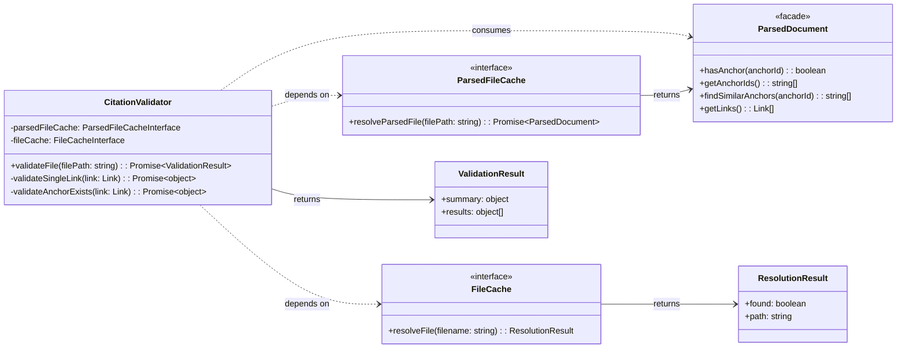

# CitationValidator Implementation Guide

This guide provides the Level 4 (Code) details for refactoring the **`CitationValidator`** component as part of user story `us1.5`. It includes the component's updated structure, pseudocode for its refactored logic, its formal data contracts, and a strategy for testing.

## Problem

Links and anchors identified by the `MarkdownParser` are purely syntactic constructs. There's no guarantee that a link's path points to an existing file or that its anchor corresponds to a real header or block in the target document. The system requires a dedicated component to perform this semantic validation and report the status of each link.

## Solution

The **`CitationValidator`** component is responsible for the semantic validation of links. ==It consumes `ParsedDocument` facade instances from the `ParsedFileCache`==. For each link, it verifies that the target file exists and, if an anchor is specified, ==uses the `ParsedDocument` query methods to check if the anchor is present==. It produces a **`CitationValidator.ValidationResult.Output.DataContrac`** object that details the status of every link (`valid`, `warning`, or `error`) and provides actionable suggestions for any failures.

## Structure

The `CitationValidator` is a class that depends on the `ParsedFileCache` (for retrieving parsed documents) and the `FileCache` (for legacy path resolution). It exposes a primary public method, `validateFile()`, which orchestrates the validation process.



1. [**ParsedDocument**]: ==The facade providing query methods over parser output (US1.7).==
2. [**ParsedFileCache**](ParsedFileCache%20Implementation%20Guide.md): The dependency used to retrieve ==`ParsedDocument` instances== efficiently.
3. [**FileCache**](../features/20251003-content-aggregation/content-aggregation-architecture.md#Citation%20Manager.File%20Cache): The dependency used for short filename lookups.
4. [**ValidationResult**](CitationValidator%20Implementation%20Guide.md#CitationValidator.ValidationResult.Output.DataContrac%20JSON%20Schema): The composite object returned by the validator.
5. [**CitationValidator**](CitationValidator%20Implementation%20Guide.md): The class that orchestrates the validation process.

## Public Contracts

### Input Contract
The component's constructor accepts two dependencies:
1. An implementation of a **[`ParsedFileCache interface`](ParsedFileCache%20Implementation%20Guide.md#Public%20Contracts)** ==that returns `ParsedDocument` facade instances==
2. An implementation of a [**`FileCache interface`**](../features/20251003-content-aggregation/content-aggregation-architecture.md#Citation%20Manager.File%20Cache)

The primary public method, `validateFile()`, accepts one argument:
1. **`filePath`** (string): The absolute path to the source markdown file to validate.

### Output Contract
The `validateFile()` method returns a `Promise` that resolves with a **`CitationValidator.ValidationResult.Output.DataContrac`** object. This object has the following structure:
- **`summary`** (object): An object containing counts of `total`, `valid`, `warning`, and `error` links.
- **`results`** (array): An array where each item is a detailed result object for a single link, including its `status`, `line`, `column`, and any `error` or `suggestion` messages.

## Pseudocode

This pseudocode follows the **MEDIUM-IMPLEMENTATION** abstraction level, showing the refactored logic that uses the new caching layer.

TypeScript

```tsx
// The CitationValidator class, responsible for the semantic validation of links.
class CitationValidator is
  private field parsedFileCache: ParsedFileCacheInterface
  private field fileCache: FileCacheInterface

  // The constructor accepts its cache dependencies.
  constructor CitationValidator(pCache: ParsedFileCacheInterface, fCache: FileCacheInterface) is
    // Integration: These dependencies are provided by the factory at runtime.
    this.parsedFileCache = pCache
    this.fileCache = fCache

  // The primary public method that orchestrates the validation of a source file.
  public async method validateFile(filePath: string): CitationValidator.ValidationResult.Output.DataContrac is
    // Boundary: Get the ParsedDocument facade instance from the cache.
    field sourceParsedDoc = await this.parsedFileCache.resolveParsedFile(filePath)

    field validationPromises = new array of Promise
    // Simplified: Use facade method to get links instead of direct array access
    foreach (link in sourceParsedDoc.getLinks()) do
      // Pattern: Concurrently validate all links found in the source document.
      validationPromises.add(this.validateSingleLink(link))

    field results = await Promise.all(validationPromises)

    return this.generateSummary(results)

  // Validates a single Link Object.
  private async method validateSingleLink(link: Link): object is
    // Decision: Check if the target file path was successfully resolved by the parser.
    if (link.target.path.absolute == null) then
      // The parser already determined the path is invalid.
      return { status: "error", error: "File not found: " + link.target.path.raw, ... }

    // Decision: Does the link have an anchor that needs validation?
    if (link.anchorType == "header" || link.anchorType == "block") then
      return await this.validateAnchorExists(link)
    else
      // This is a full-file link; path existence is sufficient.
      return { status: "valid", ... }

  // Validates that an anchor exists in its target document.
  private async method validateAnchorExists(link: Link): object is
    try
      // Boundary: Retrieve the ParsedDocument facade for the target file
      field targetParsedDoc = await this.parsedFileCache.resolveParsedFile(link.target.path.absolute)

      // Simplified: Use facade method instead of manual array operations
      if (targetParsedDoc.hasAnchor(link.target.anchor)) then
        return { status: "valid", ... }
      else
        // Pattern: Delegate suggestion generation to facade
        field suggestions = targetParsedDoc.findSimilarAnchors(link.target.anchor)
        return { status: "error", error: "Anchor not found", suggestion: suggestions[0], ... }

    catch (error) is
      // Error Handling: If the target file can't be parsed (e.g., doesn't exist), propagate the error.
      return { status: "error", error: error.message, ... }
```

## `CitationValidator.ValidationResult.Output.DataContract` JSON Schema

```json
{
  "$schema": "https://json-schema.org/draft/2020-12/schema",
  "$id": "https://cc-workflows.com/validation-result.schema.json",
  "title": "CitationValidator Validation Result Contract",
  "description": "The complete output from the CitationValidator's validateFile() method, containing a summary and detailed results for each link.",
  "type": "object",
  "properties": {
    "file": {
      "description": "The absolute path of the file that was validated.",
      "type": "string"
    },
    "summary": {
      "description": "An object containing statistics about the validation run.",
      "$ref": "#/$defs/summaryObject"
    },
    "results": {
      "description": "An array of result objects, one for each link found in the source file.",
      "type": "array",
      "items": {
        "$ref": "#/$defs/singleCitationValidator.ValidationResult.Output.DataContract"
      }
    }
  },
  "required": [
    "file",
    "summary",
    "results"
  ],
  "$defs": {
    "summaryObject": {
      "title": "Summary Object",
      "type": "object",
      "properties": {
        "total": {
          "description": "The total number of links that were validated.",
          "type": "integer",
          "minimum": 0
        },
        "valid": {
          "description": "The number of links with a 'valid' status.",
          "type": "integer",
          "minimum": 0
        },
        "warnings": {
          "description": "The number of links with a 'warning' status.",
          "type": "integer",
          "minimum": 0
        },
        "errors": {
          "description": "The number of links with an 'error' status.",
          "type": "integer",
          "minimum": 0
        }
      },
      "required": [
        "total",
        "valid",
        "warnings",
        "errors"
      ]
    },
    "singleCitationValidator.ValidationResult.Output.DataContract": {
      "title": "Single Validation Result",
      "description": "The detailed validation status for a single link.",
      "type": "object",
      "properties": {
        "line": {
          "description": "The line number of the link in the source file.",
          "type": "integer",
          "minimum": 1
        },
        "column": {
          "description": "The column number on the line where the link begins.",
          "type": "integer",
          "minimum": 1
        },
        "citation": {
          "description": "The raw markdown string of the link.",
          "type": "string"
        },
        "status": {
          "description": "The validation status for the link.",
          "type": "string",
          "enum": [
            "valid",
            "warning",
            "error"
          ]
        },
        "linkType": {
          "description": "The markdown syntax style of the link.",
          "type": "string",
          "enum": [
            "markdown",
            "wiki"
          ]
        },
        "error": {
          "description": "A detailed error message, present only if status is 'error'.",
          "type": [
            "string",
            "null"
          ]
        },
        "suggestion": {
          "description": "A human-readable suggestion for how to fix the issue.",
          "type": [
            "string",
            "null"
          ]
        },
        "pathConversion": {
          "description": "A structured object with a suggested path correction, present only for 'warning' statuses related to pathing.",
          "type": [
            "object",
            "null"
          ],
          "properties": {
            "type": {
              "type": "string",
              "const": "path-conversion"
            },
            "original": {
              "type": "string"
            },
            "recommended": {
              "type": "string"
            }
          },
          "required": [
            "type",
            "original",
            "recommended"
          ]
        }
      },
      "required": [
        "line",
        "column",
        "citation",
        "status",
        "linkType"
      ]
    }
  }
}
```

## Testing Strategy

```tsx
// Test pattern: BDD-style behavioral validation for the refactored component.
class CitationValidatorTests is

  // Test the successful validation of a document with valid links.
  method test_validation_shouldSucceedForValidLinks(): TestResult is
    // Given: A mock ParsedFileCache that returns valid ParserOutputContracts for a source and target file.
    // When: The validator's 'validateFile()' method is called on the source file.
    // Then: The returned CitationValidator.ValidationResult.Output.DataContrac object should report all links as 'valid'.
    // Validation: The mock ParsedFileCache's 'resolveParsedFile' method should have been called for both the source and target files.

  // Test the detection of a broken link due to a missing anchor.
  method test_validation_shouldFailForMissingAnchor(): TestResult is
    // Given: A mock ParsedFileCache where the target document's 'anchors' array does not contain the required anchor.
    // When: 'validateFile()' is called.
    // Then: The resulting CitationValidator.ValidationResult.Output.DataContrac object should report the link's status as 'error'.
    // Validation: The 'suggestion' field should contain helpful text based on the available anchors.

  // Test the core performance optimization of the caching layer.
  method test_caching_shouldRequestTargetFileOnlyOnce(): TestResult is
    // Given: A source document with multiple links pointing to the SAME target file.
    // Given: A mock ParsedFileCache.
    // When: 'validateFile()' is called on the source document.
    // Then: The mock ParsedFileCache's 'resolveParsedFile' method should have been called only ONCE for the target file.
    // Boundary: Verifies that the validator correctly leverages the cache to prevent redundant parsing.
```

---

## Technical Debt

### Issue 1: Redundant File Existence Check

**Current Problem** (validateCrossDocumentLink() line 325):

```javascript
if (!existsSync(targetPath)) {
    return error("File not found");
}

// Lines 467-471: THEN fetch parsed data
if (citation.target.anchor) {
    const anchorExists = await this.validateAnchorExists(
        citation.target.anchor,
        targetPath  // ← Calls parsedFileCache.resolveParsedFile()
    );
}
```

**Redundancy:**
- Line 325: `existsSync(targetPath)` - Real filesystem I/O to check file exists
- Line 468: `parsedFileCache.resolveParsedFile(targetPath)` - Parser reads file (proves it exists again)
- Result: **Double validation** that file exists - filesystem check + file read

**Better Approach:**

```javascript
// Use cache fetch as existence check
try {
    const parsed = await this.parsedFileCache.resolveParsedFile(targetPath);
    // If we got here, file exists (parser read it successfully)

    if (citation.target.anchor) {
        // Validate anchor using already-loaded parsed data
        const anchorExists = this.validateAnchorInParsedData(
            citation.target.anchor,
            parsed  // ← Already have it!
        );
    }
    return valid();
} catch (error) {
    // File doesn't exist or parse failed
    return error("File not found");
}
```

**Benefits:**
1. **Eliminate redundant I/O**: No separate `existsSync()` call
2. **Single cache lookup**: Currently does `existsSync()` + `parsedFileCache.resolveParsedFile()` = 2 operations
3. **Reuse parsed data**: No need for `validateAnchorExists()` to fetch parsed data again (currently fetches at line 622)

**Current Cost:**
- Filesystem check: 1 I/O operation
- Parse/cache fetch: 1 file read + parse (or cache hit)
- Anchor validation fetch: 1 additional cache lookup
- Total: 3 operations when 1 would suffice

**Rationale:**
The `ParsedFileCache` stores `{ filePath, content, tokens, links, anchors }`. If the cache contains an entry for `targetPath`, the file definitionally existed when parsed. The parser's `fs.readFileSync()` will throw if file doesn't exist, making the cache fetch a natural existence check.
