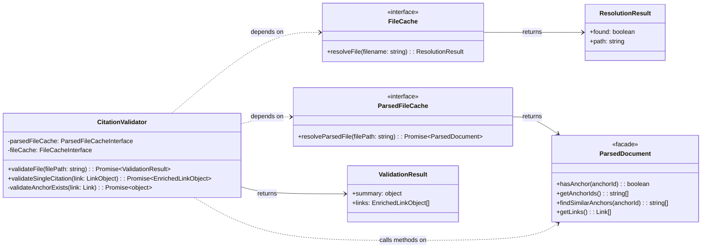

# CitationValidator Implementation Guide

This guide provides the Level 4 (Code) details for refactoring the **`CitationValidator`** component as part of user story `us1.5`. It includes the component's updated structure, pseudocode for its refactored logic, its formal data contracts, and a strategy for testing.

## Problem

Links and anchors identified by the `MarkdownParser` are purely syntactic constructs. There's no guarantee that a link's path points to an existing file or that its anchor corresponds to a real header or block in the target document. The system requires a dedicated component to perform this semantic validation and report the status of each link.

## Solution

The **`CitationValidator`** component is responsible for the semantic validation of links. It consumes `ParsedDocument` facade instances from the `ParsedFileCache`. For each link, it verifies that the target file exists and, if an anchor is specified, uses the `ParsedDocument` query methods to check if the anchor is present.

**Enrichment Pattern**: Instead of creating separate validation result objects, the validator **enriches** the LinkObjects directly by adding a `validation` property containing status, error messages, and suggestions. This progressive enhancement pattern eliminates data duplication (80% reduction) and enables a single data flow through the pipeline: parse → validate (enrich) → filter → extract. The validator returns `{ summary, links }` where `summary` provides aggregate counts and `links` is the array of enriched LinkObjects.

## Structure

The `CitationValidator` is a class that depends on the `ParsedFileCache` (for retrieving parsed documents) and the `FileCache` (for legacy path resolution). It exposes a primary public method, `validateFile()`, which orchestrates the validation process.



1. [**`CitationValidator`**](../ARCHITECTURE-Citation-Manager.md#Citation%20Manager.Citation%20Validator): The module that orchestrates the validation process.
2. [**`FileCache`**](../ARCHITECTURE-Citation-Manager.md#Citation%20Manager.File%20Cache): The dependency used for short filename lookups.
3. [**`ParsedFileCache`**](ParsedFileCache%20Implementation%20Guide.md): The dependency used to retrieve [**`ParsedDocument`**](ParsedDocument%20Implementation%20Guide.md) instances efficiently.
4. [**`ParsedDocument`**](../ARCHITECTURE-Citation-Manager.md#Citation%20Manager.ParsedDocument): The facade providing **query** methods over parser output (US1.7).
5. [**`ValidationResult`**](#Data%20Contracts): The composite object returned by the validator.

---
## File Structure

### Current Implementation (TypeScript)

```text
tools/citation-manager/
├── src/
│   ├── CitationValidator.ts                       // TypeScript implementation (~883 lines)
│   │   ├── ParsedFileCacheInterface              // DI interface
│   │   ├── FileCacheInterface                    // DI interface
│   │   ├── validateFile()                        // Main orchestrator → ValidationResult
│   │   ├── validateSingleCitation()              // Single link validation → EnrichedLinkObject
│   │   ├── enrichLinkWithValidation()            // Enrichment with discriminated union
│   │   └── helpers                               // Inline helper methods
│   │
│   └── types/
│       └── validationTypes.ts                    // Validation type definitions
│           ├── ValidationMetadata                // Discriminated union (status-based)
│           ├── EnrichedLinkObject                // LinkObject + validation property
│           └── ValidationResult                  // { summary, links } output
│
├── test/
│   ├── integration/
│   │   ├── citation-validator.test.js             // Core validation tests
│   │   ├── citation-validator-enrichment.test.js  // US1.8 enrichment pattern tests
│   │   ├── citation-validator-anchor-matching.test.js // Anchor validation tests
│   │   ├── citation-validator-cache.test.js       // ParsedFileCache integration tests
│   │   └── citation-validator-parsed-document.test.js // ParsedDocument facade tests
│   │
│   └── fixtures/
│       ├── enrichment/                            // US1.8 enrichment pattern fixtures (7 files)
│       │
│       ├── section-extraction/                    // Content extraction fixtures (2 files)
│       │   └── ...
│       │
│       ├── subdir/                                // Path resolution fixtures (1 file)
│       │   └── ...
│       │
│       ├── anchor-matching.md                     // Anchor validation scenarios
│       ├── anchor-matching-source.md              // Cross-document anchor tests
│       └── ... (32 fixtures total)
│
└── design-docs/
    └── component-guides/
        └── CitationValidator Implementation Guide.md // This document
```

**Current State**: The CitationValidator exists as a single monolithic file containing all validation logic (745+ lines). See Technical Debt Issue 2 for proposed component folder refactoring.

---
## Public Contracts

### Input Contract
The component's constructor accepts two dependencies:
1. An implementation of [**`ParsedFileCacheInterface`**](ParsedFileCache%20Implementation%20Guide.md#Public%20Contracts) that returns [**`ParsedDocument`**](ParsedDocument%20Implementation%20Guide.md) instances
2. An implementation of **`FileCacheInterface`** for legacy path resolution

#### Public Method: `validateFile(filePath)`

The primary public method for validating all citations in a source document.

**Input:**
- **`filePath`** (string): The absolute path to the source markdown file to validate

**Output:**
- **ValidationResult** (`{ summary, links }`): Enriched links with aggregate summary statistics

#### Public Method: `validateSingleCitation(link, contextFile?)`

Public method for validating a single LinkObject. Added to support CLI Orchestrator's synthetic link validation workflow in Epic 2 (extract header/file commands).

**Input:**
- **`link`** (LinkObject): Unvalidated LinkObject (synthetic or discovered by parser)
  - Can be created by LinkObjectFactory for `extract header/file` commands
  - Can be from parser output for normal validation workflows
- **`contextFile`** (string, optional): Source file context for path resolution

**Output:**
- **EnrichedLinkObject**: The input LinkObject with added `validation` property containing:
  - `status`: "valid" | "warning" | "error"
  - `error?`: Error message (when status is error/warning)
  - `suggestion?`: Suggested fix (when available)
  - `pathConversion?`: Path conversion metadata (when applicable)

**Usage:**
- Called by CLI Orchestrator to validate synthetic links created by LinkObjectFactory
- Enables `extract header <target-file> "<header>"` command to validate header existence before extraction
- Enables `extract file <target-file>` command to validate file existence before extraction
- Enriches link in place using same validation logic as `validateFile()`

### Output Contract

**Enrichment Pattern**: The `validateFile()` method returns `{ summary, links }` where:
- **`summary`** (object): Aggregate counts of `total`, `valid`, `warning`, and `error` links
- **`links`** (EnrichedLinkObject[]): Original LinkObjects from parser with added `validation` property

## Pseudocode

### Current Implementation

This pseudocode shows the **validation enrichment pattern** where LinkObjects are enriched with validation metadata instead of creating separate result objects.

```tsx
// The CitationValidator class with US1.8 Enrichment Pattern
class CitationValidator is
  private field parsedFileCache: ParsedFileCacheInterface
  private field fileCache: FileCacheInterface

  constructor CitationValidator(pCache: ParsedFileCacheInterface, fCache: FileCacheInterface) is
    this.parsedFileCache = pCache
    this.fileCache = fCache

  // Returns { summary, links } with enriched LinkObjects
  public async method validateFile(filePath: string): { summary: object, links: EnrichedLinkObject[] } is
    // Boundary: Get the ParsedDocument facade instance from the cache.
    field sourceParsedDoc = await this.parsedFileCache.resolveParsedFile(filePath)

    // Get links array - these will be enriched in place
    field links = sourceParsedDoc.getLinks()

    // Pattern: Enrich each link with validation metadata
    field validationPromises = new array of Promise
    foreach (link in links) do
      validationPromises.add(this.enrichLinkWithValidation(link))

    await Promise.all(validationPromises)

    // Generate summary from enriched links, return both
    return {
      summary: this.generateSummaryFromEnrichedLinks(links),
      links: links  // Return enriched links (no duplication!)
    }

  // Enriches a LinkObject with validation metadata (instead of returning separate result)
  private async method enrichLinkWithValidation(link: EnrichedLinkObject): void is
    // TypeScript Implementation Note (CitationValidator.ts line 184):
    // Cast to 'any' to add validation property (LinkObject doesn't include it yet)
    // Then rely on return type to enforce EnrichedLinkObject contract
    // (link as any).validation = validation;

    // Decision: Check if the target file path was successfully resolved by the parser.
    if (link.target.path.absolute == null) then
      // Enrichment: Add validation property directly to link
      link.validation = {
        status: "error",
        error: "File not found: " + link.target.path.raw
      }
      return

    // Decision: Does the link have an anchor that needs validation?
    if (link.anchorType == "header" || link.anchorType == "block") then
      await this.enrichWithAnchorValidation(link)
    else
      // This is a full-file link; path existence is sufficient.
      // Enrichment: Add validation property with valid status
      link.validation = { status: "valid" }

  // Enriches link with anchor validation metadata
  private async method enrichWithAnchorValidation(link: EnrichedLinkObject): void is
    try
      // Boundary: Retrieve the ParsedDocument facade for the target file
      field targetParsedDoc = await this.parsedFileCache.resolveParsedFile(link.target.path.absolute)

      // Use facade method to check anchor existence
      if (targetParsedDoc.hasAnchor(link.target.anchor)) then
        // Enrichment: Valid anchor found
        link.validation = { status: "valid" }
      else
        // Pattern: Delegate suggestion generation to facade
        field suggestions = targetParsedDoc.findSimilarAnchors(link.target.anchor)
        // Enrichment: Add error with suggestion
        link.validation = {
          status: "error",
          error: "Anchor not found",
          suggestion: suggestions[0]
        }

    catch (error) is
      // Error Handling: If the target file can't be parsed (e.g., doesn't exist)
      // Enrichment: Add error metadata
      link.validation = {
        status: "error",
        error: error.message
      }

  // Generate summary by counting validation statuses from enriched links
  private method generateSummaryFromEnrichedLinks(links: EnrichedLinkObject[]): object is
    field summary = { total: links.length, valid: 0, warnings: 0, errors: 0 }

    foreach (link in links) do
      // All links have validation property after enrichment
      if (link.validation.status == "valid") then
        summary.valid++
      else if (link.validation.status == "warning") then
        summary.warnings++
      else if (link.validation.status == "error") then
        summary.errors++

    return summary

  // Public method for validating a single LinkObject (Epic 2)
  // Used by CLI Orchestrator for synthetic link validation in extract header/file commands
  public async method validateSingleCitation(link: LinkObject, contextFile?: string): Promise<EnrichedLinkObject> is
    // Pattern: Reuse enrichment logic from validateFile workflow
    await this.enrichLinkWithValidation(link)

    // Enrichment: Link now has validation property added in place
    return link  // Return enriched LinkObject
```

## Data Contracts

TypeScript interfaces defining validator output structure. Source: `src/types/validationTypes.ts`

### ValidationMetadata Type (Discriminated Union)

```typescript
export type ValidationMetadata =
  | { status: "valid" }
  | {
      status: "error";
      error: string;
      suggestion?: string;
      pathConversion?: PathConversion;
    }
  | {
      status: "warning";
      error: string;
      suggestion?: string;
      pathConversion?: PathConversion;
    };
```

> **Note**: TypeScript narrows `ValidationMetadata` based on `status` checks. When `status === "error"`, TypeScript makes `error` property available without additional type guards.

### EnrichedLinkObject Interface

```typescript
export interface EnrichedLinkObject extends LinkObject {
  /** Validation metadata (added post-parse by enrichment pattern) */
  validation: ValidationMetadata;
}
```

### ValidationResult Interface

```typescript
export interface ValidationResult {
  summary: ValidationSummary;
  links: EnrichedLinkObject[];
}
```

### ValidationSummary Interface

```typescript
export interface ValidationSummary {
  total: number;
  valid: number;
  warnings: number;
  errors: number;
}
```

## Testing Strategy

**Philosophy**: Validate CitationValidator's ability to correctly enrich LinkObjects with validation metadata and return accurate ValidationResult structures using the enrichment pattern.

**Test Location**: `tools/citation-manager/test/citation-validator.test.js`

1. **Output Contract Validation**
   - `validateFile()` returns `{ summary, links }` structure matching JSON Schema
   - Summary object contains correct aggregate counts (`total`, `valid`, `warnings`, `errors`)
   - Links array contains enriched LinkObjects with `validation` property
   - Validation metadata matches discriminated union schema (valid vs error/warning states)

2. **Enrichment Pattern Validation**
   - Valid links enriched with `{ status: "valid" }` (no error/suggestion fields)
   - Error links enriched with `{ status: "error", error: string, suggestion?: string }`
   - Warning links enriched with `{ status: "warning", error: string, suggestion?: string }`
   - No illegal states (e.g., `status: "valid"` with `error` field)

3. **Cross-Document Link Validation**
   - File existence checks: Missing files produce error status
   - Anchor validation: Uses `ParsedDocument.hasAnchor()` facade method
   - Suggestion generation: Uses `ParsedDocument.findSimilarAnchors()` for fuzzy matching
   - Path resolution: Leverages FileCache when available for enhanced error messages

4. **Pattern-Specific Validation**
   - Caret syntax validation: `^FR1`, `^US1-4bAC1`, `^black-box-interfaces` patterns
   - Emphasis-marked headers: `==**ComponentName**==` format validation
   - Wiki-style links: Internal anchor resolution

5. **Caching and Performance**
   - ParsedFileCache leveraged: Same target file fetched only once per validation run
   - FileCache optional: Validator works with or without FileCache dependency
   - No redundant I/O: Validation logic operates on cached ParsedDocument instances

**Contract Validation Pattern**: Tests validate against the `ValidationResult` TypeScript interfaces documented in the [Data Contracts](#Data%20Contracts) section, ensuring validator output matches the US1.8 enrichment pattern.

---

## Technical Debt

### Issue 1: Redundant File Existence Check

**Current Problem** (validateCrossDocumentLink() line 325):

```javascript
if (!existsSync(targetPath)) {
    return error("File not found");
}

// Lines 467-471: THEN fetch parsed data
if (citation.target.anchor) {
    const anchorExists = await this.validateAnchorExists(
        citation.target.anchor,
        targetPath  // ← Calls parsedFileCache.resolveParsedFile()
    );
}
```

**Redundancy:**
- Line 325: `existsSync(targetPath)` - Real filesystem I/O to check file exists
- Line 468: `parsedFileCache.resolveParsedFile(targetPath)` - Parser reads file (proves it exists again)
- Result: **Double validation** that file exists - filesystem check + file read

**Better Approach:**

```javascript
// Use cache fetch as existence check
try {
    const parsed = await this.parsedFileCache.resolveParsedFile(targetPath);
    // If we got here, file exists (parser read it successfully)

    if (citation.target.anchor) {
        // Validate anchor using already-loaded parsed data
        const anchorExists = this.validateAnchorInParsedData(
            citation.target.anchor,
            parsed  // ← Already have it!
        );
    }
    return valid();
} catch (error) {
    // File doesn't exist or parse failed
    return error("File not found");
}
```

**Benefits:**
1. **Eliminate redundant I/O**: No separate `existsSync()` call
2. **Single cache lookup**: Currently does `existsSync()` + `parsedFileCache.resolveParsedFile()` = 2 operations
3. **Reuse parsed data**: No need for `validateAnchorExists()` to fetch parsed data again (currently fetches at line 622)

**Current Cost:**
- Filesystem check: 1 I/O operation
- Parse/cache fetch: 1 file read + parse (or cache hit)
- Anchor validation fetch: 1 additional cache lookup
- Total: 3 operations when 1 would suffice

**Rationale:**
The `ParsedFileCache` stores `{ filePath, content, tokens, links, anchors }`. If the cache contains an entry for `targetPath`, the file definitionally existed when parsed. The parser's `fs.readFileSync()` will throw if file doesn't exist, making the cache fetch a natural existence check.

---

### Issue 2: Monolithic File Structure Violates File Naming Patterns

**Current Problem**:
The `CitationValidator` component is implemented as a single monolithic file at `tools/citation-manager/src/CitationValidator.ts` (883+ lines), violating the project's file naming patterns.

**File Naming Pattern Violation**:
- **Current**: Single `CitationValidator.ts` file containing all validation logic
- **Expected**: Component folder structure with separated concerns

**Proposed Component Folder Refactoring**:

```text
tools/citation-manager/src/
├── CitationValidator/
│   ├── CitationValidator.js                          // Main orchestrator class
│   ├── validators/
│   │   ├── CaretPatternValidator.js                  // Validates ^FR1, ^US1-4bAC1 patterns
│   │   ├── EmphasisPatternValidator.js               // Validates ==**ComponentName**==
│   │   ├── CrossDocumentLinkValidator.js             // File existence + anchor validation
│   │   └── WikiStyleLinkValidator.js                 // Internal anchor validation
│   ├── helpers/
│   │   ├── PathResolver.js                           // Handles path resolution strategies
│   │   ├── EnrichmentHelper.js                       // US1.8 link enrichment logic
│   │   └── SuggestionGenerator.js                    // Fuzzy match suggestions
│   └── index.js                                      // Public exports
└── factories/
    └── componentFactory.js                           // Factory instantiates CitationValidator with DI
```

**Benefits**:
1. **Single Responsibility**: Each validator handles one pattern type
2. **Testability**: Unit test individual validators in isolation
3. **Maintainability**: Locate and modify specific validation logic easily
4. **Consistency**: Aligns with [ContentExtractor's structure](Content%20Extractor%20Implementation%20Guide.md#File%20Organization)
5. **US1.8 Clarity**: Enrichment logic separated from validation logic

**Alignment with Architecture Principles**:
- [Single Responsibility](../../../../ARCHITECTURE-PRINCIPLES.md#^single-responsibility): Each validator class has one reason to change
- File naming patterns: Component folder structure with clear separation

**Migration Strategy**:
- Extract validation methods into separate validator classes
- Maintain public API contract (`validateFile()` returns same structure)
- Use Strategy Pattern for validator chain (similar to US2.1 extraction eligibility)
- Implement during Epic 2 or as standalone refactoring story

_Source_: [File Naming Patterns](<../../../../ARCHITECTURE.md#File Naming Patterns>)

---

### Issue 3: Anchor Validation Fails on Special Characters in Headers

**Status**: Identified (2025-10-18) - To Be Fixed

**Current Problem**:
The citation validator fails to validate internal anchor references when the target heading contains special characters like `/` (forward slash). For example, the anchor `#Scattered%20File%20I/O%20Operations` fails validation with error "File 'O%20Operations' not found" - the validator incorrectly splits on `/` and only processes the text after it.

**Example Failure**:

```markdown
### Scattered File I/O Operations

[Link to section](#Scattered%20File%20I/O%20Operations)
```

**Error Output**:

```text
Line 169: [Scattered File I/O Operations](#Scattered%20File%20I/O%20Operations)
└─ File not found: #Scattered%20File%20I/O%20Operations
└─ Suggestion: File "O%20Operations" not found
```

**Root Cause**:
The validator's anchor matching logic does not properly handle URL-encoded special characters in anchor references. When encountering `/` in a URL-encoded anchor string, the validator appears to be splitting on this character instead of treating it as part of the anchor ID.

**Impact**:
- **Medium**: Causes false positive validation errors for legitimate internal anchor references
- **User Experience**: Developers see "CRITICAL ERRORS" for valid citations, reducing trust in validation results
- **Workaround Available**: Users can avoid special characters in headings or ignore false positives
- **Scope**: Affects any heading containing special characters: `/`, `\`, `|`, `<`, `>`, `:`, `*`, `?`, `"`

**Resolution Strategy**:
Implement comprehensive URL encoding/decoding handling in anchor validation:

1. **Decode anchor IDs before matching**: Convert `%20` → ` `, `%2F` → `/`, etc.
2. **Normalize both reference and target**: Ensure consistent encoding/decoding on both sides
3. **Test special characters**: Add test fixtures covering all filesystem-forbidden characters
4. **Update anchor matching logic**: Handle encoded characters in `CitationValidator.validateAnchorExists()`

**Affected Code Locations**:
- `CitationValidator.js` - Anchor matching logic needs URL decoding
- `MarkdownParser.js` - Anchor extraction may need normalization
- Test fixtures - Need coverage for special characters in headings

**Resolution Criteria**:
- Internal anchor references with URL-encoded special characters validate correctly
- Test coverage for all special characters: `/`, `\`, `|`, `<`, `>`, `:`, `*`, `?`, `"`
- Zero false positives for valid internal anchor references
- Validation correctly identifies truly broken anchors (not just encoding mismatches)

**Priority**: Medium (affects validation accuracy, but workaround exists)

**Estimated Effort**: 4-6 hours (anchor matching logic update + comprehensive test coverage)

---

### Issue 4: Same-Document Anchor Links Not Recognized as Valid Pattern

**Status**: Identified (2025-10-29) - To Be Fixed

**Current Problem**:
The citation validator does not recognize same-document anchor links (pattern: `[text](#anchor)`) as a valid citation pattern. This causes false positives when validating C4 architecture documents that use internal component cross-references.

**Example Failure**:

```markdown
#### Citation Manager.CLI Orchestrator
...delegates to [**`ContentExtractor`**](#Citation%20Manager.ContentExtractor)

#### Citation Manager.ContentExtractor
...
```

**Error Output**:

```text
Line 91: [**`ContentExtractor`**](#Citation%20Manager.ContentExtractor)
└─ Unknown citation pattern
└─ Suggestion: Use one of: cross-document [text](file.md#anchor), caret ^FR1, or wiki-style [[#anchor|text]]
```

**Currently Recognized Patterns**:
1. Cross-document links: `[text](file.md#anchor)`
2. Caret syntax: `^FR1`
3. Wiki-style: `[[#anchor|text]]`

**Missing Pattern**:
4. Same-document anchor links: `[text](#anchor)`
- Standard markdown syntax for internal document navigation
- Used throughout C4 architecture docs for component cross-references
- Link text can contain any markdown formatting: `**bold**`, `` `code` ``, combined formatting
- Anchor IDs follow Obsidian/markdown conventions: spaces as `%20`, periods, underscores, hyphens allowed

**Root Cause**:
The `MarkdownParser` link classification logic (CitationValidator.js) only checks for:
- File path present → cross-document
- No file path + anchor present → currently unhandled (triggers "unknown pattern" error)

**Impact**:
- **High**: Causes 20 false positive validation errors in architecture documents
- **User Experience**: Developers cannot validate architecture docs without getting critical errors
- **Workaround**: Currently none - valid internal links flagged as invalid
- **Scope**: Affects all same-document anchor references in architecture documentation

**Resolution Strategy**:

1. **Update Link Pattern Recognition**:
   - Extend `MarkdownParser` to recognize `[text](#anchor)` pattern
   - Add `scope: "internal-anchor"` classification for same-document references
   - Differentiate from wiki-style `[[#anchor]]` syntax

2. **Add Same-Document Anchor Validation**:
   - Check anchor exists in source document (not target document)
   - Use `ParsedDocument.hasAnchor()` on source file's parsed data
   - Support URL-encoded anchor IDs (`#Citation%20Manager.ContentExtractor`)

3. **Extend Test Coverage**:
   - Add fixtures with same-document anchor links
   - Test various link text formatting: bold, code, combined
   - Test anchor ID variations: spaces, periods, special characters
   - Verify validation correctly identifies broken vs valid internal anchors

4. **Update Documentation**:
   - Add same-document pattern to recognized citation types
   - Document scope classification: `internal-anchor` vs `internal` vs `cross-document`
   - Update error messages to include same-document pattern in suggestions

**Affected Code Locations**:
- `MarkdownParser.js` - Link pattern classification needs same-document detection
- `CitationValidator.js` - Validation logic needs internal-anchor handling
- Test fixtures - Need coverage for same-document anchor links with various formatting
- Error messages - Need to include `[text](#anchor)` in pattern suggestions

**Resolution Criteria**:
- Same-document anchor links validate correctly: `[text](#anchor)`
- Link text formatting preserved: `[**\`Component\`**](#anchor)` recognized
- Anchor existence validated against source document (not target)
- Zero false positives for valid internal component cross-references
- Test coverage for all link text formatting variations

**Priority**: High (blocks architecture document validation)

**Estimated Effort**: 6-8 hours (pattern recognition update + validation logic + comprehensive test coverage)

**Related Issues**: Issue 3 (URL encoding) - resolution should coordinate to handle encoded anchors in same-document links
