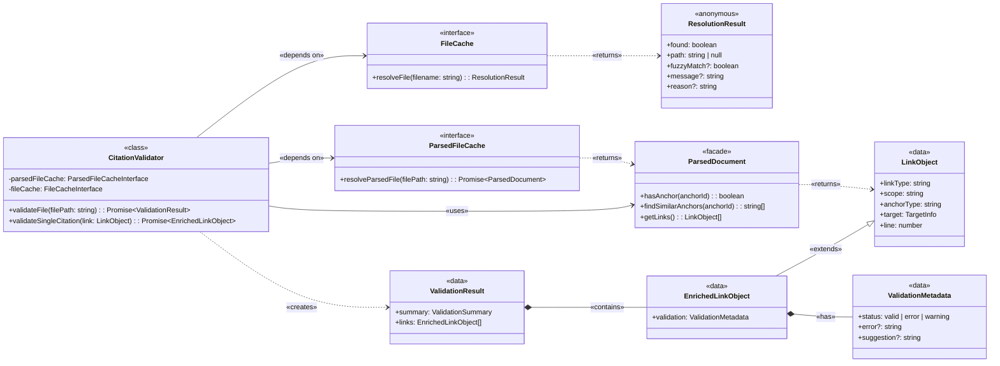

# CitationValidator Implementation Guide

## Overview
Confirms a link is valid by checking if the file exists (path + file name) and if the anchor is valid (header, block anchors).

### Problem
1. Links and anchors identified by the [**`MarkdownParser`**](../ARCHITECTURE-Citation-Manager.md#Citation%20Manager.Markdown%20Parser) have no guarantee that paths point to existing files or anchors correspond to real headers/blocks. ^P1
2. [**`MarkdownParser.ParserOutput`**](MarkdownParser%20Component%20Guide.md#ParserOutput%20Interface) contains link information about the source and target document we do not want to re-build or repeat in other consumers ([One Source Of Truth](../../../../ARCHITECTURE-PRINCIPLES.md#^one-source-of-truth)) ^P2
   1. Creating a separate validation result object duplicates 80% of link metadata (source paths, target paths, line numbers). ^P2-1
3. If errors occur in the [**`ContentExtractor`**](../ARCHITECTURE-Citation-Manager.md#Citation%20Manager.ContentExtractor), it is challenging to determine if the errors are due to invalid link or invalid content (missing, malformed, etc) ^P3

### Solution
The [**`CitationValidator`**](../ARCHITECTURE-Citation-Manager.md#Citation%20Manager.Citation%20Validator) component validates link paths and anchors are valid by:
1. consuming [**`ParsedDocument`**](../ARCHITECTURE-Citation-Manager.md#Citation%20Manager.ParsedDocument) facade instances from the [**`ParsedFileCache`**](../ARCHITECTURE-Citation-Manager.md#Citation%20Manager.ParsedFileCache) ^S1
   1. verifying target file and anchor exist using [**`ParsedDocument`**](../ARCHITECTURE-Citation-Manager.md#Citation%20Manager.ParsedDocument) facade query methods ^S1-1
2. enriching/extending [**`LinkObjects`**](MarkdownParser%20Component%20Guide.md#LinkObject%20Interface) directly by adding a [**`CitationValidator.ValidationMetadata`**](#ValidationMetadata%20Type%20(Discriminated%20Union)) property ^S2
3. The [**`CitationValidator.ValidationResult`**](#ValidationResult%20Interface) output:
   1. is consumed by the [**`ContentExtractor`**](../ARCHITECTURE-Citation-Manager.md#Citation%20Manager.ContentExtractor) for extraction eligibility analysis ^S3
   2. extends [**`LinkObjects`**](MarkdownParser%20Component%20Guide.md#LinkObject%20Interface) via the [**`EnrichedLinkObject`**](#EnrichedLinkObject%20Interface) interface, and contains [**`ValidationMetadata`**)](#ValidationMetadata%20Type%20(Discriminated%20Union)) statuses, errors, and fix suggestions
   3. eliminates data duplication (80% reduction) by adding validation property instead of creating separate result objects

### Impact

| Problem ID | Problem                                     |  Solution ID   | Solution                                                                                                                | Impact                                                                 | Principles                                                                                                              | How Principle Applies                                                                                                                |
| :--------: | ------------------------------------------- | :------------: | ----------------------------------------------------------------------------------------------------------------------- | ---------------------------------------------------------------------- | ----------------------------------------------------------------------------------------------------------------------- | ------------------------------------------------------------------------------------------------------------------------------------ |
| [P1](#^P1) | Validate target paths                       |   [S1](#^S1)   | [**`ParsedFileCache`**](../ARCHITECTURE-Citation-Manager.md#Citation%20Manager.ParsedFileCache) as existence check      | 66% reduction in filesystem calls (1 vs 3)                             | [Black Box Interfaces](../../../../../cc-workflows-site/design-docs/Architecture%20Principles.md#^black-box-interfaces) | Use [**`ParsedFileCache`**](../ARCHITECTURE-Citation-Manager.md#Citation%20Manager.ParsedFileCache) API, not raw `node:fs` calls     |
| [P1](#^P1) | Validate target anchors                     | [S1.1](#^S1-1) | [**`ParsedDocument.hasAnchor()`**](ParsedDocument%20Implementation%20Guide.md#Anchor%20Query%20Methods) on fetched doc  | 100% reduction in direct data access (0 vs 4)                          | [Black Box Interfaces](../../../../../cc-workflows-site/design-docs/Architecture%20Principles.md#^black-box-interfaces) | Use[**`ParsedDocument`**](../ARCHITECTURE-Citation-Manager.md#Citation%20Manager.ParsedDocument) API, not raw `_data.anchors` access |
| [P2](#^P2) | Avoid link metadata duplication             |   [S2](#^S2)   | Enrichment pattern (add validation to [**`LinkObject`**](MarkdownParser%20Component%20Guide.md#LinkObject%20Interface)) | 80% reduction in data duplication (1 property vs 8 fields              | [One Source of Truth](../../../../../cc-workflows-site/design-docs/Architecture%20Principles.md#^one-source-of-truth)   | Mutate original, not copy-then-extend                                                                                                |
| [P3](#^P3) | Distinguish link errors from content errors |   [S3](#^S3)   | Pre-validation before extraction                                                                                        | 100% link errors caught before ContentExtractor (0 ambiguous failures) | [Single Responsibility](../../../../ARCHITECTURE-PRINCIPLES.md#^single-responsibility)                                  | Validator validates links;<br>Extractor extracts content;                                                                            |

---

## Structure

### Class Diagram

[**`CitationValidator`**](../ARCHITECTURE-Citation-Manager.md#Citation%20Manager.Citation%20Validator) depends on [**`ParsedFileCache`**](../ARCHITECTURE-Citation-Manager.md#Citation%20Manager.ParsedFileCache) for parsed document retrieval and [**`FileCache`**](../ARCHITECTURE-Citation-Manager.md#Citation%20Manager.File%20Cache) for legacy path resolution. It exposes public methods [`validateFile()`](#Public%20Method%20validateFile%20filePath) and [`validateSingleCitation()`](#Public%20Method%20validateSingleCitation%20link%20contextFile), which return [**`ValidationResult`**](#ValidationResult%20Interface).



1. [**`CitationValidator`**](../ARCHITECTURE-Citation-Manager.md#Citation%20Manager.Citation%20Validator): The orchestrator class that validates links.
2. [**`FileCache`**](../ARCHITECTURE-Citation-Manager.md#Citation%20Manager.File%20Cache): Dependency for short filename lookups.
3. [**`ParsedFileCache`**](../ARCHITECTURE-Citation-Manager.md#Citation%20Manager.ParsedFileCache): Dependency that returns [**`ParsedDocument`**](ParsedDocument%20Implementation%20Guide.md) instances.
4. [**`ParsedDocument`**](../ARCHITECTURE-Citation-Manager.md#Citation%20Manager.ParsedDocument): Facade providing query methods over parser output.
5. [**`LinkObject`**](MarkdownParser%20Component%20Guide.md#LinkObject%20Interface): Input data from parser (link metadata).
6. [**`EnrichedLinkObject`**](#EnrichedLinkObject%20Interface): LinkObject extended with validation property.
7. [**`ValidationMetadata`**](#ValidationMetadata%20Type%20(Discriminated%20Union)): Discriminated union (valid | error | warning).
8. [**`ValidationResult`**](#ValidationResult%20Interface): Output containing summary + enriched links.
9. **`ResolutionResult`**: FileCache return type (currently inline anonymous object in `CitationValidator.ts`). See [Issue #40](https://github.com/WesleyMFrederick/cc-workflows/issues/40) for planned TypeScript refactor.

---
### File Structure

```text
tools/citation-manager/
├── src/
│   ├── CitationValidator.ts                       // TypeScript implementation (~883 lines)
│   │   ├── ParsedFileCacheInterface              // Dependency injection interface
│   │   ├── FileCacheInterface                    // Dependency injection interface
│   │   ├── validateFile()                        // Main orchestrator → ValidationResult
│   │   ├── validateSingleCitation()              // Single link validation → EnrichedLinkObject
│   │   ├── enrichLinkWithValidation()            // Link enrichment → void (mutates link)
│   │   └── helpers                               // Inline helper methods
│   │       ├── resolveTargetPath()               // Path resolution strategies
│   │       ├── validateAnchorExists()            // Anchor existence check
│   │       ├── generateSuggestion()              // Fuzzy match suggestions
│   │       └── classifyLinkPattern()             // Link pattern classification
│   │
│   ├── types/
│   │   └── validationTypes.ts                    // Validation type definitions
│   │       ├── ValidationMetadata                // Discriminated union (status-based)
│   │       ├── EnrichedLinkObject                // LinkObject + validation property
│   │       └── ValidationResult                  // { summary, links } output
│   │
│   └── factories/
│       └── componentFactory.js                   // Factory instantiates CitationValidator with DI
│
└── test/
    ├── integration/
    │   ├── citation-validator.test.js            // Core validation tests
    │   ├── citation-validator-enrichment.test.js // Enrichment pattern tests
    │   ├── citation-validator-anchor-matching.test.js // Anchor validation tests
    │   ├── citation-validator-cache.test.js      // ParsedFileCache integration tests
    │   └── citation-validator-parsed-document.test.js // ParsedDocument facade tests
    │
    └── fixtures/
        ├── enrichment/                           // Enrichment pattern fixtures
        ├── section-extraction/                   // Content extraction fixtures
        ├── subdir/                               // Path resolution fixtures
        ├── anchor-matching.md                    // Anchor validation scenarios
        └── anchor-matching-source.md             // Cross-document anchor tests
```

**Technical Debt**: The current monolithic structure violates the project's action-based file naming patterns. See [Issue #41](https://github.com/WesleyMFrederick/cc-workflows/issues/41) for proposed component folder refactoring that would align with [ContentExtractor's structure](ContentExtractor%20Component%20Guide.md#File%20Organization).

---
## Public Contracts

### Constructor

```typescript
new CitationValidator(
  parsedFileCache: ParsedFileCacheInterface,  // Required: Returns ParsedDocument instances
  fileCache: FileCacheInterface,              // Required: Legacy path resolution
)
```

| Type     | Value                                                         | Comment                                                                                                                          |
| :------- | :------------------------------------------------------------ | :------------------------------------------------------------------------------------------------------------------------------- |
| `@param` | [**`ParsedFileCacheInterface`**](#ParsedFileCacheInterface)   | Abstraction of [**`CitationManager.ParsedFileCache`**](../ARCHITECTURE-Citation-Manager.md#Citation%20Manager.ParsedFileCache)   |
| `@param` | [**`FileCacheInterface`**](#FileCacheInterface)               | Abstraction of [**`CitationManager.FileCache`**](../ARCHITECTURE-Citation-Manager.md#Citation%20Manager.File%20Cache)            |

#### ParsedFileCacheInterface
- **Consumer-defined**: Inline interface in `CitationValidator.ts`
- [**`CitationManager.ParsedFileCache`**](../ARCHITECTURE-Citation-Manager.md#Citation%20Manager.ParsedFileCache) provides the concrete implementation

```typescript

interface ParsedFileCacheInterface {
 /**
 * Parses the given markdown file (from cache if available) and
 * returns a parsed document with extracted citation links.
 */
  resolveParsedFile(filePath: string): Promise<ParsedDocument>;
}
```

| Type       | Value                     | Comment                                                                                                                       |
| :--------- | :------------------------ | :---------------------------------------------------------------------------------------------------------------------------- |
| `@param`   | `filePath: string`        | Absolute path to markdown file                                                                                                |
| `@returns` | `Promise<ParsedDocument>` | [**`CitationManager.ParsedDocument`**](../ARCHITECTURE-Citation-Manager.md#Citation%20Manager.ParsedDocument) facade instance |

#### FileCacheInterface
- **Consumer-defined**: Inline interface in `CitationValidator.ts`
- **Implementation**: [**`CitationManager.FileCache`**](../ARCHITECTURE-Citation-Manager.md#Citation%20Manager.File%20Cache)  provides the concrete implementation

```typescript
interface FileCacheInterface {
  /**
 * Resolve a short filename to its absolute path.
 */
  resolveFile(filename: string): {
    found: boolean;
    path?: string | null;
    fuzzyMatch?: boolean;
    message?: string;
    reason?: string
  };
}
```

| Type       | Value                                             | Comment                              |
| :--------- | :------------------------------------------------ | :----------------------------------- |
| `@param`   | `filename: string`                                | Short filename to resolve (e.g., "file.md")            |
| `@returns` | `{ found, path, fuzzyMatch?, message?, reason? }` | Resolution result with path or error |

---

### validateFile(filePath)

```typescript
/**
* Validate all citations in a markdown file.
* Enriches each LinkObject with ValidationMetadata in-place.
*/
CitationValidator.validateFile(filePath: string) → Promise<ValidationResult>
```

| Type       | Value                                                        | Comment                                                            |
| :--------- | :----------------------------------------------------------- | :----------------------------------------------------------------- |
| `@param`   | `filePath: string`                                           | Absolute path to source markdown file                              |
| `@returns` | [**`ValidationResult`**](#ValidationResult%20Interface)      | `{ summary, links }` with aggregate counts and enriched LinkObjects |

---

### validateSingleCitation(link, contextFile?)
- Called by CLI Orchestrator for synthetic link validation
- Supports `extract header/file` commands

```typescript
/**
* Validate a single citation link.
* Classifies pattern type and delegates to appropriate validator.
*/
CitationValidator.validateSingleCitation(link: LinkObject, contextFile?: string) → Promise<EnrichedLinkObject>
```

| Type       | Value                                                        | Comment                                                 |
| :--------- | :----------------------------------------------------------- | :------------------------------------------------------ |
| `@param`   | `link: LinkObject`                                           | Link to validate (synthetic or from parser)             |
| `@param`   | `contextFile?: string`                                       | Optional source context for path resolution             |
| `@returns` | [**`EnrichedLinkObject`**](#EnrichedLinkObject%20Interface)  | Input LinkObject with added `validation` property       |

---

## Data Contracts

TypeScript interfaces defining validator output structure. Source: `src/types/validationTypes.ts`

### ValidationResult Interface

```typescript
export interface ValidationResult {
  summary: ValidationSummary;
  links: EnrichedLinkObject[];
}
```

- [**`ValidationSummary`**](#ValidationSummary%20Interface)
- [**`EnrichedLinkObject`**](#EnrichedLinkObject%20Interface)

#### ValidationSummary Interface

```typescript
export interface ValidationSummary {
  total: number;
  valid: number;
  warnings: number;
  errors: number;
}
```

#### EnrichedLinkObject Interface

```typescript
export interface EnrichedLinkObject extends LinkObject {
  /** Validation metadata (added post-parse by enrichment pattern) */
  validation: ValidationMetadata;
}
```

##### ValidationMetadata Type (Discriminated Union)

```typescript
export type ValidationMetadata =
  | { status: "valid" }
  | {
      status: "error";
      error: string;
      suggestion?: string;
      pathConversion?: PathConversion;
    }
  | {
      status: "warning";
      error: string;
      suggestion?: string;
      pathConversion?: PathConversion;
    };
```

> **Note**: TypeScript narrows `ValidationMetadata` based on `status` checks. When `status === "error"`, TypeScript makes `error` property available without additional type guards.

## Validation Status Rules

The validator assigns one of three statuses to each link: `valid`, `warning`, or `error`. The rules below define when each status is used.

### Status: `valid`

- File exists at the expected relative path
- Anchor (if present) exists in the target document

### Status: `warning`

- File **not found** at the relative path, but file cache resolves it to a file **in a different directory**
- Anchor (if present) exists in the resolved file
- Includes a `pathConversion` suggestion with the correct relative path
- **Rationale**: The link works, but the path is ambiguous — a different file with the same name in another directory could match instead

### Status: `error`

- File not found (no resolution strategy succeeded)
- File found but anchor does not exist (regardless of how the file was resolved)
- Pattern syntax is invalid (caret, emphasis, wiki-style)
- **Key rule**: A broken anchor is always an error, even if the file was resolved via cross-directory cache lookup

### Path Resolution Strategies

The validator attempts these strategies in order when resolving a link's target file:

1. **Standard relative path** — resolve from the source file's directory (URL-decodes `%20` and other encoded characters first)
2. **Obsidian absolute path** — detects vault-relative paths like `0_SoftwareDevelopment/...` and converts to filesystem paths
3. **Symlink resolution** — follows symlinks to locate the real file on disk
4. **File cache lookup** — falls back to `FileCacheInterface.resolveFile()` for cross-directory matches

If none succeed → `error`. If only strategy 4 succeeds → `warning` with `pathConversion` suggestion.

### Anchor Matching Strategies

When an anchor is present, the validator attempts these matching strategies in order:

1. **Direct match** — exact anchor ID lookup via `ParsedDocument.hasAnchor()`
2. **URL-decoded match** — decodes `%20` and other encoded characters, then retries
3. **Block reference match** — strips leading `^` and matches against block-type anchors
4. **Flexible markdown match** — strips backticks, bold, italic, and highlights from headers before comparing

If a direct match succeeds but a raw header format exists, the validator returns an **error** with a suggestion to use the raw header format for better Obsidian compatibility (e.g., `#My Header` instead of `#my-header`).

### Status Decision Matrix

| File Found? | Same Directory? | Anchor OK? | Status      |
| :---------- | :-------------- | :--------- | :---------- |
| ✅           | ✅ Same dir      | ✅          | **valid**   |
| ✅           | ✅ Same dir      | ❌          | **error**   |
| ✅           | ❌ Different dir  | ✅          | **warning** |
| ✅           | ❌ Different dir  | ❌          | **error**   |
| ❌           | —               | —          | **error**   |

## Testing Strategy

**Philosophy**: Validate CitationValidator's ability to correctly enrich LinkObjects with validation metadata and return accurate ValidationResult structures using the enrichment pattern.

**Test Location**: `tools/citation-manager/test/citation-validator.test.js`

1. **Output Contract Validation**
   - `validateFile()` returns `{ summary, links }` structure matching JSON Schema
   - Summary object contains correct aggregate counts (`total`, `valid`, `warnings`, `errors`)
   - Links array contains enriched LinkObjects with `validation` property
   - Validation metadata matches discriminated union schema (valid vs error/warning states)

2. **Enrichment Pattern Validation**
   - Valid links enriched with `{ status: "valid" }` (no error/suggestion fields)
   - Error links enriched with `{ status: "error", error: string, suggestion?: string }`
   - Warning links enriched with `{ status: "warning", error: string, suggestion?: string }`
   - No illegal states (e.g., `status: "valid"` with `error` field)

3. **Cross-Document Link Validation**
   - File existence checks: Missing files produce error status
   - Anchor validation: Uses `ParsedDocument.hasAnchor()` facade method
   - Suggestion generation: Uses `ParsedDocument.findSimilarAnchors()` for fuzzy matching
   - Path resolution: Leverages FileCache when available for enhanced error messages

4. **Pattern-Specific Validation**
   - Caret syntax validation: `^FR1`, `^US1-4bAC1`, `^black-box-interfaces` patterns
   - Emphasis-marked headers: `==**ComponentName**==` format validation
   - Wiki-style links: Internal anchor resolution

5. **Caching and Performance**
   - ParsedFileCache leveraged: Same target file fetched only once per validation run
   - FileCache optional: Validator works with or without FileCache dependency
   - No redundant I/O: Validation logic operates on cached ParsedDocument instances

**Contract Validation Pattern**: Tests validate against the `ValidationResult` TypeScript interfaces documented in the [Data Contracts](#Data%20Contracts) section, ensuring validator output matches the US1.8 enrichment pattern.

---

## Technical Debt

### Issue 1: Redundant File Existence Check

**Current Problem** (validateCrossDocumentLink() line 325):

```javascript
if (!existsSync(targetPath)) {
    return error("File not found");
}

// Lines 467-471: THEN fetch parsed data
if (citation.target.anchor) {
    const anchorExists = await this.validateAnchorExists(
        citation.target.anchor,
        targetPath  // ← Calls parsedFileCache.resolveParsedFile()
    );
}
```

**Redundancy:**
- Line 325: `existsSync(targetPath)` - Real filesystem I/O to check file exists
- Line 468: `parsedFileCache.resolveParsedFile(targetPath)` - Parser reads file (proves it exists again)
- Result: **Double validation** that file exists - filesystem check + file read

**Better Approach:**

```javascript
// Use cache fetch as existence check
try {
    const parsed = await this.parsedFileCache.resolveParsedFile(targetPath);
    // If we got here, file exists (parser read it successfully)

    if (citation.target.anchor) {
        // Validate anchor using already-loaded parsed data
        const anchorExists = this.validateAnchorInParsedData(
            citation.target.anchor,
            parsed  // ← Already have it!
        );
    }
    return valid();
} catch (error) {
    // File doesn't exist or parse failed
    return error("File not found");
}
```

**Benefits:**
1. **Eliminate redundant I/O**: No separate `existsSync()` call
2. **Single cache lookup**: Currently does `existsSync()` + `parsedFileCache.resolveParsedFile()` = 2 operations
3. **Reuse parsed data**: No need for `validateAnchorExists()` to fetch parsed data again (currently fetches at line 622)

**Current Cost:**
- Filesystem check: 1 I/O operation
- Parse/cache fetch: 1 file read + parse (or cache hit)
- Anchor validation fetch: 1 additional cache lookup
- Total: 3 operations when 1 would suffice

**Rationale:**
The `ParsedFileCache` stores `{ filePath, content, tokens, links, anchors }`. If the cache contains an entry for `targetPath`, the file definitionally existed when parsed. The parser's `fs.readFileSync()` will throw if file doesn't exist, making the cache fetch a natural existence check.

---

### Issue 2: Monolithic File Structure Violates File Naming Patterns

**Current Problem**:
The `CitationValidator` component is implemented as a single monolithic file at `tools/citation-manager/src/CitationValidator.ts` (883+ lines), violating the project's file naming patterns.

**File Naming Pattern Violation**:
- **Current**: Single `CitationValidator.ts` file containing all validation logic
- **Expected**: Component folder structure with separated concerns

**Proposed Component Folder Refactoring**:

```text
tools/citation-manager/src/
├── CitationValidator/
│   ├── CitationValidator.js                          // Main orchestrator class
│   ├── validators/
│   │   ├── CaretPatternValidator.js                  // Validates ^FR1, ^US1-4bAC1 patterns
│   │   ├── EmphasisPatternValidator.js               // Validates ==**ComponentName**==
│   │   ├── CrossDocumentLinkValidator.js             // File existence + anchor validation
│   │   └── WikiStyleLinkValidator.js                 // Internal anchor validation
│   ├── helpers/
│   │   ├── PathResolver.js                           // Handles path resolution strategies
│   │   ├── EnrichmentHelper.js                       // US1.8 link enrichment logic
│   │   └── SuggestionGenerator.js                    // Fuzzy match suggestions
│   └── index.js                                      // Public exports
└── factories/
    └── componentFactory.js                           // Factory instantiates CitationValidator with DI
```

**Benefits**:
1. **Single Responsibility**: Each validator handles one pattern type
2. **Testability**: Unit test individual validators in isolation
3. **Maintainability**: Locate and modify specific validation logic easily
4. **Consistency**: Aligns with [ContentExtractor's structure](ContentExtractor%20Component%20Guide.md#File%20Organization)
5. **US1.8 Clarity**: Enrichment logic separated from validation logic

**Alignment with Architecture Principles**:
- [Single Responsibility](../../../../ARCHITECTURE-PRINCIPLES.md#^single-responsibility): Each validator class has one reason to change
- File naming patterns: Component folder structure with clear separation

**Migration Strategy**:
- Extract validation methods into separate validator classes
- Maintain public API contract (`validateFile()` returns same structure)
- Use Strategy Pattern for validator chain (similar to US2.1 extraction eligibility)
- Implement during Epic 2 or as standalone refactoring story

_Source_: [File Naming Patterns](../../../../ARCHITECTURE.md#File%20Naming%20Patterns)

---

### Issue 3: Anchor Validation Fails on Special Characters in Headers

**Status**: Identified (2025-10-18) - To Be Fixed

**Current Problem**:
The citation validator fails to validate internal anchor references when the target heading contains special characters like `/` (forward slash). For example, the anchor `#Scattered%20File%20I/O%20Operations` fails validation with error "File 'O%20Operations' not found" - the validator incorrectly splits on `/` and only processes the text after it.

**Example Failure**:

```markdown
### Scattered File I/O Operations

[Link to section](#Scattered%20File%20I/O%20Operations)
```

**Error Output**:

```text
Line 169: [Scattered File I/O Operations](#Scattered%20File%20I/O%20Operations)
└─ File not found: #Scattered%20File%20I/O%20Operations
└─ Suggestion: File "O%20Operations" not found
```

**Root Cause**:
The validator's anchor matching logic does not properly handle URL-encoded special characters in anchor references. When encountering `/` in a URL-encoded anchor string, the validator appears to be splitting on this character instead of treating it as part of the anchor ID.

**Impact**:
- **Medium**: Causes false positive validation errors for legitimate internal anchor references
- **User Experience**: Developers see "CRITICAL ERRORS" for valid citations, reducing trust in validation results
- **Workaround Available**: Users can avoid special characters in headings or ignore false positives
- **Scope**: Affects any heading containing special characters: `/`, `\`, `|`, `<`, `>`, `:`, `*`, `?`, `"`

**Resolution Strategy**:
Implement comprehensive URL encoding/decoding handling in anchor validation:

1. **Decode anchor IDs before matching**: Convert `%20` → ` `, `%2F` → `/`, etc.
2. **Normalize both reference and target**: Ensure consistent encoding/decoding on both sides
3. **Test special characters**: Add test fixtures covering all filesystem-forbidden characters
4. **Update anchor matching logic**: Handle encoded characters in `CitationValidator.validateAnchorExists()`

**Affected Code Locations**:
- `CitationValidator.js` - Anchor matching logic needs URL decoding
- `MarkdownParser.js` - Anchor extraction may need normalization
- Test fixtures - Need coverage for special characters in headings

**Resolution Criteria**:
- Internal anchor references with URL-encoded special characters validate correctly
- Test coverage for all special characters: `/`, `\`, `|`, `<`, `>`, `:`, `*`, `?`, `"`
- Zero false positives for valid internal anchor references
- Validation correctly identifies truly broken anchors (not just encoding mismatches)

**Priority**: Medium (affects validation accuracy, but workaround exists)

**Estimated Effort**: 4-6 hours (anchor matching logic update + comprehensive test coverage)

---

### Issue 4: Same-Document Anchor Links Not Recognized as Valid Pattern

**Status**: Identified (2025-10-29) - To Be Fixed

**Current Problem**:
The citation validator does not recognize same-document anchor links (pattern: `[text](#anchor)`) as a valid citation pattern. This causes false positives when validating C4 architecture documents that use internal component cross-references.

**Example Failure**:

```markdown
#### Citation Manager.CLI Orchestrator
...delegates to [**`ContentExtractor`**](#Citation%20Manager.ContentExtractor)

#### Citation Manager.ContentExtractor
...
```

**Error Output**:

```text
Line 91: [**`ContentExtractor`**](#Citation%20Manager.ContentExtractor)
└─ Unknown citation pattern
└─ Suggestion: Use one of: cross-document [text](file.md#anchor), caret ^FR1, or wiki-style [[#anchor|text]]
```

**Currently Recognized Patterns**:
1. Cross-document links: `[text](file.md#anchor)`
2. Caret syntax: `^FR1`
3. Wiki-style: `[[#anchor|text]]`

**Missing Pattern**:
4. Same-document anchor links: `[text](#anchor)`
- Standard markdown syntax for internal document navigation
- Used throughout C4 architecture docs for component cross-references
- Link text can contain any markdown formatting: `**bold**`, `` `code` ``, combined formatting
- Anchor IDs follow Obsidian/markdown conventions: spaces as `%20`, periods, underscores, hyphens allowed

**Root Cause**:
The `MarkdownParser` link classification logic (CitationValidator.js) only checks for:
- File path present → cross-document
- No file path + anchor present → currently unhandled (triggers "unknown pattern" error)

**Impact**:
- **High**: Causes 20 false positive validation errors in architecture documents
- **User Experience**: Developers cannot validate architecture docs without getting critical errors
- **Workaround**: Currently none - valid internal links flagged as invalid
- **Scope**: Affects all same-document anchor references in architecture documentation

**Resolution Strategy**:

1. **Update Link Pattern Recognition**:
   - Extend `MarkdownParser` to recognize `[text](#anchor)` pattern
   - Add `scope: "internal-anchor"` classification for same-document references
   - Differentiate from wiki-style `[[#anchor]]` syntax

2. **Add Same-Document Anchor Validation**:
   - Check anchor exists in source document (not target document)
   - Use `ParsedDocument.hasAnchor()` on source file's parsed data
   - Support URL-encoded anchor IDs (`#Citation%20Manager.ContentExtractor`)

3. **Extend Test Coverage**:
   - Add fixtures with same-document anchor links
   - Test various link text formatting: bold, code, combined
   - Test anchor ID variations: spaces, periods, special characters
   - Verify validation correctly identifies broken vs valid internal anchors

4. **Update Documentation**:
   - Add same-document pattern to recognized citation types
   - Document scope classification: `internal-anchor` vs `internal` vs `cross-document`
   - Update error messages to include same-document pattern in suggestions

**Affected Code Locations**:
- `MarkdownParser.js` - Link pattern classification needs same-document detection
- `CitationValidator.js` - Validation logic needs internal-anchor handling
- Test fixtures - Need coverage for same-document anchor links with various formatting
- Error messages - Need to include `[text](#anchor)` in pattern suggestions

**Resolution Criteria**:
- Same-document anchor links validate correctly: `[text](#anchor)`
- Link text formatting preserved: `[**\`Component\`**](#anchor)` recognized
- Anchor existence validated against source document (not target)
- Zero false positives for valid internal component cross-references
- Test coverage for all link text formatting variations

**Priority**: High (blocks architecture document validation)

**Estimated Effort**: 6-8 hours (pattern recognition update + validation logic + comprehensive test coverage)

**Related Issues**: Issue 3 (URL encoding) - resolution should coordinate to handle encoded anchors in same-document links
