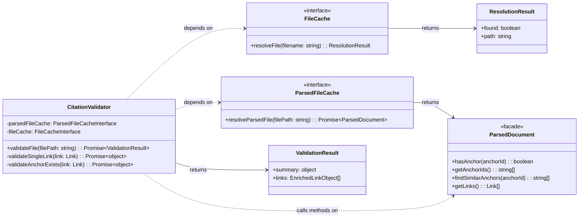

# CitationValidator Implementation Guide

This guide provides the Level 4 (Code) details for refactoring the **`CitationValidator`** component as part of user story `us1.5`. It includes the component's updated structure, pseudocode for its refactored logic, its formal data contracts, and a strategy for testing.

## Problem

Links and anchors identified by the `MarkdownParser` are purely syntactic constructs. There's no guarantee that a link's path points to an existing file or that its anchor corresponds to a real header or block in the target document. The system requires a dedicated component to perform this semantic validation and report the status of each link.

## Solution

The **`CitationValidator`** component is responsible for the semantic validation of links. It consumes `ParsedDocument` facade instances from the `ParsedFileCache`. For each link, it verifies that the target file exists and, if an anchor is specified, uses the `ParsedDocument` query methods to check if the anchor is present.

**Enrichment Pattern**: Instead of creating separate validation result objects, the validator **enriches** the LinkObjects directly by adding a `validation` property containing status, error messages, and suggestions. This progressive enhancement pattern eliminates data duplication (80% reduction) and enables a single data flow through the pipeline: parse → validate (enrich) → filter → extract. The validator returns `{ summary, links }` where `summary` provides aggregate counts and `links` is the array of enriched LinkObjects.

## Structure

The `CitationValidator` is a class that depends on the `ParsedFileCache` (for retrieving parsed documents) and the `FileCache` (for legacy path resolution). It exposes a primary public method, `validateFile()`, which orchestrates the validation process.



1. [Citation Manager.Citation Validator](../features/20251003-content-aggregation/content-aggregation-architecture.md#Citation%20Manager.Citation%20Validator): The class that orchestrates the validation process.
2. [FileCache](../features/20251003-content-aggregation/content-aggregation-architecture.md#Citation%20Manager.File%20Cache): The dependency used for short filename lookups.
3. [ParsedFileCache](ParsedFileCache%20Implementation%20Guide.md): The dependency used to retrieve `ParsedDocument` instances efficiently.
4. [ParsedDocument](../features/20251003-content-aggregation/content-aggregation-architecture.md#Citation%20Manager.Parsed%20Document): The facade providing query methods over parser output (US1.7).
5. [ValidationResult](#`CitationValidator.ValidationResult.Output.DataContract`%20JSON%20Schema): The composite object returned by the validator.

## Public Contracts

### Input Contract
The component's constructor accepts two dependencies:
1. An implementation of a [`ParsedFileCache interface`](ParsedFileCache%20Implementation%20Guide.md#Public%20Contracts) that returns `ParsedDocument` facade instances
2. An implementation of a [`FileCache interface`](../features/20251003-content-aggregation/content-aggregation-architecture.md#Citation%20Manager.File%20Cache)

The primary public method, `validateFile()`, accepts one argument:
1. **`filePath`** (string): The absolute path to the source markdown file to validate.

### Output Contract

**Enrichment Pattern**: The `validateFile()` method will return `{ summary, links }` where:
- **`summary`** (object): Aggregate counts of `total`, `valid`, `warning`, and `error` links
- **`links`** (EnrichedLinkObject[]): Original LinkObjects from parser with added `validation` property

## Pseudocode

### Current Implementation (Pre-US1.8)

This pseudocode follows the **MEDIUM-IMPLEMENTATION** abstraction level, showing the refactored logic that uses ParsedDocument facade.

```tsx
// The CitationValidator class, responsible for the semantic validation of links.
class CitationValidator is
  private field parsedFileCache: ParsedFileCacheInterface
  private field fileCache: FileCacheInterface

  // The constructor accepts its cache dependencies.
  constructor CitationValidator(pCache: ParsedFileCacheInterface, fCache: FileCacheInterface) is
    // Integration: These dependencies are provided by the factory at runtime.
    this.parsedFileCache = pCache
    this.fileCache = fCache

  // The primary public method that orchestrates the validation of a source file.
  public async method validateFile(filePath: string): ValidationResult is
    // Boundary: Get the ParsedDocument facade instance from the cache.
    field sourceParsedDoc = await this.parsedFileCache.resolveParsedFile(filePath)

    field validationPromises = new array of Promise
    // Use facade method to get links instead of direct array access
    foreach (link in sourceParsedDoc.getLinks()) do
      // Pattern: Concurrently validate all links found in the source document.
      validationPromises.add(this.validateSingleLink(link))

    field results = await Promise.all(validationPromises)

    return this.generateSummary(results)

  // Validates a single Link Object and returns separate validation result.
  private async method validateSingleLink(link: Link): object is
    // Decision: Check if the target file path was successfully resolved by the parser.
    if (link.target.path.absolute == null) then
      // The parser already determined the path is invalid.
      return { status: "error", error: "File not found: " + link.target.path.raw, ... }

    // Decision: Does the link have an anchor that needs validation?
    if (link.anchorType == "header" || link.anchorType == "block") then
      return await this.validateAnchorExists(link)
    else
      // This is a full-file link; path existence is sufficient.
      return { status: "valid", ... }

  // Validates that an anchor exists in its target document.
  private async method validateAnchorExists(link: Link): object is
    try
      // Boundary: Retrieve the ParsedDocument facade for the target file
      field targetParsedDoc = await this.parsedFileCache.resolveParsedFile(link.target.path.absolute)

      // Use facade method instead of manual array operations
      if (targetParsedDoc.hasAnchor(link.target.anchor)) then
        return { status: "valid", ... }
      else
        // Pattern: Delegate suggestion generation to facade
        field suggestions = targetParsedDoc.findSimilarAnchors(link.target.anchor)
        return { status: "error", error: "Anchor not found", suggestion: suggestions[0], ... }

    catch (error) is
      // Error Handling: If the target file can't be parsed (e.g., doesn't exist), propagate the error.
      return { status: "error", error: error.message, ... }
```

### US1.8 Enrichment Pattern (Target Implementation)

This pseudocode shows the **validation enrichment pattern** where LinkObjects are enriched with validation metadata instead of creating separate result objects.

```tsx
// The CitationValidator class with US1.8 Enrichment Pattern
class CitationValidator is
  private field parsedFileCache: ParsedFileCacheInterface
  private field fileCache: FileCacheInterface

  constructor CitationValidator(pCache: ParsedFileCacheInterface, fCache: FileCacheInterface) is
    this.parsedFileCache = pCache
    this.fileCache = fCache

  // US1.8: Returns { summary, links } instead of separate validation results
  public async method validateFile(filePath: string): { summary: object, links: EnrichedLinkObject[] } is
    // Boundary: Get the ParsedDocument facade instance from the cache.
    field sourceParsedDoc = await this.parsedFileCache.resolveParsedFile(filePath)

    // Get links array - these will be enriched in place
    field links = sourceParsedDoc.getLinks()

    // US1.8 Pattern: Enrich each link with validation metadata
    field validationPromises = new array of Promise
    foreach (link in links) do
      validationPromises.add(this.enrichLinkWithValidation(link))

    await Promise.all(validationPromises)

    // US1.8: Generate summary from enriched links, return both
    return {
      summary: this.generateSummaryFromEnrichedLinks(links),
      links: links  // Return enriched links (no duplication!)
    }

  // US1.8: Enriches a LinkObject with validation metadata (instead of returning separate result)
  private async method enrichLinkWithValidation(link: EnrichedLinkObject): void is
    // Decision: Check if the target file path was successfully resolved by the parser.
    if (link.target.path.absolute == null) then
      // US1.8 Enrichment: Add validation property directly to link
      link.validation = {
        status: "error",
        error: "File not found: " + link.target.path.raw
      }
      return

    // Decision: Does the link have an anchor that needs validation?
    if (link.anchorType == "header" || link.anchorType == "block") then
      await this.enrichWithAnchorValidation(link)
    else
      // This is a full-file link; path existence is sufficient.
      // US1.8 Enrichment: Add validation property with valid status
      link.validation = { status: "valid" }

  // US1.8: Enriches link with anchor validation metadata
  private async method enrichWithAnchorValidation(link: EnrichedLinkObject): void is
    try
      // Boundary: Retrieve the ParsedDocument facade for the target file
      field targetParsedDoc = await this.parsedFileCache.resolveParsedFile(link.target.path.absolute)

      // Use facade method to check anchor existence
      if (targetParsedDoc.hasAnchor(link.target.anchor)) then
        // US1.8 Enrichment: Valid anchor found
        link.validation = { status: "valid" }
      else
        // Pattern: Delegate suggestion generation to facade
        field suggestions = targetParsedDoc.findSimilarAnchors(link.target.anchor)
        // US1.8 Enrichment: Add error with suggestion
        link.validation = {
          status: "error",
          error: "Anchor not found",
          suggestion: suggestions[0]
        }

    catch (error) is
      // Error Handling: If the target file can't be parsed (e.g., doesn't exist)
      // US1.8 Enrichment: Add error metadata
      link.validation = {
        status: "error",
        error: error.message
      }

  // US1.8: Generate summary by counting validation statuses from enriched links
  private method generateSummaryFromEnrichedLinks(links: EnrichedLinkObject[]): object is
    field summary = { total: links.length, valid: 0, warnings: 0, errors: 0 }

    foreach (link in links) do
      // All links have validation property after enrichment
      if (link.validation.status == "valid") then
        summary.valid++
      else if (link.validation.status == "warning") then
        summary.warnings++
      else if (link.validation.status == "error") then
        summary.errors++

    return summary
```

**Key Differences in US1.8 Pattern:**
1. **Progressive Enhancement**: `enrichLinkWithValidation()` modifies links in-place instead of returning separate objects
2. **Zero Duplication**: Validation data stored once on LinkObject (not duplicated in separate result)
3. **Single Data Flow**: Same link objects pass through entire pipeline (parse → validate → filter → extract)
4. **Summary Derivation**: `generateSummaryFromEnrichedLinks()` counts from `link.validation.status` values

## `CitationValidator.ValidationResult.Output.DataContract` JSON Schema (US1.8)

**US1.8 Breaking Change**: The `ValidationResult` structure now returns enriched LinkObjects instead of separate validation result objects.

```json
{
  "$schema": "https://json-schema.org/draft/2020-12/schema",
  "$id": "https://cc-workflows.com/validation-result.schema.json",
  "title": "CitationValidator Validation Result Contract (US1.8)",
  "description": "The complete output from the CitationValidator's validateFile() method. Returns a summary and the array of enriched LinkObjects (with validation metadata added).",
  "type": "object",
  "properties": {
    "summary": {
      "description": "Aggregate statistics derived from the enriched links array.",
      "$ref": "#/$defs/summaryObject"
    },
    "links": {
      "description": "Array of EnrichedLinkObjects - original LinkObjects from parser with added validation property.",
      "type": "array",
      "items": {
        "$ref": "#/$defs/enrichedLinkObject"
      }
    }
  },
  "required": [
    "summary",
    "links"
  ],
  "$defs": {
    "summaryObject": {
      "title": "Summary Object",
      "type": "object",
      "properties": {
        "total": {
          "description": "The total number of links that were validated.",
          "type": "integer",
          "minimum": 0
        },
        "valid": {
          "description": "The number of links with a 'valid' status.",
          "type": "integer",
          "minimum": 0
        },
        "warnings": {
          "description": "The number of links with a 'warning' status.",
          "type": "integer",
          "minimum": 0
        },
        "errors": {
          "description": "The number of links with an 'error' status.",
          "type": "integer",
          "minimum": 0
        }
      },
      "required": [
        "total",
        "valid",
        "warnings",
        "errors"
      ]
    },
    "enrichedLinkObject": {
      "title": "Enriched Link Object",
      "description": "A LinkObject from the parser with added validation metadata. The base properties (linkType, scope, target, etc.) come from MarkdownParser. The validation property is added by CitationValidator during US1.8 enrichment.",
      "type": "object",
      "properties": {
        "linkType": {
          "type": "string",
          "enum": ["markdown", "wiki"],
          "description": "Parser-created: Link syntax type"
        },
        "scope": {
          "type": "string",
          "enum": ["internal", "cross-document"],
          "description": "Parser-created: Link scope"
        },
        "anchorType": {
          "type": ["string", "null"],
          "enum": ["header", "block", null],
          "description": "Parser-created: Type of anchor target (null for full-file links)"
        },
        "source": {
          "type": "object",
          "description": "Parser-created: Source file information"
        },
        "target": {
          "type": "object",
          "description": "Parser-created: Target file path and anchor"
        },
        "text": {
          "type": ["string", "null"],
          "description": "Parser-created: Link display text"
        },
        "fullMatch": {
          "type": "string",
          "description": "Parser-created: Full matched link text"
        },
        "line": {
          "type": "integer",
          "minimum": 1,
          "description": "Parser-created: Line number in source file"
        },
        "column": {
          "type": "integer",
          "minimum": 1,
          "description": "Parser-created: Column number in source file"
        },
        "validation": {
          "description": "US1.8 ENRICHMENT: Validation metadata added by CitationValidator after validation completes.",
          "$ref": "#/$defs/validationMetadata"
        }
      },
      "required": [
        "linkType",
        "scope",
        "anchorType",
        "source",
        "target",
        "text",
        "fullMatch",
        "line",
        "column",
        "validation"
      ]
    },
    "validationMetadata": {
      "title": "Validation Metadata",
      "description": "Validation status and error information added to LinkObject during US1.8 enrichment.",
      "type": "object",
      "properties": {
        "status": {
          "type": "string",
          "enum": ["valid", "warning", "error"],
          "description": "Validation result status"
        },
        "error": {
          "type": "string",
          "description": "Error or warning message (only when status is 'error' or 'warning')"
        },
        "suggestion": {
          "type": "string",
          "description": "Suggested fix (only when status is 'error' or 'warning')"
        },
        "pathConversion": {
          "type": "object",
          "description": "Path conversion metadata (only when relevant)",
          "properties": {
            "type": {
              "type": "string",
              "const": "path-conversion"
            },
            "original": {
              "type": "string"
            },
            "recommended": {
              "type": "string"
            }
          },
          "required": ["type", "original", "recommended"]
        }
      },
      "required": ["status"],
      "allOf": [
        {
          "if": {
            "properties": {
              "status": {
                "enum": ["error", "warning"]
              }
            }
          },
          "then": {
            "required": ["error"]
          }
        }
      ]
    }
  }
}
```

## Testing Strategy

**Philosophy**: Validate CitationValidator's ability to correctly enrich LinkObjects with validation metadata and return accurate ValidationResult structures per the US1.8 enrichment pattern.

**Test Location**: `tools/citation-manager/test/citation-validator.test.js`

1. **Output Contract Validation (US1.8)**
   - `validateFile()` returns `{ summary, links }` structure matching JSON Schema
   - Summary object contains correct aggregate counts (`total`, `valid`, `warnings`, `errors`)
   - Links array contains enriched LinkObjects with `validation` property
   - Validation metadata matches discriminated union schema (valid vs error/warning states)

2. **Enrichment Pattern Validation**
   - Valid links enriched with `{ status: "valid" }` (no error/suggestion fields)
   - Error links enriched with `{ status: "error", error: string, suggestion?: string }`
   - Warning links enriched with `{ status: "warning", error: string, suggestion?: string }`
   - No illegal states (e.g., `status: "valid"` with `error` field)

3. **Cross-Document Link Validation**
   - File existence checks: Missing files produce error status
   - Anchor validation: Uses `ParsedDocument.hasAnchor()` facade method
   - Suggestion generation: Uses `ParsedDocument.findSimilarAnchors()` for fuzzy matching
   - Path resolution: Leverages FileCache when available for enhanced error messages

4. **Pattern-Specific Validation**
   - Caret syntax validation: `^FR1`, `^US1-4bAC1`, `^black-box-interfaces` patterns
   - Emphasis-marked headers: `==**ComponentName**==` format validation
   - Wiki-style links: Internal anchor resolution

5. **Caching and Performance**
   - ParsedFileCache leveraged: Same target file fetched only once per validation run
   - FileCache optional: Validator works with or without FileCache dependency
   - No redundant I/O: Validation logic operates on cached ParsedDocument instances

**Contract Validation Pattern**: Tests validate against the `ValidationResult` JSON Schema documented in the [Output Contract](#`CitationValidator.ValidationResult.Output.DataContract`%20JSON%20Schema%20(US1.8)) section, ensuring validator output matches the US1.8 enrichment pattern.

---

## Technical Debt

### Issue 1: Redundant File Existence Check

**Current Problem** (validateCrossDocumentLink() line 325):

```javascript
if (!existsSync(targetPath)) {
    return error("File not found");
}

// Lines 467-471: THEN fetch parsed data
if (citation.target.anchor) {
    const anchorExists = await this.validateAnchorExists(
        citation.target.anchor,
        targetPath  // ← Calls parsedFileCache.resolveParsedFile()
    );
}
```

**Redundancy:**
- Line 325: `existsSync(targetPath)` - Real filesystem I/O to check file exists
- Line 468: `parsedFileCache.resolveParsedFile(targetPath)` - Parser reads file (proves it exists again)
- Result: **Double validation** that file exists - filesystem check + file read

**Better Approach:**

```javascript
// Use cache fetch as existence check
try {
    const parsed = await this.parsedFileCache.resolveParsedFile(targetPath);
    // If we got here, file exists (parser read it successfully)

    if (citation.target.anchor) {
        // Validate anchor using already-loaded parsed data
        const anchorExists = this.validateAnchorInParsedData(
            citation.target.anchor,
            parsed  // ← Already have it!
        );
    }
    return valid();
} catch (error) {
    // File doesn't exist or parse failed
    return error("File not found");
}
```

**Benefits:**
1. **Eliminate redundant I/O**: No separate `existsSync()` call
2. **Single cache lookup**: Currently does `existsSync()` + `parsedFileCache.resolveParsedFile()` = 2 operations
3. **Reuse parsed data**: No need for `validateAnchorExists()` to fetch parsed data again (currently fetches at line 622)

**Current Cost:**
- Filesystem check: 1 I/O operation
- Parse/cache fetch: 1 file read + parse (or cache hit)
- Anchor validation fetch: 1 additional cache lookup
- Total: 3 operations when 1 would suffice

**Rationale:**
The `ParsedFileCache` stores `{ filePath, content, tokens, links, anchors }`. If the cache contains an entry for `targetPath`, the file definitionally existed when parsed. The parser's `fs.readFileSync()` will throw if file doesn't exist, making the cache fetch a natural existence check.

---

### Issue 2: Monolithic File Structure Violates File Naming Patterns

**Current Problem**:
The `CitationValidator` component is implemented as a single monolithic file at `tools/citation-manager/src/CitationValidator.js` (745+ lines), violating the project's [File Naming Patterns](../../../../design-docs/Architecture%20-%20Baseline.md#File%20Naming%20Patterns).

**File Naming Pattern Violation**:
- **Current**: Single `CitationValidator.js` file containing all validation logic
- **Expected**: Component folder structure with separated concerns

**Proposed Component Folder Refactoring**:

```text
tools/citation-manager/src/
├── CitationValidator/
│   ├── CitationValidator.js                          // Main orchestrator class
│   ├── validators/
│   │   ├── CaretPatternValidator.js                  // Validates ^FR1, ^US1-4bAC1 patterns
│   │   ├── EmphasisPatternValidator.js               // Validates ==**ComponentName**==
│   │   ├── CrossDocumentLinkValidator.js             // File existence + anchor validation
│   │   └── WikiStyleLinkValidator.js                 // Internal anchor validation
│   ├── helpers/
│   │   ├── PathResolver.js                           // Handles path resolution strategies
│   │   ├── EnrichmentHelper.js                       // US1.8 link enrichment logic
│   │   └── SuggestionGenerator.js                    // Fuzzy match suggestions
│   └── index.js                                      // Public exports
└── factories/
    └── componentFactory.js                           // Factory instantiates CitationValidator with DI
```

**Benefits**:
1. **Single Responsibility**: Each validator handles one pattern type
2. **Testability**: Unit test individual validators in isolation
3. **Maintainability**: Locate and modify specific validation logic easily
4. **Consistency**: Aligns with [ContentExtractor's structure](Content%20Extractor%20Implementation%20Guide.md#File%20Structure)
5. **US1.8 Clarity**: Enrichment logic separated from validation logic

**Alignment with Architecture Principles**:
- [Single Responsibility](../../../../design-docs/Architecture%20Principles.md#^single-responsibility): Each validator class has one reason to change
- [File Naming Patterns](../../../../design-docs/Architecture%20-%20Baseline.md#File%20Naming%20Patterns): Component folder structure with clear separation

**Migration Strategy**:
- Extract validation methods into separate validator classes
- Maintain public API contract (`validateFile()` returns same structure)
- Use Strategy Pattern for validator chain (similar to US2.1 extraction eligibility)
- Implement during Epic 2 or as standalone refactoring story

_Source_: [File Naming Patterns](../../../../design-docs/Architecture%20-%20Baseline.md#File%20Naming%20Patterns)
