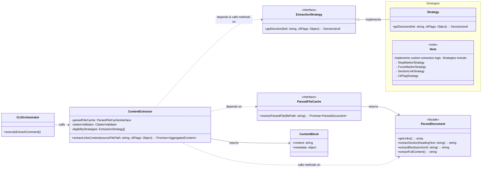
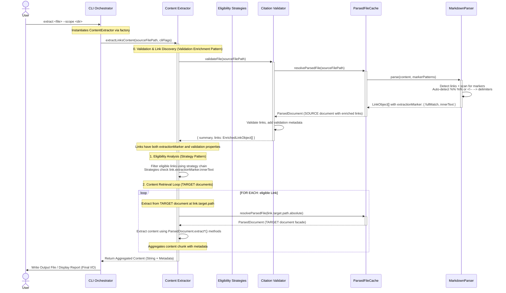

<!-- markdownlint-disable MD025 -->
# Content Extractor Implementation Guide

## Problem

The content extraction workflow requires solving two distinct code-level problems:

### Extraction Eligibility Problem

Without a structured approach to implementing the extraction eligibility rules from [FR10](../features/20251003-content-aggregation/content-aggregation-prd.md#^FR10), developers would naturally implement the precedence logic as a **monolithic function with nested if/else chains**. This creates critical problems:

1. **Rules become untestable in isolation** - Precedence logic tightly couples to the orchestrator, preventing independent testing of individual rules
2. **Closed to extension** - Adding new markdown flavors or user-configurable rules requires modifying the core function, violating the Open/Closed Principle
3. **Implicit precedence order** - Rule hierarchy is buried in control flow structure rather than explicit in the architecture
4. **Intertwined rule logic** - Each rule's implementation is tangled with others, preventing reuse and increasing regression risk

### Content Retrieval Problem

Without a centralized component to orchestrate content retrieval, every consumer would duplicate the **extraction dispatch logic**: determining which `ParsedDocument` method to call (`extractSection()`, `extractBlock()`, `extractFullContent()`), handling different return types, packaging results with metadata, and managing extraction errors. This duplication creates **maintenance burden** (changes to extraction logic require updates across all consumers) and **inconsistent error handling** (each consumer implements its own approach to missing sections or invalid anchors).

## Solution

The **`Content Extractor`** component is the central service for content aggregation. It encapsulates two primary responsibilities: **`ExtractionEligibility`** (determining _what_ to fetch using the Strategy Pattern) and **`ContentRetrieval`** (fetching the content chunk via the **`ParsedDocument`** facade). It returns the final aggregated content chunks (**`ContentBlock`** objects) back to the CLI for final output.

---
## Structure

The `Content Extractor` is a single component that uses the **Strategy Pattern** internally to manage eligibility rules. The component orchestrates the complete extraction workflow: **validation** (via internal `CitationValidator` call to discover links), **eligibility analysis** (via the strategy chain), and **content retrieval** (via the ParsedDocument facade).

**Input Contract**: The component receives a `sourceFilePath` from the CLI. The CLI orchestrator validates the source file first to discover all LinkObjects with their source and target paths. These pre-validated links are then used internally by ContentExtractor for eligibility analysis and content extraction. The source file path is extracted from the LinkObject array and validated for consistency (all links share the same `link.source.path.absolute` value).



1. **ExtractionStrategy**: Base interface defining the contract for eligibility rule strategies (`getDecision(link, cliFlags)`)
2. **StopMarkerStrategy, ForceMarkerStrategy, SectionLinkStrategy, CliFlagStrategy**: Concrete strategy implementations executed in precedence order
3. **ParsedFileCache**: The dependency used to retrieve ParsedDocument instances
4. **ParsedDocument**: The facade providing content extraction methods (`extractSection()`, `extractBlock()`, `extractFullContent()`)
5. **ContentBlock**: The composite object returned containing extracted content and metadata
6. **ContentExtractor**: The class that orchestrates eligibility analysis and content retrieval

---

## Public Contracts

The component's interface is designed as a single execution point to hide internal complexity and ensure the CLI remains thin and focused on application orchestration.

### Input Contract

**Dependencies (injected via constructor):**
1. **`ParsedFileCache`**: For retrieving parsed documents
2. **`CitationValidator`**: For validating citations before extraction
3. **`eligibilityStrategies`**: Array of strategy objects for eligibility rules

**Public Method: `extractLinksContent(sourceFilePath, cliFlags)`**
1. **`sourceFilePath`** (string): Absolute path to the source markdown file containing citations
2. **`cliFlags`** (object): Command-line options (e.g., `{ fullFiles: true }`) to be evaluated by the eligibility strategies

### Output Contract

The `extractLinksContent()` method returns a `Promise` that resolves with an **`AggregatedContent`** object containing an array of **`ContentBlock`** objects, which contain the extracted content and necessary source metadata.

- **ContentBlock Structure**: The internal object structure contains:
  - `content` (string): The extracted markdown chunk (section, block, or full file).
  - `metadata` (object): Source attribution information (e.g., `sourceFile`, `sectionHeading`, `lineRange`).
- **Final Output**: The CLI uses this aggregated array to perform the final file write.

---

## File Structure

```text
tools/citation-manager/
└── src/
    ├── core/
    │   └── ContentExtractor/                           // Component folder (TitleCase per coding standards)
    │       ├── ContentExtractor.js                    // Main component class (entry point)
    │       ├── analyzeEligibility.js                  // Eligibility analysis operation (verb-noun pattern)
    │       └── eligibilityStrategies/                 // Strategy pattern implementations
    │           ├── ExtractionStrategy.js             // Base interface for all eligibility rules
    │           ├── StopMarkerStrategy.js             // Concrete rule: %%stop-extract-link%%
    │           ├── ForceMarkerStrategy.js            // Concrete rule: %%extract-link%%
    │           ├── SectionLinkStrategy.js            // Concrete rule: Anchor-based links eligible by default
    │           └── CliFlagStrategy.js                // Concrete rule: --full-files flag evaluation
    │
    └── factories/
        └── componentFactory.js                        // createContentExtractor() factory with DI wiring
```

_Source_: [File Naming Patterns](../../../../design-docs/Architecture%20-%20Baseline.md#File%20Naming%20Patterns)

---
## ContentExtractor Workflow: Component Interaction Diagram  



### Workflow Characteristics

- **Single Service Interface**: The core operation is executed via a **single, high-level call** to the `Content Extractor` component: `extractLinksContent(sourceFilePath, cliFlags)`. This abstracts the entire multi-step process from the CLI.

- **Validation Enrichment Pattern**: The `Content Extractor` calls `CitationValidator.validateFile()` once and receives **enriched links with validation metadata** directly in the response: `{ summary, links: EnrichedLinkObject[] }`. Each link contains its validation status, eliminating the need for separate validation result structures or redundant calls to retrieve links.

- **Zero Redundant Calls**: The validator internally uses `ParsedFileCache` to get the SOURCE document. ContentExtractor receives enriched links directly from the validator with no separate call needed to retrieve links. Only TARGET documents require additional `ParsedFileCache` calls during content extraction.

- **Single Data Flow**: Links flow through a progressive enhancement pipeline: parse → validate → enrich → filter → extract. Validation metadata lives on the `LinkObject.validation` property, creating zero data duplication and a single source of truth.

- **Source vs Target Document Distinction**: The workflow operates on two document types:
  - **SOURCE document**: The file containing citations (e.g., `context-package.md`). Retrieved once by validator, enriched links returned to ContentExtractor.
  - **TARGET documents**: Files referenced by citations (e.g., `architecture.md`, `prd.md`). Retrieved in the extraction loop via `link.target.path.absolute` for content extraction.

- **Encapsulated Logic**: The `Content Extractor` internally manages the complex control flow, performing **Link Eligibility Analysis** (via Strategy Pattern) and the **Content Retrieval Loop** (via ParsedDocument facade calls to TARGET documents).

- **Performance Optimization**: The `ParsedFileCache` guarantees each unique file is parsed at most once per command execution. This applies to both the SOURCE document (parsed during validation) and all TARGET documents (parsed during extraction loop).

- **Complexity Abstraction**: Content retrieval from TARGET documents is handled by declarative calls to the `ParsedDocument` facade's methods (`extractSection()`, `extractBlock()`, `extractFullContent()`). The facade hides the underlying token-walking or line-lookup mechanics.

- **Aggregation Point**: The `Content Extractor` is responsible for **internal content aggregation** (managing formatting and metadata from all TARGET documents) before returning the final result to the CLI.

- **Final I/O**: The `CLI Orchestrator` performs the single, final I/O operation: writing the fully aggregated content string to the output file.

- **Asynchronous Flow**: The core content retrieval operations remain **asynchronous** (`Promise`-based) to accommodate the file I/O operations necessary during cache misses.

---
## Implementation Patterns

### Factory Implement Pattern

```javascript
/**
 * Create content extractor with full dependencies
 *
 *
 * @param {ExtractionStrategy[]|null} [strategies=null] - Optional strategy override for testing or custom extraction rules
 * @param {ParsedFileCache|null} [parsedFileCache=null] - Optional cache override for testing and dependency injection flexibility
 * @param {CitationValidator|null} [validator=null] - Optional validator override for testing and dependency injection flexibility
 * @returns {ContentExtractor} Fully configured ContentExtractor instance
*/
export function createContentExtractor(
  strategies = null,
  parsedFileCache = null,
  validator = null
) {
  const _strategies = strategies || [
    new StopMarkerStrategy(),
    new ForceMarkerStrategy(),
    new SectionLinkStrategy(),
    new CliFlagStrategy(),
  ];

  const _parsedFileCache = parsedFileCache || createParsedFileCache();
  const _validator = validator || createCitationValidator();

  return new ContentExtractor(_strategies, _parsedFileCache, _validator);
}
```

**Pattern Benefits:**
- Encapsulates strategy instantiation and explicit precedence ordering
- Enables integration testing with real strategies in isolated configurations
- Supports extensibility through custom extraction strategies (e.g., implementing HTML comment-based markers like `<!-- extract-link -->` or `<!-- stop-extract -->` for different markdown flavors, custom markers for specific documentation systems, or user-defined extraction rules)
- Provides production-ready defaults with optional dependency injection
- Follows workspace factory pattern from `createCitationValidator()`

### Extraction Marker Detection: MVP Hardcoded Approach

**MVP Implementation**: MarkdownParser hardcodes detection of `%% %%` and `<!-- -->` delimiters after links. The parser scans the remainder of each line after detecting a link and extracts any marker found.

**Architecture Flow (MVP):**
1. **Parser detects link**: Finds markdown or wiki link on a line
2. **Parser scans for markers**: Checks remainder of line for `%%...%%` or `<!--...-->` patterns
3. **Parser extracts marker data**: Captures both full marker and inner text
4. **LinkObject enriched**: `extractionMarker: { fullMatch, innerText }` added to LinkObject
5. **Strategies check inner text**: Each strategy checks `link.extractionMarker?.innerText` against expected values

**LinkObject.extractionMarker Structure:**

```typescript
extractionMarker: {
  fullMatch: string,   // Complete marker as found: '%%force-extract%%' or '<!-- extract-link -->'
  innerText: string    // Text between delimiters: 'force-extract' or 'extract-link'
} | null               // null if no marker found on line
```

**Markdown Examples:**

| Markdown Syntax | extractionMarker Value | Strategy Checks |
|-----------------|------------------------|-----------------|
| `[link](path.md)%%force-extract%%` | `{ fullMatch: '%%force-extract%%', innerText: 'force-extract' }` | `innerText === 'force-extract'` |
| `[link](path.md) %%stop-extract-link%%` | `{ fullMatch: '%%stop-extract-link%%', innerText: 'stop-extract-link' }` | `innerText === 'stop-extract-link'` |
| `[link](path.md)<!-- extract-link -->` | `{ fullMatch: '<!-- extract-link -->', innerText: 'extract-link' }` | `innerText === 'extract-link'` |
| `[link](path.md)` | `null` | Strategy returns null (pass to next) |

**Strategy Implementation Examples:**

```javascript
// StopMarkerStrategy - Prevents extraction when marker present
class StopMarkerStrategy {
  getDecision(link, cliFlags) {
    if (link.extractionMarker?.innerText === 'stop-extract-link') {
      return { eligible: false, reason: 'Stop marker prevents extraction' };
    }
    return null;
  }
}

// ForceMarkerStrategy - Forces extraction regardless of other rules
class ForceMarkerStrategy {
  getDecision(link, cliFlags) {
    if (link.extractionMarker?.innerText === 'force-extract') {
      return { eligible: true, reason: 'Force marker overrides defaults' };
    }
    return null;
  }
}

// SectionLinkStrategy - Checks if link has anchor (section/block reference)
class SectionLinkStrategy {
  getDecision(link, cliFlags) {
    if (link.anchorType !== null) {  // Has anchor = section/block link
      return { eligible: true, reason: 'Section links eligible by default' };
    }
    return null;
  }
}

// CliFlagStrategy - Checks CLI flags for extraction override
class CliFlagStrategy {
  getDecision(link, cliFlags) {
    if (cliFlags.fullFiles === true) {
      return { eligible: true, reason: 'CLI flag --full-files forces extraction' };
    }
    return null;
  }
}
```

**MarkdownParser Responsibilities:**
1. Receive marker patterns array from ParsedFileCache/CitationValidator
2. After detecting link, scan remainder of line for any registered marker
3. Auto-detect delimiter style: `%% text %%` or `<!-- text -->`
4. Extract inner text (content between delimiters)
5. Set `link.extractionMarker = { fullMatch, innerText }` or `null`
6. Handle whitespace tolerance (optional spaces between link and marker)

**MVP Technical Debt:**

For MVP, MarkdownParser **hardcodes** detection of `%% %%` and `<!-- -->` delimiters after links. This creates coupling between the parser (generic markdown processing) and the content extraction feature. See [MarkdownParser Technical Debt: Issue 5 - Hardcoded Extraction Marker Detection](Markdown%20Parser%20Implementation%20Guide.md#Issue%205%20Hardcoded%20Extraction%20Marker%20Detection%20(MVP%20Tech%20Debt)) for full analysis and future extensibility approach.

**Future Enhancement:** Parser will accept custom annotation detectors as configuration, eliminating coupling and enabling feature-specific marker registration without parser modifications. `ContentExtractor` will define content extraction markers: [Issue 1: Strategy-Defined Extraction Markers (Future Enhancement)](#Issue%201%20Strategy-Defined%20Extraction%20Markers%20(Future%20Enhancement))

---
## Related Files
- [Pseudocode - Abstraction Levels](../../../../design-docs/Psuedocode%20Style%20Guide.md#Abstraction%20Levels)
- [Architecture - Baseline](../../../../design-docs/Architecture%20-%20Baseline.md)
- [ParsedFileCache Implementation Guide](../../../../../resume-coach/design-docs/examples/component-guides/ParsedFileCache%20Implementation%20Guide.md)
- [ParsedDocument Implementation Guide](ParsedDocument%20Implementation%20Guide.md)
- [us2.1-implement-extraction-eligibility-strategy-pattern](../features/20251003-content-aggregation/user-stories/us2.1-implement-extraction-eligibility-strategy-pattern/us2.1-implement-extraction-eligibility-strategy-pattern.md)

---

# `ContentExtractor` Component Whiteboard

How ContentExtractor Orchestrates Complete Extraction Workflow

```js
// ContentExtractor owns the entire extraction workflow
async extractLinksCotent(sourceFilePath, cliFlags) {
 // Step 1: Validate file and discover links (internal prerequisite)
 const validationResult = await this.citationValidator.validateFile(sourceFilePath);

 if (!validationResult.isValid) {
  throw new ValidationError("Cannot extract from file with broken citations");
 }

 // Step 2: Get parsed document to access links
 const parsedDoc = await this.parsedFileCache.resolveParsedFile(sourceFilePath);
 const allLinks = parsedDoc.getLinks();

 // Step 3-7: Process each link
 const contentBlocks = [];
 for (const link of allLinks) {
  // 3. Check eligibility using Strategy Pattern
  const decision = this.analyzeEligibility(link, cliFlags);

  if (decision.eligible) {
   // 4. Get target file path
   const targetFilePath = link.target.path.absolute;

   // 5. Get ParsedDocument from cache
   const targetDoc = await this.parsedFileCache.resolveParsedFile(targetFilePath);

   // 6. Determine which extraction method to call based on anchorType
   let content;
   if (link.anchorType === "header") {
     // Extract section (need heading text from anchor)
     content = targetDoc.extractSection(link.target.anchor);
   } else if (link.anchorType === "block") {
     // Extract block
     content = targetDoc.extractBlock(link.target.anchor);
   } else if (link.anchorType === null) {
     // Full file extraction
     content = targetDoc.extractFullContent();
   }

   // 7. Package into ContentBlock with metadata
   const contentBlock = {
     content: content,
     metadata: {
       sourceFile: link.source.path.absolute,
       targetFile: link.target.path.absolute,
       anchor: link.target.anchor,
       line: link.line,
       column: link.column
     }
   };
   contentBlocks.push(contentBlock);
  }
 }

 // Step 8: Aggregate and return
 return this.aggregateContent(contentBlocks);
}
```
  
  Key LinkObject Properties Used

  1. `link.target.path.absolute` - Which file to fetch ParsedDocument for
  2. `link.anchorType` - Which extraction method to call ("header", "block", null)
  3. `link.target.anchor` - The anchor ID to pass to extraction method
  4. `link.source.path.absolute` - For ContentBlock metadata (attribution)
  5. `link.line`, `link.column` - For ContentBlock metadata (source location)

  The Strategy Pattern's Role

  The eligibility strategies also navigate LinkObject:
- `link.extractionMarker` - Check for force/stop markers (added in US2.1)
- `link.anchorType` - SectionLinkStrategy checks if not null
- `link.scope` - Potentially filter by internal vs cross-document

  So ContentExtractor uses LinkObject properties to route extraction decisions and dispatch to the correct ParsedDocument methods.

---

# Architectural Decision Records

## Validation Enrichment Pattern

**Decision Date**: 2025-10-17
**Status**: Recommended for Implementation

### Problem: Massive Data Duplication

The current architectural approach creates separate data structures for parser output (`LinkObject`) and validation results (`ValidationResult`), leading to 80% data duplication:

**LinkObject** (from MarkdownParser):

```typescript
{
  linkType: "markdown",      // ← Duplicated in ValidationResult
  line: 42,                   // ← Duplicated
  column: 5,                  // ← Duplicated
  fullMatch: "[text](file)",  // ← Duplicated as "citation"
  target: { path: "file.md", anchor: "#section" },
  // ... other structural data
}
```

**ValidationResult.results[0]** (from CitationValidator):

```typescript
{
  line: 42,                   // ← Duplicate
  column: 5,                  // ← Duplicate
  citation: "[text](file)",   // ← Duplicate (fullMatch)
  linkType: "markdown",       // ← Duplicate
  status: "error",            // ← UNIQUE (only 3-4 fields are new!)
  error: "Anchor not found",  // ← UNIQUE
  suggestion: "#similar"      // ← UNIQUE
}
```

**Impact**:
- Memory overhead (storing same data twice)
- Redundant `getLinks()` calls (validator fetches, extractor fetches again)
- Architectural messiness (data flow passes same information multiple times)

### Recommended Solution: Hybrid Validation Enrichment

Validation metadata should live **on the LinkObject** itself, eliminating duplication while preserving separation of concerns for summary reporting.

#### Enhanced LinkObject Schema

```typescript
interface LinkObject {
  // Original parser data (unchanged)
  linkType: "markdown" | "wiki",
  scope: "cross-document" | "internal",
  target: { path, anchor },
  line: number,
  column: number,
  fullMatch: string,

  // Validation metadata (added AFTER validation)
  validation?: {
    status: "valid" | "warning" | "error",
    error?: string,           // Only when status = "error"
    suggestion?: string,      // Only when status = "error" | "warning"
    pathConversion?: object   // Only when relevant
  }
}
```

#### ValidationResult Schema (Summary Only)

```typescript
interface ValidationResult {
  summary: {
    total: number,
    valid: number,
    warnings: number,
    errors: number
  },
  links: LinkObject[]  // Return enriched links (no duplication!)
}
```

#### Implementation Pattern

```typescript
class CitationValidator {
  async validateFile(filePath): ValidationResult {
    const parsed = await this.parsedFileCache.resolveParsedFile(filePath)
    const links = parsed.getLinks()

    // Enrich each link with validation metadata
    for (const link of links) {
      const result = await this.validateSingleLink(link)
      link.validation = {
        status: result.status,
        error: result.error,
        suggestion: result.suggestion
      }
    }

    // Return summary + enriched links (no duplication!)
    return {
      summary: this.generateSummary(links),
      links: links
    }
  }
}
```

#### ContentExtractor Usage

```typescript
class ContentExtractor {
  async extractLinksContent(sourceFilePath, cliFlags) {
    // Step 1: Validate and get enriched links
    const { summary, links } = await this.citationValidator.validateFile(sourceFilePath)

    if (summary.errors > 0) {
      throw new Error("Cannot extract from file with broken citations")
    }

    // Step 2: Use enriched links directly (no redundant fetch!)
    const eligibleLinks = links.filter(link =>
      link.validation.status === "valid" &&
      this.isEligible(link, cliFlags)
    )

    // Step 3: Extract content from eligible links
    const contentBlocks = []
    for (const link of eligibleLinks) {
      const targetDoc = await this.parsedFileCache.resolveParsedFile(link.target.path.absolute)
      const content = this.extractContent(targetDoc, link)
      contentBlocks.push({ content, metadata: this.buildMetadata(link) })
    }

    return this.aggregateContent(contentBlocks)
  }
}
```

### Benefits

1. **Zero Duplication**: Validation data stored once on LinkObject (50% memory reduction)
2. **Single Data Flow**: One object passes through pipeline (parse → validate → filter → extract)
3. **No Redundant Calls**: Validator returns enriched links; extractor uses them directly
4. **Natural Lifecycle**: Progressive enhancement pattern (base data + validation metadata)
5. **Separation Preserved**: Summary stays separate for CLI reporting needs

### Type Safety (Preventing Illegal States)

Use TypeScript discriminated unions to prevent invalid states:

```typescript
// Base link (from parser - unvalidated)
interface UnvalidatedLinkObject {
  linkType: "markdown" | "wiki",
  target: { path, anchor },
  line: number,
  column: number,
  // No validation field = explicitly unvalidated
}

// After validation
interface ValidatedLinkObject extends UnvalidatedLinkObject {
  validation: {
    status: "valid" | "warning" | "error",
    error?: string,
    suggestion?: string
  }
}

type LinkObject = UnvalidatedLinkObject | ValidatedLinkObject

// Type guard
function isValidated(link: LinkObject): link is ValidatedLinkObject {
  return 'validation' in link
}

// Usage with type safety
for (const link of links) {
  if (isValidated(link) && link.validation.status === "error") {
    console.log(link.validation.error)  // TypeScript knows this exists
  }
}
```

### Migration Impact

**Files Requiring Updates**:
1. `CitationValidator.js` - Return `{ summary, links }` instead of separate validation results
2. `ContentExtractor.js` - Use enriched links from validator (remove redundant `getLinks()`)
3. `MarkdownParser.js` - LinkObject schema unchanged (validation field added post-parse)
4. `citation-manager.js` CLI - Handle enriched links for display/reporting
5. Type definitions - Add discriminated union types for validated vs unvalidated links

**Backward Compatibility**: Breaking change requiring coordinated update across validator → extractor → CLI

### Implementation Priority

**Timing**: Implement during US2.1 (Extraction Eligibility) to avoid architectural refactoring later
**Risk**: Medium (requires coordinated changes across 3+ components)
**Value**: High (eliminates fundamental duplication, cleaner architecture for Epic 2)

### Impacted Documentation

The following design documents require updates to reflect the Validation Enrichment Pattern:

**Component Guides (Direct Impact)**:
1. `CitationValidator Implementation Guide.md` - Output contract changes from separate ValidationResult to enriched LinkObjects
2. `Content Extractor Implementation Guide.md` - Input contract changes to receive enriched links directly from validator
3. `Markdown Parser Implementation Guide.md` - Clarify that `validation` property is added post-parse, not by parser

**Architecture Documents (Direct Impact)**:
4. `content-aggregation-architecture.md` - Data flow between validator → extractor changes
~~5. `Architecture.md` - Component contracts and data models require updates~~

**Feature Documents (Direct Impact)**:
6. `content-aggregation-prd.md` - Validation output format specification changes
~~7. `content-aggregation-architecture-whiteboard.md` - Contains the ADR itself, may need workflow updates~~

**User Stories (Implementation Impact)**:
8. `us2.1-implement-extraction-eligibility-strategy-pattern.md` - ADR states "implement during US2.1"
9. `us1.7-implement-parsed-document-facade.md` - May affect facade's interaction with enriched links
10. `us1.5-implement-cache-for-parsed-files.md` - Cache may need to handle enriched LinkObjects

**Total**: 10 documents requiring updates to reflect the Validation Enrichment Pattern

---


# `ContentExtractor` Component Technical Debt

## Issue 1: Strategy-Defined Extraction Markers (Future Enhancement)

**Current MVP Limitation**: Extraction markers (`%%force-extract%%`, `%%stop-extract-link%%`) are hardcoded in MarkdownParser. Strategies cannot define custom markers, limiting extensibility for new markdown flavors or user-defined rules.

**MVP Implementation (Current State)**:

```javascript
// Strategies check hardcoded marker values
class ForceMarkerStrategy {
  getDecision(link, cliFlags) {
    // Can only check for markers that MarkdownParser already knows about
    if (link.extractionMarker?.innerText === 'force-extract') {
      return { eligible: true, reason: 'Force extraction marker' };
    }
    return null;
  }
}

// MarkdownParser hardcodes: /\s*(%%(.+?)%%|<!--\s*(.+?)\s*-->)/
```

### Future Enhancement: Strategy Registration Pattern

Strategies will define their marker patterns via `getMarker()` method, which ContentExtractor collects and passes to MarkdownParser during parsing.

**Strategy Interface Update**:

```javascript
class ExtractionStrategy {
  /**
   * Define the extraction marker this strategy responds to
   * @returns {string|null} Full marker string (e.g., '%%force-extract%%') or null if no marker
   */
  getMarker() {
    return null; // Default: no marker
  }

  /**
   * Evaluate eligibility based on link properties and CLI flags
   * @param {LinkObject} link - Enriched link with extractionMarker property
   * @param {Object} cliFlags - CLI flags
   * @returns {Decision|null} Eligibility decision or null to pass to next strategy
   */
  getDecision(link, cliFlags) {
    // Strategy logic
  }
}
```

**Concrete Strategy Implementation**:

```javascript
class ForceMarkerStrategy {
  getMarker() {
    return '%%force-extract%%';  // Strategy defines its marker
  }

  getDecision(link, cliFlags) {
    // Check if parser found this strategy's marker
    if (link.extractionMarker?.innerText === 'force-extract') {
      return { eligible: true, reason: 'Force extraction marker' };
    }
    return null;
  }
}

class StopMarkerStrategy {
  getMarker() {
    return '%%stop-extract-link%%';
  }

  getDecision(link, cliFlags) {
    if (link.extractionMarker?.innerText === 'stop-extract-link') {
      return { eligible: false, reason: 'Stop extraction marker' };
    }
    return null;
  }
}

// Custom HTML comment strategy (user-defined)
class HtmlForceMarkerStrategy {
  getMarker() {
    return '<!-- force-extract -->';  // Custom marker
  }

  getDecision(link, cliFlags) {
    if (link.extractionMarker?.innerText === 'force-extract') {
      return { eligible: true, reason: 'HTML comment forces extraction' };
    }
    return null;
  }
}
```

**ContentExtractor Orchestration**:

```javascript
class ContentExtractor {
  constructor(strategies, parsedFileCache, citationValidator) {
    this.strategies = strategies;
    this.parsedFileCache = parsedFileCache;
    this.citationValidator = citationValidator;
  }

  async extractLinksContent(sourceFilePath, cliFlags) {
    // Collect marker patterns from all strategies
    const markerPatterns = this.strategies
      .map(strategy => strategy.getMarker())
      .filter(marker => marker !== null);
    // Result: ['%%force-extract%%', '%%stop-extract-link%%', '<!-- force-extract -->']

    // Pass markers to validator, which forwards to parser
    const { summary, links } = await this.citationValidator.validateFile(
      sourceFilePath,
      { markerPatterns }  // Future: validator passes to parser
    );

    // Rest of extraction logic...
  }
}
```

**MarkdownParser Integration** (requires parser extensibility - see [MarkdownParser Issue 5](Markdown%20Parser%20Implementation%20Guide.md#Issue%205%20Hardcoded%20Extraction%20Marker%20Detection%20(MVP%20Tech%20Debt))):

```javascript
class MarkdownParser {
  parseFile(filePath, options = {}) {
    const { markerPatterns = [] } = options;

    // Build regex from strategy-provided patterns
    const markerRegex = this.buildMarkerRegex(markerPatterns);

    // Scan for markers after links using strategy-defined patterns
    const extractionMarkerMatch = remainingLine.match(markerRegex);
    if (extractionMarkerMatch) {
      linkObject.extractionMarker = {
        fullMatch: extractionMarkerMatch[0],
        innerText: this.extractInnerText(extractionMarkerMatch[0])
      };
    }
  }

  buildMarkerRegex(patterns) {
    if (patterns.length === 0) {
      // Fallback to hardcoded MVP patterns
      return /\s*(%%(.+?)%%|<!--\s*(.+?)\s*-->)/;
    }
    // Build regex from strategy patterns (escape special chars, build alternation)
    // Implementation details TBD
  }
}
```

**Benefits of Future Approach**:
- ✅ **Strategies own their markers**: Marker definition co-located with decision logic
- ✅ **No parser modifications for new markers**: Parser accepts patterns as configuration
- ✅ **Custom user strategies**: Users can define `<!-- custom-marker -->` or other formats
- ✅ **Clear contract**: `getMarker()` returns marker, `getDecision()` checks for it
- ✅ **Backward compatible**: Null marker = strategy doesn't use markers (CLI flags, anchor types)

**Implementation Dependencies**:
1. **MarkdownParser extensibility** - Parser must accept custom annotation patterns (see MarkdownParser Issue 5)
2. **CitationValidator marker forwarding** - Validator must pass markerPatterns to parser
3. **Strategy interface update** - Add `getMarker()` to ExtractionStrategy interface
4. **Factory pattern update** - Collect markers from strategies before instantiation

**Discovery Date**: 2025-10-20
**Discovered During**: ContentExtractor implementation guide development
**Priority**: Medium (enables extensibility for custom markdown flavors; not blocking MVP)
**Related Tech Debt**: [MarkdownParser Issue 5 - Hardcoded Extraction Marker Detection](Markdown%20Parser%20Implementation%20Guide.md#Issue%205%20Hardcoded%20Extraction%20Marker%20Detection%20(MVP%20Tech%20Debt))

---