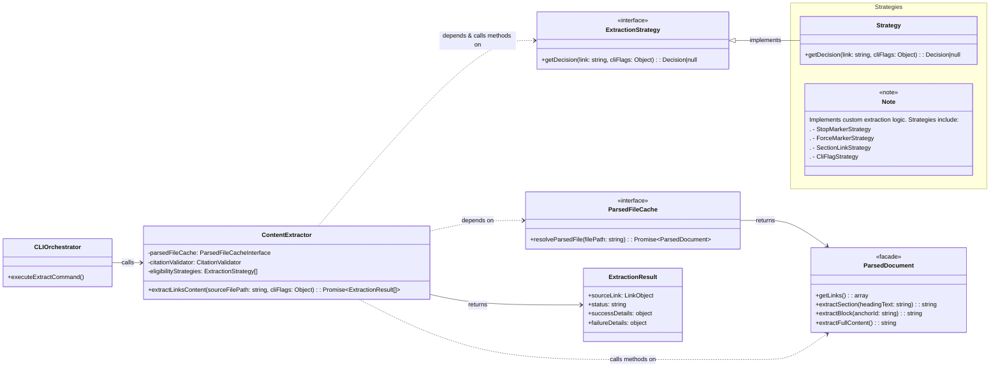
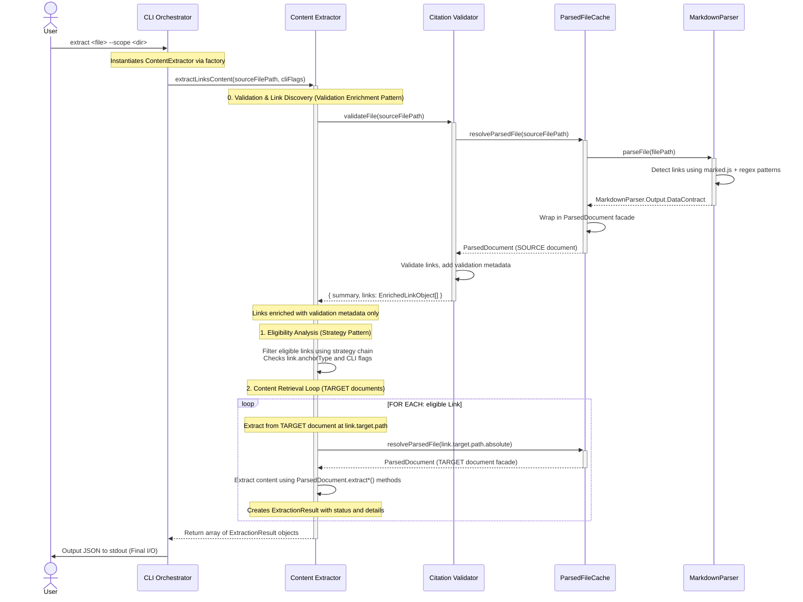

<!-- markdownlint-disable MD025 -->
# Content Extractor Implementation Guide

## Problem

The content extraction workflow requires solving two distinct code-level problems:

### Extraction Eligibility Problem

Without a structured approach to implementing the extraction eligibility rules from [FR10](../features/20251003-content-aggregation/content-aggregation-prd.md#^FR10), developers would naturally implement the precedence logic as a **monolithic function with nested if/else chains**. This creates critical problems:

1. **Rules become untestable in isolation** - Precedence logic tightly couples to the orchestrator, preventing independent testing of individual rules
2. **Closed to extension** - Adding new markdown flavors or user-configurable rules requires modifying the core function, violating the Open/Closed Principle
3. **Implicit precedence order** - Rule hierarchy is buried in control flow structure rather than explicit in the architecture
4. **Intertwined rule logic** - Each rule's implementation is tangled with others, preventing reuse and increasing regression risk

### Content Retrieval Problem

Without a centralized component to orchestrate content retrieval, every consumer would duplicate the **extraction dispatch logic**: determining which `ParsedDocument` method to call (`extractSection()`, `extractBlock()`, `extractFullContent()`), handling different return types, packaging results with metadata, and managing extraction errors. This duplication creates **maintenance burden** (changes to extraction logic require updates across all consumers) and **inconsistent error handling** (each consumer implements its own approach to missing sections or invalid anchors).

## Solution

The **`Content Extractor`** component is the central service for content aggregation. It encapsulates two primary responsibilities: **`ExtractionEligibility`** (determining _what_ to fetch using the Strategy Pattern) and **`ContentRetrieval`** (fetching the content chunk via the **`ParsedDocument`** facade). It returns **`ExtractionResult`** objects back to the CLI for final output.

---
## Structure

The `Content Extractor` is a single component that uses the **Strategy Pattern** internally to manage eligibility rules. The component orchestrates the complete extraction workflow: **validation** (via internal `CitationValidator` call to discover links), **eligibility analysis** (via the strategy chain), and **content retrieval** (via the ParsedDocument facade).

**Input Contract**: The component receives a `sourceFilePath` from the CLI. The CLI orchestrator validates the source file first to discover all LinkObjects with their source and target paths. These pre-validated links are then used internally by ContentExtractor for eligibility analysis and content extraction. The source file path is extracted from the LinkObject array and validated for consistency (all links share the same `link.source.path.absolute` value).



1. **ExtractionStrategy**: Base interface defining the contract for eligibility rule strategies (`getDecision(link, cliFlags)`)
2. **StopMarkerStrategy, ForceMarkerStrategy, SectionLinkStrategy, CliFlagStrategy**: Concrete strategy implementations executed in precedence order
3. **ParsedFileCache**: The dependency used to retrieve ParsedDocument instances
4. **ParsedDocument**: The facade providing content extraction methods (`extractSection()`, `extractBlock()`, `extractFullContent()`)
5. **ExtractionResult**: The result object returned for each link containing status, source link reference, and either success details (extracted content + decision reason) or failure details (error reason)
6. **ContentExtractor**: The class that orchestrates eligibility analysis and content retrieval

---

## Public Contracts

The component's interface is designed as a single execution point to hide internal complexity and ensure the CLI remains thin and focused on application orchestration.

### Input Contract

**Dependencies (injected via constructor):**
1. **`ParsedFileCache`**: For retrieving parsed documents
2. **`CitationValidator`**: For validating citations before extraction
3. **`eligibilityStrategies`**: Array of strategy objects for eligibility rules

**Public Method: `extractLinksContent(sourceFilePath, cliFlags)`**
1. **`sourceFilePath`** (string): Absolute path to the source markdown file containing citations
2. **`cliFlags`** (object): Command-line options (e.g., `{ fullFiles: true }`) to be evaluated by the eligibility strategies

### Output Contract

The `extractLinksContent()` method returns a `Promise` that resolves with an **`ExtractionResult`** object. This is the ONLY public output contract for the ContentExtractor component.

**Complete Schema**: See [ExtractionResult (Public Output Contract)](#ExtractionResult%20(Public%20Output%20Contract)) in Content Deduplication Strategy section

**Design Rationale**:
- **Primary goal**: Minimize token usage for LLM context packages via content deduplication
- **No backward compatibility**: Epic 2 is cohesive unit; intermediate format never exposed publicly
- **Content-based hashing**: Detects duplicates even when different files contain identical text
- **Single source of truth**: Each unique content piece stored once, referenced by multiple links
- **Deduplication is default**: Content deduplication is standard behavior, not an optional variant
- **Names as Contracts**: `ExtractionResult` describes WHAT (extraction results), not HOW (deduplicated)

**Internal Implementation Detail**: The extraction workflow internally produces intermediate extraction attempts (stored in `_LinkExtractionAttempt[]` array) during processing, but these are immediately transformed via internal `_deduplicateExtractionResults()` function before returning. See [`_LinkExtractionAttempt` schema](#_LinkExtractionAttempt%20(Internal%20Intermediate%20Format)).

**Final Output**: The CLI receives the deduplicated structure and outputs it as JSON to stdout (per US2.3 AC7). File writing and formatted output are deferred to future work.

---

## File Structure

Following [Action-Based File Organization](../../../../design-docs/Architecture%20Principles.md#^action-based-file-organization-definition) principles, operations are extracted to separate files following the **"Files Transform States"** pattern:

```text
tools/citation-manager/
└── src/
    ├── core/
    │   └── ContentExtractor/                           // Component folder (TitleCase per coding standards)
    │       ├── ContentExtractor.js                    // Thin orchestrator class (entry point)
    │       ├── extractLinksContent.js                 // PRIMARY operation: content extraction workflow (verb-noun)
    │       ├── analyzeEligibility.js                  // Supporting operation: eligibility analysis (verb-noun)
    │       ├── deduplicateExtractionResults.js        // Supporting operation: content deduplication via hashing (verb-noun)
    │       ├── normalizeAnchor.js                     // Utility helpers: anchor normalization (verb-noun)
    │       └── eligibilityStrategies/                 // Strategy pattern implementations
    │           ├── ExtractionStrategy.js             // Base interface for all eligibility rules
    │           ├── StopMarkerStrategy.js             // Concrete rule: %%stop-extract-link%%
    │           ├── ForceMarkerStrategy.js            // Concrete rule: %%extract-link%%
    │           ├── SectionLinkStrategy.js            // Concrete rule: Anchor-based links eligible by default
    │           └── CliFlagStrategy.js                // Concrete rule: --full-files flag evaluation
    │
    └── factories/
        └── componentFactory.js                        // createContentExtractor() factory with DI wiring
```

**File Organization Rationale**:
- **ContentExtractor.js**: Thin class wrapper for DI/factory pattern, delegates to operation functions
- **extractLinksContent.js**: Primary operation orchestrating validation → eligibility → retrieval → deduplication workflow
- **analyzeEligibility.js**: Supporting operation implementing strategy chain pattern
- **deduplicateExtractionResults.js**: Supporting operation implementing content-based hashing for deduplication
- **normalizeAnchor.js**: Utility functions for anchor normalization (`decodeUrlAnchor`, `normalizeBlockId`)

_Source_: [Action-Based File Organization](../../../../design-docs/Architecture%20Principles.md#^action-based-file-organization-definition), [File Naming Patterns](../../../../design-docs/Architecture%20-%20Baseline.md#File%20Naming%20Patterns)

---
## ContentExtractor Workflow: Component Interaction Diagram  



### Workflow Characteristics

- **Single Service Interface**: The core operation is executed via a **single, high-level call** to the `Content Extractor` component: `extractLinksContent(sourceFilePath, cliFlags)`. This abstracts the entire multi-step process from the CLI.
- **Validation Enrichment Pattern**: The `Content Extractor` calls `CitationValidator.validateFile()` once and receives **enriched links with validation metadata** directly in the response: `{ summary, links: EnrichedLinkObject[] }`. Each link contains its validation status, eliminating the need for separate validation result structures or redundant calls to retrieve links.
- **Zero Redundant Calls**: The validator internally uses `ParsedFileCache` to get the SOURCE document. ContentExtractor receives enriched links directly from the validator with no separate call needed to retrieve links. Only TARGET documents require additional `ParsedFileCache` calls during content extraction.
- **Single Data Flow**: Links flow through a progressive enhancement pipeline: parse → validate → enrich → filter → extract. Validation metadata lives on the `LinkObject.validation` property, creating zero data duplication and a single source of truth.
- **Source vs Target Document Distinction**: The workflow operates on two document types:
  - **SOURCE document**: The file containing citations (e.g., `context-package.md`). Retrieved once by validator, enriched links returned to ContentExtractor.
  - **TARGET documents**: Files referenced by citations (e.g., `architecture.md`, `prd.md`). Retrieved in the extraction loop via `link.target.path.absolute` for content extraction.
- **Encapsulated Logic**: The `Content Extractor` internally manages the complex control flow, performing **Link Eligibility Analysis** (via Strategy Pattern) and the **Content Retrieval Loop** (via ParsedDocument facade calls to TARGET documents).
- **Performance Optimization**: The `ParsedFileCache` guarantees each unique file is parsed at most once per command execution. This applies to both the SOURCE document (parsed during validation) and all TARGET documents (parsed during extraction loop).
- **Complexity Abstraction**: Content retrieval from TARGET documents is handled by declarative calls to the `ParsedDocument` facade's methods (`extractSection()`, `extractBlock()`, `extractFullContent()`). The facade hides the underlying token-walking or line-lookup mechanics.
- **Aggregation Point**: The `Content Extractor` aggregates **`ExtractionResult`** objects (each containing extraction status, source link reference, and either success or failure details) into a single array before returning to the CLI.
- **Final I/O**: The `CLI Orchestrator` performs the final I/O operation: outputting the array of `ExtractionResult` objects as JSON to stdout (per US2.3 AC7). File writing and formatted output are deferred to future work.
- **Asynchronous Flow**: The core content retrieval operations remain **asynchronous** (`Promise`-based) to accommodate the file I/O operations necessary during cache misses.

---
## `ContentExtractor` Main Methods

### `ContentExtractor.extractLinksContent()`

**Pseudocode:**

```ts
/**
 * Orchestrates the extraction of content referenced by eligible links within a source file.
 * Implements the workflow defined in US2.2.
 */
class ContentExtractor is
  private field parsedFileCache: ParsedFileCache
  private field citationValidator: CitationValidator
  private field eligibilityStrategies: array of ExtractionStrategy

  /**
   * Constructor with dependency injection (US2.2 AC1).
   */
  constructor ContentExtractor(parsedFileCache, citationValidator, eligibilityStrategies) is
    this.parsedFileCache = parsedFileCache
    this.citationValidator = citationValidator
    this.eligibilityStrategies = eligibilityStrategies

  /**
   * Analyzes link eligibility using the configured strategy chain.
   * (Existing method from US2.1)
   */
  public method analyzeEligibility(link: LinkObject, cliFlags: object): EligibilityDecision is
    // Implementation uses analyzeEligibility function and this.eligibilityStrategies
    return analyzeEligibility(link, cliFlags, this.eligibilityStrategies)

  /**
   * Main orchestration method (US2.2 AC2).
   * Validates source file, filters by eligibility, fetches target documents,
   * normalizes anchors, calls appropriate extraction methods, and aggregates results.
   * Returns a promise resolving to an array of ExtractionResult objects (US2.2 AC8, AC9).
   */
  public async method extractLinksContent(sourceFilePath: string, cliFlags: object): Promise<array of ExtractionResult> is
    // --- Step 1: Validate Source File & Get Enriched Links ---
    // Call injected CitationValidator to get enriched links (US2.2 AC3)
    field validationResult = await this.citationValidator.validateFile(sourceFilePath)

    // --- Step 1b: Filter Internal Links (US2.2 AC15) ---
    // Internal links are excluded from extraction processing
    field crossDocumentLinks = validationResult.links.filter(link => link.scope != 'internal')

    // --- Step 2: Process Each Link and Build Results ---
    field allResults = []

    for (field link in crossDocumentLinks) do
      // --- 2a: Check Validation Status ---
      // Skip links that failed validation (US2.2 AC4)
      if (link.validation.status == 'error') then
        allResults.push({
          sourceLink: link,
          status: 'skipped',
          failureDetails: {
            reason: `Link failed validation: ${link.validation.error}`
          }
        })
        continue

      // --- 2b: Analyze Eligibility ---
      field decision = this.analyzeEligibility(link, cliFlags)

      if (!decision.eligible) then
        allResults.push({
          sourceLink: link,
          status: 'skipped',
          failureDetails: {
            reason: `Link not eligible for extraction: ${decision.reason}`
          }
        })
        continue

      // --- 2c: Determine Target Document ---
      // All links are cross-document after AC15 filter
      field targetDoc = null
      try
        if (link.target.path.absolute) then
          // Fetch target document via cache (US2.2 AC5)
          targetDoc = await this.parsedFileCache.resolveParsedFile(link.target.path.absolute)
        else
          // No resolvable target path
          throw new Error('No resolvable target path')
      catch (error) is
        // Target file missing or un-parsable
        allResults.push({
          sourceLink: link,
          status: 'error',
          failureDetails: {
            reason: `Cannot read target file: ${link.target.path.absolute || 'unknown'}`
          }
        })
        continue

      // --- 2d: Extract Content Based on Anchor Type ---
      field content = null
      try
        if (link.anchorType == 'header') then
          // Normalization (ADR-CE02): Decode URL anchor (US2.2 AC5)
          field decodedAnchor = this.decodeUrlAnchor(link.target.anchor)
          content = targetDoc.extractSection(decodedAnchor)

        else if (link.anchorType == 'block') then
          // Normalization (ADR-CE02): Remove '^' prefix (US2.2 AC6)
          field blockId = this.normalizeBlockId(link.target.anchor)
          content = targetDoc.extractBlock(blockId)

        else if (link.anchorType == null) then
          // Full file extraction (US2.2 AC7)
          content = targetDoc.extractFullContent()

        // --- 2e: Create Success Result ---
        if (content != null) then
          allResults.push({
            sourceLink: link,
            status: 'success',
            successDetails: {
              decisionReason: decision.reason,
              extractedContent: content
            }
          })
        else
          // Content extraction returned null
          allResults.push({
            sourceLink: link,
            status: 'error',
            failureDetails: {
              reason: 'Content extraction returned null'
            }
          })

      catch (error) is
        // Extraction method failed (e.g., anchor not found)
        field anchorType = link.anchorType || 'file'
        field anchorValue = link.target.anchor || link.target.path.absolute
        allResults.push({
          sourceLink: link,
          status: 'error',
          failureDetails: {
            reason: `${anchorType} anchor not found: ${anchorValue}`
          }
        })

    return allResults

  // --- Helper Methods ---

  /**
   * Removes the '^' prefix from block anchor strings.
   * (As defined in ADR-CE02)
   */
  private method normalizeBlockId(anchor: string | null): string | null is
    if (anchor != null && anchor.startsWith('^')) then
      return anchor.substring(1)
    return anchor

  /**
   * Decodes URL-encoded characters in anchor strings (e.g., %20 -> space).
   * (As defined in ADR-CE02)
   */
  private method decodeUrlAnchor(anchor: string | null): string | null is
    if (anchor != null) then
      try
        return decodeURIComponent(anchor)
      catch (e) is
        // Handle potential decoding errors gracefully
        return anchor // Return original anchor if decoding fails
    return anchor

end class // ContentExtractor
```

---
## Data Schemas

### `_LinkExtractionAttempt` (Internal Intermediate Format)

**Visibility**: Private implementation detail, not exposed in public API

This intermediate structure is produced during the extraction loop before deduplication. Each attempt represents one link's extraction outcome.

```javascript
/**
 * INTERNAL: Intermediate extraction attempt structure.
 * This is transformed into ExtractionResult via _deduplicateExtractionResults().
 * NOT part of the public API.
 */
type _LinkExtractionAttempt = {
  /**
   * The original, complete LinkObject from the MarkdownParser that was processed.
   * Provides full context about the link itself (source, target, line, column, anchor, etc.).
   */
  sourceLink: LinkObject;

  /**
   * The status of the extraction attempt for this link.
   * - 'success': Content was successfully extracted.
   * - 'skipped': Extraction was skipped (e.g., link failed validation, was ineligible).
   * - 'error': An error occurred during the extraction process itself (e.g., target file readable but anchor not found).
   */
  status: "success" | "skipped" | "error";

  /**
   * Contains the successfully extracted content and the reason for eligibility.
   * *Only present if status is 'success'.*
   */
  successDetails?: {
    /** The justification from the eligibility strategy. */
    decisionReason: string;
    /** The raw extracted string content. */
    extractedContent: string;
  };

  /**
   * Contains the reason why extraction was skipped or failed.
   * *Only present if status is 'skipped' or 'error'.*
   */
  failureDetails?: {
    /** A message explaining why extraction was skipped (validation failure, ineligibility) or why it failed (extraction error). */
    reason: string;
  };
};
```

### `ContentExtractor.analyzeEligibility`

#### 1. `LinkObject` Interface (Input)

This is the primary data construct for determining eligibility. While the full `LinkObject` produced by the `MarkdownParser` is large, the `ContentExtractor`'s strategies only depend on a small, specific interface (or "shape") of that object. This adheres to the [**Dependency Abstraction** principle](../../../../design-docs/Architecture%20Principles.md#^dependency-abstraction), as the strategies don't need to know about the entire parser, only this minimal data contract.

```ts
// The minimal interface of a LinkObject consumed by the strategies
{
  /**
   * The type of anchor, if any.
   * Strategies use this to determine if a link is a "section link."
   *
   */
  anchorType: 'header' | 'block' | null,

  /**
   * The post-link marker, if any.
   * Strategies use this to override default behavior.
   *
   */
  extractionMarker: {
    innerText: 'force-extract' | 'stop-extract-link' | string
  } | null
}
```

#### 2. `CliFlags` Object (Input)

This is a simple data object that provides runtime context from the command line, allowing users to override default behavior.

JavaScript

```ts
{
  /**
   * Flag to force extraction of full-file links (those with anchorType: null).
   *
   */
  fullFiles: boolean
}
```

#### 3. `EligibilityDecision` Object (Output)

This is the clean, simple, and authoritative data model that the `ContentExtractor` _produces_. Every strategy must return this object (or `null` to pass to the next strategy).

```ts
{
  /**
   * The final boolean decision.
   */
  eligible: boolean,

  /**
   * The justification from the specific strategy that made the final decision.
   *
   */
  reason: string
}
```

---

## Content Deduplication Strategy

### Purpose

The Content Deduplication Strategy minimizes token usage in LLM context packages by storing identical extracted content only once. When multiple links reference the same target or when different files contain identical content, the system uses content-based hashing to detect duplicates and create an indexed structure that eliminates redundancy.

### Algorithm: Content-Based Hashing

**Approach**: Generate SHA-256 hash of extracted content string to create unique contentId.

**Key Generation**:

```javascript
function generateContentId(extractedContent) {
  const crypto = require('crypto');
  return crypto.createHash('sha256')
    .update(extractedContent)
    .digest('hex')
    .substring(0, 16); // Truncate to 16 chars for readability
}
```

**Benefits of Content-Based Approach**:
- Catches duplicates even when different files contain identical text
- Automatic cache invalidation when content changes (different hash)
- Deterministic: same content always produces same ID
- Collision risk negligible (SHA-256 has 2^64 possible values for 16 hex chars)

**Trade-offs**:
- Whitespace-sensitive: minor formatting differences create different hashes (acceptable for MVP)
- Cannot detect partial matches (e.g., H3 content as substring of H2 extraction)

### `ExtractionResult` (Public Output Contract)

**Visibility**: Public API - THE ONLY format returned by `extractLinksContent()`

The output structure uses an indexed format to minimize token usage through content deduplication. This is the final, deduplicated format after internal transformation of `_LinkExtractionAttempt[]` array.

```javascript
{
  /**
   * Content index mapping contentId (SHA-256 hash) to unique content.
   * Each entry stores content once with metadata about all sources.
   */
  contentIndex: {
    [contentId: string]: {
      /** The extracted markdown content (stored once) */
      content: string,

      /** Character count of content (for stats calculation) */
      contentLength: number,

      /** Array of all source locations that produced this identical content */
      sources: Array<{
        /** Absolute path to target file */
        targetFile: string,

        /** Anchor fragment (with # or ^ prefix) or null for full-file */
        anchor: string | null,

        /** Type of anchor: "header", "block", or null */
        anchorType: "header" | "block" | null
      }>
    }
  },

  /**
   * Array of link references pointing to content via contentId.
   * Preserves source location and extraction metadata.
   */
  links: Array<{
    /** Hash reference to contentIndex entry, or null for skipped/error links */
    contentId: string | null,

    /** 1-based line number in source file */
    sourceLine: number,

    /** 0-based column position in source file */
    sourceColumn: number,

    /** Display text from original markdown link */
    linkText: string,

    /** Status of extraction: "success", "skipped", or "error" */
    status: "success" | "skipped" | "error",

    /** Eligibility decision reason (present when status === "success") */
    decisionReason?: string,

    /** Failure explanation (present when status !== "success") */
    reason?: string
  }>,

  /**
   * Aggregate statistics about deduplication effectiveness
   */
  stats: {
    /** Total number of links processed */
    totalLinks: number,

    /** Count of unique content entries in contentIndex */
    uniqueContent: number,

    /** Count of links referencing duplicate content */
    duplicateContentDetected: number,

    /** Sum of character counts for deduplicated content */
    tokensSaved: number,

    /** Ratio of tokens saved to total content size (0.0 to 1.0) */
    compressionRatio: number
  }
}
```

### Deduplication Workflow

The deduplication operation transforms intermediate extraction attempts into the final `ExtractionResult`:

```typescript
/**
 * Transform flat array of intermediate extraction attempts into deduplicated indexed structure.
 * Implements content-based hashing to detect and eliminate duplicate content.
 * This is an internal operation; the intermediate array format is not exposed publicly.
 */
function _deduplicateExtractionResults(attempts: _LinkExtractionAttempt[]): ExtractionResult is
  field contentIndex = {}
  field links = []
  field totalSaved = 0

  // Process each extraction result
  for (field result in results) do
    if (result.status == 'success') then
      // Generate content hash
      field contentId = generateContentId(result.successDetails.extractedContent)

      // Check if content already exists in index
      if (!contentIndex[contentId]) then
        // First occurrence: store content with source metadata
        contentIndex[contentId] = {
          content: result.successDetails.extractedContent,
          contentLength: result.successDetails.extractedContent.length,
          sources: [{
            targetFile: result.sourceLink.target.path.absolute,
            anchor: result.sourceLink.target.anchor,
            anchorType: result.sourceLink.anchorType
          }]
        }
      else
        // Duplicate detected: add source to existing entry, track savings
        contentIndex[contentId].sources.push({
          targetFile: result.sourceLink.target.path.absolute,
          anchor: result.sourceLink.target.anchor,
          anchorType: result.sourceLink.anchorType
        })
        totalSaved += result.successDetails.extractedContent.length

      // Create link reference
      links.push({
        contentId: contentId,
        sourceLine: result.sourceLink.line,
        sourceColumn: result.sourceLink.column,
        linkText: result.sourceLink.text,
        status: 'success',
        decisionReason: result.successDetails.decisionReason
      })
    else
      // Preserve skipped/error results without content
      links.push({
        contentId: null,
        sourceLine: result.sourceLink.line,
        sourceColumn: result.sourceLink.column,
        linkText: result.sourceLink.text,
        status: result.status,
        reason: result.failureDetails.reason
      })

  // Calculate statistics
  field uniqueCount = Object.keys(contentIndex).length
  field duplicateCount = results.filter(r => r.status === 'success').length - uniqueCount
  field totalContentSize = Object.values(contentIndex).reduce((sum, entry) => sum + entry.contentLength, 0)

  return {
    contentIndex: contentIndex,
    links: links,
    stats: {
      totalLinks: results.length,
      uniqueContent: uniqueCount,
      duplicateContentDetected: duplicateCount,
      tokensSaved: totalSaved,
      compressionRatio: totalSaved / (totalContentSize + totalSaved)
    }
  }
end function
```

### Integration with ContentExtractor

The `extractLinksContent()` method applies deduplication as the final step before returning:

```typescript
class ContentExtractor is
  // ... existing methods ...

  public async method extractLinksContent(sourceFilePath: string, cliFlags: object): Promise<ExtractionResult> is
    // Phase 1-3: Validation, filtering, content extraction
    field attempts = []
    // ... existing extraction logic produces _LinkExtractionAttempt[] ...

    // Phase 4: Deduplication (internal transformation)
    return _deduplicateExtractionResults(attempts)
  end method
end class
```

**Architecture Notes**:
- **No backward compatibility**: Intermediate flat array format never exposed; Epic 2 is cohesive unit
- **Primary goal**: Minimize token usage for LLM context packages
- **Operation file**: Deduplication logic lives in `deduplicateExtractionResults.js` per Action-Based File Organization
- **Factory pattern**: Factory creates ContentExtractor with deduplication enabled by default
- **Names as Contracts**: Public contract is `ExtractionResult`, deduplication is default behavior not optional variant

---

---
## Error Handling Specification

The `ContentExtractor` produces `ExtractionResult` objects with three possible status values: `'success'`, `'skipped'`, and `'error'`. This section defines the specific error messages used in `failureDetails.reason` for different failure scenarios, ensuring consistent error reporting across the system.

### Status: 'skipped'

Links are marked as `'skipped'` when they cannot be extracted due to validation failures or eligibility rules, but this is expected behavior rather than an error condition.

**Validation Failure:**
- **Condition**: `link.validation.status === 'error'`
- **Reason Format**: `"Link failed validation: {link.validation.error}"`
- **Example**: `"Link failed validation: Target file does not exist"`

**Ineligibility:**
- **Condition**: `decision.eligible === false` (from Strategy Pattern)
- **Reason Format**: `"Link not eligible for extraction: {decision.reason}"`
- **Example**: `"Link not eligible for extraction: Full-file links require --full-files flag"`

### Status: 'error'

Links are marked as `'error'` when extraction fails due to runtime errors or missing content, indicating an unexpected problem that should be investigated.

**Target File Read Failure:**
- **Condition**: `parsedFileCache.resolveParsedFile()` throws error
- **Reason Format**: `"Cannot read target file: {link.target.path.absolute || 'unknown'}"`
- **Example**: `"Cannot read target file: /path/to/missing-file.md"`

**Section Not Found:**
- **Condition**: `targetDoc.extractSection()` throws error for header anchor
- **Reason Format**: `"header anchor not found: {decodedAnchor}"`
- **Example**: `"header anchor not found: Installation Guide"`

**Block Not Found:**
- **Condition**: `targetDoc.extractBlock()` throws error for block anchor
- **Reason Format**: `"block anchor not found: {blockId}"`
- **Example**: `"block anchor not found: definition-123"`

**Null Content Returned:**
- **Condition**: Extraction method returns `null` instead of throwing
- **Reason Format**: `"Content extraction returned null"`
- **Example**: `"Content extraction returned null"`

**No Resolvable Target:**
- **Condition**: Link has no `target.path.absolute` value
- **Reason Format**: `"Cannot read target file: unknown"`
- **Example**: Used for defensive handling of invalid link objects

### Implementation Notes

1. **Error Message Construction**: The pseudocode shows dynamic error message construction using template literals to include contextual information (file paths, anchor values, validation errors)

2. **Status vs Error Distinction**:
   - Use `'skipped'` for expected conditions (validation failures, eligibility rules)
   - Use `'error'` for unexpected runtime problems (missing files, missing anchors, null returns)

3. **User Story References**:
   - US2.2 AC4: Validation error filtering and skipping
   - US2.3 AC5: Error reporting to stderr for user visibility
   - US2.3 AC6: Extraction continues despite individual link failures

4. **Debugging Support**: Error messages include specific values (file paths, anchor text) to enable rapid diagnosis without additional logging infrastructure

---
## Factory Implement Pattern

```javascript
/**
 * Create content extractor with full dependencies
 *
 * @param {ParsedFileCache|null} [parsedFileCache=null] - Optional cache override for testing and dependency injection flexibility
 * @param {CitationValidator|null} [validator=null] - Optional validator override for testing and dependency injection flexibility
 * @param {ExtractionStrategy[]|null} [strategies=null] - Optional strategy override for testing or custom extraction rules
 * @returns {ContentExtractor} Fully configured ContentExtractor instance that orchestrates extraction workflow and returns ExtractionResult objects
 */
export function createContentExtractor(
  parsedFileCache = null,
  validator = null,
  strategies = null
) {
  const _parsedFileCache = parsedFileCache || createParsedFileCache();
  const _validator = validator || createCitationValidator();
  const _strategies = strategies || [
    new StopMarkerStrategy(),
    new ForceMarkerStrategy(),
    new SectionLinkStrategy(),
    new CliFlagStrategy(),
  ];

  return new ContentExtractor(_parsedFileCache, _validator, _strategies);
}
```

**Pattern Benefits:**
- Encapsulates strategy instantiation and explicit precedence ordering
- Enables integration testing with real strategies in isolated configurations
- Supports extensibility through custom extraction strategies (e.g., implementing HTML comment-based markers like `<!-- extract-link -->` or `<!-- stop-extract -->` for different markdown flavors, custom markers for specific documentation systems, or user-defined extraction rules)
- Provides production-ready defaults with optional dependency injection
- Follows workspace factory pattern from `createCitationValidator()`

### Extraction Marker Detection: MVP Hardcoded Approach

**MVP Implementation**: MarkdownParser hardcodes detection of `%% %%` and `<!-- -->` delimiters after links. The parser scans the remainder of each line after detecting a link and extracts any marker found.

**Architecture Flow (MVP):**
1. **Parser detects link**: Finds markdown or wiki link on a line
2. **Parser scans for markers**: Checks remainder of line for `%%...%%` or `<!--...-->` patterns
3. **Parser extracts marker data**: Captures both full marker and inner text
4. **LinkObject enriched**: `extractionMarker: { fullMatch, innerText }` added to LinkObject
5. **Strategies check inner text**: Each strategy checks `link.extractionMarker?.innerText` against expected values

**LinkObject.extractionMarker Structure:**

```typescript
extractionMarker: {
  fullMatch: string,   // Complete marker as found: '%%force-extract%%' or '<!-- extract-link -->'
  innerText: string    // Text between delimiters: 'force-extract' or 'extract-link'
} | null               // null if no marker found on line
```

**Markdown Examples:**

| Markdown Syntax | extractionMarker Value | Strategy Checks |
|-----------------|------------------------|-----------------|
| `[link](path.md)%%force-extract%%` | `{ fullMatch: '%%force-extract%%', innerText: 'force-extract' }` | `innerText === 'force-extract'` |
| `[link](path.md) %%stop-extract-link%%` | `{ fullMatch: '%%stop-extract-link%%', innerText: 'stop-extract-link' }` | `innerText === 'stop-extract-link'` |
| `[link](path.md)<!-- extract-link -->` | `{ fullMatch: '<!-- extract-link -->', innerText: 'extract-link' }` | `innerText === 'extract-link'` |
| `[link](path.md)` | `null` | Strategy returns null (pass to next) |

**Strategy Implementation Examples:**

```javascript
// StopMarkerStrategy - Prevents extraction when marker present
class StopMarkerStrategy {
  getDecision(link, cliFlags) {
    if (link.extractionMarker?.innerText === 'stop-extract-link') {
      return { eligible: false, reason: 'Stop marker prevents extraction' };
    }
    return null;
  }
}

// ForceMarkerStrategy - Forces extraction regardless of other rules
class ForceMarkerStrategy {
  getDecision(link, cliFlags) {
    if (link.extractionMarker?.innerText === 'force-extract') {
      return { eligible: true, reason: 'Force marker overrides defaults' };
    }
    return null;
  }
}

// SectionLinkStrategy - Checks if link has anchor (section/block reference)
class SectionLinkStrategy {
  getDecision(link, cliFlags) {
    if (link.anchorType !== null) {  // Has anchor = section/block link
      return { eligible: true, reason: 'Section links eligible by default' };
    }
    return null;
  }
}

// CliFlagStrategy - Checks CLI flags for extraction override
class CliFlagStrategy {
  getDecision(link, cliFlags) {
    if (cliFlags.fullFiles === true) {
      return { eligible: true, reason: 'CLI flag --full-files forces extraction' };
    }
    return null;
  }
}
```

**MarkdownParser Responsibilities:**
1. Receive marker patterns array from ParsedFileCache/CitationValidator
2. After detecting link, scan remainder of line for any registered marker
3. Auto-detect delimiter style: `%% text %%` or `<!-- text -->`
4. Extract inner text (content between delimiters)
5. Set `link.extractionMarker = { fullMatch, innerText }` or `null`
6. Handle whitespace tolerance (optional spaces between link and marker)

**MVP Technical Debt:**

For MVP, MarkdownParser **hardcodes** detection of `%% %%` and `<!-- -->` delimiters after links. This creates coupling between the parser (generic markdown processing) and the content extraction feature. See [MarkdownParser Technical Debt: Issue 5 - Hardcoded Extraction Marker Detection](Markdown%20Parser%20Implementation%20Guide.md#Issue%205%20Hardcoded%20Extraction%20Marker%20Detection%20(MVP%20Tech%20Debt)) for full analysis and future extensibility approach.

**Future Enhancement:** Parser will accept custom annotation detectors as configuration, eliminating coupling and enabling feature-specific marker registration without parser modifications. `ContentExtractor` will define content extraction markers: [Issue 1: Strategy-Defined Extraction Markers (Future Enhancement)](#Issue%201%20Strategy-Defined%20Extraction%20Markers%20(Future%20Enhancement))

---
## Related Files
- [Pseudocode - Abstraction Levels](../../../../design-docs/Psuedocode%20Style%20Guide.md#Abstraction%20Levels)
- [Architecture - Baseline](../../../../design-docs/Architecture%20-%20Baseline.md)
- [ParsedFileCache Implementation Guide](../../../../../resume-coach/design-docs/examples/component-guides/ParsedFileCache%20Implementation%20Guide.md)
- [ParsedDocument Implementation Guide](ParsedDocument%20Implementation%20Guide.md)
- [us2.1-implement-extraction-eligibility-strategy-pattern](../features/20251003-content-aggregation/user-stories/us2.1-implement-extraction-eligibility-strategy-pattern/us2.1-implement-extraction-eligibility-strategy-pattern.md)

---

# Whiteboard

---
# Future Work

## Output Formatting and Persistence

The initial implementation of the `extract` command (US2.3) focuses on orchestrating the content extraction workflow and returning the raw array of `ExtractionResult` objects, output as JSON to stdout. The design and implementation of user-facing output formatting (e.g., structured markdown, inline replacement) and persistence options (e.g., writing to a specified file via `--output`) have been explicitly deferred.

This deferred scope includes functionality originally described in US2.3 Acceptance Criteria AC5 (markdown header formatting), AC6 (writing to output file), AC7 (file-based success message), and the `--output` option in AC2.

The requirements for the final output format and persistence will be defined in a future user story after evaluating the utility of the raw extracted content for the primary LLM context-gathering use case.

---

# Architectural Decision Records

## ADR-CE02: Anchor Normalization Location for Extraction

- **Status:** Proposed
- **Date:** 2025-10-22
- **Context:**
  - The `LinkObject` provided by `MarkdownParser` contains `target.anchor` which may be URL-encoded (e.g., `%20` for spaces in headers) or prefixed with `^` (for block anchors).
  - The `ParsedDocument.extractSection` method expects the raw, decoded heading text to find the corresponding token.
  - The `ParsedDocument.extractBlock` method expects the block ID _without_ the `^` prefix.
  - A decision is needed on _where_ to perform the necessary normalization (URL decoding for sections, `^` removal for blocks).
- **Decision:**
  - Anchor normalization **SHALL** occur within the orchestrating method (`ContentExtractor.extractLinksContent`).
  - This method will decode URL-encoded anchors _before_ calling `ParsedDocument.extractSection`.
  - This method will remove the `^` prefix from block anchors _before_ calling `ParsedDocument.extractBlock`.
  - The `ParsedDocument` extraction methods (`extractSection`, `extractBlock`) **SHALL** expect clean, normalized inputs (raw heading text, block ID without prefix).
- **Consequences:**
  - **Pros:**
    - Keeps the `ParsedDocument` API clean and focused on its core responsibility: extracting content based on exact identifiers (**Single Responsibility**, **Clear Contracts**).
    - Decouples the `ParsedDocument` implementation from the specific formats used in `LinkObject.target.anchor` (**Dependency Abstraction**).
    - Consolidates the adaptation logic within the orchestrator, which is already responsible for mediating between the `LinkObject` contract and the `ParsedDocument` API.
  - **Cons:**
    - Adds minor normalization logic (URL decoding, prefix stripping) to the `ContentExtractor.extractLinksContent` method.
    - The orchestrator needs to be aware of the potential need for normalization based on `link.anchorType`.

## Validation Enrichment Pattern

**Decision Date**: 2025-10-17
**Status**: Recommended for Implementation

### Problem: Massive Data Duplication

The current architectural approach creates separate data structures for parser output (`LinkObject`) and validation results (`ValidationResult`), leading to 80% data duplication:

**LinkObject** (from MarkdownParser):

```typescript
{
  linkType: "markdown",      // ← Duplicated in ValidationResult
  line: 42,                   // ← Duplicated
  column: 5,                  // ← Duplicated
  fullMatch: "[text](file)",  // ← Duplicated as "citation"
  target: { path: "file.md", anchor: "#section" },
  // ... other structural data
}
```

**ValidationResult.results[0]** (from CitationValidator):

```typescript
{
  line: 42,                   // ← Duplicate
  column: 5,                  // ← Duplicate
  citation: "[text](file)",   // ← Duplicate (fullMatch)
  linkType: "markdown",       // ← Duplicate
  status: "error",            // ← UNIQUE (only 3-4 fields are new!)
  error: "Anchor not found",  // ← UNIQUE
  suggestion: "#similar"      // ← UNIQUE
}
```

**Impact**:
- Memory overhead (storing same data twice)
- Redundant `getLinks()` calls (validator fetches, extractor fetches again)
- Architectural messiness (data flow passes same information multiple times)

### Recommended Solution: Hybrid Validation Enrichment

Validation metadata should live **on the LinkObject** itself, eliminating duplication while preserving separation of concerns for summary reporting.

#### Enhanced LinkObject Schema

```typescript
interface LinkObject {
  // Original parser data (unchanged)
  linkType: "markdown" | "wiki",
  scope: "cross-document" | "internal",
  target: { path, anchor },
  line: number,
  column: number,
  fullMatch: string,

  // Validation metadata (added AFTER validation)
  validation?: {
    status: "valid" | "warning" | "error",
    error?: string,           // Only when status = "error"
    suggestion?: string,      // Only when status = "error" | "warning"
    pathConversion?: object   // Only when relevant
  }
}
```

#### ValidationResult Schema (Summary Only)

```typescript
interface ValidationResult {
  summary: {
    total: number,
    valid: number,
    warnings: number,
    errors: number
  },
  links: LinkObject[]  // Return enriched links (no duplication!)
}
```

#### Implementation Pattern

```typescript
class CitationValidator {
  async validateFile(filePath): ValidationResult {
    const parsed = await this.parsedFileCache.resolveParsedFile(filePath)
    const links = parsed.getLinks()

    // Enrich each link with validation metadata
    for (const link of links) {
      const result = await this.validateSingleLink(link)
      link.validation = {
        status: result.status,
        error: result.error,
        suggestion: result.suggestion
      }
    }

    // Return summary + enriched links (no duplication!)
    return {
      summary: this.generateSummary(links),
      links: links
    }
  }
}
```

#### ContentExtractor Usage

```typescript
class ContentExtractor {
  async extractLinksContent(sourceFilePath, cliFlags) {
    // Step 1: Validate and get enriched links
    const { summary, links } = await this.citationValidator.validateFile(sourceFilePath)

    if (summary.errors > 0) {
      throw new Error("Cannot extract from file with broken citations")
    }

    // Step 2: Process all links and create ExtractionResult objects
    const results = []
    for (const link of links) {
      // Skip validation errors
      if (link.validation.status === "error") {
        results.push({
          sourceLink: link,
          status: 'skipped',
          failureDetails: { reason: `Validation failed: ${link.validation.error}` }
        })
        continue
      }

      // Check eligibility
      const decision = this.analyzeEligibility(link, cliFlags)
      if (!decision.eligible) {
        results.push({
          sourceLink: link,
          status: 'skipped',
          failureDetails: { reason: `Not eligible: ${decision.reason}` }
        })
        continue
      }

      // Extract content
      try {
        const targetDoc = await this.parsedFileCache.resolveParsedFile(link.target.path.absolute)
        const content = this.extractContent(targetDoc, link)
        results.push({
          sourceLink: link,
          status: 'success',
          successDetails: {
            decisionReason: decision.reason,
            extractedContent: content
          }
        })
      } catch (error) {
        results.push({
          sourceLink: link,
          status: 'error',
          failureDetails: { reason: `Extraction failed: ${error.message}` }
        })
      }
    }

    return results
  }
}
```

### Benefits

1. **Zero Duplication**: Validation data stored once on LinkObject (50% memory reduction)
2. **Single Data Flow**: One object passes through pipeline (parse → validate → filter → extract)
3. **No Redundant Calls**: Validator returns enriched links; extractor uses them directly
4. **Natural Lifecycle**: Progressive enhancement pattern (base data + validation metadata)
5. **Separation Preserved**: Summary stays separate for CLI reporting needs

### Type Safety (Preventing Illegal States)

Use TypeScript discriminated unions to prevent invalid states:

```typescript
// Base link (from parser - unvalidated)
interface UnvalidatedLinkObject {
  linkType: "markdown" | "wiki",
  target: { path, anchor },
  line: number,
  column: number,
  // No validation field = explicitly unvalidated
}

// After validation
interface ValidatedLinkObject extends UnvalidatedLinkObject {
  validation: {
    status: "valid" | "warning" | "error",
    error?: string,
    suggestion?: string
  }
}

type LinkObject = UnvalidatedLinkObject | ValidatedLinkObject

// Type guard
function isValidated(link: LinkObject): link is ValidatedLinkObject {
  return 'validation' in link
}

// Usage with type safety
for (const link of links) {
  if (isValidated(link) && link.validation.status === "error") {
    console.log(link.validation.error)  // TypeScript knows this exists
  }
}
```

### Migration Impact

**Files Requiring Updates**:
1. `CitationValidator.js` - Return `{ summary, links }` instead of separate validation results
2. `ContentExtractor.js` - Use enriched links from validator (remove redundant `getLinks()`)
3. `MarkdownParser.js` - LinkObject schema unchanged (validation field added post-parse)
4. `citation-manager.js` CLI - Handle enriched links for display/reporting
5. Type definitions - Add discriminated union types for validated vs unvalidated links

**Backward Compatibility**: Breaking change requiring coordinated update across validator → extractor → CLI

### Implementation Priority

**Timing**: Implement during US2.1 (Extraction Eligibility) to avoid architectural refactoring later
**Risk**: Medium (requires coordinated changes across 3+ components)
**Value**: High (eliminates fundamental duplication, cleaner architecture for Epic 2)

### Impacted Documentation

The following design documents require updates to reflect the Validation Enrichment Pattern:

**Component Guides (Direct Impact)**:
1. `CitationValidator Implementation Guide.md` - Output contract changes from separate ValidationResult to enriched LinkObjects
2. `Content Extractor Implementation Guide.md` - Input contract changes to receive enriched links directly from validator
3. `Markdown Parser Implementation Guide.md` - Clarify that `validation` property is added post-parse, not by parser

**Architecture Documents (Direct Impact)**:
4. `content-aggregation-architecture.md` - Data flow between validator → extractor changes
~~5. `Architecture.md` - Component contracts and data models require updates~~

**Feature Documents (Direct Impact)**:
6. `content-aggregation-prd.md` - Validation output format specification changes
~~7. `content-aggregation-architecture-whiteboard.md` - Contains the ADR itself, may need workflow updates~~

**User Stories (Implementation Impact)**:
8. `us2.1-implement-extraction-eligibility-strategy-pattern.md` - ADR states "implement during US2.1"
9. `us1.7-implement-parsed-document-facade.md` - May affect facade's interaction with enriched links
10. `us1.5-implement-cache-for-parsed-files.md` - Cache may need to handle enriched LinkObjects

**Total**: 10 documents requiring updates to reflect the Validation Enrichment Pattern

---

# `ContentExtractor` Component Technical Debt

## Issue 1: Nested Content Duplication Detection (Deferred - US2.2a)

**Current Limitation**: The content deduplication strategy uses content-based hashing (SHA-256) to detect identical extracted content. However, it cannot detect when one piece of content is a substring of another, which occurs in the following scenario:

**Scenario**: H2 Section Containing H3 Subsections
- **Link A** extracts an H2 section: `## Architecture`
- **Link B** directly targets an H3 within that section: `### Component Design`
- The H2 extraction includes all nested H3 content
- The H3 extraction contains only the subsection content
- **Result**: Both extractions stored separately in contentIndex despite H3 being substring of H2

**Example**:

```markdown
## Architecture
This section describes the architecture.

### Component Design
Components follow these patterns...

### Data Flow
Data flows through these stages...
```

**Link Behavior**:
- `[architecture](doc.md#Architecture)` → Extracts entire H2 section (includes both H3s)
- `[components](doc.md#Component%20Design)` → Extracts only H3 subsection

**Current Behavior**: Two separate contentIndex entries created:
- ContentId A: Full H2 content (large)
- ContentId B: H3 subset (small, duplicate of portion of A)

**Desired Future Behavior**: Detect that ContentId B is substring of ContentId A and either:
1. Reference offset/range within ContentId A
2. Store only ContentId A, mark ContentId B as derived
3. Provide substring relationship in stats

**Why Deferred**:
- Substring detection adds significant complexity (O(n²) comparisons or suffix tree construction)
- Edge case handling (multiple overlapping substrings, partial matches)
- MVP goal is exact duplicate detection, not partial content analysis
- Token savings from exact duplicates provides majority of value

**Workaround for MVP**: Accept that nested content creates separate entries. Document in stats that some duplicated content may exist within larger extractions.

**Mitigation Strategy**: Users should prefer linking to higher-level sections when context is needed, avoiding granular subsection links when parent section provides sufficient context.

**Discovery Date**: 2025-10-25
**Discovered During**: US2.2a design brainstorming
**Priority**: Low (edge case, minimal impact on primary goal of token reduction)
**Estimated Impact**: 5-10% additional token usage in documents with many nested subsection links

---

## Issue 2: Strategy-Defined Extraction Markers (Future Enhancement)

**Current MVP Limitation**: Extraction markers (`%%force-extract%%`, `%%stop-extract-link%%`) are hardcoded in MarkdownParser. Strategies cannot define custom markers, limiting extensibility for new markdown flavors or user-defined rules.

**MVP Implementation (Current State)**:

```javascript
// Strategies check hardcoded marker values
class ForceMarkerStrategy {
  getDecision(link, cliFlags) {
    // Can only check for markers that MarkdownParser already knows about
    if (link.extractionMarker?.innerText === 'force-extract') {
      return { eligible: true, reason: 'Force extraction marker' };
    }
    return null;
  }
}

// MarkdownParser hardcodes: /\s*(%%(.+?)%%|<!--\s*(.+?)\s*-->)/
```

### Future Enhancement: Strategy Registration Pattern

Strategies will define their marker patterns via `getMarker()` method, which ContentExtractor collects and passes to MarkdownParser during parsing.

**Strategy Interface Update**:

```javascript
class ExtractionStrategy {
  /**
   * Define the extraction marker this strategy responds to
   * @returns {string|null} Full marker string (e.g., '%%force-extract%%') or null if no marker
   */
  getMarker() {
    return null; // Default: no marker
  }

  /**
   * Evaluate eligibility based on link properties and CLI flags
   * @param {LinkObject} link - Enriched link with extractionMarker property
   * @param {Object} cliFlags - CLI flags
   * @returns {Decision|null} Eligibility decision or null to pass to next strategy
   */
  getDecision(link, cliFlags) {
    // Strategy logic
  }
}
```

**Concrete Strategy Implementation**:

```javascript
class ForceMarkerStrategy {
  getMarker() {
    return '%%force-extract%%';  // Strategy defines its marker
  }

  getDecision(link, cliFlags) {
    // Check if parser found this strategy's marker
    if (link.extractionMarker?.innerText === 'force-extract') {
      return { eligible: true, reason: 'Force extraction marker' };
    }
    return null;
  }
}

class StopMarkerStrategy {
  getMarker() {
    return '%%stop-extract-link%%';
  }

  getDecision(link, cliFlags) {
    if (link.extractionMarker?.innerText === 'stop-extract-link') {
      return { eligible: false, reason: 'Stop extraction marker' };
    }
    return null;
  }
}

// Custom HTML comment strategy (user-defined)
class HtmlForceMarkerStrategy {
  getMarker() {
    return '<!-- force-extract -->';  // Custom marker
  }

  getDecision(link, cliFlags) {
    if (link.extractionMarker?.innerText === 'force-extract') {
      return { eligible: true, reason: 'HTML comment forces extraction' };
    }
    return null;
  }
}
```

**ContentExtractor Orchestration**:

```javascript
class ContentExtractor {
  constructor(strategies, parsedFileCache, citationValidator) {
    this.strategies = strategies;
    this.parsedFileCache = parsedFileCache;
    this.citationValidator = citationValidator;
  }

  async extractLinksContent(sourceFilePath, cliFlags) {
    // Collect marker patterns from all strategies
    const markerPatterns = this.strategies
      .map(strategy => strategy.getMarker())
      .filter(marker => marker !== null);
    // Result: ['%%force-extract%%', '%%stop-extract-link%%', '<!-- force-extract -->']

    // Pass markers to validator, which forwards to parser
    const { summary, links } = await this.citationValidator.validateFile(
      sourceFilePath,
      { markerPatterns }  // Future: validator passes to parser
    );

    // Rest of extraction logic...
  }
}
```

**MarkdownParser Integration** (requires parser extensibility - see [MarkdownParser Issue 5](Markdown%20Parser%20Implementation%20Guide.md#Issue%205%20Hardcoded%20Extraction%20Marker%20Detection%20(MVP%20Tech%20Debt))):

```javascript
class MarkdownParser {
  parseFile(filePath, options = {}) {
    const { markerPatterns = [] } = options;

    // Build regex from strategy-provided patterns
    const markerRegex = this.buildMarkerRegex(markerPatterns);

    // Scan for markers after links using strategy-defined patterns
    const extractionMarkerMatch = remainingLine.match(markerRegex);
    if (extractionMarkerMatch) {
      linkObject.extractionMarker = {
        fullMatch: extractionMarkerMatch[0],
        innerText: this.extractInnerText(extractionMarkerMatch[0])
      };
    }
  }

  buildMarkerRegex(patterns) {
    if (patterns.length === 0) {
      // Fallback to hardcoded MVP patterns
      return /\s*(%%(.+?)%%|<!--\s*(.+?)\s*-->)/;
    }
    // Build regex from strategy patterns (escape special chars, build alternation)
    // Implementation details TBD
  }
}
```

**Benefits of Future Approach**:
- ✅ **Strategies own their markers**: Marker definition co-located with decision logic
- ✅ **No parser modifications for new markers**: Parser accepts patterns as configuration
- ✅ **Custom user strategies**: Users can define `<!-- custom-marker -->` or other formats
- ✅ **Clear contract**: `getMarker()` returns marker, `getDecision()` checks for it
- ✅ **Backward compatible**: Null marker = strategy doesn't use markers (CLI flags, anchor types)

**Implementation Dependencies**:
1. **MarkdownParser extensibility** - Parser must accept custom annotation patterns (see MarkdownParser Issue 5)
2. **CitationValidator marker forwarding** - Validator must pass markerPatterns to parser
3. **Strategy interface update** - Add `getMarker()` to ExtractionStrategy interface
4. **Factory pattern update** - Collect markers from strategies before instantiation

**Discovery Date**: 2025-10-20
**Discovered During**: ContentExtractor implementation guide development
**Priority**: Medium (enables extensibility for custom markdown flavors; not blocking MVP)
**Related Tech Debt**: [MarkdownParser Issue 5 - Hardcoded Extraction Marker Detection](Markdown%20Parser%20Implementation%20Guide.md#Issue%205%20Hardcoded%20Extraction%20Marker%20Detection%20(MVP%20Tech%20Debt))

---
