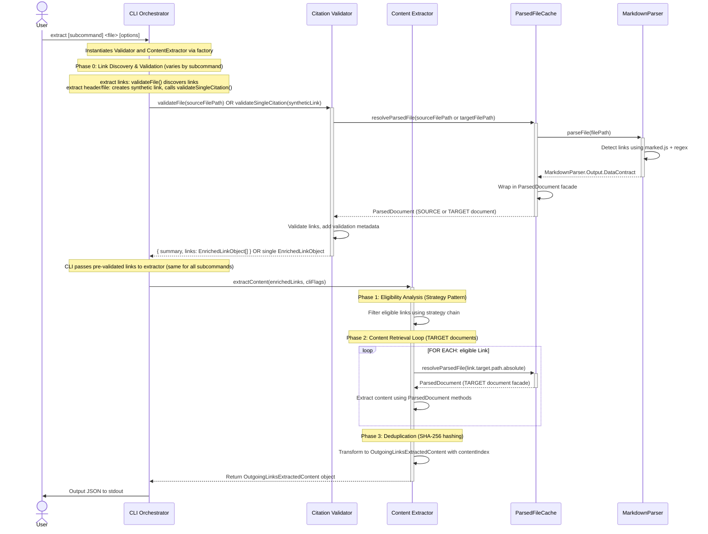
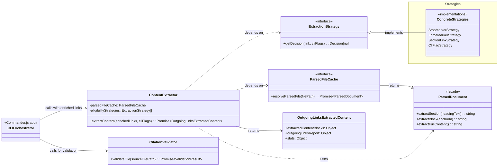

<!-- markdownlint-disable MD025 -->
<!-- markdownlint-disable  -->
# Content Extractor Implementation Guide

This document expands on [ContentExtractor component definition](<../.archive/features/20251003-content-aggregation/content-aggregation-architecture.md#Citation Manager.ContentExtractor>) from Level 3 architecture.

## Document Sequence
Better Sequence:

  1. Purpose and Scope → "Why does this exist?"
  2. Component Workflow → "What does it orchestrate?" (the sequence diagram)
  3. Public Contracts → "How do I use it?" (constructor, methods, schemas)
  4. Architecture Patterns → "Why is it designed this way?"
  5. Implementation Details → Deep dives (algorithms, pseudocode)

  Reasoning:

  The workflow diagram tells the orchestration story:
- Shows validation → eligibility → extraction → deduplication flow
- Illustrates SOURCE vs TARGET document distinction
- Reveals the Strategy Pattern and Validation Enrichment in action
- Provides mental model BEFORE seeing method signatures

  After seeing "ContentExtractor calls CitationValidator, then loops through links calling ParsedDocument methods," the contract extractLinksContent(sourceFilePath, cliFlags): Promise\<ExtractionResult\> makes immediate sense.

  Without the workflow first, readers see schemas like OutgoingLinksExtractedContent and have to mentally reconstruct how that structure gets built.

Revised Public Contracts Section Flow (Reusable Template):

  1. Instantiation → Constructor signature, DI pattern, factory function usage, dependency defaults
  2. Primary Operations → Main methods with signatures, parameters, return types
  3. Output Contracts → Detailed schemas of what operations return
  4. Error Handling → Status values, error message formats, failure scenarios
  
## Purpose and Scope

The **`ContentExtractor`** component is responsible for:

- Orchestrating the complete content extraction workflow from pre-validated links
- Analyzing link eligibility using the **Strategy Pattern** with configurable precedence rules
- Retrieving content from target documents via [**`ParsedDocument.Content Extraction`**](../../../../../resume-coach/design-docs/examples/component-guides/ParsedDocument%20Implementation%20Guide.md#Content%20Extraction) facade methods
- Deduplicating extracted content using SHA-256 content-based hashing
- Aggregating results into `OutgoingLinksExtractedContent` structure for CLI output

The component is **NOT** responsible for:

- Link discovery or validation (expects pre-validated links from [**`CLI Orchestrator`**](<../.archive/features/20251003-content-aggregation/content-aggregation-architecture.md#Citation Manager.CLI Orchestrator>))
- Parsing markdown (delegated to [**`Markdown Parser`**](<../.archive/features/20251003-content-aggregation/content-aggregation-architecture.md#Citation Manager.Markdown Parser>))
- Navigating parser output structures (delegated to [**`ParsedDocument`**](<../.archive/features/20251003-content-aggregation/content-aggregation-architecture.md#Citation Manager.ParsedDocument>) facade)
- Reading files from disk (delegated to [**`ParsedFileCache`**](<../.archive/features/20251003-content-aggregation/content-aggregation-architecture.md#Citation Manager.ParsedFileCache>))
- Final output formatting or file writing (delegated to [**`CLI Orchestrator`**](<../.archive/features/20251003-content-aggregation/content-aggregation-architecture.md#Citation Manager.CLI Orchestrator>))

This component operates as the extraction orchestration layer, sitting between the CLI and lower-level components (ParsedFileCache, ParsedDocument). It receives enriched LinkObjects from the CLI (after validation) and transforms them into a deduplicated `OutgoingLinksExtractedContent` object optimized for LLM consumption.

---

## Component Workflow

### ContentExtractor Workflow Component Interaction

**Note**: This diagram shows the `extract links` workflow. For `extract header/file` subcommands, Phase 0 differs: CLI creates synthetic link via LinkObjectFactory and calls `validator.validateSingleCitation()` instead of `validateFile()`. Phases 1-3 are identical across all extract subcommands.



**Workflow Characteristics**:
- CLI orchestrates validation before extraction (separation of concerns)
- Validation Enrichment Pattern: [**`Citation Validator`**](<../.archive/features/20251003-content-aggregation/content-aggregation-architecture.md#Citation Manager.Citation Validator>) returns enriched links to CLI
- ContentExtractor receives pre-validated links and focuses on extraction workflow
- Performance: [**`ParsedFileCache`**](../../../../../resume-coach/design-docs/examples/component-guides/ParsedFileCache%20Implementation%20Guide.md#Output%20Contract) ensures each file parsed at most once
- Source vs Target: **SOURCE** file contains citations (validated by CLI), **TARGET** files provide content (retrieved by Extractor)
- Deduplication: Internal transformation before returning to CLI

---

## Public Contracts

### Component Creation

#### Constructor Signature
**File**: `src/core/ContentExtractor/ContentExtractor.js`

```typescript
class ContentExtractor {
  constructor(
    parsedFileCache: ParsedFileCache,
    eligibilityStrategies: ExtractionStrategy[]
  )
}
```

**Dependencies**:
- [**`ParsedFileCache`**](<../.archive/features/20251003-content-aggregation/content-aggregation-architecture.md#Citation Manager.ParsedFileCache>): Retrieves ParsedDocument instances for target files
- `eligibilityStrategies`: Array of strategy objects in precedence order

**Architecture Note**: ContentExtractor operates on pre-validated LinkObjects provided by the caller (typically CLI Orchestrator after validation step). Link discovery and validation are external concerns handled by the CLI before calling the extractor.

#### Factory Function

**File**: `src/factories/componentFactory.js`

```typescript
createContentExtractor(
  parsedFileCache?: ParsedFileCache,
  strategies?: ExtractionStrategy[]
): ContentExtractor
```

**Factory Pattern Benefits**:
- Encapsulates dependency wiring complexity
- Provides production-ready defaults when no overrides specified
- Enables dependency injection for testing (mock caches, strategies)
- Defines explicit strategy precedence order

**Default Strategy Precedence** (highest to lowest priority):
1. `StopMarkerStrategy` - Blocks extraction when `%%stop-extract-link%%` present
2. `ForceMarkerStrategy` - Forces extraction when `%%force-extract%%` present
3. `SectionLinkStrategy` - Anchors (sections/blocks) eligible by default
4. `CliFlagStrategy` - Respects `--full-files` flag for full-file links

### Primary Methods

#### extractContent()
**File**: `src/core/ContentExtractor/extractContent.js`

**Signature**:

```typescript
async extractContent(
  enrichedLinks: EnrichedLinkObject[],
  cliFlags: { fullFiles?: boolean }
): Promise<OutgoingLinksExtractedContent>
```

**Parameters**:
- `enrichedLinks`: Array of pre-validated LinkObjects with validation metadata (provided by CLI after calling CitationValidator)
- `cliFlags`: Command-line options evaluated by eligibility strategies

**Returns**: Promise resolving to [**`OutgoingLinksExtractedContent`**](#OutgoingLinksExtractedContent%20Schema)

**Architecture Note**: This method expects links that have already been discovered and validated by the CLI Orchestrator. The extractor focuses solely on eligibility analysis, content retrieval, and deduplication.

### Output Contracts

#### OutgoingLinksExtractedContent Schema
The output structure uses an indexed format to minimize token usage through content deduplication. This structure is built incrementally during the extraction workflow via inline deduplication (see Phase 4 in main workflow pseudocode).

```javascript
{
  /** Index mapping contentId to unique content blocks extracted from target files. */
  extractedContentBlocks: {

    /** Reserved metadata field: total JSON size of extractedContentBlocks object.
     * Used by CLI to check against BASH_MAX_OUTPUT_LENGTH before displaying output.
     * Calculated as JSON.stringify(extractedContentBlocks).length before adding this field.
     * Actual final size ~30-40 chars larger (acceptable for threshold checking). */
    _totalContentCharacterLength: number,

    /** contentId is a Hash */
    [contentId: string]: {
      content: string, // The extracted markdown content (stored once).
      contentLength: number, // Character count of the unique content block.
      sourceLinks: Array<{
        rawSourceLink: string, // Original link text from source document (e.g., "[[file.md#anchor]]").
        sourceLine: number // 1-based line number where link appeared in source document.
      }> // All source document links that extracted this content (tracks duplicates).
    }
  },

  /** Report detailing the processing status for each outgoing citation link from the specified source file. */
  outgoingLinksReport: {
    sourceFilePath: string, // Absolute path to the source file containing the processed links.

    /** Array detailing the status and content mapping for each processed link. */
    processedLinks: Array<{
      contentId: string | null, // Hash reference to extractedContentBlocks entry, or null if skipped/error.
      sourceLine: number, // 1-based line number of the link in the source file.
      sourceColumn: number, // 0-based column position of the link in the source file.
      linkText: string, // Display text from the original markdown link.
      linkTargetPathRaw: string | null, // Raw path string (e.g., "../file.md", "#internal-anchor") from the original link.
      linkTargetAnchor: string | null, // Anchor string (e.g., "header-name", "^block-id") from the original link, or null.
      linkExtractionEligibilityReason?: string, // The reason why this link was deemed eligible for extraction attempt (e.g., "Section links eligible by default", "Force marker overrides defaults"). Present if eligibility check passed.
      extractionStatus: "success" | "skipped" | "error", // The final status of the extraction attempt.
      extractionFailureReason?: string // Explanation for non-success status ('skipped' or 'error'). (e.g., "Link failed validation", "Target file not found", "Anchor not found"). Not present if status is 'success'.
    }>
  },

  /** Aggregate statistics summarizing the extraction and deduplication results. */
  stats: {
    totalLinks: number, // Total number of citation links processed from the source document.
    uniqueContent: number, // Count of unique content blocks stored in extractedContentBlocks.
    duplicateContentDetected: number, // Number of citation links that referenced content already found (duplicates).
    tokensSaved: number, // Estimated character count saved by deduplication.
    compressionRatio: number // Ratio of saved characters to the hypothetical total size if not deduplicated.
  }
}
```

**Design Notes**:
- Deduplication is default behavior, not optional variant
- No backward compatibility: `OutgoingLinksExtractedContent` is the only public contract
- Single-pass inline approach: no intermediate arrays or separate deduplication step
- Source information for each content block is available via `outgoingLinksReport.processedLinks` array (filter by `contentId` to find all links that extracted a specific content block)

### Error Handling

#### Extraction Status Values

**Property**:  `OutgoingLinksExtractedContent.outgoingLinksReport.processedLinks[].extractionStatus`

- `"success"`: Content extracted successfully
- `"skipped"`: Expected conditions (validation failure, ineligibility rules)
- `"error"`: Unexpected runtime problems (missing files, missing anchors)

#### Failure Reason Formats

**Property**: `OutgoingLinksExtractedContent.outgoingLinksReport.processedLinks[].extractionFailureReason`

This field is present when `extractionStatus` is `"skipped"` or `"error"`:

**Skipped Status Reasons**:
- Validation failure: `"Link failed validation: {link.validation.error}"`
- Ineligibility: `"Link not eligible for extraction: {decision.reason}"`

**Error Status Reasons**:
- Target file error: `"Cannot read target file: {absolutePath}"`
- Section not found: `"header anchor not found: {anchorValue}"`
- Block not found: `"block anchor not found: {anchorValue}"`

---
## Architecture Patterns

### Strategy Pattern

**File**: `src/core/ContentExtractor/eligibilityStrategies/`

Encapsulates eligibility rules as interchangeable strategy objects evaluated in precedence order.

**Implementation**:
- Each strategy implements `getDecision(link, cliFlags): Decision | null`
- Strategies return `{ eligible: boolean, reason: string }` or `null` to pass to next Strategy
- Array order defines precedence: Stop → Force → Section → CliFlag

**Benefits**:
- Rules testable in isolation
- Open/Closed Principle: extend without modifying orchestrator
- Explicit precedence via array position

### Chain of Responsibility

**File**: `src/core/ContentExtractor/analyzeEligibility.js`

Each strategy handles the eligibility decision or passes to the next strategy in the chain.

**Implementation**:
- `analyzeEligibility()` iterates through strategy array
- First strategy returning non-null decision wins
- Default fallback: ineligible if no strategy matches

**Benefits**:
- Decouples sender (ContentExtractor) from receiver (concrete strategies)
- Dynamic chain modification via strategy array injection

### Dependency Injection

**File**: `src/core/ContentExtractor/ContentExtractor.js`

Dependencies provided via constructor parameters for testability and loose coupling.

**Benefits**:
- Enables mock injection for unit testing
- Loose coupling: depends on interfaces, not concrete implementations
- Explicit dependencies visible in constructor

---

## File Organization

**Component Files**:

```text
tools/citation-manager/src/core/ContentExtractor/
├── ContentExtractor.js                 # Thin orchestrator class (entry point)
├── extractContent.js                   # PRIMARY operation: extraction workflow with inline deduplication
├── analyzeEligibility.js               # Supporting operation: strategy chain
├── normalizeAnchor.js                  # Utility: anchor normalization
└── eligibilityStrategies/
    ├── ExtractionStrategy.js           # Base interface
    ├── StopMarkerStrategy.js
    ├── ForceMarkerStrategy.js
    ├── SectionLinkStrategy.js
    └── CliFlagStrategy.js
```

**Factory Pattern**:

```text
tools/citation-manager/src/factories/
└── componentFactory.js                 # createContentExtractor() with DI
```

---

## Implementation Details

### Class Diagram



### Main Workflow: extractContent()
**File**: `src/core/ContentExtractor/extractContent.js`

High-level orchestration pseudocode showing the extraction pipeline phases:

```typescript
async function extractContent(enrichedLinks, cliFlags): Promise<OutgoingLinksExtractedContent> {

  // Boundary: Receives pre-validated enriched links from CLI (after validation step)
  // Links arrive with validation metadata already populated

  // Pattern: Initialize output contract structure that will be built incrementally
  const result: OutgoingLinksExtractedContent = {
    extractedContentBlocks: {},
    outgoingLinksReport: {
      sourceFilePath: enrichedLinks[0]?.source?.path || '', // Extract from link metadata
      processedLinks: []
    },
    stats: {
      totalLinks: 0,
      uniqueContent: 0,
      duplicateContentDetected: 0,
      tokensSaved: 0,
      compressionRatio: 0
    }
  };

  // PHASE 1: Scope Filtering
  // Pattern: Use filter to exclude internal links before per-link processing
  crossDocumentLinks = enrichedLinks.filter(link => link.scope !== 'internal')

  // PHASE 2: Parallel Extraction with Inline Deduplication
  // Performance: Map pattern enables parallel I/O operations for file reads
  // Pattern: Single-pass processing builds both extractedContentBlocks and processedLinks simultaneously
  const extractionResults = await Promise.all(
    crossDocumentLinks.map(async (link) => {

      // Decision: Record validation failures with 'skipped' status
      if (link.validation.status === 'error') {
        return {
          link,
          status: 'skipped',
          reason: `Link failed validation: ${link.validation.error}`
        };
      }

      // Pattern: Strategy chain determines eligibility (Stop → Force → Section → CliFlag)
      // Integration: Call analyzeEligibility with strategy array
      const eligibilityDecision = analyzeEligibility(link, cliFlags, strategies);

      if (!eligibilityDecision.eligible) {
        return {
          link,
          status: 'skipped',
          reason: `Link not eligible: ${eligibilityDecision.reason}`
        };
      }

      // PHASE 3: Content Retrieval (per eligible link)
      try {
        // Integration: Fetch target ParsedDocument from ParsedFileCache
        const targetParsedDocument = await parsedFileCache.resolveParsedFile(link.target.path);

        // Decision: Dispatch based on anchor type
        // Boundary: Normalize anchors before calling ParsedDocument facade methods
        let content;
        if (anchorType === 'header') {
          content = targetParsedDocument.extractSection(decodedAnchor, headingLevel);
        } else if (anchorType === 'block') {
          content = targetParsedDocument.extractBlock(normalizedBlockId);
        } else {
          content = targetParsedDocument.extractFullContent();
        }

        return {
          link,
          status: 'success',
          content,
          eligibilityReason: eligibilityDecision.reason
        };

      } catch (error) {
        // Error handling: Capture extraction failures
        return {
          link,
          status: 'error',
          reason: error.message
        };
      }
    })
  );

  // PHASE 4: Build Output Contract with Inline Deduplication
  // Pattern: Single pass through results builds both indexed content and report
  for (const extraction of extractionResults) {
    result.stats.totalLinks++;

    if (extraction.status === 'success') {
      // Pattern: Content-based hashing for deduplication
      const contentId = generateContentId(extraction.content);

      if (!result.extractedContentBlocks[contentId]) {
        // First occurrence: Create new content block entry
        result.extractedContentBlocks[contentId] = {
          content: extraction.content,
          contentLength: extraction.content.length
        };
        result.stats.uniqueContent++;
      } else {
        // Duplicate detected: Track for statistics
        result.stats.duplicateContentDetected++;
        result.stats.tokensSaved += extraction.content.length;
      }

      // Add processedLink entry referencing the content block
      result.outgoingLinksReport.processedLinks.push({
        contentId,
        sourceLine: extraction.link.position.line,
        sourceColumn: extraction.link.position.column,
        linkText: extraction.link.text,
        linkTargetPathRaw: extraction.link.target.pathRaw,
        linkTargetAnchor: extraction.link.target.anchor,
        linkExtractionEligibilityReason: extraction.eligibilityReason,
        extractionStatus: 'success'
      });

    } else {
      // Skipped or error: Add processedLink entry without content
      result.outgoingLinksReport.processedLinks.push({
        contentId: null,
        sourceLine: extraction.link.position.line,
        sourceColumn: extraction.link.position.column,
        linkText: extraction.link.text,
        linkTargetPathRaw: extraction.link.target.pathRaw,
        linkTargetAnchor: extraction.link.target.anchor,
        extractionStatus: extraction.status,
        extractionFailureReason: extraction.reason
      });
    }
  }

  // Calculate final compression ratio
  const totalContentSize = Object.values(result.extractedContentBlocks)
    .reduce((sum, block) => sum + block.contentLength, 0);
  result.stats.compressionRatio =
    result.stats.tokensSaved / (totalContentSize + result.stats.tokensSaved);

  return result;
}

/**
 * Generate content-based hash for deduplication.
 * Pattern: SHA-256 hashing enables automatic duplicate detection
 */
function generateContentId(content: string): string {
  return crypto.createHash('sha256')
    .update(content)
    .digest('hex')
    .substring(0, 16);
}
```

**Workflow Characteristics**:
- **Single service interface**: Multiple internal phases hidden behind one public method
- **Validation enrichment**: Links arrive pre-validated with metadata from CitationValidator
- **Scope filtering**: Internal links excluded before processing via filter pattern
- **Strategy-based eligibility**: Chain of Responsibility pattern determines extraction eligibility
- **Anchor normalization**: URL decoding and prefix removal before ParsedDocument calls
- **Error isolation**: Individual link failures don't stop processing of remaining links
- **Content deduplication**: SHA-256 hashing detects identical content across targets, inline single-pass approach (US2.2a)

### Anchor Normalization Helpers
**File**: `src/core/ContentExtractor/normalizeAnchor.js`

These utility functions prepare anchor strings for ParsedDocument extraction methods:

```typescript
/**
 * Decode URL-encoded characters in anchor strings.
 * Integration: Converts LinkObject anchor format to ParsedDocument expected format
 * Pattern: Called before extractSection() to handle spaces and special chars
 */
function decodeUrlAnchor(anchor: string | null): string | null {
  if (anchor === null) return null;

  try {
    // Boundary: URL decode %20 → space, %23 → #, etc.
    return decodeURIComponent(anchor);
  } catch (error) {
    // Error handling: Return original if decode fails (malformed encoding)
    return anchor;
  }
}

/**
 * Remove '^' prefix from block anchor IDs.
 * Integration: Converts LinkObject block format to ParsedDocument expected format
 * Pattern: Called before extractBlock() to strip Obsidian block syntax
 */
function normalizeBlockId(anchor: string | null): string | null {
  if (anchor === null) return null;

  // Pattern: Strip leading '^' from block references
  if (anchor.startsWith('^')) {
    return anchor.substring(1);
  }

  return anchor;
}
```

**Usage in extractLinksContent**:
```typescript
// Before calling ParsedDocument methods
if (anchorType === 'header') {
  const decodedAnchor = decodeUrlAnchor(link.target.anchor);
  content = targetDoc.extractSection(decodedAnchor, headingLevel);
} else if (anchorType === 'block') {
  const blockId = normalizeBlockId(link.target.anchor);
  content = targetDoc.extractBlock(blockId);
}
```

**Design Rationale** ([ADR-CE02: Anchor Normalization Location](#ADR-CE02%20Anchor%20Normalization%20Location)):
- Keeps ParsedDocument API clean (expects normalized inputs)
- Decouples ParsedDocument from LinkObject format details
- Consolidates adaptation logic in ContentExtractor orchestrator

### Content Deduplication Strategy

### Content-Based Hashing Strategy

**Approach**: Generate SHA-256 hash of extracted content string to create unique contentId.

**Hash Generation**:

```javascript
function generateContentId(extractedContent) {
  const crypto = require('crypto');
  return crypto.createHash('sha256')
    .update(extractedContent)
    .digest('hex')
    .substring(0, 16); // Truncate to 16 chars
}
```

**Benefits**:
- Catches duplicates even when different files contain identical text
- Automatic cache invalidation when content changes
- Deterministic: same content always produces same ID
- Collision risk negligible (SHA-256 with 16 chars = 2^64 values)

**Trade-offs Accepted**:
- Whitespace-sensitive (minor formatting differences create different hashes)
- Cannot detect partial matches (H3 as substring of H2)

### Eligibility Analysis Implementation

### Strategy Chain Execution

```typescript
function analyzeEligibility(
  link: LinkObject,
  cliFlags: Object,
  strategies: ExtractionStrategy[]
): EligibilityDecision {

  for (const strategy of strategies) {
    const decision = strategy.getDecision(link, cliFlags)

    if (decision !== null) {
      // First strategy to return decision wins
      return decision
    }
  }

  // Default fallback: ineligible
  return {
    eligible: false,
    reason: 'No strategy matched - defaulting to ineligible'
  }
}
```

**Strategy Precedence** (array order defines priority):
1. Stop marker overrides all other rules
2. Force marker overrides defaults and CLI flags
3. Section links eligible by default
4. CLI flags control full-file extraction

### Example Strategy Implementation

```javascript
class StopMarkerStrategy {
  getDecision(link, cliFlags) {
    if (link.extractionMarker?.innerText === 'stop-extract-link') {
      return {
        eligible: false,
        reason: 'Stop marker prevents extraction'
      }
    }
    return null; // Pass to next strategy
  }
}
```

### LinkObject Interface (Input)

**Minimal Interface** consumed by eligibility strategies:

```typescript
{
  anchorType: 'header' | 'block' | null,
  extractionMarker: {
    innerText: 'force-extract' | 'stop-extract-link' | string
  } | null,
  target: {
    path: { absolute: string },
    anchor: string | null
  },
  validation: {
    status: 'valid' | 'warning' | 'error',
    error?: string
  }
}
```

---

## Testing Strategy

The ContentExtractor component follows the workspace testing principle of **"Real Systems, Fake Fixtures"** - tests use real component instances with static test fixtures, avoiding mocks of application components.

### Unit Tests

**Utility Functions**:
- Anchor normalization utilities (`normalizeBlockId`, `decodeUrlAnchor`)
  - Caret prefix removal for block references
  - URL decoding for encoded anchors
  - Null handling and graceful fallback for malformed encoding
- Content ID generation (`generateContentId`)
  - SHA-256 hash generation from content strings
  - Truncation to 16 hexadecimal characters
  - Deterministic output for identical inputs

**Eligibility Analysis**:
- Strategy chain execution (`analyzeEligibility`)
  - First non-null decision wins
  - Precedence order respected (Stop → Force → Section → CliFlag)
  - Fallback to ineligible when no strategies match
  - Default ineligibility behavior

**Individual Strategy Tests**:
- Each strategy tested in isolation with mock link and CLI flag objects
- Stop marker strategy blocks extraction when marker present
- Force marker strategy enables extraction when marker present
- Section link strategy enables extraction for anchored links by default
- CLI flag strategy respects `--full-files` flag for full-file links
- Null returns when strategy conditions not met (pass to next in chain)

### Integration Tests

**Component Collaboration**:
- ContentExtractor orchestration with real ParsedFileCache, CitationValidator, ParsedDocument
- Validation enrichment workflow (validation metadata flows through pipeline)
- Cache integration (ParsedFileCache ensures single parse per target file)
- Factory pattern integration (createContentExtractor with dependency injection)

**Extraction Workflow Tests**:
- Complete workflow execution: validation → eligibility → extraction → aggregation
- Section extraction with real ParsedDocument facade
  - Anchor normalization (URL decoding before extraction)
  - Section content retrieval via `extractSection()`
  - Content boundary detection (nested sections handled correctly)
- Block extraction with real ParsedDocument facade
  - Caret prefix removal before extraction
  - Block content retrieval via `extractBlock()`
  - Single-line extraction accuracy
- Full-file extraction with real ParsedDocument facade
  - Entire content retrieval via `extractFullContent()`
  - No anchor normalization required

**Eligibility Precedence Tests**:
- Marker precedence over CLI flags
- Marker precedence over default behaviors
- Multi-strategy interaction patterns
- Complex precedence scenarios (stop marker on section link, force marker on full-file link)

**Error Handling Tests**:
- Validation errors result in skipped status
- Missing target files result in error status with descriptive reasons
- Missing anchors result in error status with descriptive reasons
- Individual link failures don't block processing of remaining links
- Internal links filtered before processing (scope='internal' excluded)

### Deduplication Tests (US2.2a)

**Hash Generation**:
- Identical content produces identical hashes
- Different content produces different hashes
- Hash determinism (same input always produces same hash)
- Hash truncation to 16 characters

**Duplicate Detection**:
- Multiple links extracting identical content stored once
- Content index maps content IDs to deduplicated blocks
- Content origins array tracks all source locations
- First occurrence creates index entry, subsequent occurrences add origins

**Statistics Calculation**:
- Total links count accurate
- Unique content count matches index size
- Duplicate content detected count accurate
- Tokens saved calculation (sum of deduplicated content lengths)
- Compression ratio calculation correct

**Output Structure**:
- Processed links reference content via content ID
- Skipped/error links have null content ID with failure reasons
- All link metadata preserved (line, column, text, eligibility reason, status)
- Stats object populated with aggregate counts

### Acceptance Criteria Tests

**US2.1 Tests** (Extraction Eligibility):
- Default behaviors validated (section eligible, full-file ineligible without flag)
- Marker overrides validated (force-extract, stop-extract-link)
- CLI flag behavior validated (--full-files enables full-file extraction)
- Strategy pattern implementation validated (each rule encapsulated)

**US2.2 Tests** (Content Retrieval):
- Validation enrichment consumed correctly
- Eligibility filtering excludes invalid and ineligible links
- Section extraction normalizes anchors correctly
- Block extraction normalizes anchors correctly
- Full-file extraction retrieves complete content
- Internal link filtering (scope='internal' excluded)
- Output structure matches contract (array of extraction results)

**US2.2a Tests** (Deduplication):
- Content-based hashing using SHA-256
- Output structure organizes into three logical groups
- Multiple identical extractions deduplicated correctly
- Statistics include compression ratio
- Intermediate structures remain internal (not exposed in public API)

### End-to-End Tests

**Complete Pipeline Validation**:
- Source file with mixed link types (section, block, full-file, internal)
- Marker-based overrides in real fixtures
- Validation errors handled gracefully
- Cache efficiency demonstrated (target files parsed once)
- Output contract complete and correct

**Test Principles Applied**:
- BDD structure: Given-When-Then comments in all tests
- Real Systems: No mocking of application components
- Fake Fixtures: Static markdown files in test/fixtures directory
- Integration over isolation: Prefer testing component collaboration
- Acceptance criteria traceability: Tests reference US/AC numbers

---

## Architectural Decisions

### ADR-CE01: Content-Based Hashing (Not Identity-Based)

**Status**: Accepted (2025-10-25)

**Context**: Need to deduplicate extracted content to minimize LLM token usage.

**Decision**: Use SHA-256 hash of extracted content string as contentId, not `targetFile + anchor` identity.

**Rationale**:
- Catches duplicates even when different files contain identical text
- Content-driven: same text = same hash regardless of source
- Automatic detection without manual tracking
- Collision risk negligible (2^64 possible values)

**Consequences**:
- ✅ More duplicates detected than identity-based approach
- ✅ Automatic invalidation when content changes
- ⚠️ Whitespace-sensitive (acceptable for MVP)
- ⚠️ Cannot detect partial matches (documented limitation)

### ADR-CE02: Anchor Normalization Location

**Status**: Accepted (2025-10-22)

**Context**: LinkObject contains URL-encoded anchors (`%20` for spaces) and `^` prefixes for blocks. ParsedDocument expects clean inputs.

**Decision**: Perform normalization in `ContentExtractor.extractLinksContent()` before calling ParsedDocument methods.

**Rationale**:
- Keeps ParsedDocument API clean (Single Responsibility)
- Decouples ParsedDocument from LinkObject format details (Dependency Abstraction)
- Consolidates adaptation logic in orchestrator

**Implementation**:
- `decodeUrlAnchor()`: URL-decode before `extractSection()`
- `normalizeBlockId()`: Remove `^` prefix before `extractBlock()`

### ADR-CE03: Default Deduplication (No Backward Compatibility)

**Status**: Accepted (2025-10-25)

**Context**: Should deduplication be optional or default behavior?

**Decision**: `OutgoingLinksExtractedContent` with deduplicated structure is THE ONLY public contract.

**Rationale**:
- Primary goal: minimize token usage (deduplication must be default)
- Epic 2 cohesion: entire epic ships together, no incremental API stability needed
- Simplicity: single output contract reduces complexity
- Names as Contracts: `OutgoingLinksExtractedContent` describes WHAT (extracted content from outgoing links), not HOW (deduplicated)

**Consequences**:
- ✅ Optimized output by default
- ✅ Single API surface to maintain
- ⚠️ Breaking change if flat format exposed (mitigated: intermediate format never public)

---

## Known Limitations & Technical Debt

### Issue 1: Nested Content Duplication Detection (Deferred)

**Description**: Cannot detect when H3 subsection content is substring of parent H2 extraction.

**Scenario**:
- Link A extracts H2 section (includes nested H3 subsections)
- Link B directly targets one H3 within that H2
- Result: Two entries in contentIndex despite H3 being substring of H2

**Impact**: 5-10% additional token usage in documents with many nested subsection links.

**Why Deferred**:
- Substring detection requires O(n²) comparisons or suffix trees
- MVP goal is exact duplicate detection
- Token savings from exact duplicates provides majority of value

**Workaround**: Users should prefer linking to higher-level sections when context needed.

**Status**: Documented technical debt, low priority
**Discovery**: 2025-10-25 during US2.2a design

### Issue 2: Strategy-Defined Extraction Markers (Future Enhancement)

**Current Limitation**: Extraction markers (`%%force-extract%%`, `%%stop-extract-link%%`) hardcoded in MarkdownParser. Strategies cannot define custom markers.

**Future Approach**: Strategies define markers via `getMarker()` method, ContentExtractor collects and passes to MarkdownParser.

**Benefits**:
- Strategies own their markers (co-location)
- No parser modifications for new markers
- Custom user strategies enabled

**Status**: Deferred to future enhancement
**Related**: [MarkdownParser Issue 5 - Hardcoded Extraction Marker Detection](Markdown%20Parser%20Implementation%20Guide.md#Issue%205%20Hardcoded%20Extraction%20Marker%20Detection%20(MVP%20Tech%20Debt))

### Issue 3: Deferred US2.3 CLI Features (Future Enhancement)

**Description**: Output formatting, file writing, and --output option deferred from US2.3 acceptance criteria.

**Deferred Features**:
- **Output Formatting (AC5)**: `--format` option for json/markdown/summary output styles
- **File Writing (AC6, AC7)**: `--output <file>` flag with optional `--append` mode
- **Output Option (AC2)**: Unified output destination control (stdout vs file)

**Current Behavior**: MVP outputs JSON to stdout only. Users pipe output to files using shell redirection (`>`).

**Why Deferred**:
- MVP prioritizes core extraction workflow over output convenience features
- Shell redirection covers majority of file output use cases
- Formatting can be added without breaking extraction logic
- Append mode requires careful JSON array boundary handling

**Future Implementation Path**:
1. Implement basic `--output <file>` for write-to-file
2. Add `--append` modifier for append mode with JSON merging
3. Add `--format` option for alternative output styles (markdown, summary, table)
4. Ensure backward compatibility (stdout JSON remains default)

**Status**: Documented for future Epic 2 iterations or separate enhancement epic
**Deferral Date**: 2025-10-28 (US2.3 scope reduction)
**Reference**: [Content Aggregation PRD line 416](../.archive/features/20251003-content-aggregation/content-aggregation-prd.md)

---

## Related Documentation

- [Content Aggregation PRD - US2.2a](<../.archive/features/20251003-content-aggregation/content-aggregation-prd.md#Story 2.2a Implement Content Deduplication for ExtractionResults>)
- [Content Aggregation Architecture - Level 3 Component](<../.archive/features/20251003-content-aggregation/content-aggregation-architecture.md#Citation Manager.ContentExtractor>)
- [ParsedDocument Implementation Guide](ParsedDocument%20Implementation%20Guide.md)
- [ParsedFileCache Implementation Guide](ParsedFileCache%20Implementation%20Guide.md)
- [US2.2: Content Retrieval](../.archive/features/20251003-content-aggregation/user-stories/us2.2-implement-content-retrieval/us2.2-implement-content-retrieval.md)
- [US2.2a Design Plan](../.archive/features/20251003-content-aggregation/user-stories/us2.2a-implement-content-deduplication/us2.2a-implement-content-deduplication-design-plan.md)

---

