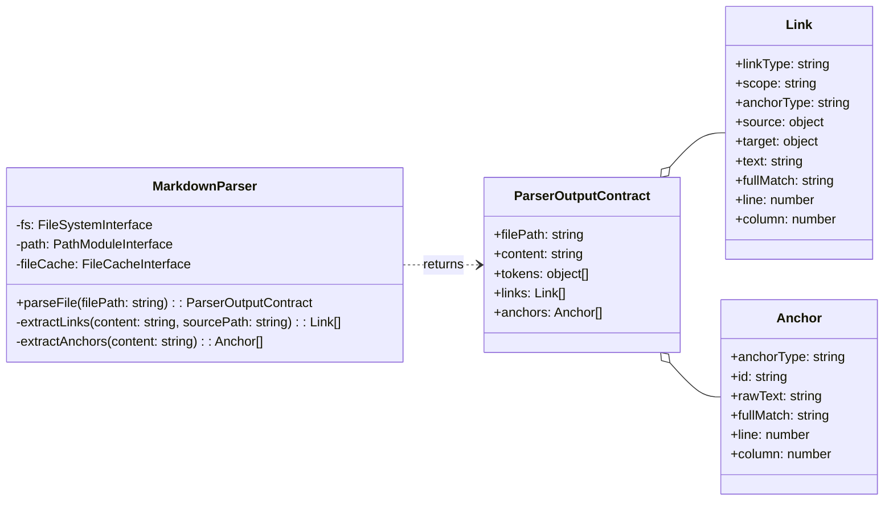

# Markdown Parser Implementation Guide

This guide provides the Level 4 (Code) details for implementing the **`MarkdownParser`** component. It includes the component's structure, pseudocode for its core logic, the formal data contracts for its output, and a strategy for testing.

## Problem

Downstream components like the `CitationValidator` and `ContentExtractor` need a structured, queryable representation of a markdown document's links and anchors. Parsing raw markdown text with regular expressions in each component would be repetitive, brittle, and inefficient. The system needs a single, reliable component to transform a raw markdown file into a consistent and explicit data model.

## Solution

The **`MarkdownParser`** component acts as a specialized transformer. It accepts a file path, reads the document, and applies a series of parsing strategies to produce a single, comprehensive **`MarkdownParser.Output.DataContract`** object. This object contains two primary collections: a list of all outgoing **`Link Objects`** and a list of all available **`Anchor Objects`**. By centralizing this parsing logic, the `MarkdownParser` provides a clean, reusable service that decouples all other components from the complexities of markdown syntax.

## Structure

The `MarkdownParser` is a class that depends on interfaces for the File System, Path Module, and the `FileCache`. It exposes a single public method, `parseFile()`, which returns the `ParserOutputContract`.



1. [**ParserOutputContract**](Markdown%20Parser%20Implementation%20Guide.md#Data%20Contracts): The composite object returned by the parser.
2. [**Link Object**](Markdown%20Parser%20Implementation%20Guide.md#Data%20Contracts): The data object representing an outgoing link.
3. [**Anchor Object**](Markdown%20Parser%20Implementation%20Guide.md#Data%20Contracts): The data object representing a potential link target.
4. **MarkdownParser**: The class that orchestrates the parsing process. The guide you are reading. The guide you are reading.

## Public Contracts

### Input Contract

The component's contract requires the following inputs for operation:
1. Interfaces for the **`FileSystem`** and **`Path Module`**, provided at instantiation.
2. An optional **`FileCache` interface**, provided at instantiation, to be used for short filename resolution.
3. A **`filePath`** (string), provided to the public `parseFile()` method.
### Output Contract
1. The `parseFile()` method returns a `Promise` that resolves with the **`MarkdownParser.Output.DataContract`**. This object represents the full structural composition of the document and is the component's sole output. Its detailed schema is defined in the [`Data Contracts`](#Data%20Contracts) section below.
## Files

- **Source**: [`tools/citation-manager/src/MarkdownParser.js`](../../src/MarkdownParser.js)
- **Tests**: [`tools/citation-manager/test/parser-output-contract.test.js`](../../test/parser-output-contract.test.js)

## Pseudocode
This pseudocode follows the **MEDIUM-IMPLEMENTATION** abstraction level, showing the core logic and integration points required for implementation.

```tsx
// The MarkdownParser class, responsible for transforming a markdown file into a structured data model.
class MarkdownParser is
  private field fileSystem
  private field pathModule
  private field fileCache

  // The constructor accepts all external dependencies, following the Dependency Abstraction principle.
  constructor MarkdownParser(fs: FileSystemInterface, path: PathModuleInterface, cache: FileCacheInterface) is
    // Integration: These dependencies are provided by the factory at runtime.
    this.fileSystem = fs
    this.pathModule = path
    this.fileCache = cache
    // ... initialization of regex patterns ...

  // The primary public method that executes the parsing workflow.
  public async method parseFile(filePath: string): ParserOutputContract is
    // Boundary: All file system reads are handled here.
    field absoluteSourcePath = this.pathModule.resolve(filePath)
    field content = this.fileSystem.readFileSync(absoluteSourcePath, "utf8")

    // Integration: Delegates low-level tokenization to the 'marked' library.
    field tokens = marked.lexer(content)

    // Calls private methods to build the high-level data collections.
    field links = this.extractLinks(content, absoluteSourcePath)
    field anchors = this.extractAnchors(content)
    
    return {
      filePath: absoluteSourcePath,
      content: content,
      tokens: tokens,
      links: links,
      anchors: anchors
    }

  // Extracts all outgoing links from the document content.
  private method extractLinks(content: string, sourcePath: string): array of Link is
    field links = new array of Link
    field lines = content.split("\n")

    foreach (line in lines with index) do
      // Pattern: Apply regex for standard markdown links: [text](path#anchor)
      // ... find all markdown link matches on the line ...
      foreach (match in markdownMatches) do
        // Decision: Resolve the path. Use FileCache for short filenames if available.
        field rawPath = match.path
        field resolvedPath = this.resolveTargetPath(rawPath, sourcePath)
        
        links.add(new Link({
          linkType: "markdown",
          scope: "cross-document", // or "internal"
          anchorType: this.determineAnchorType(match.anchor), // "header" or "block"
          source: { path: { absolute: sourcePath } },
          target: {
            path: {
              raw: rawPath,
              absolute: resolvedPath,
              relative: this.pathModule.relative(this.pathModule.dirname(sourcePath), resolvedPath)
            },
            anchor: match.anchor
          },
          // ... populate text, fullMatch, line, column ...
        }))

      // Pattern: Apply regex for wiki-style links: [[path#anchor|text]]
      // ... find all wiki link matches on the line ...
      foreach (match in wikiMatches) do
        // ... create and add wiki link objects to the links array ...
    
    return links
    
  // Extracts all potential link targets from the document content.
  private method extractAnchors(content: string): array of Anchor is
    field anchors = new array of Anchor
    field lines = content.split("\n")

    foreach (line in lines with index) do
      // Pattern: Apply regex for header anchors: ## Header Text
      if (line matches headerPattern) then
        anchors.add(new Anchor({
          anchorType: "header",
          id: this.createHeaderId(line.text), // e.g., "Header%20Text"
          rawText: line.text,
          fullMatch: line.raw,
          // ... populate line, column ...
        }))
        
      // Pattern: Apply regex for block anchors: ^block-id
      if (line contains blockPattern) then
        anchors.add(new Anchor({
          anchorType: "block",
          id: match.id,
          rawText: null,
          fullMatch: match.raw,
          // ... populate line, column ...
        }))
        
    return anchors
```

## Data Contracts

The component's output is strictly defined by the **`MarkdownParser.Output.DataContract`** JSON Schema. This is the definitive structure that all consuming components can rely on.

> [!danger] Technical Lead Note:
> - The `.headings[]` array is not used by any other source code. It is referenced in test code. It could be used to create an AST of the document.

```json
{
  "$schema": "https://json-schema.org/draft/2020-12/schema",
  "$id": "https://cc-workflows.com/parser-output.schema.json",
  "title": "MarkdownParser.Output.DataContract",
  "description": "The complete output from the MarkdownParser's parseFile() method, containing all structural information about a markdown document.",
  "type": "object",
  "properties": {
    "filePath": {
      "description": "The absolute path of the file that was parsed.",
      "type": "string"
    },
    "content": {
      "description": "The full, raw string content of the parsed file.",
      "type": "string"
    },
    "tokens": {
      "description": "An array of raw token objects from the 'marked' library's lexer. The structure is defined by the external `marked` package.",
      "type": "array",
      "items": { "type": "object" }
    },
    "links": {
      "description": "An array of all outgoing links found in the document.",
      "type": "array",
      "items": { "$ref": "#/$defs/linkObject" }
    },
    "headings": {
      "description": "An array of all headings extracted from the document structure. Could later be used to generate an artifical AST.",
      "type": "array",
      "items": { "$ref": "#/$defs/headingObject" }
    },
    "anchors": {
      "description": "An array of all available anchors (targets) defined in the document.",
      "type": "array",
      "items": { "$ref": "#/$defs/anchorObject" }
    }
  },
  "required": [ "filePath", "content", "tokens", "links", "headings", "anchors" ],
  "$defs": {
    "linkObject": {
      "title": "Link Object",
      "type": "object",
      "properties": {
        "linkType": { "type": "string", "enum": [ "markdown", "wiki" ] },
        "scope": { "type": "string", "enum": [ "internal", "cross-document" ] },
        "anchorType": { "type": ["string", "null"], "enum": [ "header", "block", null ] },
        "source": { "type": "object", "properties": { "path": { "type": "object", "properties": { "absolute": { "type": "string" } }, "required": ["absolute"] } }, "required": ["path"] },
        "target": { "type": "object", "properties": { "path": { "type": "object", "properties": { "raw": { "type": ["string", "null"] }, "absolute": { "type": ["string", "null"] }, "relative": { "type": ["string", "null"] } }, "required": ["raw", "absolute", "relative"] }, "anchor": { "type": ["string", "null"] } }, "required": ["path", "anchor"] },
        "text": { "type": ["string", "null"] },
        "fullMatch": { "type": "string" },
        "line": { "type": "integer", "minimum": 1 },
        "column": { "type": "integer", "minimum": 1 }
      },
      "required": [ "linkType", "scope", "anchorType", "source", "target", "text", "fullMatch", "line", "column" ]
    },
    "headingObject": {
      "title": "Heading Object",
      "description": "Represents a heading extracted from the document structure. Used by the CLI 'ast' command for document structure analysis and available for future content aggregation features.",
      "type": "object",
      "properties": {
        "level": { "type": "integer", "minimum": 1, "maximum": 6, "description": "Heading depth (1-6)" },
        "text": { "type": "string", "description": "Heading text content" },
        "raw": { "type": "string", "description": "Raw markdown including # symbols" }
      },
      "required": [ "level", "text", "raw" ]
    },
    "anchorObject": {
      "title": "Anchor Object",
      "type": "object",
      "properties": {
        "anchorType": { "type": "string", "enum": [ "header", "block" ] },
        "id": { "type": "string" },
        "rawText": { "type": ["string", "null"] },
        "fullMatch": { "type": "string" },
        "line": { "type": "integer", "minimum": 1 },
        "column": { "type": "integer", "minimum": 1 }
      },
      "required": [ "anchorType", "id", "rawText", "fullMatch", "line", "column" ]
    }
  }
}
```

### ParserOutputContract Example

```json
{
  "filePath": "/project/tools/citation-manager/test/fixtures/enhanced-citations.md",
  "content": "# Enhanced Citations Test File\n\nThis file tests new citation patterns...\n...",
  "tokens": [
    {
      "type": "heading",
      "depth": 1,
      "text": "Enhanced Citations Test File",
      "raw": "# Enhanced Citations Test File"
    }
  ],
  "links": [
    {
      "linkType": "markdown",
      "scope": "cross-document",
      "anchorType": "header",
      "source": {
        "path": {
          "absolute": "/project/tools/citation-manager/test/fixtures/enhanced-citations.md"
        }
      },
      "target": {
        "path": {
          "raw": "test-target.md",
          "absolute": "/project/tools/citation-manager/test/fixtures/test-target.md",
          "relative": "test-target.md"
        },
        "anchor": "auth-service"
      },
      "text": "Component Details",
      "fullMatch": "[Component Details](test-target.md#auth-service)",
      "line": 5,
      "column": 3
    },
    {
      "linkType": "markdown",
      "scope": "cross-document",
      "anchorType": null,
      "source": {
        "path": {
          "absolute": "/project/tools/citation-manager/test/fixtures/enhanced-citations.md"
        }
      },
      "target": {
        "path": {
          "raw": "test-target.md",
          "absolute": "/project/tools/citation-manager/test/fixtures/test-target.md",
          "relative": "test-target.md"
        },
        "anchor": null
      },
      "text": "Implementation Guide",
      "fullMatch": "[Implementation Guide](test-target.md)",
      "line": 11,
      "column": 3
    }
  ],
  "headings": [
    {
      "level": 1,
      "text": "Enhanced Citations Test File",
      "raw": "# Enhanced Citations Test File"
    },
    {
      "level": 2,
      "text": "Caret References",
      "raw": "## Caret References"
    },
    {
      "level": 3,
      "text": "Auth Service",
      "raw": "### Auth Service {#auth-service}"
    }
  ],
  "anchors": [
    {
      "anchorType": "header",
      "id": "Caret%20References",
      "rawText": "Caret References",
      "fullMatch": "## Caret References",
      "line": 26,
      "column": 1
    },
    {
      "anchorType": "block",
      "id": "FR1",
      "rawText": null,
      "fullMatch": "^FR1",
      "line": 28,
      "column": 26
    },
    {
      "anchorType": "header",
      "id": "auth-service",
      "rawText": "Auth Service",
      "fullMatch": "### Auth Service {#auth-service}",
      "line": 32,
      "column": 1
    }
  ]
}
```

## Testing Strategy

Tests for the `MarkdownParser` should validate its ability to correctly transform markdown into the `MarkdownParser.Output.DataContract`.

```tsx
// Test pattern: BDD-style behavioral validation.
class MarkdownParserTests is

  // Test that all link syntaxes are correctly identified and parsed.
 method test_linkExtraction_shouldParseAllLinkTypes(): TestResult is
   // Given: A markdown document with a mix of 'markdown' and 'wiki' style links on specific lines.
   // When: The parser's 'parseFile()' method is called on the document.
   // Then: The returned 'links' array should contain correctly structured Link Objects, and a spot-check of the 'line' and 'column' numbers for a known link confirms positional accuracy.
   // Validation: Check 'linkType', 'scope', and the 'line' and 'column' for one or two examples.
  
  // Test that all anchor syntaxes are correctly identified.
  method test_anchorExtraction_shouldParseAllAnchorTypes(): TestResult is
    // Given: A document with 'header' anchors (including those with markdown) and 'block' anchors (^).
    // When: The parser's 'parseFile()' method is called.
    // Then: The returned 'anchors' array should contain correctly structured Anchor Objects for each syntax.
    // Validation: Check the 'anchorType', 'id', and 'rawText' fields.
    
  // Test the integration with the FileCache for path resolution.
  method test_pathResolution_shouldUseFileCacheForShortFilenames(): TestResult is
    // Given: A link with a short filename (e.g., 'guide.md') and a pre-populated FileCache.
    // When: 'parseFile()' is called.
    // Then: The resulting Link Object's 'target.path.absolute' field should contain the correct absolute path resolved from the cache.
    // Boundary: Verifies the interaction between the Parser and the FileCache dependency.
    
 // Test that all source and target path variations are correctly resolved and calculated.
 method test_pathResolution_should_Correctly_Populate_All_Paths(): TestResult is
   // Given: A fixture directory with files in the root, a subdirectory, and a parent directory.
   // When: The parser is run on a source file containing links to targets in each of these locations.
   // Then: The resulting Link Objects must have correctly populated path properties for all scenarios:
   //
   //   - The 'source.path.absolute' field must always be the correct absolute path of the file being parsed.
   //   - The 'target.path.raw' field must exactly match the path string from the markdown link.
   //   - The 'target.path.absolute' field must be correctly resolved for links pointing to the same directory, a subdirectory, and a parent directory.
   //   - The 'target.path.relative' field must be the correctly calculated relative path between the source and target.
   //   - For a link pointing to a non-existent file, the 'target.path.absolute' and 'target.path.relative' fields should be null.
   //
   // Validation: Create a test fixture for each scenario and assert the values of all four path fields in the resulting Link Object.
```

---

## Whiteboard

### MarkdownParser.Output.DataContract: How Tokens, Links, and Anchors Are Populated

**Key Question**: How does the MarkdownParser.Output.DataContract get its data? Which code is responsible for each array?

**Answer**: MarkdownParser uses a **two-layer parsing approach** - standard markdown parsing via marked.js, plus custom regex extraction for Obsidian-specific syntax.

#### Layer 1: Standard Markdown Parsing (marked.js)

**Code Location**: `MarkdownParser.parseFile()` lines 23-36

```javascript
async parseFile(filePath) {
  this.currentSourcePath = filePath;
  const content = this.fs.readFileSync(filePath, "utf8");
  const tokens = marked.lexer(content);  // ← marked.js creates tokens array

  return {
    filePath,
    content,
    tokens,        // ← From marked.js (standard markdown AST)
    links: this.extractLinks(content),     // ← Custom extraction (see Layer 2)
    headings: this.extractHeadings(tokens), // ← Walks tokens array
    anchors: this.extractAnchors(content)  // ← Custom extraction (see Layer 2)
  };
}
```

**What `marked.lexer(content)` creates**:
- Hierarchical token tree for standard markdown elements
- Token types: `heading`, `paragraph`, `list`, `list_item`, `blockquote`, `code`, etc.
- Each token has: `type`, `raw`, `text`, and often nested `tokens` array
- **Does NOT parse** Obsidian-specific syntax like `^anchor-id` or `[[wikilinks]]`

**Tokens used by**:
- `extractHeadings()` - Walks tokens recursively to extract heading metadata
- Epic 2 Section Extraction POC - Walks tokens to find section boundaries
- Future ContentExtractor component

#### Layer 2: Custom Regex Parsing (Obsidian Extensions)

##### Links Array Population

**Code Location**: `extractLinks(content)` lines 38-291

**Method**: Line-by-line regex parsing on raw content string

**Link patterns extracted**:
1. **Cross-document markdown links**: `[text](file.md#anchor)` (line 45)
2. **Citation format**: `[cite: path]` (line 87)
3. **Relative path links**: `[text](path/to/file#anchor)` (line 128)
4. **Wiki-style cross-document**: `[[file.md#anchor|text]]` (line 177)
5. **Wiki-style internal**: `[[#anchor|text]]` (line 219)
6. **Caret syntax references**: `^anchor-id` (line 255)

**Output**: LinkObject schema with:

```javascript
{
  linkType: "markdown" | "wiki",
  scope: "cross-document" | "internal",
  anchorType: "header" | "block" | null,
  source: { path: { absolute } },
  target: {
    path: { raw, absolute, relative },
    anchor: string | null
  },
  text: string,
  fullMatch: string,
  line: number,
  column: number
}
```

##### Anchors Array Population

**Code Location**: `extractAnchors(content)` lines 345-450

**Method**: Line-by-line regex parsing on raw content string

**Anchor patterns extracted**:

1. **Obsidian block references** (lines 350-363):
   - Pattern: `^anchor-id` at END of line
   - Example: `Some content ^my-anchor`
   - Regex: `/\^([a-zA-Z0-9\-_]+)$/`

2. **Caret syntax** (lines 365-382):
   - Pattern: `^anchor-id` anywhere in line (legacy)
   - Regex: `/\^([A-Za-z0-9-]+)/g`

3. **Emphasis-marked anchors** (lines 384-397):
   - Pattern: `==**text**==`
   - Creates anchor with ID `==**text**==`
   - Regex: `/==\*\*([^*]+)\*\*==/g`

4. **Header anchors** (lines 399-446):
   - Pattern: `# Heading` or `# Heading {#custom-id}`
   - Uses raw heading text as anchor ID
   - Also creates Obsidian-compatible anchor (removes colons, URL-encodes spaces)
   - Regex: `/^(#+)\s+(.+)$/`

**Output**: AnchorObject schema with:

```javascript
{
  anchorType: "block" | "header",
  id: string,           // The anchor identifier
  rawText: string | null, // Text content (for headers/emphasis)
  fullMatch: string,    // Full matched pattern
  line: number,         // 1-based line number
  column: number        // 0-based column position
}
```

#### Why Two Layers?

**marked.js handles**:
- ✅ Standard markdown syntax (CommonMark spec)
- ✅ Hierarchical token tree structure
- ✅ Performance-optimized parsing

**Custom regex handles**:
- ✅ Obsidian-specific extensions (`^anchor-id`, `[[wikilinks]]`)
- ✅ Citation manager custom syntax (`[cite: path]`)
- ✅ Line/column position metadata for error reporting
- ✅ Path resolution (absolute/relative) via filesystem

#### Epic 2 Content Extraction: Which Layer?

**Section Extraction** (headings):
- Uses **Layer 1** (tokens array)
- Algorithm: Walk tokens to find heading, collect tokens until next same-or-higher level
- POC: `tools/citation-manager/test/poc-section-extraction.test.js`

**Block Extraction** (`^anchor-id`):
- Uses **Layer 2** (anchors array)
- Algorithm: Find anchor by ID, use `line` number to extract content from raw string
- POC: `tools/citation-manager/test/poc-block-extraction.test.js`

**Full File Extraction**:
- Uses **both layers** (content string + metadata from tokens/anchors)
- Algorithm: Return entire `content` field with metadata from parser output

#### Viewing MarkdownParser.Output.DataContract

To see the complete JSON structure for any file:

```bash
npm run citation:ast <file-path> 2>/dev/null | npx @biomejs/biome format --stdin-file-path=output.json
```

Example output saved at: `tools/citation-manager/design-docs/features/20251003-content-aggregation/prd-parser-output-contract.json`

**Structure**:

```json
{
  "filePath": "/absolute/path/to/file.md",
  "content": "# Full markdown content as string...",
  "tokens": [
    {
      "type": "heading",
      "depth": 1,
      "text": "Citation Manager",
      "raw": "# Citation Manager\n\n",
      "tokens": [...]
    },
    // ... more tokens
  ],
  "links": [
    {
      "linkType": "markdown",
      "scope": "cross-document",
      "anchorType": "header",
      "source": { "path": { "absolute": "..." } },
      "target": {
        "path": { "raw": "guide.md", "absolute": "...", "relative": "..." },
        "anchor": "Installation"
      },
      // ... more fields
    }
    // ... more links
  ],
  "headings": [
    { "level": 1, "text": "Citation Manager", "raw": "# Citation Manager\n\n" }
    // ... more headings
  ],
  "anchors": [
    {
      "anchorType": "block",
      "id": "FR2",
      "rawText": null,
      "fullMatch": "^FR2",
      "line": 64,
      "column": 103
    },
    {
      "anchorType": "header",
      "id": "Requirements",
      "rawText": "Requirements",
      "fullMatch": "## Requirements",
      "line": 61,
      "column": 0
    }
    // ... more anchors
  ]
}
```

**Research Date**: 2025-10-07
**POC Validation**: Section extraction (7/7 tests) + Block extraction (9/9 tests) = 100% success rate
**Epic 2 Readiness**: ContentExtractor implementation can proceed with validated data contracts

## Technical Debt

### Issue 1: Duplicate Parsing - Parse Twice, Use Once

**Current Problem** (extractLinks() lines 104-357):
- `marked.lexer()` creates tokens with `type: "link"` objects containing `href`, `text`, `raw`
- Code **ignores** these link tokens and re-parses entire content line-by-line with 6 different regex patterns
- Result: Parse twice, O(n×patterns) complexity instead of O(n)

**Evidence**:

```javascript
// Test proves marked.js extracts links:
const tokens = marked.lexer('[Link text](file.md#anchor)');
// Returns: { type: "link", href: "file.md#anchor", text: "Link text", raw: "..." }
```

**Markdownlint Pattern** (verified in /Users/wesleyfrederick/Documents/ObsidianVault/0_SoftwareDevelopment/markdownlint/lib/md051.mjs):

```javascript
// Line 113: Filter tokens by type, no regex
const links = filterByTypesCached([ "link" ])
  .filter(link => !((link.parent?.type === "atxHeadingText")));
```

### Issue 2: Header Anchor Redundancy

**Current Problem** (extractAnchors() lines 494-540):
- Re-scans content with regex `/^(#+)\s+(.+)$/` to find headings
- But `extractHeadings(tokens)` already walked tokens and extracted headings at line 81
- Could derive header anchors from existing `headings` array instead of re-parsing

**Justified Regex** (extractAnchors() lines 446-491):
- Block anchors (`^block-id`, `==**text**==`) correctly use regex
- These are Obsidian-specific, not in CommonMark/GFM
- Neither marked.js nor micromark parse these patterns

### Issue 3: Link Pattern Duplication

**Current Problem** (extractLinks() lines 109-353):
- 6 link patterns each construct nearly identical link objects (127+ lines each)
- Massive code duplication for: path resolution, link classification, object construction
- Only differences: regex pattern and 2-3 classification fields

**Solution**: Link pattern registry with shared factory function

Recommendation: Refine the Hybrid

  The current implementation could be more strategic about which layer handles what:

  | Pattern                             | Current      | Better Approach    | Reasoning                           |
  |-------------------------------------|--------------|--------------------|-------------------------------------|
  | Standard markdown links \[text\](url) | Regex        | walkTokens         | Already in AST as type: "link"      |
  | Headings ## Title                   | walkTokens ✅ | walkTokens ✅       | Structural element                  |
  | Header anchors                      | Regex        | walkTokens         | Derive from heading tokens          |
  | Wiki links \[\[page\]\]                 | Regex        | Regex OR extension | Not standard markdown               |
  | Block refs ^id                      | Regex ✅      | Regex ✅            | Line-specific, EOL position matters |
  | Citation syntax                     | Regex        | Extension          | Could be formalized                 |

  Concrete Improvement

  Current code extracts standard markdown links with regex:
  // extractLinks() line 45
  const markdownLinkPattern = /\[([^\]]+)\]\(([^)]+)\)/g;

  But marked.js already parsed these!

  // More efficient: extract from existing tokens
  function extractLinksFromTokens(tokens) {
    const links = [];
    marked.walkTokens(tokens, (token) => {
      if (token.type === 'link') {
        links.push({
          linkType: 'markdown',
          target: { path: { raw: token.href }, anchor: extractAnchor(token.href) },
          text: token.text,
          // ... but line/column are harder to get
        });
      }
    });
    return links;
  }

  The line/column problem is the real challenge with pure walkTokens.

  My Recommendation

  Keep the hybrid, but refactor to this principle:

  If marked.js naturally parses it AND you don't need precise line/column → use walkTokensIf it's Obsidian-specific OR needs line/column positions → use regex

---

## Legacy Technical Debt Documentation

### Performance: Double-Parse Anti-Pattern

**Problem**: Current implementation parses content twice with wasted effort.

**Evidence**:
1. Line 74: `marked.lexer(content)` creates full token tree with structured link tokens
2. Lines 104-357: `extractLinks()` ignores tokens, re-scans entire content with regex
3. Lines 439-543: `extractAnchors()` ignores heading tokens, re-scans content with regex

**Proof that marked.js provides link tokens** (validated 2025-10-09):

```javascript
marked.lexer('[Link text](file.md#anchor)') produces:
{
  type: "link",
  href: "file.md#anchor",    // ← Full path + anchor already parsed
  text: "Link text",          // ← Display text
  raw: "[Link text](file.md#anchor)"
}
```

**Current cost**:
- Parse markdown: O(n) via marked.lexer
- Re-parse with 6 regex patterns: O(n×6) line-by-line scans
- Total: ~7× parsing overhead for standard markdown links

**Industry pattern (markdownlint MD051)**:

```javascript
// Extract links by filtering tokens, not regex
const links = filterByTypesCached(["link"])
for (const link of links) {
  const href = filterByTypes(link.children, ["resourceDestinationString"])
  // Line/column already in token: link.startLine, link.startColumn
}
```

**Recommendation**: Refactor to token-first extraction:
- Extract standard markdown links from `marked.lexer()` tokens (eliminates 4/6 regex patterns)
- Keep regex ONLY for Obsidian-specific syntax (`^anchor`, `[[wikilinks]]`) not in CommonMark
- Header anchors should derive from existing heading tokens, not re-parse

### Code Duplication: Link Object Construction

**Problem**: Six regex patterns (lines 111-353) construct nearly identical link objects with 127-38 lines each.

**Duplication**:
- Path resolution logic: Repeated 6 times
- Link object structure: Repeated 6 times
- Only differences: regex pattern + 2-3 classification fields (`linkType`, `scope`, `anchorType`)

**Recommendation**: Extract to pattern registry + factory:

```javascript
const linkPatterns = [
  { regex: /\[([^\]]+)\]\(([^)#]+\.md)(#([^)]+))?\)/g,
    classify: (match) => ({ linkType: "markdown", scope: "cross-document", ... }) },
  // ... other patterns
];

function createLinkObject(match, classification, sourcePath) {
  // Single implementation of path resolution + object construction
}
```

### Unused Infrastructure: headings Array

**Problem**: `headings` array extracted from tokens but never consumed by production code.

**Evidence**:
- Only referenced in test files (`parser-output-contract.test.js`, `parsed-file-cache.test.js`)
- CLI `ast` command dumps it but doesn't use it
- Documentation claims "available for future content aggregation" - speculative infrastructure

**Cost**: Extra token tree walk on every parse for unused data.

**Recommendation**: Remove from output contract or document concrete planned consumer.

---

## Markdownlint Approach

Markdownlint does not primarily rely on whole-file regex or naive line-by-line scans; it parses Markdown once into a structured token stream and a lines array, then runs rules over those structures. Regex is used selectively for small, local checks, while most logic is token-based and linear-time over the parsed representation.

### Parsing model
- The core parse is done once per file/string and produces a micromark token stream plus an array of raw lines, which are then shared with every rule.
- Built-in rules operate on micromark tokens; custom rules can choose micromark, markdown-it, or a text-only mode if they really want to work directly on lines.
- Front matter is stripped via a start-of-file match and HTML comments are interpreted for inline enable/disable, reducing the effective content that rules must consider.

### How rules match
- A rule’s function receives both tokens and the original lines and typically iterates tokens to identify semantic structures like headings, lists, links, and code fences.
- For formatting checks that are inherently textual (for example trailing spaces or line length), rules iterate the lines array and may apply small, targeted regex on a single line or substring.
- Violations are reported via a callback with precise line/column and optional fix info, so rules avoid global regex sweeps and focus only on the minimal spans they need.

### Regex vs tokens
- Token-driven checks dominate because they’re resilient to Markdown edge cases and avoid brittle, backtracking-heavy regex across the whole document.
- Regex is used as a tactical tool for localized patterns (e.g., trimming whitespace, counting spaces, or validating a fragment) rather than as the primary parsing mechanism.
- This hybrid keeps rules simple and fast: structure from tokens, micro-patterns from small regex where appropriate.

### Large content handling
- The single-parse-per-file design means the Markdown is parsed once and reused, preventing N× reparsing as the number of rules grows.
- Most built-in rules are O(n) in the size of the token stream or the number of lines, and many short-circuit early within a line or token subtree to minimize work.
- Inline configuration and front matter exclusion reduce the effective scan area, and costly rules (like line-length over code/table regions) can be tuned or disabled to cap worst-case work.

### Practical implications
- For big documents and repos, parsing once and sharing tokens keeps total runtime closer to linear in input size, even with many rules.
- Prefer writing custom rules against tokens to avoid reinventing Markdown parsing and to keep checks robust across edge cases.
- Use line-based or small regex only where semantics aren’t needed, keeping scans local to a line or token’s text to preserve performance.

1. [https://github.com/markdown-it/markdown-it/issues/68](https://github.com/markdown-it/markdown-it/issues/68)
2. [https://markdown-it-py.readthedocs.io/en/latest/api/markdown_it.token.html](https://markdown-it-py.readthedocs.io/en/latest/api/markdown_it.token.html)
3. [https://markdown-it.github.io/markdown-it/](https://markdown-it.github.io/markdown-it/)
4. [https://markdown-it-py.readthedocs.io/en/latest/using.html](https://markdown-it-py.readthedocs.io/en/latest/using.html)
5. [https://stackoverflow.com/questions/68934462/customize-markdown-parsing-in-markdown-it](https://stackoverflow.com/questions/68934462/customize-markdown-parsing-in-markdown-it)
6. [https://dlaa.me/blog/post/markdownlintfixinfo](https://dlaa.me/blog/post/markdownlintfixinfo)
7. [https://classic.yarnpkg.com/en/package/markdownlint-rule-helpers](https://classic.yarnpkg.com/en/package/markdownlint-rule-helpers)
8. [https://stackoverflow.com/questions/63989663/render-tokens-in-markdown-it](https://stackoverflow.com/questions/63989663/render-tokens-in-markdown-it)
9. [https://app.renovatebot.com/package-diff?name=markdownlint&from=0.31.0&to=0.31.1](https://app.renovatebot.com/package-diff?name=markdownlint&from=0.31.0&to=0.31.1)
10. [https://www.varac.net/docs/markup/markdown/linting-formatting.html](https://www.varac.net/docs/markup/markdown/linting-formatting.html)
11. [https://community.openai.com/t/markdown-is-15-more-token-efficient-than-json/841742](https://community.openai.com/t/markdown-is-15-more-token-efficient-than-json/841742)
12. [https://jackdewinter.github.io/2020/05/11/markdown-linter-rules-the-first-three/](https://jackdewinter.github.io/2020/05/11/markdown-linter-rules-the-first-three/)
13. [https://qmacro.org/blog/posts/2021/05/13/notes-on-markdown-linting-part-1/](https://qmacro.org/blog/posts/2021/05/13/notes-on-markdown-linting-part-1/)
14. [https://discourse.joplinapp.org/t/help-with-markdown-it-link-rendering/8143](https://discourse.joplinapp.org/t/help-with-markdown-it-link-rendering/8143)
15. [https://git.theoludwig.fr/theoludwig/markdownlint-rule-relative-links/compare/v2.3.0...v2.3.2?style=unified&whitespace=ignore-all&show-outdated=](https://git.theoludwig.fr/theoludwig/markdownlint-rule-relative-links/compare/v2.3.0...v2.3.2?style=unified&whitespace=ignore-all&show-outdated=)
16. [https://archlinux.org/packages/extra/any/markdownlint-cli2/files/](https://archlinux.org/packages/extra/any/markdownlint-cli2/files/)
17. [https://jackdewinter.github.io/2021/07/26/markdown-linter-getting-back-to-new-rules/](https://jackdewinter.github.io/2021/07/26/markdown-linter-getting-back-to-new-rules/)
18. [https://github.com/DavidAnson/markdownlint/issues/762](https://github.com/DavidAnson/markdownlint/issues/762)
19. [http://xiangxing98.github.io/Markdownlint_Rules.html](http://xiangxing98.github.io/Markdownlint_Rules.html)
20. [https://pypi.org/project/pymarkdownlnt/](https://pypi.org/project/pymarkdownlnt/)

---
## Micromark 3rd Party Obsidian Extensions
Yes—micromark has third‑party extensions that implement Obsidian‑flavored Markdown features such as wikilinks, embeds, tags, and callouts, though they are community packages rather than official Obsidian modules. Examples include the @moritzrs “OFM” family (ofm, ofm‑wikilink, ofm‑tag, ofm‑callout) and a general wiki‑link extension that can be adapted for Obsidian‑style links.[npmjs+3](https://www.npmjs.com/package/@moritzrs%2Fmicromark-extension-ofm-wikilink)

### Available extensions

- @moritzrs/micromark-extension-ofm-wikilink adds Obsidian‑style [[wikilinks]] and media embeds, with corresponding HTML serialization helpers.[npmjs](https://www.npmjs.com/package/@moritzrs%2Fmicromark-extension-ofm-wikilink)

- @moritzrs/micromark-extension-ofm-callout implements Obsidian‑style callouts so blocks beginning with [!type] parse as callouts in micromark flows.[packages.ecosyste](https://packages.ecosyste.ms/registries/npmjs.org/keywords/micromark-extension)

- Bundled “OFM” packages and other Obsidian‑focused extension sets exist, such as @moritzrs/micromark-extension-ofm and @goonco/micromark-extension-ofm, to cover broader Obsidian syntax in one place.[libraries+1](https://libraries.io/npm/@goonco%2Fmicromark-extension-ofm)

### What they cover

- Obsidian callouts use a [!type] marker at the start of a blockquote (for example, [!info]) and these extensions aim to parse that syntax so it can be transformed or rendered outside Obsidian.[obsidian+1](https://help.obsidian.md/callouts)

- There is also a general micromark wiki‑link extension for [[Wiki Links]] that can be configured (alias divider, permalink resolution) and used where pure Obsidian semantics aren’t required.[github](https://github.com/landakram/micromark-extension-wiki-link)

- Some remark plugins add Obsidian‑style callouts by registering micromark syntax under the hood, demonstrating the typical integration path in unified/remark ecosystems.[github](https://github.com/rk-terence/gz-remark-callout)

### Integration tips

- These packages expose micromark syntax and HTML extensions that are passed via the micromark options (extensions/htmlExtensions) during parsing and serialization.[github+1](https://github.com/landakram/micromark-extension-wiki-link)

- For AST work, pair micromark syntax with matching mdast utilities like @moritzrs/mdast-util-ofm-wikilink (via mdast‑util‑from‑markdown) or use higher‑level wrappers such as “remark‑ofm” referenced by the OFM packages.[npmjs+1](https://www.npmjs.com/package/@moritzrs%2Fmdast-util-ofm-wikilink)

- When targeting full Obsidian coverage, prefer the curated OFM bundles and selectively enable features needed for wikilinks, tags, callouts, and related behaviors to match Obsidian’s documented syntax.[packages.ecosyste+1](https://packages.ecosyste.ms/registries/npmjs.org/keywords/micromark-extension)

1. [https://www.npmjs.com/package/@moritzrs%2Fmicromark-extension-ofm-wikilink](https://www.npmjs.com/package/@moritzrs%2Fmicromark-extension-ofm-wikilink)
2. [https://packages.ecosyste.ms/registries/npmjs.org/keywords/micromark-extension](https://packages.ecosyste.ms/registries/npmjs.org/keywords/micromark-extension)
3. [https://github.com/landakram/micromark-extension-wiki-link](https://github.com/landakram/micromark-extension-wiki-link)
4. [https://libraries.io/npm/@goonco%2Fmicromark-extension-ofm](https://libraries.io/npm/@goonco%2Fmicromark-extension-ofm)
5. [https://help.obsidian.md/callouts](https://help.obsidian.md/callouts)
6. [https://github.com/rk-terence/gz-remark-callout](https://github.com/rk-terence/gz-remark-callout)
7. [https://www.npmjs.com/package/@moritzrs%2Fmdast-util-ofm-wikilink](https://www.npmjs.com/package/@moritzrs%2Fmdast-util-ofm-wikilink)
8. [https://www.npmjs.com/package/@moritzrs%2Fmicromark-extension-ofm-tag](https://www.npmjs.com/package/@moritzrs%2Fmicromark-extension-ofm-tag)
9. [https://jsr.io/@jooooock/obsidian-markdown-parser](https://jsr.io/@jooooock/obsidian-markdown-parser)
10. [https://libraries.io/npm/@moritzrs%2Fmicromark-extension-ofm-wikilink](https://libraries.io/npm/@moritzrs%2Fmicromark-extension-ofm-wikilink)
11. [https://codesandbox.io/examples/package/micromark-extension-wiki-link](https://codesandbox.io/examples/package/micromark-extension-wiki-link)
12. [https://pdworkman.com/obsidian-callouts/](https://pdworkman.com/obsidian-callouts/)
13. [https://www.moritzjung.dev/obsidian-stats/plugins/qatt/](https://www.moritzjung.dev/obsidian-stats/plugins/qatt/)
14. [https://unifiedjs.com/explore/package/remark-wiki-link/](https://unifiedjs.com/explore/package/remark-wiki-link/)
15. [https://www.youtube.com/watch?v=tSSc42tCVto](https://www.youtube.com/watch?v=tSSc42tCVto)
16. [https://www.moritzjung.dev/obsidian-stats/plugins/md-image-caption/](https://www.moritzjung.dev/obsidian-stats/plugins/md-image-caption/)
17. [https://cdn.jsdelivr.net/npm/micromark-extension-wiki-link@0.0.4/dist/](https://cdn.jsdelivr.net/npm/micromark-extension-wiki-link@0.0.4/dist/)
18. [https://forum.inkdrop.app/t/backlinks-roam-obsidian/1928](https://forum.inkdrop.app/t/backlinks-roam-obsidian/1928)
19. [https://www.youtube.com/watch?v=sdVNiSQcMv0](https://www.youtube.com/watch?v=sdVNiSQcMv0)
20. [https://forum.inkdrop.app/t/different-checkbox-types/3237](https://forum.inkdrop.app/t/different-checkbox-types/3237)
