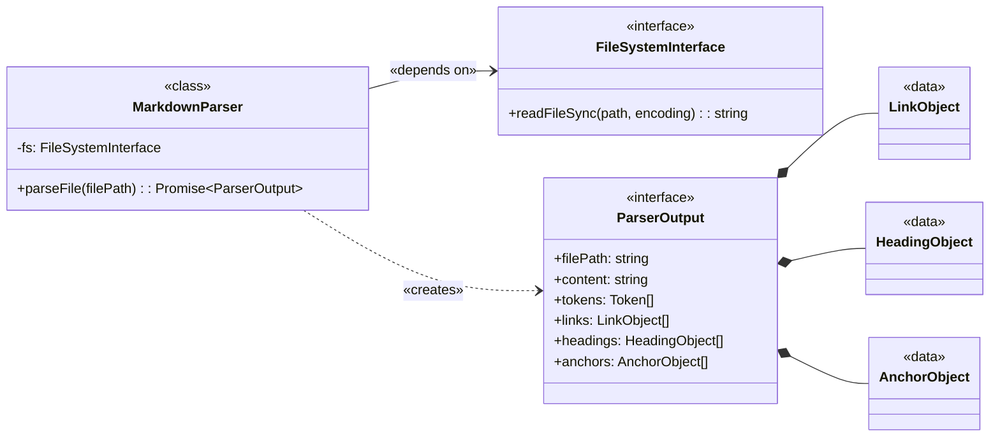
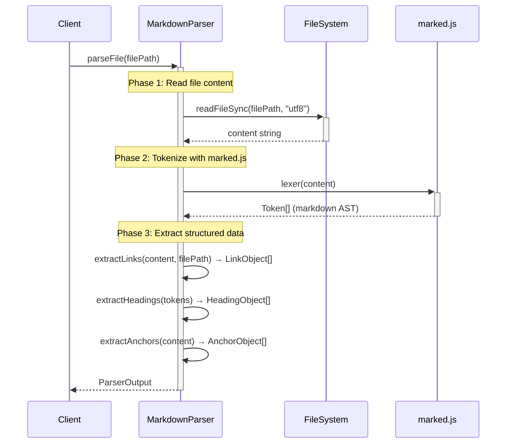

# Markdown Parser Implementation Guide

## Overview
Parses markdown files into structured objects containing outgoing links and header/anchors for consumption by downstream components.

### Problem
1. Downstream components like [**`CitationValidator`**](../ARCHITECTURE-Citation-Manager.md#Citation%20Manager.Citation%20Validator) and [**`ContentExtractor`**](../ARCHITECTURE-Citation-Manager.md#Citation%20Manager.ContentExtractor) need a structured, queryable representation of a markdown document's links and anchors. ^P1
2. Parsing raw markdown text with regular expressions in each component would be repetitive, brittle, and inefficient. ^P2
3. The system needs a single, reliable component to transform a raw markdown file into a consistent and explicit data model. ^P3

### Solution
The [**`MarkdownParser`**](../ARCHITECTURE-Citation-Manager.md#Citation%20Manager.Markdown%20Parser) component provides centralized markdown parsing by:
1. accepting a file path, reading the document, and applying parsing strategies to produce a comprehensive [**`ParserOutput`**](Markdown%20Parser%20Implementation%20Guide.md#ParserOutput%20Interface) object ^S1
2. wrapping output in the [**`ParsedDocument`**](../ARCHITECTURE-Citation-Manager.md#Citation%20Manager.ParsedDocument) facade before consumption, decoupling consumers from parser internals ([P1](#^P1)) ^S2
3. producing two primary collections: [**`LinkObject[]`**](Markdown%20Parser%20Implementation%20Guide.md#LinkObject%20Interface) and [**`AnchorObject[]`**](Markdown%20Parser%20Implementation%20Guide.md#AnchorObject%20Type%20(Discriminated%20Union)), centralizing parsing logic and eliminating regex duplication ([P2](#^P2), [P3](#^P3)) ^S3

### Impact

| Problem ID | Problem | Solution ID | Solution | Impact | Principles | How Principle Applies |
| :--------: | ------- | :---------: | -------- | ------ | ---------- | --------------------- |
| [P1](#^P1) | Components need structured representation | [S1](#^S1), [S2](#^S2) | Single parse with comprehensive [**`ParserOutput`**](Markdown%20Parser%20Implementation%20Guide.md#ParserOutput%20Interface) + facade wrapping | Fewer errors navigating data; stable consumer interface | [Data Model First](../../../../../cc-workflows-site/design-docs/Architecture%20Principles.md#^data-model-first) | Clean data structures lead to clean code; structured output prevents navigation errors |
| [P2](#^P2) | Regex duplication across components | [S3](#^S3) | Centralized link/anchor extraction | 100% reduction in duplicated parsing logic (0 regex per consumer vs N) | [Single Responsibility](../../../../../cc-workflows-site/design-docs/Architecture%20Principles.md#^single-responsibility) | Parser parses; consumers consume - each component has one clear concern |
| [P3](#^P3) | No reliable transformer | [S1](#^S1) | DI-enabled [**`MarkdownParser`**](../ARCHITECTURE-Citation-Manager.md#Citation%20Manager.Markdown%20Parser) class | Flexible testing (mock fs for unit, real fs for integration) | [Dependency Abstraction](../../../../../cc-workflows-site/design-docs/Architecture%20Principles.md#^dependency-abstraction) | Depend on FileSystemInterface abstraction, not concrete node:fs |
| [P1](#^P1) | Type safety for anchors | [S3](#^S3) | TypeScript discriminated unions ([**`AnchorObject`**](Markdown%20Parser%20Implementation%20Guide.md#AnchorObject%20Type%20(Discriminated%20Union))) | Impossible to represent invalid anchor states | [Illegal States Unrepresentable](../../../../../cc-workflows-site/design-docs/Architecture%20Principles.md#^illegal-states-unrepresentable) | Header vs block enforced at type level; invalid combinations cannot compile |

### Boundaries

The component is exclusively responsible for transforming a raw markdown string into the structured **MarkdownParser.Output.DataContract**. Its responsibilities are strictly limited to syntactic analysis. The component is **not** aware of the `ParsedDocument` facade that wraps its output. The component is **not** responsible for:
- Validating the existence or accessibility of file paths.
- Verifying the semantic correctness of links or anchors.
- Interpreting or executing any code within the document.

---

## Structure

### Class Diagram

[**`MarkdownParser`**](../ARCHITECTURE-Citation-Manager.md#Citation%20Manager.Markdown%20Parser) depends on [**`FileSystemInterface`**](#FileSystemInterface) for file I/O. It exposes a single public method, [`parseFile()`](#`MarkdownParser.parseFile()`%20Sequence%20Diagram) , which returns the [**`ParserOutput`**](#ParserOutput%20Interface)interface.



1. [**`ParserOutput`**](Markdown%20Parser%20Implementation%20Guide.md#Data%20Contracts): The composite object returned by the parser.
2. [**``LinkObject``**](#LinkObject%20Interface): The data object representing an outgoing link.
3. [**`AnchorObject`**](#AnchorObject%20Type%20(Discriminated%20Union)): The data object representing a potential link target.
4. [**`CitationManager.MarkdownParser`**](../ARCHITECTURE-Citation-Manager.md#Citation%20Manager.Markdown%20Parser): The class that orchestrates the parsing process. The guide you are reading.

---
### File Structure

```text
tools/citation-manager/
├── src/
│   ├── MarkdownParser.ts                              // TypeScript implementation
│   │   ├── FileSystemInterface                        // Dependency injection interface
│   │   ├── parseFile()                                // Main orchestrator → ParserOutput
│   │   ├── extractLinks()                             // Link extraction → LinkObject[]
│   │   ├── extractAnchors()                           // Anchor extraction → AnchorObject[]
│   │   ├── extractHeadings()                          // Heading extraction → HeadingObject[]
│   │   └── helpers                                    // Inline helper methods
│   │       ├── determineAnchorType()                  // Anchor type classification
│   │       ├── resolvePath()                          // Path resolution
│   │       ├── _detectExtractionMarker()              // Extraction marker detection
│   │       ├── containsMarkdown()                     // Markdown pattern detection
│   │       └── toKebabCase()                          // String formatting
│   │
│   ├── types/
│   │   ├── citationTypes.ts                           // Parser output type definitions
│   │   │   ├── ParserOutput                           // Parser output interface
│   │   │   ├── LinkObject                             // Link data structure
│   │   │   ├── AnchorObject                           // Anchor discriminated union
│   │   │   └── HeadingObject                          // Heading data structure
│   │   │
│   │   └── validationTypes.ts                         // Validation type definitions
│   │       └── ValidationMetadata                     // Added to LinkObject post-parse
│   │
│   └── factories/
│       └── componentFactory.ts                        // Factory instantiates MarkdownParser with DI
│
└── test/
    ├── parser-output-contract.test.js                 // Contract validation tests
    ├── integration/
    │   └── e2e-parser-to-extractor.test.js            // E2E: parser → extractor workflow
    └── fixtures/
        ├── enhanced-citations.md                      // Link pattern test data
        └── complex-headers.md                         // Anchor extraction test data
```

**Technical Debt**: The current monolithic structure violates the project's action-based file naming patterns. See [Issue #18](https://github.com/WesleyMFrederick/cc-workflows/issues/18) for proposed component folder refactoring that would align with [ContentExtractor's structure](Content%20Extractor%20Implementation%20Guide.md#File%20Organization).

---
## Public Contracts

### Constructor

```typescript
new MarkdownParser(
  fileSystem: FileSystemInterface,  // Required: File system operations
)
```

| Type     | Value                                                | Comment                                   |
| :------- | :--------------------------------------------------- | :---------------------------------------- |
| `@param` | [**`FileSystemInterface`**](#FileSystemInterface)    | File system abstraction for reading files |

#### FileSystemInterface
- **Tight coupling**: Interface signature is `typeof readFileSync` from `node:fs`. Enables test mocking but not true abstraction—any replacement must match Node's exact method signature.

```typescript
/**
 * File system interface for dependency injection.
 * Matches Node.js fs module subset used by MarkdownParser.
 */
interface FileSystemInterface {
  readFileSync: typeof readFileSync;  // from "node:fs"
}
```

---

### parseFile(filePath)
- [**`MarkdownParser.parseFile()`**](#`MarkdownParser.parseFile()`%20Sequence%20Diagram): Workflow sequence diagram
  
```typescript
/**
 * Parse markdown file and extract all metadata.
 *
 * Main entry point for file parsing. Reads file, tokenizes with marked.lexer(),
 * and extracts links, headings, and anchors.
 */
MarkdownParser.parseFile(filePath: string) → Promise<ParserOutput>
```

| Type       | Value                                           | Comment                                                                                                                             |
| :--------- | :---------------------------------------------- | :---------------------------------------------------------------------------------------------------------------------------------- |
| `@param`   | `filePath: string`                              | Absolute path to markdown file                                                                                                      |
| `@returns` | [**`ParserOutput`**](#ParserOutput%20Interface) | Complete structured representation with file metadata (path, content, tokens), outgoing links, available anchors, and document headings |

---
## Component Workflow

### `MarkdownParser.parseFile()` Sequence Diagram



---
## Data Contracts

TypeScript interfaces defining parser output structure. Source: `src/types/citationTypes.ts`

> [!danger] Technical Lead Note
> The `.headings[]` array is not used by any other source code. It is referenced in test code. It could be used to create an AST of the document.

### ParserOutput Interface

```typescript
export interface ParserOutput {
  /** Absolute path of parsed file */
  filePath: string;

  /** Full raw content string */
  content: string;

  /** Tokenized markdown AST from marked.js */
  tokens: Token[];  // from 'marked' library

  /** All outgoing links found in document */
  links: LinkObject[];

  /** All headings extracted from document structure */
  headings: HeadingObject[];

  /** All anchors (potential link targets) in document */
  anchors: AnchorObject[];
}
```

- [**``LinkObject``**](#LinkObject%20Interface)
- [**`HeadingObject`**](#HeadingObject%20Interface)
- [**`AnchorObject`**](#AnchorObject%20Type%20(Discriminated%20Union))

---
### LinkObject Interface

```typescript
export interface LinkObject {
  /** Link syntax type */
  linkType: "markdown" | "wiki";

  /** Link scope classification */
  scope: "internal" | "cross-document";

  /** Anchor type classification (null if no anchor) */
  anchorType: "header" | "block" | null;

  /** Source file information */
  source: {
    path: {
      /** Absolute path of source file */
      absolute: string | null;
    };
  };

  /** Target resolution */
  target: {
    path: {
      /** Raw path string from markdown (null for internal links) */
      raw: string | null;
      /** Absolute file system path (null if unresolved or internal) */
      absolute: string | null;
      /** Relative path from source file (null if unresolved or internal) */
      relative: string | null;
    };
    /** Header/block anchor (null if no anchor) */
    anchor: string | null;
  };

  /** Display text shown in markdown (null for caret references) */
  text: string | null;

  /** Complete matched markdown syntax */
  fullMatch: string;

  /** Source file line number (1-based) */
  line: number;

  /** Source file column number (0-based) */
  column: number;

  /** Extraction marker after link (null if none) */
  extractionMarker: {
    fullMatch: string;
    innerText: string;
  } | null;

  /** Validation metadata (enriched post-parse by CitationValidator) */
  validation?: ValidationMetadata;
}
```

#### Extraction Marker Examples

The `extractionMarker` property captures optional control markers that appear after links, used by `ContentExtractor` to override default extraction eligibility:

| Markdown | extractionMarker Value |
|----------|----------------------|
| `[link](file.md)%%force-extract%%` | `{ fullMatch: '%%force-extract%%', innerText: 'force-extract' }` |
| `[link](file.md) %%stop-extract-link%%` | `{ fullMatch: '%%stop-extract-link%%', innerText: 'stop-extract-link' }` |
| `[link](file.md)<!-- force-extract -->` | `{ fullMatch: '<!-- force-extract -->', innerText: 'force-extract' }` |
| `[link](file.md)` | `null` |

**Note**: See [Issue 5: Hardcoded Extraction Marker Detection](#Issue%205%20Hardcoded%20Extraction%20Marker%20Detection%20MVP%20Tech%20Debt) for MVP technical debt discussion.

#### ValidationMetadata Type

> Owned by CitationValidator. See [**`ValidationMetadata`**](CitationValidator%20Implementation%20Guide.md#ValidationMetadata%20Type%20(Discriminated%20Union)) for the full discriminated union definition.

---
### AnchorObject Type (Discriminated Union)

```typescript
export type AnchorObject =
  | {
      /** Header anchor */
      anchorType: "header";
      /** Anchor identifier (raw heading text) */
      id: string;
      /** URL-encoded ID for Obsidian compatibility (always present for headers) */
      urlEncodedId: string;
      /** Original heading text */
      rawText: string;
      /** Full matched pattern from source */
      fullMatch: string;
      /** Source file line number (1-based) */
      line: number;
      /** Source file column number (1-based) */
      column: number;
    }
  | {
      /** Block anchor */
      anchorType: "block";
      /** Anchor identifier (block ID like 'FR1' or '^my-anchor') */
      id: string;
      /** Always null for block anchors */
      rawText: null;
      /** Full matched pattern from source */
      fullMatch: string;
      /** Source file line number (1-based) */
      line: number;
      /** Source file column number (1-based) */
      column: number;
    };
```

---
### HeadingObject Interface

```typescript
export interface HeadingObject {
  /** Heading depth (1-6) */
  level: number;

  /** Heading text content */
  text: string;

  /** Raw markdown including # symbols */
  raw: string;
}
```

---
### ParserOutputContract Example

```json
{
  "filePath": "/project/tools/citation-manager/test/fixtures/enhanced-citations.md",
  "content": "# Enhanced Citations Test File\n\nThis file tests new citation patterns...\n...",
  "tokens": [
    {
      "type": "heading",
      "depth": 1,
      "text": "Enhanced Citations Test File",
      "raw": "# Enhanced Citations Test File"
    }
  ],
  "links": [
    {
      "linkType": "markdown",
      "scope": "cross-document",
      "anchorType": "header",
      "source": {
        "path": {
          "absolute": "/project/tools/citation-manager/test/fixtures/enhanced-citations.md"
        }
      },
      "target": {
        "path": {
          "raw": "test-target.md",
          "absolute": "/project/tools/citation-manager/test/fixtures/test-target.md",
          "relative": "test-target.md"
        },
        "anchor": "auth-service"
      },
      "text": "Component Details",
      "fullMatch": "[Component Details](test-target.md#auth-service)",
      "line": 5,
      "column": 3,
      "extractionMarker": null
    },
    {
      "linkType": "markdown",
      "scope": "cross-document",
      "anchorType": null,
      "source": {
        "path": {
          "absolute": "/project/tools/citation-manager/test/fixtures/enhanced-citations.md"
        }
      },
      "target": {
        "path": {
          "raw": "test-target.md",
          "absolute": "/project/tools/citation-manager/test/fixtures/test-target.md",
          "relative": "test-target.md"
        },
        "anchor": null
      },
      "text": "Implementation Guide",
      "fullMatch": "[Implementation Guide](test-target.md)",
      "line": 11,
      "column": 3,
      "extractionMarker": null
    }
  ],
  "headings": [
    {
      "level": 1,
      "text": "Enhanced Citations Test File",
      "raw": "# Enhanced Citations Test File"
    },
    {
      "level": 2,
      "text": "Caret References",
      "raw": "## Caret References"
    },
    {
      "level": 3,
      "text": "Auth Service",
      "raw": "### Auth Service {#auth-service}"
    }
  ],
  "anchors": [
    {
      "anchorType": "header",
      "id": "Caret References",
      "urlEncodedId": "Caret%20References",
      "rawText": "Caret References",
      "fullMatch": "## Caret References",
      "line": 26,
      "column": 1
    },
    {
      "anchorType": "block",
      "id": "FR1",
      "rawText": null,
      "fullMatch": "^FR1",
      "line": 28,
      "column": 26
    },
    {
      "anchorType": "header",
      "id": "auth-service",
      "urlEncodedId": "auth-service",
      "rawText": "Auth Service",
      "fullMatch": "### Auth Service {#auth-service}",
      "line": 32,
      "column": 1
    }
  ]
}
```

---
## Testing Strategy

**Philosophy**: Validate MarkdownParser's ability to correctly transform markdown into the `MarkdownParser.ParserOutput` TypeScript interfaces.

**Test Location**: `tools/citation-manager/test/parser-output-contract.test.js`

1. **Schema Compliance Validation**
   - All output objects match TypeScript interface definitions (LinkObject, AnchorObject, HeadingObject)
   - Required fields present with correct types
   - Enum properties adhere to documented constraints

2. **Contract Boundary Testing**
   - US1.6: Single anchor per header with dual ID properties (`id` + `urlEncodedId`)
   - US1.6: Header anchors include `urlEncodedId`, block anchors omit it
   - Path resolution: Verify raw/absolute/relative calculations
   - No unexpected fields beyond documented contract

3. **Link and Anchor Extraction**
   - Parser correctly identifies all link syntaxes (markdown, wiki, cross-document, internal)
   - Anchor types properly classified (header vs block)
   - Position metadata (line/column) accurately captured

**Contract Validation Pattern**: Tests validate against the JSON Schema documented in the [Data Contracts](#Data%20Contracts) section, ensuring parser output matches the published API contract.

---
## Technical Debt

```github-query
outputType: table
queryType: issue
org: WesleyMFrederick
repo: cc-workflows
query: "is:issue  label:component:MarkdownParser"
sort: number
direction: asc
columns: [number, status, title, labels, created, updated]
```

## Whiteboard

