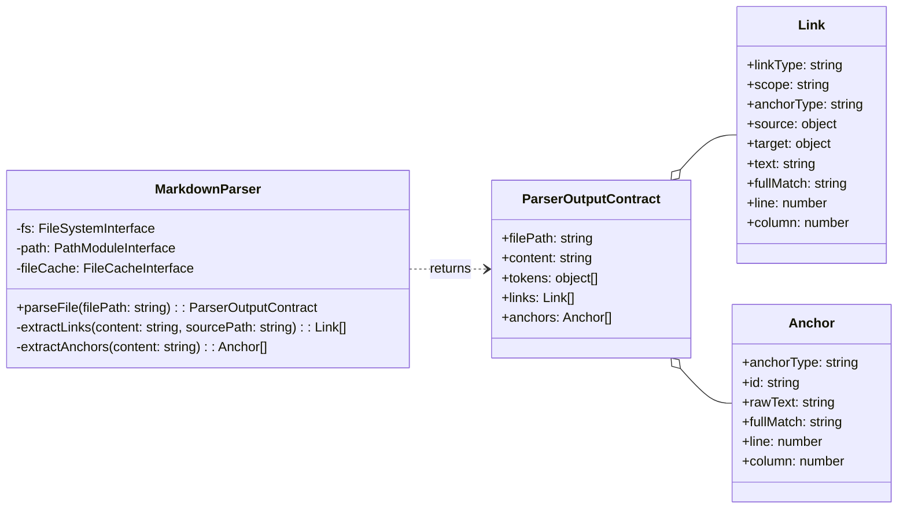

# Markdown Parser Implementation Guide

This guide provides the Level 4 (Code) details for implementing the **`MarkdownParser`** component. It includes the component's structure, pseudocode for its core logic, the formal data contracts for its output, and a strategy for testing.

## Problem

Downstream components like the `CitationValidator` and `ContentExtractor` need a structured, queryable representation of a markdown document's links and anchors. Parsing raw markdown text with regular expressions in each component would be repetitive, brittle, and inefficient. The system needs a single, reliable component to transform a raw markdown file into a consistent and explicit data model.

## Solution

The **`MarkdownParser`** component acts as a specialized transformer. It accepts a file path, reads the document, and applies a series of parsing strategies to produce a single, comprehensive **`Parser Output Contract`** object. This object contains two primary collections: a list of all outgoing **`Link Objects`** and a list of all available **`Anchor Objects`**. By centralizing this parsing logic, the `MarkdownParser` provides a clean, reusable service that decouples all other components from the complexities of markdown syntax.

## Structure

The `MarkdownParser` is a class that depends on interfaces for the File System, Path Module, and the `FileCache`. It exposes a single public method, `parseFile()`, which returns the `ParserOutputContract`.



1. [**ParserOutputContract**](Markdown%20Parser%20Implementation%20Guide.md#Data%20Contracts): The composite object returned by the parser.
2. [**Link Object**](Markdown%20Parser%20Implementation%20Guide.md#Data%20Contracts): The data object representing an outgoing link.
3. [**Anchor Object**](Markdown%20Parser%20Implementation%20Guide.md#Data%20Contracts): The data object representing a potential link target.
4. [**MarkdownParser**](Markdown%20Parser%20Implementation%20Guide.md): The class that orchestrates the parsing process.

## Public Contracts

### Input Contract

The component's contract requires the following inputs for operation:
1. Interfaces for the **`FileSystem`** and **`Path Module`**, provided at instantiation.
2. An optional **`FileCache` interface**, provided at instantiation, to be used for short filename resolution.
3. A **`filePath`** (string), provided to the public `parseFile()` method.
### Output Contract
The `parseFile()` method returns a `Promise` that resolves with the **`Parser Output Contract`**. This object represents the full structural composition of the document and is the component's sole output. Its detailed schema is defined in the `Data Contracts` section below.

## Pseudocode
This pseudocode follows the **MEDIUM-IMPLEMENTATION** abstraction level, showing the core logic and integration points required for implementation.

```tsx
// The MarkdownParser class, responsible for transforming a markdown file into a structured data model.
class MarkdownParser is
  private field fileSystem
  private field pathModule
  private field fileCache

  // The constructor accepts all external dependencies, following the Dependency Abstraction principle.
  constructor MarkdownParser(fs: FileSystemInterface, path: PathModuleInterface, cache: FileCacheInterface) is
    // Integration: These dependencies are provided by the factory at runtime.
    this.fileSystem = fs
    this.pathModule = path
    this.fileCache = cache
    // ... initialization of regex patterns ...

  // The primary public method that executes the parsing workflow.
  public async method parseFile(filePath: string): ParserOutputContract is
    // Boundary: All file system reads are handled here.
    field absoluteSourcePath = this.pathModule.resolve(filePath)
    field content = this.fileSystem.readFileSync(absoluteSourcePath, "utf8")

    // Integration: Delegates low-level tokenization to the 'marked' library.
    field tokens = marked.lexer(content)

    // Calls private methods to build the high-level data collections.
    field links = this.extractLinks(content, absoluteSourcePath)
    field anchors = this.extractAnchors(content)
    
    return {
      filePath: absoluteSourcePath,
      content: content,
      tokens: tokens,
      links: links,
      anchors: anchors
    }

  // Extracts all outgoing links from the document content.
  private method extractLinks(content: string, sourcePath: string): array of Link is
    field links = new array of Link
    field lines = content.split("\n")

    foreach (line in lines with index) do
      // Pattern: Apply regex for standard markdown links: [text](path#anchor)
      // ... find all markdown link matches on the line ...
      foreach (match in markdownMatches) do
        // Decision: Resolve the path. Use FileCache for short filenames if available.
        field rawPath = match.path
        field resolvedPath = this.resolveTargetPath(rawPath, sourcePath)
        
        links.add(new Link({
          linkType: "markdown",
          scope: "cross-document", // or "internal"
          anchorType: this.determineAnchorType(match.anchor), // "header" or "block"
          source: { path: { absolute: sourcePath } },
          target: {
            path: {
              raw: rawPath,
              absolute: resolvedPath,
              relative: this.pathModule.relative(this.pathModule.dirname(sourcePath), resolvedPath)
            },
            anchor: match.anchor
          },
          // ... populate text, fullMatch, line, column ...
        }))

      // Pattern: Apply regex for wiki-style links: [[path#anchor|text]]
      // ... find all wiki link matches on the line ...
      foreach (match in wikiMatches) do
        // ... create and add wiki link objects to the links array ...
    
    return links
    
  // Extracts all potential link targets from the document content.
  private method extractAnchors(content: string): array of Anchor is
    field anchors = new array of Anchor
    field lines = content.split("\n")

    foreach (line in lines with index) do
      // Pattern: Apply regex for header anchors: ## Header Text
      if (line matches headerPattern) then
        anchors.add(new Anchor({
          anchorType: "header",
          id: this.createHeaderId(line.text), // e.g., "Header%20Text"
          rawText: line.text,
          fullMatch: line.raw,
          // ... populate line, column ...
        }))
        
      // Pattern: Apply regex for block anchors: ^block-id
      if (line contains blockPattern) then
        anchors.add(new Anchor({
          anchorType: "block",
          id: match.id,
          rawText: null,
          fullMatch: match.raw,
          // ... populate line, column ...
        }))
        
    return anchors
```

## Data Contracts

The component's output is strictly defined by the **`Parser Output Contract`** JSON Schema. This is the definitive structure that all consuming components can rely on.

```json
{
  "$schema": "https://json-schema.org/draft/2020-12/schema",
  "$id": "https://cc-workflows.com/parser-output.schema.json",
  "title": "Parser Output Contract",
  "description": "The complete output from the MarkdownParser's parseFile() method, containing all structural information about a markdown document.",
  "type": "object",
  "properties": {
    "filePath": {
      "description": "The absolute path of the file that was parsed.",
      "type": "string"
    },
    "content": {
      "description": "The full, raw string content of the parsed file.",
      "type": "string"
    },
    "tokens": {
      "description": "An array of raw token objects from the 'marked' library's lexer. The structure is defined by the external `marked` package.",
      "type": "array",
      "items": { "type": "object" }
    },
    "links": {
      "description": "An array of all outgoing links found in the document.",
      "type": "array",
      "items": { "$ref": "#/$defs/linkObject" }
    },
    "headings": {
      "description": "An array of all headings extracted from the document structure.",
      "type": "array",
      "items": { "$ref": "#/$defs/headingObject" }
    },
    "anchors": {
      "description": "An array of all available anchors (targets) defined in the document.",
      "type": "array",
      "items": { "$ref": "#/$defs/anchorObject" }
    }
  },
  "required": [ "filePath", "content", "tokens", "links", "headings", "anchors" ],
  "$defs": {
    "linkObject": {
      "title": "Link Object",
      "type": "object",
      "properties": {
        "linkType": { "type": "string", "enum": [ "markdown", "wiki" ] },
        "scope": { "type": "string", "enum": [ "internal", "cross-document" ] },
        "anchorType": { "type": ["string", "null"], "enum": [ "header", "block", null ] },
        "source": { "type": "object", "properties": { "path": { "type": "object", "properties": { "absolute": { "type": "string" } }, "required": ["absolute"] } }, "required": ["path"] },
        "target": { "type": "object", "properties": { "path": { "type": "object", "properties": { "raw": { "type": ["string", "null"] }, "absolute": { "type": ["string", "null"] }, "relative": { "type": ["string", "null"] } }, "required": ["raw", "absolute", "relative"] }, "anchor": { "type": ["string", "null"] } }, "required": ["path", "anchor"] },
        "text": { "type": ["string", "null"] },
        "fullMatch": { "type": "string" },
        "line": { "type": "integer", "minimum": 1 },
        "column": { "type": "integer", "minimum": 1 }
      },
      "required": [ "linkType", "scope", "anchorType", "source", "target", "text", "fullMatch", "line", "column" ]
    },
    "headingObject": {
      "title": "Heading Object",
      "description": "Represents a heading extracted from the document structure. Used by the CLI 'ast' command for document structure analysis and available for future content aggregation features.",
      "type": "object",
      "properties": {
        "level": { "type": "integer", "minimum": 1, "maximum": 6, "description": "Heading depth (1-6)" },
        "text": { "type": "string", "description": "Heading text content" },
        "raw": { "type": "string", "description": "Raw markdown including # symbols" }
      },
      "required": [ "level", "text", "raw" ]
    },
    "anchorObject": {
      "title": "Anchor Object",
      "type": "object",
      "properties": {
        "anchorType": { "type": "string", "enum": [ "header", "block" ] },
        "id": { "type": "string" },
        "rawText": { "type": ["string", "null"] },
        "fullMatch": { "type": "string" },
        "line": { "type": "integer", "minimum": 1 },
        "column": { "type": "integer", "minimum": 1 }
      },
      "required": [ "anchorType", "id", "rawText", "fullMatch", "line", "column" ]
    }
  }
}
```

### ParserOutputContract Example

```json
{
  "filePath": "/project/tools/citation-manager/test/fixtures/enhanced-citations.md",
  "content": "# Enhanced Citations Test File\n\nThis file tests new citation patterns...\n...",
  "tokens": [
    {
      "type": "heading",
      "depth": 1,
      "text": "Enhanced Citations Test File",
      "raw": "# Enhanced Citations Test File"
    }
  ],
  "links": [
    {
      "linkType": "markdown",
      "scope": "cross-document",
      "anchorType": "header",
      "source": {
        "path": {
          "absolute": "/project/tools/citation-manager/test/fixtures/enhanced-citations.md"
        }
      },
      "target": {
        "path": {
          "raw": "test-target.md",
          "absolute": "/project/tools/citation-manager/test/fixtures/test-target.md",
          "relative": "test-target.md"
        },
        "anchor": "auth-service"
      },
      "text": "Component Details",
      "fullMatch": "[Component Details](test-target.md#auth-service)",
      "line": 5,
      "column": 3
    },
    {
      "linkType": "markdown",
      "scope": "cross-document",
      "anchorType": null,
      "source": {
        "path": {
          "absolute": "/project/tools/citation-manager/test/fixtures/enhanced-citations.md"
        }
      },
      "target": {
        "path": {
          "raw": "test-target.md",
          "absolute": "/project/tools/citation-manager/test/fixtures/test-target.md",
          "relative": "test-target.md"
        },
        "anchor": null
      },
      "text": "Implementation Guide",
      "fullMatch": "[Implementation Guide](test-target.md)",
      "line": 11,
      "column": 3
    }
  ],
  "headings": [
    {
      "level": 1,
      "text": "Enhanced Citations Test File",
      "raw": "# Enhanced Citations Test File"
    },
    {
      "level": 2,
      "text": "Caret References",
      "raw": "## Caret References"
    },
    {
      "level": 3,
      "text": "Auth Service",
      "raw": "### Auth Service {#auth-service}"
    }
  ],
  "anchors": [
    {
      "anchorType": "header",
      "id": "Caret%20References",
      "rawText": "Caret References",
      "fullMatch": "## Caret References",
      "line": 26,
      "column": 1
    },
    {
      "anchorType": "block",
      "id": "FR1",
      "rawText": null,
      "fullMatch": "^FR1",
      "line": 28,
      "column": 26
    },
    {
      "anchorType": "header",
      "id": "auth-service",
      "rawText": "Auth Service",
      "fullMatch": "### Auth Service {#auth-service}",
      "line": 32,
      "column": 1
    }
  ]
}
```

## Testing Strategy

Tests for the `MarkdownParser` should validate its ability to correctly transform markdown into the `Parser Output Contract`.

```tsx
// Test pattern: BDD-style behavioral validation.
class MarkdownParserTests is

  // Test that all link syntaxes are correctly identified and parsed.
 method test_linkExtraction_shouldParseAllLinkTypes(): TestResult is
   // Given: A markdown document with a mix of 'markdown' and 'wiki' style links on specific lines.
   // When: The parser's 'parseFile()' method is called on the document.
   // Then: The returned 'links' array should contain correctly structured Link Objects, and a spot-check of the 'line' and 'column' numbers for a known link confirms positional accuracy.
   // Validation: Check 'linkType', 'scope', and the 'line' and 'column' for one or two examples.
  
  // Test that all anchor syntaxes are correctly identified.
  method test_anchorExtraction_shouldParseAllAnchorTypes(): TestResult is
    // Given: A document with 'header' anchors (including those with markdown) and 'block' anchors (^).
    // When: The parser's 'parseFile()' method is called.
    // Then: The returned 'anchors' array should contain correctly structured Anchor Objects for each syntax.
    // Validation: Check the 'anchorType', 'id', and 'rawText' fields.
    
  // Test the integration with the FileCache for path resolution.
  method test_pathResolution_shouldUseFileCacheForShortFilenames(): TestResult is
    // Given: A link with a short filename (e.g., 'guide.md') and a pre-populated FileCache.
    // When: 'parseFile()' is called.
    // Then: The resulting Link Object's 'target.path.absolute' field should contain the correct absolute path resolved from the cache.
    // Boundary: Verifies the interaction between the Parser and the FileCache dependency.
    
 // Test that all source and target path variations are correctly resolved and calculated.
 method test_pathResolution_should_Correctly_Populate_All_Paths(): TestResult is
   // Given: A fixture directory with files in the root, a subdirectory, and a parent directory.
   // When: The parser is run on a source file containing links to targets in each of these locations.
   // Then: The resulting Link Objects must have correctly populated path properties for all scenarios:
   //
   //   - The 'source.path.absolute' field must always be the correct absolute path of the file being parsed.
   //   - The 'target.path.raw' field must exactly match the path string from the markdown link.
   //   - The 'target.path.absolute' field must be correctly resolved for links pointing to the same directory, a subdirectory, and a parent directory.
   //   - The 'target.path.relative' field must be the correctly calculated relative path between the source and target.
   //   - For a link pointing to a non-existent file, the 'target.path.absolute' and 'target.path.relative' fields should be null.
   //
   // Validation: Create a test fixture for each scenario and assert the values of all four path fields in the resulting Link Object.
```
