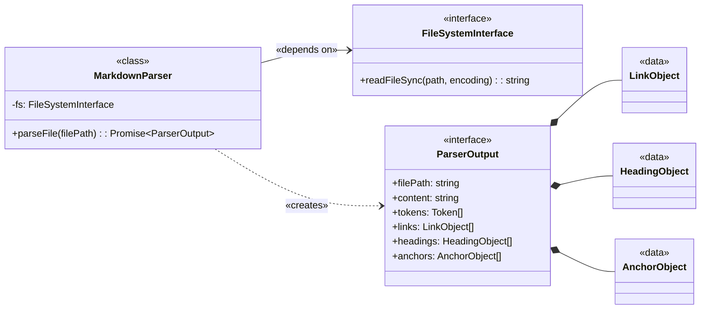
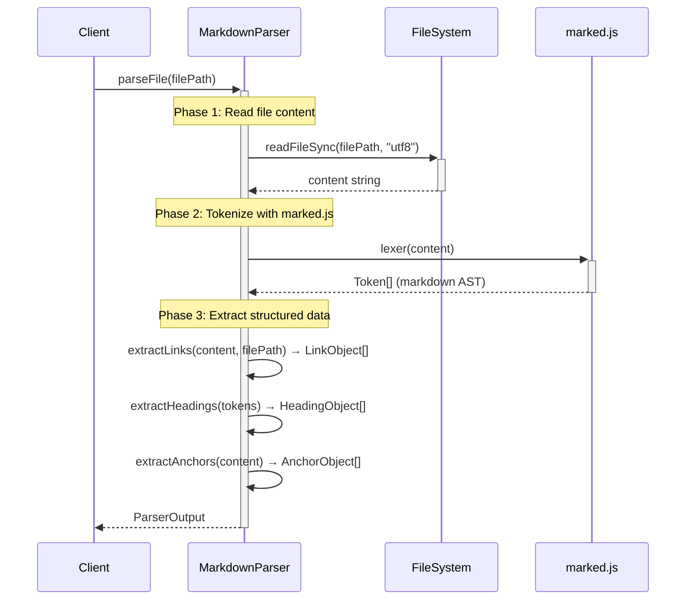

# Markdown Parser Implementation Guide

## Overview
Parses markdown files into structured objects containing outgoing links and header/anchors for consumption by downstream components.

### Problem
1. Downstream components like [**`CitationValidator`**](../ARCHITECTURE-Citation-Manager.md#Citation%20Manager.Citation%20Validator) and [**`ContentExtractor`**](../ARCHITECTURE-Citation-Manager.md#Citation%20Manager.ContentExtractor) need a structured, queryable representation of a markdown document's links and anchors. ^P1
2. Parsing raw markdown text with regular expressions in each component would be repetitive, brittle, and inefficient. ^P2
3. The system needs a single, reliable component to transform a raw markdown file into a consistent and explicit data model. ^P3

### Solution
The [**`MarkdownParser`**](../ARCHITECTURE-Citation-Manager.md#Citation%20Manager.Markdown%20Parser) component provides centralized markdown parsing by:
1. accepting a file path, reading the document, and applying parsing strategies to produce a comprehensive [**`ParserOutput`**](Markdown%20Parser%20Implementation%20Guide.md#ParserOutput%20Interface) object ^S1
2. wrapping output in the [**`ParsedDocument`**](../ARCHITECTURE-Citation-Manager.md#Citation%20Manager.ParsedDocument) facade before consumption, decoupling consumers from parser internals ([P1](#^P1)) ^S2
3. producing two primary collections: [**`LinkObject[]`**](Markdown%20Parser%20Implementation%20Guide.md#LinkObject%20Interface) and [**`AnchorObject[]`**](Markdown%20Parser%20Implementation%20Guide.md#AnchorObject%20Type%20(Discriminated%20Union)), centralizing parsing logic and eliminating regex duplication ([P2](#^P2), [P3](#^P3)) ^S3

### Impact

| Problem ID | Problem | Solution ID | Solution | Impact | Principles | How Principle Applies |
| :--------: | ------- | :---------: | -------- | ------ | ---------- | --------------------- |
| [P1](#^P1) | Components need structured representation | [S1](#^S1), [S2](#^S2) | Single parse with comprehensive [**`ParserOutput`**](Markdown%20Parser%20Implementation%20Guide.md#ParserOutput%20Interface) + facade wrapping | Fewer errors navigating data; stable consumer interface | [Data Model First](../../../../../cc-workflows-site/design-docs/Architecture%20Principles.md#^data-model-first) | Clean data structures lead to clean code; structured output prevents navigation errors |
| [P2](#^P2) | Regex duplication across components | [S3](#^S3) | Centralized link/anchor extraction | 100% reduction in duplicated parsing logic (0 regex per consumer vs N) | [Single Responsibility](../../../../../cc-workflows-site/design-docs/Architecture%20Principles.md#^single-responsibility) | Parser parses; consumers consume - each component has one clear concern |
| [P3](#^P3) | No reliable transformer | [S1](#^S1) | DI-enabled [**`MarkdownParser`**](../ARCHITECTURE-Citation-Manager.md#Citation%20Manager.Markdown%20Parser) class | Flexible testing (mock fs for unit, real fs for integration) | [Dependency Abstraction](../../../../../cc-workflows-site/design-docs/Architecture%20Principles.md#^dependency-abstraction) | Depend on FileSystemInterface abstraction, not concrete node:fs |
| [P1](#^P1) | Type safety for anchors | [S3](#^S3) | TypeScript discriminated unions ([**`AnchorObject`**](Markdown%20Parser%20Implementation%20Guide.md#AnchorObject%20Type%20(Discriminated%20Union))) | Impossible to represent invalid anchor states | [Illegal States Unrepresentable](../../../../../cc-workflows-site/design-docs/Architecture%20Principles.md#^illegal-states-unrepresentable) | Header vs block enforced at type level; invalid combinations cannot compile |

### Boundaries

The component is exclusively responsible for transforming a raw markdown string into the structured **MarkdownParser.Output.DataContract**. Its responsibilities are strictly limited to syntactic analysis. The component is **not** aware of the `ParsedDocument` facade that wraps its output. The component is **not** responsible for:
- Validating the existence or accessibility of file paths.
- Verifying the semantic correctness of links or anchors.
- Interpreting or executing any code within the document.

---

## Structure

### Class Diagram

[**`MarkdownParser`**](../ARCHITECTURE-Citation-Manager.md#Citation%20Manager.Markdown%20Parser) depends on [**`FileSystemInterface`**](#FileSystemInterface) for file I/O. It exposes a single public method, [`parseFile()`](#`MarkdownParser.parseFile()`%20Sequence%20Diagram) , which returns the [**`ParserOutput`**](#ParserOutput%20Interface)interface.



1. [**`ParserOutput`**](Markdown%20Parser%20Implementation%20Guide.md#Data%20Contracts): The composite object returned by the parser.
2. [**``LinkObject``**](#LinkObject%20Interface): The data object representing an outgoing link.
3. [**`AnchorObject`**](#AnchorObject%20Type%20(Discriminated%20Union)): The data object representing a potential link target.
4. [**`CitationManager.MarkdownParser`**](../ARCHITECTURE-Citation-Manager.md#Citation%20Manager.Markdown%20Parser): The class that orchestrates the parsing process. The guide you are reading.

---
### File Structure

```text
tools/citation-manager/
├── src/
│   ├── MarkdownParser.ts                              // TypeScript implementation (~670 lines)
│   │   ├── FileSystemInterface                        // Dependency injection interface
│   │   ├── parseFile()                                // Main orchestrator → ParserOutput
│   │   ├── extractLinks()                             // Link extraction → LinkObject[]
│   │   ├── extractAnchors()                           // Anchor extraction → AnchorObject[]
│   │   ├── extractHeadings()                          // Heading extraction → HeadingObject[]
│   │   └── helpers                                    // Inline helper methods
│   │       ├── determineAnchorType()                  // Anchor type classification
│   │       ├── resolvePath()                          // Path resolution
│   │       ├── _detectExtractionMarker()              // Extraction marker detection
│   │       ├── containsMarkdown()                     // Markdown pattern detection
│   │       └── toKebabCase()                          // String formatting
│   │
│   ├── types/
│   │   ├── citationTypes.ts                           // Parser output type definitions
│   │   │   ├── ParserOutput                           // Parser output interface
│   │   │   ├── LinkObject                             // Link data structure
│   │   │   ├── AnchorObject                           // Anchor discriminated union
│   │   │   └── HeadingObject                          // Heading data structure
│   │   │
│   │   └── validationTypes.ts                         // Validation type definitions
│   │       └── ValidationMetadata                     // Added to LinkObject post-parse
│   │
│   └── factories/
│       └── componentFactory.js                        // Factory instantiates MarkdownParser with DI
│
└── test/
    ├── parser-output-contract.test.js                 // Contract validation tests
    ├── integration/
    │   └── e2e-parser-to-extractor.test.js            // E2E: parser → extractor workflow
    └── fixtures/
        ├── enhanced-citations.md                      // Link pattern test data
        └── complex-headers.md                         // Anchor extraction test data
```

**Technical Debt**: The current monolithic structure violates the project's action-based file naming patterns. See [Issue #18](https://github.com/WesleyMFrederick/cc-workflows/issues/18) for proposed component folder refactoring that would align with [ContentExtractor's structure](Content%20Extractor%20Implementation%20Guide.md#File%20Organization).

---
## Public Contracts

### Constructor

```typescript
new MarkdownParser(
  fileSystem: FileSystemInterface,     // Required: Read file operations
)
```

- [**`FileSystemInterface`**](#FileSystemInterface): File system abstraction for reading files

#### FileSystemInterface

```typescript
interface FileSystemInterface {
  readFileSync: typeof readFileSync;  // from "node:fs"
}
```

- **Tight coupling**: Interface signature is `typeof readFileSync` from `node:fs`. Enables test mocking but not true abstraction—any replacement must match Node's exact method signature.

---

### parseFile(filePath)

```typescript
MarkdownParser.parseFile(filePath: string) → Promise<ParserOutput>
```

**Inputs**:
- `filePath: string` - Absolute path to markdown file

**Returns:**
- [**`ParserOutput`**](#ParserOutput%20Interface)
  - Complete structured representation of markdown document including:
    - File metadata (path, content, tokens)
    - All outgoing links with resolution metadata
    - All available anchors (headers and blocks)
    - Document headings with hierarchy

---
## Component Workflow

### `MarkdownParser.parseFile()` Sequence Diagram



---
## Data Contracts

TypeScript interfaces defining parser output structure. Source: `src/types/citationTypes.ts`

> [!danger] Technical Lead Note
> The `.headings[]` array is not used by any other source code. It is referenced in test code. It could be used to create an AST of the document.

### ParserOutput Interface

```typescript
export interface ParserOutput {
  /** Absolute path of parsed file */
  filePath: string;

  /** Full raw content string */
  content: string;

  /** Tokenized markdown AST from marked.js */
  tokens: Token[];  // from 'marked' library

  /** All outgoing links found in document */
  links: LinkObject[];

  /** All headings extracted from document structure */
  headings: HeadingObject[];

  /** All anchors (potential link targets) in document */
  anchors: AnchorObject[];
}
```

- [**``LinkObject``**](#LinkObject%20Interface)
- [**`HeadingObject`**](#HeadingObject%20Interface)
- [**`AnchorObject`**](#AnchorObject%20Type%20(Discriminated%20Union))

---
### LinkObject Interface

```typescript
export interface LinkObject {
  /** Link syntax type */
  linkType: "markdown" | "wiki";

  /** Link scope classification */
  scope: "internal" | "cross-document";

  /** Anchor type classification (null if no anchor) */
  anchorType: "header" | "block" | null;

  /** Source file information */
  source: {
    path: {
      /** Absolute path of source file */
      absolute: string | null;
    };
  };

  /** Target resolution */
  target: {
    path: {
      /** Raw path string from markdown (null for internal links) */
      raw: string | null;
      /** Absolute file system path (null if unresolved or internal) */
      absolute: string | null;
      /** Relative path from source file (null if unresolved or internal) */
      relative: string | null;
    };
    /** Header/block anchor (null if no anchor) */
    anchor: string | null;
  };

  /** Display text shown in markdown (null for caret references) */
  text: string | null;

  /** Complete matched markdown syntax */
  fullMatch: string;

  /** Source file line number (1-based) */
  line: number;

  /** Source file column number (0-based) */
  column: number;

  /** Extraction marker after link (null if none) */
  extractionMarker: {
    fullMatch: string;
    innerText: string;
  } | null;

  /** Validation metadata (enriched post-parse by CitationValidator) */
  validation?: ValidationMetadata;
}
```

#### Extraction Marker Examples

The `extractionMarker` property captures optional control markers that appear after links, used by `ContentExtractor` to override default extraction eligibility:

| Markdown | extractionMarker Value |
|----------|----------------------|
| `[link](file.md)%%force-extract%%` | `{ fullMatch: '%%force-extract%%', innerText: 'force-extract' }` |
| `[link](file.md) %%stop-extract-link%%` | `{ fullMatch: '%%stop-extract-link%%', innerText: 'stop-extract-link' }` |
| `[link](file.md)<!-- force-extract -->` | `{ fullMatch: '<!-- force-extract -->', innerText: 'force-extract' }` |
| `[link](file.md)` | `null` |

**Note**: See [Issue 5: Hardcoded Extraction Marker Detection](#Issue%205%20Hardcoded%20Extraction%20Marker%20Detection%20MVP%20Tech%20Debt) for MVP technical debt discussion.

#### ValidationMetadata Interface

```typescript
export interface ValidationMetadata {
  /** Validation outcome status */
  status: "valid" | "warning" | "error";

  /** Target file exists on disk */
  fileExists: boolean;

  /** Target anchor exists in file (null if no anchor specified) */
  anchorExists: boolean | null;

  /** Suggested corrections for errors (empty for valid) */
  suggestions?: string[];

  /** Path conversion info for cross-references */
  pathConversion?: string;
}
```

---
### AnchorObject Type (Discriminated Union)

```typescript
export type AnchorObject =
  | {
      /** Header anchor */
      anchorType: "header";
      /** Anchor identifier (raw heading text) */
      id: string;
      /** URL-encoded ID for Obsidian compatibility (always present for headers) */
      urlEncodedId: string;
      /** Original heading text */
      rawText: string;
      /** Full matched pattern from source */
      fullMatch: string;
      /** Source file line number (1-based) */
      line: number;
      /** Source file column number (1-based) */
      column: number;
    }
  | {
      /** Block anchor */
      anchorType: "block";
      /** Anchor identifier (block ID like 'FR1' or '^my-anchor') */
      id: string;
      /** Always null for block anchors */
      rawText: null;
      /** Full matched pattern from source */
      fullMatch: string;
      /** Source file line number (1-based) */
      line: number;
      /** Source file column number (1-based) */
      column: number;
    };
```

---
### HeadingObject Interface

```typescript
export interface HeadingObject {
  /** Heading depth (1-6) */
  level: number;

  /** Heading text content */
  text: string;

  /** Raw markdown including # symbols */
  raw: string;
}
```

---
### ParserOutputContract Example

> **Note**: Links do NOT include `validation` property - added post-parse by CitationValidator ([Story 1.8 Acceptance Criteria](<../.archive/features/20251003-content-aggregation/content-aggregation-prd.md#Story 1.8 Acceptance Criteria>)).

```json
{
  "filePath": "/project/tools/citation-manager/test/fixtures/enhanced-citations.md",
  "content": "# Enhanced Citations Test File\n\nThis file tests new citation patterns...\n...",
  "tokens": [
    {
      "type": "heading",
      "depth": 1,
      "text": "Enhanced Citations Test File",
      "raw": "# Enhanced Citations Test File"
    }
  ],
  "links": [
    {
      "linkType": "markdown",
      "scope": "cross-document",
      "anchorType": "header",
      "source": {
        "path": {
          "absolute": "/project/tools/citation-manager/test/fixtures/enhanced-citations.md"
        }
      },
      "target": {
        "path": {
          "raw": "test-target.md",
          "absolute": "/project/tools/citation-manager/test/fixtures/test-target.md",
          "relative": "test-target.md"
        },
        "anchor": "auth-service"
      },
      "text": "Component Details",
      "fullMatch": "[Component Details](test-target.md#auth-service)",
      "line": 5,
      "column": 3,
      "extractionMarker": null
    },
    {
      "linkType": "markdown",
      "scope": "cross-document",
      "anchorType": null,
      "source": {
        "path": {
          "absolute": "/project/tools/citation-manager/test/fixtures/enhanced-citations.md"
        }
      },
      "target": {
        "path": {
          "raw": "test-target.md",
          "absolute": "/project/tools/citation-manager/test/fixtures/test-target.md",
          "relative": "test-target.md"
        },
        "anchor": null
      },
      "text": "Implementation Guide",
      "fullMatch": "[Implementation Guide](test-target.md)",
      "line": 11,
      "column": 3,
      "extractionMarker": null
    }
  ],
  "headings": [
    {
      "level": 1,
      "text": "Enhanced Citations Test File",
      "raw": "# Enhanced Citations Test File"
    },
    {
      "level": 2,
      "text": "Caret References",
      "raw": "## Caret References"
    },
    {
      "level": 3,
      "text": "Auth Service",
      "raw": "### Auth Service {#auth-service}"
    }
  ],
  "anchors": [
    {
      "anchorType": "header",
      "id": "Caret References",
      "urlEncodedId": "Caret%20References",
      "rawText": "Caret References",
      "fullMatch": "## Caret References",
      "line": 26,
      "column": 1
    },
    {
      "anchorType": "block",
      "id": "FR1",
      "rawText": null,
      "fullMatch": "^FR1",
      "line": 28,
      "column": 26
    },
    {
      "anchorType": "header",
      "id": "auth-service",
      "urlEncodedId": "auth-service",
      "rawText": "Auth Service",
      "fullMatch": "### Auth Service {#auth-service}",
      "line": 32,
      "column": 1
    }
  ]
}
```

---
## Testing Strategy

**Philosophy**: Validate MarkdownParser's ability to correctly transform markdown into the `MarkdownParser.ParserOutput` TypeScript interfaces.

**Test Location**: `tools/citation-manager/test/parser-output-contract.test.js`

1. **Schema Compliance Validation**
   - All output objects match TypeScript interface definitions (LinkObject, AnchorObject, HeadingObject)
   - Required fields present with correct types
   - Enum properties adhere to documented constraints

2. **Contract Boundary Testing**
   - US1.6: Single anchor per header with dual ID properties (`id` + `urlEncodedId`)
   - US1.6: Header anchors include `urlEncodedId`, block anchors omit it
   - Path resolution: Verify raw/absolute/relative calculations
   - No unexpected fields beyond documented contract

3. **Link and Anchor Extraction**
   - Parser correctly identifies all link syntaxes (markdown, wiki, cross-document, internal)
   - Anchor types properly classified (header vs block)
   - Position metadata (line/column) accurately captured

**Contract Validation Pattern**: Tests validate against the JSON Schema documented in the [Data Contracts](#Data%20Contracts) section, ensuring parser output matches the published API contract.

---
## Technical Debt

```github-query
outputType: table
queryType: issue
org: WesleyMFrederick
repo: cc-workflows
query: "is:issue  label:component:MarkdownParser"
sort: number
direction: asc
columns: [number, status, title, labels, created, updated]
```

---
<!-- markdownlint-disable -->
# Whiteboard

## MarkdownParser.ParserOutput: How Tokens, Links, and Anchors Are Populated

**Key Question**: How does the MarkdownParser.ParserOutput get its data? Which code is responsible for each array?

**Answer**: MarkdownParser uses a **two-layer parsing approach** - standard markdown parsing via marked.js, plus custom regex extraction for Obsidian-specific syntax.

### Layer 1: Standard Markdown Parsing (marked.js)

**Code Location**: `MarkdownParser.parseFile()` lines 23-36

```javascript
async parseFile(filePath) {
  this.currentSourcePath = filePath;
  const content = this.fs.readFileSync(filePath, "utf8");
  const tokens = marked.lexer(content);  // ← marked.js creates tokens array

  return {
    filePath,
    content,
    tokens,        // ← From marked.js (standard markdown AST)
    links: this.extractLinks(content),     // ← Custom extraction (see Layer 2)
    headings: this.extractHeadings(tokens), // ← Walks tokens array
    anchors: this.extractAnchors(content)  // ← Custom extraction (see Layer 2)
  };
}
```

**What `marked.lexer(content)` creates**:
- Hierarchical token tree for standard markdown elements
- Token types: `heading`, `paragraph`, `list`, `list_item`, `blockquote`, `code`, etc.
- Each token has: `type`, `raw`, `text`, and often nested `tokens` array
- **Does NOT parse** Obsidian-specific syntax like `^anchor-id` or `[[wikilinks]]`

**Tokens used by**:
- `extractHeadings()` - Walks tokens recursively to extract heading metadata
- Epic 2 Section Extraction POC - Walks tokens to find section boundaries
- Future ContentExtractor component

### Layer 2: Custom Regex Parsing (Obsidian Extensions)

#### Links Array Population

**Code Location**: `extractLinks(content)` lines 38-291

**Method**: Line-by-line regex parsing on raw content string

**Link patterns extracted**:
1. **Cross-document markdown links**: `[text](file.md#anchor)` (line 45)
2. **Citation format**: `[cite: path]` (line 87)
3. **Relative path links**: `[text](path/to/file#anchor)` (line 128)
4. **Wiki-style cross-document**: `[[file.md#anchor|text]]` (line 177)
5. **Wiki-style internal**: `[[#anchor|text]]` (line 219)
6. **Caret syntax references**: `^anchor-id` (line 255)

**Output**: LinkObject schema with:

```javascript
{
  linkType: "markdown" | "wiki",
  scope: "cross-document" | "internal",
  anchorType: "header" | "block" | null,
  source: { path: { absolute } },
  target: {
    path: { raw, absolute, relative },
    anchor: string | null
  },
  text: string,
  fullMatch: string,
  line: number,
  column: number
}
```

#### Anchors Array Population

**Code Location**: `extractAnchors(content)` lines 345-450

**Method**: Line-by-line regex parsing on raw content string

**Anchor patterns extracted**:

1. **Obsidian block references** (lines 350-363):
   - Pattern: `^anchor-id` at END of line
   - Example: `Some content ^my-anchor`
   - Regex: `/\^([a-zA-Z0-9\-_]+)$/`

2. **Caret syntax** (lines 365-382):
   - Pattern: `^anchor-id` anywhere in line (legacy)
   - Regex: `/\^([A-Za-z0-9-]+)/g`

3. **Emphasis-marked anchors** (lines 384-397):
   - Pattern: `==**text**==`
   - Creates anchor with ID `==**text**==`
   - Regex: `/==\*\*([^*]+)\*\*==/g`

4. **Header anchors** (lines 399-446):
   - Pattern: `# Heading` or `# Heading {#custom-id}`
   - Uses raw heading text as anchor ID
   - Also creates Obsidian-compatible anchor (removes colons, URL-encodes spaces)
   - Regex: `/^(#+)\s+(.+)$/`

**Output**: AnchorObject schema with:

```javascript
{
  anchorType: "block" | "header",
  id: string,           // Raw text format (e.g., "Story 1.5: Implement Cache")
  urlEncodedId: string, // Obsidian-compatible format (e.g., "Story%201.5%20Implement%20Cache")
                        // Always populated for headers, omitted for blocks (US1.6)
  rawText: string | null, // Text content (for headers/emphasis)
  fullMatch: string,    // Full matched pattern
  line: number,         // 1-based line number
  column: number        // 0-based column position
}
```

### Why Two Layers?

**marked.js handles**:
- ✅ Standard markdown syntax (CommonMark spec)
- ✅ Hierarchical token tree structure
- ✅ Performance-optimized parsing

**Custom regex handles**:
- ✅ Obsidian-specific extensions (`^anchor-id`, `[[wikilinks]]`)
- ✅ Citation manager custom syntax (`[cite: path]`)
- ✅ Line/column position metadata for error reporting
- ✅ Path resolution (absolute/relative) via filesystem

### Epic 2 Content Extraction: Which Layer?

**Section Extraction** (headings):
- Uses **Layer 1** (tokens array)
- Algorithm: Walk tokens to find heading, collect tokens until next same-or-higher level
- POC: `tools/citation-manager/test/poc-section-extraction.test.js`

**Block Extraction** (`^anchor-id`):
- Uses **Layer 2** (anchors array)
- Algorithm: Find anchor by ID, use `line` number to extract content from raw string
- POC: `tools/citation-manager/test/poc-block-extraction.test.js`

**Full File Extraction**:
- Uses **both layers** (content string + metadata from tokens/anchors)
- Algorithm: Return entire `content` field with metadata from parser output

### Viewing MarkdownParser.ParserOutput

To see the complete JSON structure for any file:

```bash
npm run citation:ast <file-path> 2>/dev/null | npx @biomejs/biome format --stdin-file-path=output.json
```

Example output saved at: `tools/citation-manager/design-docs/features/20251003-content-aggregation/prd-parser-output-contract.json`

**Structure**:

```json
{
  "filePath": "/absolute/path/to/file.md",
  "content": "# Full markdown content as string...",
  "tokens": [
    {
      "type": "heading",
      "depth": 1,
      "text": "Citation Manager",
      "raw": "# Citation Manager\n\n",
      "tokens": [...]
    },
    // ... more tokens
  ],
  "links": [
    {
      "linkType": "markdown",
      "scope": "cross-document",
      "anchorType": "header",
      "source": { "path": { "absolute": "..." } },
      "target": {
        "path": { "raw": "guide.md", "absolute": "...", "relative": "..." },
        "anchor": "Installation"
      },
      // ... more fields
    }
    // ... more links
  ],
  "headings": [
    { "level": 1, "text": "Citation Manager", "raw": "# Citation Manager\n\n" }
    // ... more headings
  ],
  "anchors": [
    {
      "anchorType": "block",
      "id": "FR2",
      "rawText": null,
      "fullMatch": "^FR2",
      "line": 64,
      "column": 103
    },
    {
      "anchorType": "header",
      "id": "Requirements",
      "rawText": "Requirements",
      "fullMatch": "## Requirements",
      "line": 61,
      "column": 0
    }
    // ... more anchors
  ]
}
```

**Research Date**: 2025-10-07
**POC Validation**: Section extraction (7/7 tests) + Block extraction (9/9 tests) = 100% success rate
**Epic 2 Readiness**: ContentExtractor implementation can proceed with validated data contracts

---

# Markdownlint Approach

Markdownlint does not primarily rely on whole-file regex or naive line-by-line scans; it parses Markdown once into a structured token stream and a lines array, then runs rules over those structures. Regex is used selectively for small, local checks, while most logic is token-based and linear-time over the parsed representation.

## Parsing model
- The core parse is done once per file/string and produces a micromark token stream plus an array of raw lines, which are then shared with every rule.
- Built-in rules operate on micromark tokens; custom rules can choose micromark, markdown-it, or a text-only mode if they really want to work directly on lines.
- Front matter is stripped via a start-of-file match and HTML comments are interpreted for inline enable/disable, reducing the effective content that rules must consider.

## How rules match
- A rule’s function receives both tokens and the original lines and typically iterates tokens to identify semantic structures like headings, lists, links, and code fences.
- For formatting checks that are inherently textual (for example trailing spaces or line length), rules iterate the lines array and may apply small, targeted regex on a single line or substring.
- Violations are reported via a callback with precise line/column and optional fix info, so rules avoid global regex sweeps and focus only on the minimal spans they need.

## Regex vs tokens
- Token-driven checks dominate because they’re resilient to Markdown edge cases and avoid brittle, backtracking-heavy regex across the whole document.
- Regex is used as a tactical tool for localized patterns (e.g., trimming whitespace, counting spaces, or validating a fragment) rather than as the primary parsing mechanism.
- This hybrid keeps rules simple and fast: structure from tokens, micro-patterns from small regex where appropriate.

## Large content handling
- The single-parse-per-file design means the Markdown is parsed once and reused, preventing N× reparsing as the number of rules grows.
- Most built-in rules are O(n) in the size of the token stream or the number of lines, and many short-circuit early within a line or token subtree to minimize work.
- Inline configuration and front matter exclusion reduce the effective scan area, and costly rules (like line-length over code/table regions) can be tuned or disabled to cap worst-case work.

## Practical implications
- For big documents and repos, parsing once and sharing tokens keeps total runtime closer to linear in input size, even with many rules.
- Prefer writing custom rules against tokens to avoid reinventing Markdown parsing and to keep checks robust across edge cases.
- Use line-based or small regex only where semantics aren’t needed, keeping scans local to a line or token’s text to preserve performance.

1. [https://github.com/markdown-it/markdown-it/issues/68](https://github.com/markdown-it/markdown-it/issues/68)
2. [https://markdown-it-py.readthedocs.io/en/latest/api/markdown_it.token.html](https://markdown-it-py.readthedocs.io/en/latest/api/markdown_it.token.html)
3. [https://markdown-it.github.io/markdown-it/](https://markdown-it.github.io/markdown-it/)
4. [https://markdown-it-py.readthedocs.io/en/latest/using.html](https://markdown-it-py.readthedocs.io/en/latest/using.html)
5. [https://stackoverflow.com/questions/68934462/customize-markdown-parsing-in-markdown-it](https://stackoverflow.com/questions/68934462/customize-markdown-parsing-in-markdown-it)
6. [https://dlaa.me/blog/post/markdownlintfixinfo](https://dlaa.me/blog/post/markdownlintfixinfo)
7. [https://classic.yarnpkg.com/en/package/markdownlint-rule-helpers](https://classic.yarnpkg.com/en/package/markdownlint-rule-helpers)
8. [https://stackoverflow.com/questions/63989663/render-tokens-in-markdown-it](https://stackoverflow.com/questions/63989663/render-tokens-in-markdown-it)
9. [https://app.renovatebot.com/package-diff?name=markdownlint&from=0.31.0&to=0.31.1](https://app.renovatebot.com/package-diff?name=markdownlint&from=0.31.0&to=0.31.1)
10. [https://www.varac.net/docs/markup/markdown/linting-formatting.html](https://www.varac.net/docs/markup/markdown/linting-formatting.html)
11. [https://community.openai.com/t/markdown-is-15-more-token-efficient-than-json/841742](https://community.openai.com/t/markdown-is-15-more-token-efficient-than-json/841742)
12. [https://jackdewinter.github.io/2020/05/11/markdown-linter-rules-the-first-three/](https://jackdewinter.github.io/2020/05/11/markdown-linter-rules-the-first-three/)
13. [https://qmacro.org/blog/posts/2021/05/13/notes-on-markdown-linting-part-1/](https://qmacro.org/blog/posts/2021/05/13/notes-on-markdown-linting-part-1/)
14. [https://discourse.joplinapp.org/t/help-with-markdown-it-link-rendering/8143](https://discourse.joplinapp.org/t/help-with-markdown-it-link-rendering/8143)
15. [https://git.theoludwig.fr/theoludwig/markdownlint-rule-relative-links/compare/v2.3.0...v2.3.2?style=unified&whitespace=ignore-all&show-outdated=](https://git.theoludwig.fr/theoludwig/markdownlint-rule-relative-links/compare/v2.3.0...v2.3.2?style=unified&whitespace=ignore-all&show-outdated=)
16. [https://archlinux.org/packages/extra/any/markdownlint-cli2/files/](https://archlinux.org/packages/extra/any/markdownlint-cli2/files/)
17. [https://jackdewinter.github.io/2021/07/26/markdown-linter-getting-back-to-new-rules/](https://jackdewinter.github.io/2021/07/26/markdown-linter-getting-back-to-new-rules/)
18. [https://github.com/DavidAnson/markdownlint/issues/762](https://github.com/DavidAnson/markdownlint/issues/762)
19. [http://xiangxing98.github.io/Markdownlint_Rules.html](http://xiangxing98.github.io/Markdownlint_Rules.html)
20. [https://pypi.org/project/pymarkdownlnt/](https://pypi.org/project/pymarkdownlnt/)

Here is **the exact code in the markdownlint repo** that takes rule definitions and runs logic on them—**no guessing**:

**Location: `lib/markdownlint.mjs` (v0.39.0)**

## 1. Registering and Validating Rules

Custom and built-in rules are merged:

js

`const ruleList = rules.concat(customRuleList); const ruleErr = validateRuleList(ruleList, synchronous);`

(field validation is enforced in `validateRuleList`, requiring `"names"`, `"description"`, `"function"`, etc.)

## 2. Core Linting Flow: `lintContent`

This function is where each rule function is called:

js

`// Function to run for each rule const forRule = (rule) => {   ...   // Prepares the onError handler and params   function onError(errorInfo) { ... }   // Calls the rule's implementation (your callback)   function invokeRuleFunction() {     rule.function(params, onError);   }   if (rule.asynchronous) {     // For async rules: return a Promise-wrapped call     return Promise.resolve().then(invokeRuleFunction)                           .catch(catchCallsOnError);   }   // For sync rules   try {     invokeRuleFunction();   } catch (error) {     if (handleRuleFailures) { catchCallsOnError(error); } else { throw error; }   }   return null; }; const ruleResults = ruleListAsyncFirst.map(forRule);`

- **`params`**: The first argument, with content and parsed tokens.

- **`onError`**: The second argument, to report rule violations.

## 3. How Rules Are Iterated and Called

After preprocessing:

- The relevant rules (including custom) are placed in `ruleList`.

- **Each rule’s `.function` property is invoked with `params` + `onError`.**

- Results/errors are collected for output.

## 4. Direct Code Example – Rule Execution (Sync/Async)

js

`const forRule = (rule) => {   ...   function invokeRuleFunction() {     rule.function(params, onError); // <- rule "runs" here   }   if (rule.asynchronous) {     return Promise.resolve().then(invokeRuleFunction)                           .catch(catchCallsOnError);   }   try {     invokeRuleFunction();   } catch (error) {     if (handleRuleFailures) { catchCallsOnError(error); } else { throw error; }   }   return null; }; // Then: ruleListAsyncFirst.map(forRule);`

**Source: [`lib/markdownlint.mjs`](https://github.com/DavidAnson/markdownlint/blob/v0.39.0/lib/markdownlint.mjs) v0.39.0**[github](https://github.com/DavidAnson/markdownlint/raw/refs/tags/v0.39.0/lib/markdownlint.mjs)​

This is the specific, canonical spot where _every_ rule definition—internal or custom, sync or async—is executed with the parsed file content and can report lint errors. No extra speculation—this is the repo source of rule handling and invocation.

1. [https://github.com/DavidAnson/markdownlint/raw/refs/tags/v0.39.0/lib/markdownlint.mjs](https://github.com/DavidAnson/markdownlint/raw/refs/tags/v0.39.0/lib/markdownlint.mjs)
2. [https://github.com/DavidAnson/markdownlint/blob/v0.39.0/test/rules/node_modules/markdownlint-rule-sample-commonjs/sample-rule.cjs](https://github.com/DavidAnson/markdownlint/blob/v0.39.0/test/rules/node_modules/markdownlint-rule-sample-commonjs/sample-rule.cjs)

---
## Micromark 3rd Party Obsidian Extensions
Yes—micromark has third‑party extensions that implement Obsidian‑flavored Markdown features such as wikilinks, embeds, tags, and callouts, though they are community packages rather than official Obsidian modules. Examples include the @moritzrs “OFM” family (ofm, ofm‑wikilink, ofm‑tag, ofm‑callout) and a general wiki‑link extension that can be adapted for Obsidian‑style links.[npmjs+3](https://www.npmjs.com/package/@moritzrs%2Fmicromark-extension-ofm-wikilink)

### Available extensions

- @moritzrs/micromark-extension-ofm-wikilink adds Obsidian‑style [[wikilinks]] and media embeds, with corresponding HTML serialization helpers.[npmjs](https://www.npmjs.com/package/@moritzrs%2Fmicromark-extension-ofm-wikilink)

- @moritzrs/micromark-extension-ofm-callout implements Obsidian‑style callouts so blocks beginning with [!type] parse as callouts in micromark flows.[packages.ecosyste](https://packages.ecosyste.ms/registries/npmjs.org/keywords/micromark-extension)

- Bundled “OFM” packages and other Obsidian‑focused extension sets exist, such as @moritzrs/micromark-extension-ofm and @goonco/micromark-extension-ofm, to cover broader Obsidian syntax in one place.[libraries+1](https://libraries.io/npm/@goonco%2Fmicromark-extension-ofm)

### What they cover

- Obsidian callouts use a [!type] marker at the start of a blockquote (for example, [!info]) and these extensions aim to parse that syntax so it can be transformed or rendered outside Obsidian.[obsidian+1](https://help.obsidian.md/callouts)

- There is also a general micromark wiki‑link extension for [[Wiki Links]] that can be configured (alias divider, permalink resolution) and used where pure Obsidian semantics aren’t required.[github](https://github.com/landakram/micromark-extension-wiki-link)

- Some remark plugins add Obsidian‑style callouts by registering micromark syntax under the hood, demonstrating the typical integration path in unified/remark ecosystems.[github](https://github.com/rk-terence/gz-remark-callout)

### Integration tips

- These packages expose micromark syntax and HTML extensions that are passed via the micromark options (extensions/htmlExtensions) during parsing and serialization.[github+1](https://github.com/landakram/micromark-extension-wiki-link)

- For AST work, pair micromark syntax with matching mdast utilities like @moritzrs/mdast-util-ofm-wikilink (via mdast‑util‑from‑markdown) or use higher‑level wrappers such as “remark‑ofm” referenced by the OFM packages.[npmjs+1](https://www.npmjs.com/package/@moritzrs%2Fmdast-util-ofm-wikilink)

- When targeting full Obsidian coverage, prefer the curated OFM bundles and selectively enable features needed for wikilinks, tags, callouts, and related behaviors to match Obsidian’s documented syntax.[packages.ecosyste+1](https://packages.ecosyste.ms/registries/npmjs.org/keywords/micromark-extension)

1. [https://www.npmjs.com/package/@moritzrs%2Fmicromark-extension-ofm-wikilink](https://www.npmjs.com/package/@moritzrs%2Fmicromark-extension-ofm-wikilink)
2. [https://packages.ecosyste.ms/registries/npmjs.org/keywords/micromark-extension](https://packages.ecosyste.ms/registries/npmjs.org/keywords/micromark-extension)
3. [https://github.com/landakram/micromark-extension-wiki-link](https://github.com/landakram/micromark-extension-wiki-link)
4. [https://libraries.io/npm/@goonco%2Fmicromark-extension-ofm](https://libraries.io/npm/@goonco%2Fmicromark-extension-ofm)
5. [https://help.obsidian.md/callouts](https://help.obsidian.md/callouts)
6. [https://github.com/rk-terence/gz-remark-callout](https://github.com/rk-terence/gz-remark-callout)
7. [https://www.npmjs.com/package/@moritzrs%2Fmdast-util-ofm-wikilink](https://www.npmjs.com/package/@moritzrs%2Fmdast-util-ofm-wikilink)
8. [https://www.npmjs.com/package/@moritzrs%2Fmicromark-extension-ofm-tag](https://www.npmjs.com/package/@moritzrs%2Fmicromark-extension-ofm-tag)
9. [https://jsr.io/@jooooock/obsidian-markdown-parser](https://jsr.io/@jooooock/obsidian-markdown-parser)
10. [https://libraries.io/npm/@moritzrs%2Fmicromark-extension-ofm-wikilink](https://libraries.io/npm/@moritzrs%2Fmicromark-extension-ofm-wikilink)
11. [https://codesandbox.io/examples/package/micromark-extension-wiki-link](https://codesandbox.io/examples/package/micromark-extension-wiki-link)
12. [https://pdworkman.com/obsidian-callouts/](https://pdworkman.com/obsidian-callouts/)
13. [https://www.moritzjung.dev/obsidian-stats/plugins/qatt/](https://www.moritzjung.dev/obsidian-stats/plugins/qatt/)
14. [https://unifiedjs.com/explore/package/remark-wiki-link/](https://unifiedjs.com/explore/package/remark-wiki-link/)
15. [https://www.youtube.com/watch?v=tSSc42tCVto](https://www.youtube.com/watch?v=tSSc42tCVto)
16. [https://www.moritzjung.dev/obsidian-stats/plugins/md-image-caption/](https://www.moritzjung.dev/obsidian-stats/plugins/md-image-caption/)
17. [https://cdn.jsdelivr.net/npm/micromark-extension-wiki-link@0.0.4/dist/](https://cdn.jsdelivr.net/npm/micromark-extension-wiki-link@0.0.4/dist/)
18. [https://forum.inkdrop.app/t/backlinks-roam-obsidian/1928](https://forum.inkdrop.app/t/backlinks-roam-obsidian/1928)
19. [https://www.youtube.com/watch?v=sdVNiSQcMv0](https://www.youtube.com/watch?v=sdVNiSQcMv0)
20. [https://forum.inkdrop.app/t/different-checkbox-types/3237](https://forum.inkdrop.app/t/different-checkbox-types/3237)
