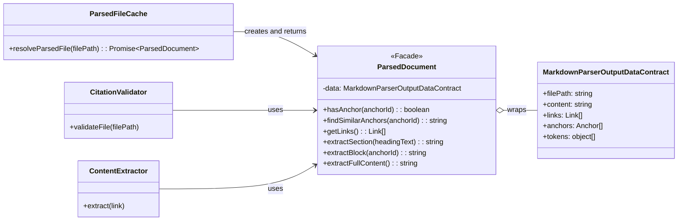

# ParsedDocument Implementation Guide

This guide provides the Level 4 (Code) details for the **`ParsedDocument`** facade, which will be implemented as part of User Story 1.7.

## Problem

Consumers like the `CitationValidator` are tightly coupled to the internal structure of the `MarkdownParser.Output.DataContract`. This makes the `CitationValidator` complex, forces it to contain data-querying logic, and makes any future change to the parser's output a breaking change for all consumers.

## Solution

The **`ParsedDocument`** facade is a wrapper class that encapsulates the raw `MarkdownParser.Output.DataContract`. It provides a stable, method-based API for querying links, anchors, and content, hiding the complex internal data structures from all consumers. This simplifies consumer logic and isolates the system from future changes to the underlying parser.

## Structure

The `ParsedFileCache` is responsible for creating `ParsedDocument` instances. Consumers like `CitationValidator` and the future `ContentExtractor` will depend on the `ParsedDocument` interface for all data access.



1. [MarkdownParser.Output.DataContract](Markdown%20Parser%20Implementation%20Guide.md#Data%20Contracts): The raw data object being wrapped
2. **ParsedDocument**: The facade providing query methods (this guide)
3. [CitationValidator](CitationValidator%20Implementation%20Guide.md): Consumer using anchor/link query methods
4. [Citation Manager.Content Extractor](../features/20251003-content-aggregation/content-aggregation-architecture.md#==Citation%20Manager.Content%20Extractor==): Future Epic 2 consumer using content extraction methods

## File Structure

```text
tools/citation-manager/
└── src/
    └── core/
        └── ParsedDocument.js    # Facade class with query and extraction methods
```

**Architecture Notes:**
- Maintained as single facade class per Facade Pattern
- Future refactoring may extract operations following Action-Based Organization if complexity warrants
- Current structure prioritizes encapsulation and interface stability

## Public Contracts

### Input Contract
1. **`parserOutput`** (object): A complete `MarkdownParser.Output.DataContract` object produced by the `MarkdownParser`.

### Output Contract (Public Methods)
The facade exposes a set of query methods for consumers.

#### Anchor Queries
- **`hasAnchor(anchorId: string): boolean`**: Returns `true` or `false` if an anchor ID exists in the document. This method encapsulates all complex matching logic, including direct, URL-decoded, and flexible markdown matching.
- **`findSimilarAnchors(anchorId: string): string`**: Returns a formatted suggestion string (e.g., "Did you mean...") when an anchor is not found, encapsulating all suggestion-generation logic.

#### Link Queries
- **`getLinks(): LinkObject[]`**: Returns the full array of `LinkObject`s from the document for consumers that need to iterate over all links.

#### Content Extraction
- **`extractSection(headingText: string): string`**: Returns the string content for a specific section by encapsulating the complex token-walking logic.
- **`extractBlock(anchorId: string): string`**: Returns the string content for a specific block reference (e.g., `^my-block-id`).
- **`extractFullContent(): string`**: A simple getter that returns the entire raw content of the document as a string.

## Pseudocode

This [Psuedocode - Medium Level -Implementation Ready Patterns](../../../../design-docs/Psuedocode%20Style%20Guide.md#MEDIUM-IMPLEMENTATION%20Implementation-Ready%20Patterns), showing the core facade pattern and query method implementations.

```tsx
// The ParsedDocument class, providing a stable query interface over parser output
class ParsedDocument is
  private field _data: MarkdownParser.Output.DataContract
  private field _cachedAnchorIds: string[] = null
  private field _cachedBlockAnchors: Anchor[] = null
  private field _cachedHeaderAnchors: Anchor[] = null
  private field _cachedCrossDocumentLinks: Link[] = null

  // Constructor accepts and wraps the raw parser output
  constructor ParsedDocument(parserOutput: MarkdownParser.Output.DataContract) is
    // Encapsulation: Store raw data privately, never expose directly
    this._data = parserOutput

  // === PUBLIC METHODS ===

  // --- Anchor Queries ---

  // Check if an anchor exists using direct and flexible matching
  public method hasAnchor(anchorId: string): boolean is
    // Logic: Checks both raw `id` and `urlEncodedId` for a direct match.
    // This is the primary, high-performance method for validation.
    return this._data.anchors.some(anchor =>
      anchor.id == anchorId || anchor.urlEncodedId == anchorId
    )

  // Find anchors similar to a given anchor ID for generating suggestions
  public method findSimilarAnchors(anchorId: string): string[] is
    // Complexity Encapsulation: Hides the fuzzy matching algorithm from consumers.
    field allIds = this._getAnchorIds()
    return this._fuzzyMatch(anchorId, allIds)

  // --- Link Queries ---

  // Get all links found in the document
  public method getLinks(): Link[] is
    return this._data.links

  // --- Content Extraction (for Epic 2) ---

  // Get the entire raw content of the document as a string
  public method extractFullContent(): string is
    return this._data.content

  // Extract content for a specific section by heading text
  public method extractSection(headingText: string, headingLevel: number): string | null is
    // Phase 1: Walk tokens to build ordered list and find target heading
    // Uses walkTokens pattern (child before sibling) for in-order traversal
    field orderedTokens = []
    field targetToken = null
    field targetIndex = -1

    method walkTokens(tokenList) is
      foreach (token in tokenList) do
        field currentIndex = orderedTokens.length
        orderedTokens.push(token)

        // Check if this is our target heading
        if (targetToken == null &&
            token.type == "heading" &&
            token.depth == headingLevel &&
            token.text == headingText) then
          targetToken = token
          targetIndex = currentIndex

        // Process nested tokens (child before sibling)
        if (token.tokens != null) then
          walkTokens(token.tokens)

    walkTokens(this._data.tokens)

    // Return null if heading not found
    if (targetToken == null) then
      return null

    // Phase 2: Find section boundary (next same-or-higher level heading)
    field endIndex = orderedTokens.length
    for (i = targetIndex + 1; i < orderedTokens.length; i++) do
      field token = orderedTokens[i]
      if (token.type == "heading" && token.depth <= headingLevel) then
        endIndex = i
        break

    // Phase 3: Extract tokens and reconstruct content from token.raw
    field sectionTokens = orderedTokens.slice(targetIndex, endIndex)
    field content = sectionTokens.map(t => t.raw).join("")

    return content

  // Extract content for a specific block reference by anchor ID
  public method extractBlock(anchorId: string): string | null is
    // Find anchor with matching ID and anchorType === "block"
    field anchor = this._data.anchors.find(a =>
      a.anchorType == "block" && a.id == anchorId
    )

    if (anchor == null) then
      return null

    // Split content into lines (anchor.line is 1-based)
    field lines = this._data.content.split("\n")
    field lineIndex = anchor.line - 1

    // Validate line index is within bounds
    if (lineIndex < 0 || lineIndex >= lines.length) then
      return null

    // Extract single line containing block anchor
    field blockContent = lines[lineIndex]

    return blockContent


  // === INTERNAL (PRIVATE) HELPERS ===

  // Get all anchor IDs, including both id and urlEncodedId variants, for fuzzy matching
  private method _getAnchorIds(): string[] is
    // Performance: Lazy-loads and caches the result on the first call
    if (this._cachedAnchorIds == null) then
      field ids = new Set<string>()
      foreach (anchor in this._data.anchors) do
        ids.add(anchor.id)
        // Include urlEncodedId if it's different from the raw id
        if (anchor.urlEncodedId && anchor.urlEncodedId != anchor.id) then
          ids.add(anchor.urlEncodedId)
      this._cachedAnchorIds = Array.from(ids)
    return this._cachedAnchorIds

  // Get all block-level anchors, cached for performance
  private method _getBlockAnchors(): Anchor[] is
    if (this._cachedBlockAnchors == null) then
      this._cachedBlockAnchors = this._data.anchors.filter(a => a.anchorType == "block")
    return this._cachedBlockAnchors

  // Get all header-level anchors, cached for performance
  private method _getHeaderAnchors(): Anchor[] is
    if (this._cachedHeaderAnchors == null) then
        this._cachedHeaderAnchors = this._data.anchors.filter(a => a.anchorType == "header")
    return this._cachedHeaderAnchors

  // Fuzzy matching implementation to find similar strings
  private method _fuzzyMatch(target: string, candidates: string[]): string[] is
    // Implementation: Uses Levenshtein distance for similarity calculation
    field matches = new array of object
    foreach (candidate in candidates) do
      field similarity = this._calculateSimilarity(target, candidate)
      if (similarity > 0.3) then  // 30% similarity threshold for higher recall
        matches.add({ candidate: candidate, score: similarity })

    matches.sort((a, b) => b.score - a.score)
    return matches.map(m => m.candidate).slice(0, 5) // Return top 5 suggestions

  // Levenshtein distance similarity calculation
  private method _calculateSimilarity(str1: string, str2: string): number is
    // Implementation: Full Levenshtein distance algorithm with case-insensitive comparison
    // Edge cases: identical strings return 1.0, empty strings return 0.0
    // Algorithm: Dynamic programming matrix for edit distance calculation
    // Normalization: Distance normalized by max string length: 1 - (distance / maxLength)
    // Returns a value between 0 (completely different) and 1 (identical)
    // Actual implementation in ParsedDocument.js lines 180-219
```

## Method Contracts

### Anchor Query Methods

#### `getAnchorIds(): string[]`
- **Purpose**: Get all available anchor IDs in the document
- **Returns**: Array of strings containing both `id` and `urlEncodedId` (when different)
- **Caching**: Result cached after first call for performance
- **Example**: `["Story 1.7: Implementation", "Story%201.7%20Implementation", "FR1", "header-name"]`

#### `hasAnchor(anchorId: string): boolean`
- **Purpose**: Check if specific anchor exists in document
- **Parameters**: `anchorId` - Anchor ID to check (raw or URL-encoded format)
- **Returns**: `true` if anchor found, `false` otherwise
- **Logic**: Checks both `anchor.id` and `anchor.urlEncodedId` for match
- **Example**: `hasAnchor("Story 1.7: Implementation")` → `true`

#### `getBlockAnchors(): Anchor[]`
- **Purpose**: Get all block-type anchors (caret syntax: `^anchor-id`)
- **Returns**: Array of anchor objects with `anchorType === "block"`
- **Caching**: Result cached after first call for performance
- **Status**: Private helper method implemented, cache field `_cachedBlockAnchors` available
- **Example**: `[{ anchorType: "block", id: "FR1", line: 42, column: 28, ... }]`
- **Note**: Currently private implementation used internally by extraction methods

#### `getHeaderAnchors(): Anchor[]`
- **Purpose**: Get all header-type anchors (from headings)
- **Returns**: Array of anchor objects with `anchorType === "header"`
- **Caching**: Result cached after first call for performance
- **Status**: Private helper method implemented, cache field `_cachedHeaderAnchors` available
- **Example**: `[{ anchorType: "header", id: "Overview", urlEncodedId: "Overview", ... }]`
- **Note**: Currently private implementation used internally by extraction methods

#### `findSimilarAnchors(anchorId: string): string[]`
- **Purpose**: Find anchors similar to given anchor ID (fuzzy matching for suggestions)
- **Parameters**: `anchorId` - Target anchor ID to find matches for
- **Returns**: Array of similar anchor IDs sorted by similarity score (max 5 results)
- **Algorithm**: Levenshtein distance with 0.3 threshold (30% similarity)
- **Example**: `findSimilarAnchors("Story 1.7")` → `["Story 1.7: Implementation", "Story 1.6"]`

**Design Note**: The 0.3 threshold (30% similarity) was chosen to provide higher recall (more suggestions) for partial anchor queries. This lower threshold compared to typical fuzzy matching (50-60%) accommodates common user patterns like typing partial anchor text during citation creation.

### Link Query Methods

#### `getLinks(): Link[]`
- **Purpose**: Get all links in the document
- **Returns**: Array of all link objects
- **Example**: `[{ linkType: "markdown", scope: "cross-document", ... }]`
- **Note**: Returns direct reference to internal array for performance. Consumers should not mutate returned values.

### Content Extraction Methods

#### `extractFullContent(): string`
- **Purpose**: Get complete file content
- **Returns**: Full content string from `_data.content`
- **Use Case**: Full-file extraction for Epic 2
- **Note**: Returns direct reference to internal string for performance. Consumers should not mutate returned values.

**Pseudocode:**

```typescript
public method extractFullContent(): string is
  // Boundary: Direct access to encapsulated raw content
  return this._data.content
```

#### `extractSection(headingText: string, headingLevel: number): string | null`
- **Purpose**: Extract content under specific heading until next same-or-higher level heading
- **Parameters**:
  - `headingText` - Exact text of the heading to extract (case-sensitive)
  - `headingLevel` - Heading level (1-6, where 1 is `#`, 2 is `##`, etc.)
- **Returns**: Section content string including heading and all nested content, or `null` if heading not found
- **Algorithm**:
  - Phase 1: Walk tokens recursively to build ordered list, find target heading
  - Phase 2: Find section boundary (next heading at same or higher level)
  - Phase 3: Extract tokens and reconstruct content from `token.raw`
- **Edge Cases**:
  - Returns `null` when heading text not found at specified level
  - Includes all nested lower-level headings (e.g., H3/H4 within H2 section)
  - Last section includes all remaining content to end of file
- **Example**: `extractSection("Overview", 2)` → `"## Overview\n\nContent here...\n### Subsection\n..."`
- **Proof Of Concept**: `/Users/wesleyfrederick/Documents/ObsidianVault/0_SoftwareDevelopment/cc-workflows/tools/citation-manager/test/poc-section-extraction.test.js`

**Pseudocode:**

```typescript
/**
 * Extract content for a specific section by heading text and level.
 * Integration: Uses marked.js token tree for structural navigation.
 *
 * @param headingText - Exact heading text to find
 * @param headingLevel - Heading depth (1-6)
 * @returns Section content string or null if not found
 */
extractSection(headingText: string, headingLevel: number): string | null {
  // Phase 1: Flatten token tree and locate target heading
  const orderedTokens = [];
  let targetIndex = -1;

  const walkTokens = (tokenList) => {
    for (const token of tokenList) {
      orderedTokens.push(token);

      // Found our target heading?
      if (token.type === 'heading' &&
          token.depth === headingLevel &&
          token.text === headingText) {
        targetIndex = orderedTokens.length - 1;
      }

      // Recurse into nested tokens (child-before-sibling traversal)
      if (token.tokens) walkTokens(token.tokens);
    }
  };

  walkTokens(this._data.tokens);

  // Not found? Return null
  if (targetIndex === -1) return null;

  // Phase 2: Find section boundary (next same-or-higher level heading)
  let endIndex = orderedTokens.length;  // Default: to end of file
  for (let i = targetIndex + 1; i < orderedTokens.length; i++) {
    const token = orderedTokens[i];
    if (token.type === 'heading' && token.depth <= headingLevel) {
      endIndex = i;
      break;
    }
  }

  // Phase 3: Reconstruct content from token.raw properties
  const sectionTokens = orderedTokens.slice(targetIndex, endIndex);
  return sectionTokens.map(t => t.raw).join('');
}
```

#### `extractBlock(anchorId: string): string | null`
- **Purpose**: Extract single line containing specific block anchor
- **Parameters**: `anchorId` - Block anchor ID without `^` prefix (e.g., "FR1" for `^FR1`)
- **Returns**: Single line content string containing block anchor, or `null` if anchor not found
- **Algorithm**:
  - Find anchor in `_data.anchors` where `anchorType === "block"` and `id === anchorId`
  - Use anchor's `line` property (1-based) to locate content
  - Extract single line at that position
- **Edge Cases**:
  - Returns `null` when anchor ID not found
  - Returns `null` when anchor exists but is header type (not block type)
  - Returns `null` when line number is out of bounds
- **Example**: `extractBlock("FR1")` → `"This is the functional requirement. ^FR1"`
- **Note**: Currently extracts single line only. Future iterations may expand to handle multi-line paragraphs or list items.
- **Proof Of Concept**: `/Users/wesleyfrederick/Documents/ObsidianVault/0_SoftwareDevelopment/cc-workflows/tools/citation-manager/test/poc-block-extraction.test.js`

**Pseudocode:**

```typescript
/**
 * Extract content for a specific block reference by anchor ID.
 * Integration: Uses anchor metadata from MarkdownParser output.
 *
 * @param anchorId - Block anchor ID without ^ prefix
 * @returns Single line content string or null if not found
 */
extractBlock(anchorId: string): string | null {
  // --- Anchor Lookup ---
  // Integration: Query anchors array from parser output
  const anchor = this._data.anchors.find(a =>
    a.anchorType === 'block' && a.id === anchorId
  );

  // Decision: Return null if block anchor not found (edge case handling)
  if (!anchor) return null;

  // --- Line Positioning ---
  // Boundary: Split raw content into lines for line-based extraction
  const lines = this._data.content.split('\n');
  const lineIndex = anchor.line - 1;  // Pattern: Convert 1-based to 0-based indexing

  // Decision: Validate line index within bounds (edge case handling)
  if (lineIndex < 0 || lineIndex >= lines.length) return null;

  // --- Content Extraction ---
  return lines[lineIndex];
}
```

## Testing Strategy

Tests for the `ParsedDocument` facade must validate that each query method correctly transforms and filters the internal data structures.

### Test Structure

```tsx
// Test pattern: BDD-style behavioral validation for the public facade methods
describe("ParsedDocument", () => {

  // Test anchor existence check, which is a primary public method
  it("hasAnchor should correctly validate existence using both id and urlEncodedId", () => {
    // Given: A ParsedDocument with an anchor that has two ID formats
    const parserOutput = {
      anchors: [
        { anchorType: "header", id: "Test Header", urlEncodedId: "Test%20Header" }
      ]
    };
    const parsedDoc = new ParsedDocument(parserOutput);

    // When/Then: The hasAnchor method should return true for both ID formats
    expect(parsedDoc.hasAnchor("Test Header")).toBe(true);
    expect(parsedDoc.hasAnchor("Test%20Header")).toBe(true);
    expect(parsedDoc.hasAnchor("NonExistent")).toBe(false);
  });

  // Test the public method for generating suggestions
  it("findSimilarAnchors should return a sorted list of suggested matches", () => {
    // Given: A ParsedDocument with several anchors
    const parserOutput = {
      anchors: [
        { id: "Story 1.7: Implementation", urlEncodedId: null },
        { id: "Story 1.6: Refactoring", urlEncodedId: null },
        { id: "Story 2.1: New Feature", urlEncodedId: null }
      ]
    };
    const parsedDoc = new ParsedDocument(parserOutput);

    // When: findSimilarAnchors() is called with a partial or misspelled ID
    const suggestions = parsedDoc.findSimilarAnchors("Story 1.7");

    // Then: It returns a list of potential matches, sorted by relevance
    expect(suggestions[0]).toBe("Story 1.7: Implementation");
    expect(suggestions).toContain("Story 1.6: Refactoring");
  });

  // Test the public method for retrieving all links
  it("getLinks should return the complete array of link objects", () => {
    // Given: A ParsedDocument with a known set of links
    const mockLinks = [
      { scope: "cross-document", target: { path: { raw: "other.md" } } },
      { scope: "internal", target: { anchor: "section" } }
    ];
    const parserOutput = { links: mockLinks };
    const parsedDoc = new ParsedDocument(parserOutput);

    // When: getLinks() is called
    const links = parsedDoc.getLinks();

    // Then: It returns the exact array of link objects
    expect(links).toHaveLength(2);
    expect(links).toEqual(mockLinks);
  });

  // Test the public method for full content extraction
  it("extractFullContent should return the complete, raw content string", () => {
    // Given: A ParsedDocument with a known content string
    const mockContent = "# Test Document\n\nThis is test content.";
    const parserOutput = { content: mockContent };
    const parsedDoc = new ParsedDocument(parserOutput);

    // When: extractFullContent() is called
    const content = parsedDoc.extractFullContent();

    // Then: It returns the exact content string
    expect(content).toBe(mockContent);
  });

  // Test Epic 2 extraction methods
  it("extractSection should extract section content by heading text and level", () => {
    // Given: A ParsedDocument with tokenized sections
    const parserOutput = {
      tokens: [
        { type: "heading", depth: 2, text: "First Section", raw: "## First Section\n" },
        { type: "paragraph", raw: "Section content here.\n" },
        { type: "heading", depth: 3, text: "Subsection", raw: "### Subsection\n" },
        { type: "paragraph", raw: "Nested content.\n" },
        { type: "heading", depth: 2, text: "Second Section", raw: "## Second Section\n" }
      ]
    };
    const parsedDoc = new ParsedDocument(parserOutput);

    // When: extractSection() is called with heading text and level
    const section = parsedDoc.extractSection("First Section", 2);

    // Then: It returns the section content including nested headings
    expect(section).toContain("## First Section");
    expect(section).toContain("Section content here");
    expect(section).toContain("### Subsection");
    expect(section).toContain("Nested content");
    expect(section).not.toContain("Second Section");
  });

  it("extractSection should return null when heading not found", () => {
    // Given: A ParsedDocument with sections
    const parserOutput = { tokens: [{ type: "heading", depth: 2, text: "Existing", raw: "## Existing\n" }] };
    const parsedDoc = new ParsedDocument(parserOutput);

    // When: extractSection() is called with non-existent heading
    const section = parsedDoc.extractSection("Non-Existent", 2);

    // Then: It returns null
    expect(section).toBeNull();
  });

  it("extractBlock should extract single line by anchor ID", () => {
    // Given: A ParsedDocument with block anchors
    const parserOutput = {
      content: "Line 1\nThis is important content. ^important-block\nLine 3",
      anchors: [
        { anchorType: "block", id: "important-block", line: 2, column: 28 }
      ]
    };
    const parsedDoc = new ParsedDocument(parserOutput);

    // When: extractBlock() is called with anchor ID
    const block = parsedDoc.extractBlock("important-block");

    // Then: It returns the line containing the block anchor
    expect(block).toBe("This is important content. ^important-block");
  });

  it("extractBlock should return null when anchor not found", () => {
    // Given: A ParsedDocument with block anchors
    const parserOutput = { content: "Some content", anchors: [{ anchorType: "block", id: "existing", line: 1 }] };
    const parsedDoc = new ParsedDocument(parserOutput);

    // When: extractBlock() is called with non-existent anchor
    const block = parsedDoc.extractBlock("non-existent");

    // Then: It returns null
    expect(block).toBeNull();
  });
});
```

## Epic 2 Content Extraction Methods

The `extractSection()` and `extractBlock()` methods are now fully implemented with algorithms proven through POC testing. See the Pseudocode section above for complete implementation details.

### Section Extraction Algorithm (Implemented)

**Algorithm Overview:**
1. **Phase 1 - Token Walking**: Recursively walk tokens to build ordered list and locate target heading
2. **Phase 2 - Boundary Detection**: Find section boundary (next same-or-higher level heading)
3. **Phase 3 - Content Reconstruction**: Extract tokens and reconstruct content from `token.raw` properties

**Key Implementation Details:**
- Uses `walkTokens` pattern (child before sibling) for in-order traversal
- Matches heading by exact text and level (case-sensitive)
- Includes all nested lower-level headings within section
- Last section automatically includes all remaining content to end of file
- Returns `null` when heading not found

**Proof of Concept**: `/Users/wesleyfrederick/Documents/ObsidianVault/0_SoftwareDevelopment/cc-workflows/tools/citation-manager/test/poc-section-extraction.test.js`

### Block Extraction Algorithm (Implemented)

**Algorithm Overview:**
1. **Anchor Lookup**: Find anchor in `_data.anchors` where `anchorType === "block"` and `id === anchorId`
2. **Line Positioning**: Use anchor's `line` property (1-based) to locate content
3. **Content Extraction**: Extract single line at that position
4. **Validation**: Return `null` if anchor not found or line out of bounds

**Key Implementation Details:**
- Filters anchors by type to ensure block anchor (not header anchor)
- Converts 1-based line number to 0-based array index
- Validates line index is within content bounds
- Currently extracts single line only (future: may expand to multi-line paragraphs)

**Proof of Concept**: `/Users/wesleyfrederick/Documents/ObsidianVault/0_SoftwareDevelopment/cc-workflows/tools/citation-manager/test/poc-block-extraction.test.js`

## Known Limitations (US1.7)

### Incomplete Facade Encapsulation for Advanced Queries

**Status**: Technical debt created by US1.7, resolution planned for Epic 2

**Issue**: CitationValidator helper methods require direct `_data.anchors` access for metadata-dependent operations:
- Line 528: `suggestObsidianBetterFormat()` needs anchor objects with `anchorType` and `rawText` properties
- Line 560: `findFlexibleAnchorMatch()` needs anchor objects with `rawText` for markdown-aware matching
- Lines 570-578: Suggestion generation needs anchor objects filtered by type

**Missing Facade Methods**:
- `getHeaderAnchors(): AnchorObject[]` - Return header anchor objects with metadata
- `getBlockAnchors(): AnchorObject[]` - Return block anchor objects with metadata
- `getAnchorByIdWithMetadata(anchorId): AnchorObject|null` - Return full anchor object

**Impact**: Primary validation fully decoupled via `hasAnchor()` and `findSimilarAnchors()` methods, but error reporting and advanced matching still coupled to internal anchor schema.

**Workaround**: Helper methods access `parsedDoc._data.anchors` directly until facade extended in Epic 2.

**Resolution**: Epic 2 will extend facade with metadata-aware query methods to eliminate remaining coupling.

## Design Notes

**Encapsulation Benefits**:
- All direct access to `_data` is private - consumers cannot bypass facade
- Fuzzy matching complexity hidden in `_fuzzyMatch()` private method
- Token navigation complexity will be hidden in extraction methods (Epic 2)

**Performance Optimization**:
- Lazy-load and cache anchor IDs on first call
- Future: Consider caching other frequently-accessed queries

**Extension Strategy**:
- New query methods can be added without modifying existing methods
- Consumers only depend on methods they use, not entire interface

**Testing Approach**:
- Unit tests validate each query method independently
- Integration tests validate CitationValidator and ContentExtractor usage
- Use real parser output fixtures from test/fixtures/

## Integration with Existing Components

### ParsedFileCache Integration
The `ParsedFileCache` wraps parser output in `ParsedDocument` before caching:

```javascript
const parsePromise = this.markdownParser.parseFile(filePath)
const parsedDocPromise = parsePromise.then(contract =>
  new ParsedDocument(contract)
)
this.cache.set(cacheKey, parsedDocPromise)
```

### CitationValidator Integration
The `CitationValidator` uses facade methods instead of direct data access:

```javascript
// Before US1.7:
const anchorExists = parsed.anchors.some(a => a.id === anchor)

// After US1.7:
const anchorExists = parsedDoc.hasAnchor(anchor)
```

### ContentExtractor Integration (Epic 2)
The future `ContentExtractor` will use extraction methods:

```javascript
const section = parsedDoc.extractSection(headingText)
const block = parsedDoc.extractBlock(anchorId)
const fullContent = parsedDoc.extractFullContent()
```
