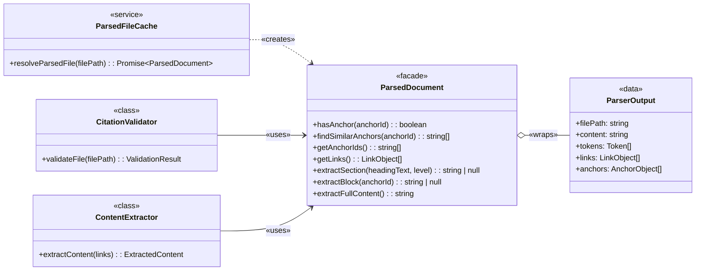

# ParsedDocument Implementation Guide

## Overview

Wraps parser output in a facade providing stable query methods for anchor validation, link retrieval, and content extraction for consumption by downstream components.

### Problem
1. Consumers like the [**`CitationValidator`**](../ARCHITECTURE-Citation-Manager.md#Citation%20Manager.Citation%20Validator) are tightly coupled to the internal structure of [**`MarkdownParser.ParserOutput`**](Markdown%20Parser%20Implementation%20Guide.md#ParserOutput%20Interface), making them complex and forcing them to contain data-querying logic. ^P1
2. Any change to the parser's output structure becomes a breaking change for all consumers. ^P2
3. Direct data structure access violates encapsulation and makes the system brittle to refactoring. ^P3

### Solution
The [**`ParsedDocument`**](../ARCHITECTURE-Citation-Manager.md#Citation%20Manager.ParsedDocument) facade provides a stable query interface by:
1. encapsulating the raw [**`MarkdownParser.ParserOutput`**](Markdown%20Parser%20Implementation%20Guide.md#ParserOutput%20Interface) and hiding internal data structures from all consumers (addresses [P1](#^P1)) ^S1
2. providing method-based query APIs for anchors, links, and content that decouple consumers from parser internals (addresses [P1](#^P1), [P2](#^P2)) ^S2
3. enabling parser refactoring without breaking consumer code (addresses [P2](#^P2), [P3](#^P3)) ^S3

### Impact

| Problem ID | Problem | Solution ID | Solution | Impact | Principles | How Principle Applies |
| :--------: | ------- | :---------: | -------- | ------ | ---------- | --------------------- |
| [P1](#^P1) | Tight coupling to parser internals | [S1](#^S1), [S2](#^S2) | Facade with query methods | Zero direct data structure access | [Black Box Interfaces](../../../../../cc-workflows-site/design-docs/Architecture%20Principles.md#^black-box-interfaces) | Expose clean API; hide implementation |
| [P2](#^P2) | Breaking changes propagate | [S2](#^S2), [S3](#^S3) | Stable method-based API | Parser refactoring doesn't break consumers | [Modular Design](../../../../../cc-workflows-site/design-docs/Architecture%20Principles.md#^modular-design-principles-definition) | Replaceable parts via interfaces |
| [P3](#^P3) | Brittle to refactoring | [S1](#^S1), [S3](#^S3) | Encapsulated data access | System resilient to internal changes | [Access-Pattern Fit](../../../../../cc-workflows-site/design-docs/Architecture%20Principles.md#^access-pattern-fit) | Data structures aligned with query patterns |

---

## Structure

### Class Diagram

[**`ParsedFileCache`**](ParsedFileCache%20Implementation%20Guide.md#Output%20Contract) creates `ParsedDocument` instances. Consumers like [**`CitationValidator`**](CitationValidator%20Implementation%20Guide.md) and [**`ContentExtractor`**](Content%20Extractor%20Implementation%20Guide.md) depend on the `ParsedDocument` facade for all data access.



1. [**`ParsedFileCache`**](../ARCHITECTURE-Citation-Manager.md#Citation%20Manager.ParsedFileCache): Service that creates `ParsedDocument` instances
2. [**`ParsedDocument`**](../ARCHITECTURE-Citation-Manager.md#Citation%20Manager.ParsedDocument): Facade providing query methods (this guide)
3. [**`CitationValidator`**](../ARCHITECTURE-Citation-Manager.md#Citation%20Manager.Citation%20Validator): Consumer using anchor/link query methods
4. [**`ContentExtractor`**](../ARCHITECTURE-Citation-Manager.md#Citation%20Manager.ContentExtractor): Consumer using content extraction methods
5. [**`MarkdownParser.ParserOutput`**](Markdown%20Parser%20Implementation%20Guide.md#ParserOutput%20Interface): Data contract being wrapped

---
### File Structure

```text
tools/citation-manager/
├── src/
│   ├── ParsedDocument.ts                      // Facade implementation (~355 lines)
│   │   ├── hasAnchor()                        // Anchor existence check
│   │   ├── findSimilarAnchors()               // Fuzzy matching for suggestions
│   │   ├── getAnchorIds()                     // Lazy-loaded anchor cache
│   │   ├── getLinks()                         // Link array passthrough
│   │   ├── extractFullContent()               // Raw content accessor
│   │   ├── extractSection()                   // Token-walking section extraction
│   │   └── extractBlock()                     // Line-based block extraction
│   │
│   └── types/
│       └── citationTypes.ts                   // TypeScript type definitions
│
└── test/
    ├── parsed-document.test.js                // Unit tests for facade methods
    ├── parsed-document-extraction.test.js     // Section/block extraction tests
    ├── poc-block-extraction.test.js           // POC validation for block extraction
    │
    └── integration/
        └── citation-validator-parsed-document.test.js  // Integration with CitationValidator
```

---
## Public Contracts

### Constructor

```typescript
new ParsedDocument(
  parserOutput: ParserOutput  // Complete MarkdownParser.Output.DataContract
)
```

| Type     | Value           | Comment                      |
| :------- | :-------------- | :--------------------------- |
| `@param` | `ParserOutput`  | [**`MarkdownParser.ParserOutput`**](Markdown%20Parser%20Implementation%20Guide.md#ParserOutput%20Interface) produced by MarkdownParser |

---

### hasAnchor(anchorId)

```typescript
/**
 * Check if specific anchor exists in document.
 * Encapsulates all complex matching logic including direct, URL-decoded, and flexible markdown matching.
 */
ParsedDocument.hasAnchor(anchorId: string) → boolean
```

| Type       | Value           | Comment                        |
| :--------- | :-------------- | :----------------------------- |
| `@param`   | `anchorId: string` | Anchor ID to check (raw or URL-encoded format) |
| `@returns` | `boolean`       | True if anchor found, false otherwise |

---

### findSimilarAnchors(anchorId)

```typescript
/**
 * Find anchors similar to given anchor ID using fuzzy matching.
 * Returns suggestions for use when anchor is not found.
 */
ParsedDocument.findSimilarAnchors(anchorId: string) → string[]
```

| Type       | Value           | Comment                        |
| :--------- | :-------------- | :----------------------------- |
| `@param`   | `anchorId: string` | Target anchor ID to find matches for |
| `@returns` | `string[]`      | Array of similar anchor IDs sorted by similarity (max 5 results) |

---

### getAnchorIds()

```typescript
/**
 * Get all available anchor IDs in the document.
 * Result cached after first call for performance.
 */
ParsedDocument.getAnchorIds() → string[]
```

| Type       | Value           | Comment                        |
| :--------- | :-------------- | :----------------------------- |
| `@returns` | `string[]`      | Array containing both `id` and `urlEncodedId` variants for all anchors |

---

### getLinks()

```typescript
/**
 * Get all links in the document.
 * Returns direct reference to internal array for performance.
 */
ParsedDocument.getLinks() → LinkObject[]
```

| Type       | Value           | Comment                        |
| :--------- | :-------------- | :----------------------------- |
| `@returns` | `LinkObject[]`  | Array of all [**`LinkObject`**](Markdown%20Parser%20Implementation%20Guide.md#LinkObject%20Interface)s from document |

---

### extractSection(headingText, headingLevel)

```typescript
/**
 * Extract content under specific heading until next same-or-higher level heading.
 * Encapsulates complex token-walking logic for section boundary detection.
 */
ParsedDocument.extractSection(headingText: string, headingLevel: number) → string | null
```

| Type       | Value           | Comment                        |
| :--------- | :-------------- | :----------------------------- |
| `@param`   | `headingText: string` | Exact text of heading to extract (case-sensitive) |
| `@param`   | `headingLevel: number` | Heading level (1-6, where 1 is `#`, 2 is `##`, etc.) |
| `@returns` | `string \| null` | Section content including heading and nested content, or null if not found |

---

### extractBlock(anchorId)

```typescript
/**
 * Extract single line containing specific block anchor.
 * Filters by anchorType="block" for type safety.
 */
ParsedDocument.extractBlock(anchorId: string) → string | null
```

| Type       | Value           | Comment                        |
| :--------- | :-------------- | :----------------------------- |
| `@param`   | `anchorId: string` | Block anchor ID without `^` prefix (e.g., "FR1" for `^FR1`) |
| `@returns` | `string \| null` | Single line content containing block anchor, or null if not found |

---

### extractFullContent()

```typescript
/**
 * Get complete file content.
 * Simple accessor for raw content string.
 */
ParsedDocument.extractFullContent() → string
```

| Type       | Value           | Comment                        |
| :--------- | :-------------- | :----------------------------- |
| `@returns` | `string`        | Full content string from document |

---

## Pseudocode

High-level architectural patterns showing the Facade pattern, lazy loading, and content extraction strategies.

```typescript
/**
 * Facade Pattern: ParsedDocument wraps parser output and provides stable query interface
 *
 * Key Patterns:
 * - Encapsulation: Parser output stored privately, never exposed
 * - Lazy Loading: Anchor IDs computed and cached on first access
 * - Query Methods: Stable interface decouples consumers from parser internals
 */
class ParsedDocument {
  private _data: ParserOutput           // Pattern: Private encapsulation
  private _cachedAnchorIds: string[]    // Pattern: Lazy-loaded cache

  constructor(parserOutput: ParserOutput) {
    // Pattern: Dependency injection of parser output
    this._data = parserOutput
  }

  // === ANCHOR QUERY PATTERNS ===

  hasAnchor(anchorId: string): boolean {
    // Pattern: Dual-key lookup (id + urlEncodedId) for flexible matching
    // Decision: Check both formats to handle Obsidian encoding variations
  }

  findSimilarAnchors(anchorId: string): string[] {
    // Pattern: Fuzzy matching with threshold filtering
    // Integration: Uses lazy-loaded anchor cache
    // Algorithm: Levenshtein distance with 0.3 similarity threshold
    // Returns: Top 5 matches sorted by similarity score
  }

  getAnchorIds(): string[] {
    // Pattern: Lazy loading with cache-aside
    // Decision: Build unique set of id + urlEncodedId on first call
  }

  // === LINK QUERY PATTERNS ===

  getLinks(): LinkObject[] {
    // Pattern: Direct passthrough to encapsulated data
    // Boundary: Returns reference to internal array (consumers must not mutate)
  }

  // === CONTENT EXTRACTION PATTERNS ===

  extractFullContent(): string {
    // Pattern: Simple accessor for raw content
    // Boundary: Returns reference to internal string
  }

  extractSection(headingText: string, headingLevel: number): string | null {
    // Pattern: Three-phase content extraction
    // Phase 1 - Token Traversal: Recursive walk to flatten tree and locate target
    //   - Decision: Use child-before-sibling order for proper nesting
    //   - Decision: Skip recursion for tokens with inclusive .raw (heading, paragraph)
    // Phase 2 - Boundary Detection: Find next same-or-higher level heading
    //   - Decision: Default to end-of-file if no boundary found
    // Phase 3 - Content Reconstruction: Join token.raw from slice
    //   - Integration: Relies on marked.js token.raw for source reconstruction
  }

  extractBlock(anchorId: string): string | null {
    // Pattern: Anchor-based line extraction
    // Decision: Filter by anchorType="block" for type safety
    // Integration: Uses 1-based line numbers from parser
    // Boundary: Validates line index before extraction
    // Limitation: Single line only (future: multi-line block support)
  }

  // === PRIVATE HELPER PATTERNS ===

  private _getAnchorIds(): string[] {
    // Pattern: Lazy initialization with null check
    // Decision: Cache computed result for repeated queries
  }

  private _fuzzyMatch(target: string, candidates: string[]): string[] {
    // Pattern: Similarity scoring with threshold filtering
    // Algorithm: Levenshtein distance for edit-based similarity
    // Decision: 0.3 threshold balances recall vs precision
  }

  private _calculateSimilarity(str1: string, str2: string): number {
    // Algorithm: Levenshtein distance with normalization
    // Decision: Case-insensitive comparison for user-friendly matching
    // Returns: 0.0 (different) to 1.0 (identical)
  }

  private _tokenIncludesChildrenInRaw(tokenType: string): boolean {
    // Decision: Determine if token.raw includes nested content
    // Pattern: Type-based dispatch to avoid duplicate content extraction
    // Inclusive types: heading, paragraph, text, code, html
    // Structural types: list, blockquote, table (require recursion)
  }
}
```

## Method Contracts

### Anchor Query Methods

#### `getAnchorIds(): string[]`
- **Purpose**: Get all available anchor IDs in the document
- **Returns**: Array of strings containing both `id` and `urlEncodedId` (when different)
- **Caching**: Result cached after first call for performance
- **Example**: `["Story 1.7: Implementation", "Story%201.7%20Implementation", "FR1", "header-name"]`

#### `hasAnchor(anchorId: string): boolean`
- **Purpose**: Check if specific anchor exists in document
- **Parameters**: `anchorId` - Anchor ID to check (raw or URL-encoded format)
- **Returns**: `true` if anchor found, `false` otherwise
- **Logic**: Checks both `anchor.id` and `anchor.urlEncodedId` for match
- **Example**: `hasAnchor("Story 1.7: Implementation")` → `true`

#### `findSimilarAnchors(anchorId: string): string[]`
- **Purpose**: Find anchors similar to given anchor ID (fuzzy matching for suggestions)
- **Parameters**: `anchorId` - Target anchor ID to find matches for
- **Returns**: Array of similar anchor IDs sorted by similarity score (max 5 results)
- **Algorithm**: Levenshtein distance with 0.3 threshold (30% similarity)
- **Example**: `findSimilarAnchors("Story 1.7")` → `["Story 1.7: Implementation", "Story 1.6"]`

**Design Note**: The 0.3 threshold (30% similarity) was chosen to provide higher recall (more suggestions) for partial anchor queries. This lower threshold compared to typical fuzzy matching (50-60%) accommodates common user patterns like typing partial anchor text during citation creation.

### Link Query Methods

#### `getLinks(): Link[]`
- **Purpose**: Get all links in the document
- **Returns**: Array of all link objects
- **Example**: `[{ linkType: "markdown", scope: "cross-document", ... }]`
- **Note**: Returns direct reference to internal array for performance. Consumers should not mutate returned values.

### Content Extraction Methods

#### `extractFullContent(): string`
- **Purpose**: Get complete file content
- **Returns**: Full content string from `_data.content`
- **Use Case**: Full-file extraction
- **Note**: Returns direct reference to internal string for performance. Consumers should not mutate returned values.

**Pseudocode:**

```typescript
public method extractFullContent(): string is
  // Boundary: Direct access to encapsulated raw content
  return this._data.content
```

#### `extractSection(headingText: string, headingLevel: number): string | null`
- **Purpose**: Extract content under specific heading until next same-or-higher level heading
- **Parameters**:
  - `headingText` - Exact text of the heading to extract (case-sensitive)
  - `headingLevel` - Heading level (1-6, where 1 is `#`, 2 is `##`, etc.)
- **Returns**: Section content string including heading and all nested content, or `null` if heading not found
- **Algorithm**:
  - Phase 1: Walk tokens recursively to build ordered list, find target heading
  - Phase 2: Find section boundary (next heading at same or higher level)
  - Phase 3: Extract tokens and reconstruct content from `token.raw`
- **Edge Cases**:
  - Returns `null` when heading text not found at specified level
  - Includes all nested lower-level headings (e.g., H3/H4 within H2 section)
  - Last section includes all remaining content to end of file
- **Example**: `extractSection("Overview", 2)` → `"## Overview\n\nContent here...\n### Subsection\n..."`
- **Tests**: `test/parsed-document-extraction.test.js` validates section extraction behavior

**Pattern Overview:**

```typescript
/**
 * Three-Phase Content Extraction Pattern
 *
 * Phase 1 - Token Traversal:
 * Pattern: Recursive tree walk with child-before-sibling ordering
 * Decision: Flatten nested token tree into ordered array
 * Integration: Uses marked.js token structure with .tokens for nesting
 * Critical: Skip recursion for tokens where .raw includes children (heading, paragraph)
 *
 * Phase 2 - Boundary Detection:
 * Pattern: Sequential scan for section terminator
 * Decision: Next same-or-higher level heading marks section end
 * Edge Case: No boundary found → extract to end of file
 *
 * Phase 3 - Content Reconstruction:
 * Pattern: Array slice and string join
 * Integration: Concatenate token.raw properties for source-accurate output
 * Benefit: Preserves original markdown formatting exactly
 */
```

#### `extractBlock(anchorId: string): string | null`
- **Purpose**: Extract single line containing specific block anchor
- **Parameters**: `anchorId` - Block anchor ID without `^` prefix (e.g., "FR1" for `^FR1`)
- **Returns**: Single line content string containing block anchor, or `null` if anchor not found
- **Algorithm**:
  - Find anchor in `_data.anchors` where `anchorType === "block"` and `id === anchorId`
  - Use anchor's `line` property (1-based) to locate content
  - Extract single line at that position
- **Edge Cases**:
  - Returns `null` when anchor ID not found
  - Returns `null` when anchor exists but is header type (not block type)
  - Returns `null` when line number is out of bounds
- **Example**: `extractBlock("FR1")` → `"This is the functional requirement. ^FR1"`
- **Note**: Currently extracts single line only. Future iterations may expand to handle multi-line paragraphs or list items.
- **Proof Of Concept**: `/Users/wesleyfrederick/Documents/ObsidianVault/0_SoftwareDevelopment/cc-workflows/tools/citation-manager/test/poc-block-extraction.test.js`

**Pattern Overview:**

```typescript
/**
 * Anchor-Based Line Extraction Pattern
 *
 * Anchor Lookup:
 * Pattern: Type-discriminated search in anchors array
 * Decision: Filter by anchorType="block" for type safety
 * Integration: Uses anchor metadata from MarkdownParser output
 *
 * Line Positioning:
 * Pattern: 1-based to 0-based index conversion
 * Integration: Anchor.line property contains 1-based line number
 * Boundary: Split content by newlines for line-based access
 *
 * Validation:
 * Decision: Validate line index within bounds before extraction
 * Edge Cases: Return null for missing anchor or out-of-bounds index
 *
 * Limitation:
 * Current: Single line extraction only
 * Future: May expand to multi-line block support (full paragraph/list item)
 */
```

## Testing Strategy

**Pattern**: Behavioral validation of facade methods using BDD-style tests with Given-When-Then structure.

**TypeScript Configuration:**
- Test files: `.test.ts` extension with Vitest
- Import pattern: `import ParsedDocument from "../../dist/ParsedDocument.js"` (compiled output)
- Type validation: Epic 3 TypeScript conversion standards (`scripts/validate-typescript-conversion.js`)

### Test Coverage Patterns

**Anchor Query Methods** - Validate dual-key matching and fuzzy search:
- `hasAnchor()`: Test both `id` and `urlEncodedId` matching
- `findSimilarAnchors()`: Validate Levenshtein distance threshold and scoring
- `getAnchorIds()`: Verify lazy loading and cache behavior

**Link Query Methods** - Validate passthrough and filtering:
- `getLinks()`: Verify complete array return without transformation

**Content Extraction Methods** - Validate complex token walking:
- `extractSection()`: Test boundary detection (same/higher level headings), nested content inclusion, null returns
- `extractBlock()`: Test anchor type filtering, line number conversion, bounds validation, null returns
- `extractFullContent()`: Verify direct content passthrough

### Test File Locations

**Source of Truth**: Actual test implementations in:
- Unit tests: `test/parsed-document.test.js`, `test/parsed-document-extraction.test.js`
- Integration tests: `test/integration/citation-validator-parsed-document.test.js`
- POC validation: `test/poc-block-extraction.test.js`

**See actual tests for implementation details** - this guide documents WHAT to test and WHY, test files show HOW.

## Content Extraction Methods

The `extractSection()` and `extractBlock()` methods are fully implemented with algorithms proven through POC testing. See the Pseudocode section above for complete implementation details.

### Section Extraction Algorithm (Implemented)

**Algorithm Overview:**
1. **Phase 1 - Token Walking**: Recursively walk tokens to build ordered list and locate target heading
2. **Phase 2 - Boundary Detection**: Find section boundary (next same-or-higher level heading)
3. **Phase 3 - Content Reconstruction**: Extract tokens and reconstruct content from `token.raw` properties

**Key Implementation Details:**
- Uses `walkTokens` pattern (child before sibling) for in-order traversal
- Matches heading by exact text and level (case-sensitive)
- Includes all nested lower-level headings within section
- Last section automatically includes all remaining content to end of file
- Returns `null` when heading not found

**Tests**: `test/parsed-document-extraction.test.js` validates section extraction behavior

### Block Extraction Algorithm (Implemented)

**Algorithm Overview:**
1. **Anchor Lookup**: Find anchor in `_data.anchors` where `anchorType === "block"` and `id === anchorId`
2. **Line Positioning**: Use anchor's `line` property (1-based) to locate content
3. **Content Extraction**: Extract single line at that position
4. **Validation**: Return `null` if anchor not found or line out of bounds

**Key Implementation Details:**
- Filters anchors by type to ensure block anchor (not header anchor)
- Converts 1-based line number to 0-based array index
- Validates line index is within content bounds
- Currently extracts single line only (future: may expand to multi-line paragraphs)

**Proof of Concept**: `/Users/wesleyfrederick/Documents/ObsidianVault/0_SoftwareDevelopment/cc-workflows/tools/citation-manager/test/poc-block-extraction.test.js`

## Known Limitations (US1.7)

### Incomplete Facade Encapsulation for Advanced Queries

**GitHub Issue**: [#35](https://github.com/WesleyMFrederick/cc-workflows/issues/35) - CitationValidator helpers require direct anchor access, breaking facade encapsulation

**Status**: Technical debt created by US1.7, remains as low-priority technical debt (extraction methods work correctly)

**Issue**: CitationValidator helper methods require direct `_data.anchors` access for metadata-dependent operations:
- Line 528: `suggestObsidianBetterFormat()` needs anchor objects with `anchorType` and `rawText` properties
- Line 560: `findFlexibleAnchorMatch()` needs anchor objects with `rawText` for markdown-aware matching
- Lines 570-578: Suggestion generation needs anchor objects filtered by type

**Missing Facade Methods**:
- `getAnchorByIdWithMetadata(anchorId): AnchorObject|null` - Return full anchor object with metadata

**Impact**: Primary validation fully decoupled via `hasAnchor()` and `findSimilarAnchors()` methods, but error reporting and advanced matching still coupled to internal anchor schema.

**Workaround**: Helper methods access `parsedDoc._data.anchors` directly. This is acceptable as a low-priority technical debt since the core extraction functionality works correctly.

**Resolution**: Future work may extend facade with metadata-aware query methods to eliminate remaining coupling, but this is not currently prioritized.

---

## Technical Debt

```github-query
outputType: table
queryType: issue
org: WesleyMFrederick
repo: cc-workflows
query: "is:issue label:component:ParsedDocument"
sort: number
direction: asc
columns: [number, status, title, labels, created, updated]
```

---

## Design Notes

**Encapsulation Benefits**:
- All direct access to `_data` is private - consumers cannot bypass facade
- Fuzzy matching complexity hidden in `_fuzzyMatch()` private method
- Token navigation complexity is hidden in extraction methods

**Performance Optimization**:
- Lazy-load and cache anchor IDs on first call
- Future: Consider caching other frequently-accessed queries

**Extension Strategy**:
- New query methods can be added without modifying existing methods
- Consumers only depend on methods they use, not entire interface

**Testing Approach**:
- Unit tests validate each query method independently
- Integration tests validate CitationValidator and ContentExtractor usage
- Use real parser output fixtures from test/fixtures/

## Integration with Existing Components

### ParsedFileCache Integration
The `ParsedFileCache` wraps parser output in `ParsedDocument` before caching:

```typescript
// Cache miss - parse file and wrap in facade
const parsePromise = this.parser.parseFile(cacheKey);

const parsedDocPromise = parsePromise.then(
  (parserOutput: ParserOutput) => new ParsedDocument(parserOutput)
);

// Store Promise IMMEDIATELY to deduplicate concurrent requests
this.cache.set(cacheKey, parsedDocPromise);

// Cleanup failed parses to allow retry
parsedDocPromise.catch(() => {
  this.cache.delete(cacheKey);
});

return parsedDocPromise;
```

### CitationValidator Integration
The `CitationValidator` uses facade methods instead of direct data access:

```typescript
// Before US1.7: Direct data structure access
const anchorExists = parsed.anchors.some(a => a.id === anchor)

// After US1.7: Facade method encapsulates complexity
const anchorExists = parsedDoc.hasAnchor(anchor)
```

### ContentExtractor Integration
The `ContentExtractor` uses extraction methods for content retrieval:

```typescript
// Extract section content by heading
const section = parsedDoc.extractSection(headingText, headingLevel)

// Extract block content by anchor ID
const block = parsedDoc.extractBlock(anchorId)

// Extract full file content
const fullContent = parsedDoc.extractFullContent()
```
