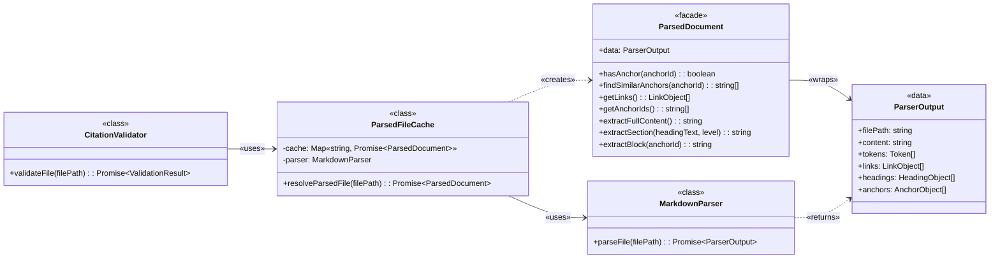

# ParsedFileCache Implementation Guide

## Overview

Caches parsed markdown files as ParsedDocument facades, ensuring each file is parsed at most once per command execution.

### Problem

1. Components like [**`CitationValidator`**](CitationValidator%20Implementation%20Guide.md) and [**`ContentExtractor`**](Content%20Extractor%20Implementation%20Guide.md) need access to parsed file data during validation runs. ^P1
2. Without caching, the same file could be parsed repeatedly, causing significant I/O and CPU overhead. ^P2
3. The system needs a single broker to manage parsed file access with concurrent request deduplication. ^P3

### Solution

The [**`ParsedFileCache`**](ParsedFileCache%20Implementation%20Guide.md) provides centralized parsed file access by:
1. implementing the [[#Read-Through Cache with Promise Deduplication Pattern|Read-Through Cache pattern]] with Promise-based deduplication (addresses [P2](#^P2), [P3](#^P3)) ^S1
2. wrapping [**`ParserOutput`**](Markdown%20Parser%20Implementation%20Guide.md#Data%20Contracts) in [**`ParsedDocument`**](ParsedDocument%20Implementation%20Guide.md) facade before caching (addresses [P1](#^P1)) ^S2
3. using normalized absolute paths as cache keys to prevent duplicate entries for same file (addresses [P2](#^P2)) ^S3

### Impact

| Problem ID | Problem | Solution ID | Solution | Impact | Principles | How Principle Applies |
| :--------: | ------- | :---------: | -------- | ------ | ---------- | --------------------- |
| [P1](#^P1) | Consumers need parsed file data | [S2](#^S2) | ParsedDocument facade | Stable query interface | [Black Box Interfaces](../../../../ARCHITECTURE-PRINCIPLES.md#^black-box-interfaces) | Expose clean API; hide parser internals |
| [P2](#^P2) | Repeated parsing wastes resources | [S1](#^S1), [S3](#^S3) | Promise cache + path normalization | Each file parsed once per run | [Simplicity First](../../../../ARCHITECTURE-PRINCIPLES.md#^simplicity-first) | Native Map, no external deps |
| [P3](#^P3) | Concurrent requests cause duplicate work | [S1](#^S1) | Promise deduplication | Concurrent callers share single parse | [One Source of Truth](../../../../ARCHITECTURE-PRINCIPLES.md#^one-source-of-truth) | Single Promise per file |

---

## Structure

### Class Diagram

[**`ParsedFileCache`**](../ARCHITECTURE-Citation-Manager.md#Citation%20Manager.ParsedFileCache) depends on [**`MarkdownParser`**](../ARCHITECTURE-Citation-Manager.md#Citation%20Manager.Markdown%20Parser) for file parsing. It exposes a single public method, [[#Read-Through Cache with Promise Deduplication Pattern|`resolveParsedFile()`]], which returns a [**`ParsedDocument`**](ParsedDocument%20Implementation%20Guide.md) facade instance. It is consumed by any component that needs parsed file data.



1. [**`ParserOutput`**](Markdown%20Parser%20Implementation%20Guide.md#Data%20Contracts): The data contract returned by parser.
2. [**`ParsedDocument`**](ParsedDocument%20Implementation%20Guide.md): Facade providing query methods over parser output.
3. [**`MarkdownParser`**](Markdown%20Parser%20Implementation%20Guide.md): Parser class that produces `ParserOutput` on cache miss.
4. [**`CitationValidator`**](CitationValidator%20Implementation%20Guide.md): Example consumer of the cache.
5. [**`ParsedFileCache`**](ParsedFileCache%20Implementation%20Guide.md): Cache orchestrator with Promise deduplication.

---
### File Structure

```text
tools/citation-manager/
├── src/
│   └── ParsedFileCache.ts                     // Promise-based cache (~79 lines)
│       ├── constructor()                      // Initialize with parser dependency
│       └── resolveParsedFile()                // Main entry point with deduplication
│
└── test/
    ├── parsed-file-cache.test.js              // Unit tests for cache behavior
    └── integration/
        ├── parsed-file-cache-facade.test.js   // Integration: cache + ParsedDocument
        ├── citation-validator-cache.test.js   // Integration: cache + validator
        └── end-to-end-cache.test.js           // E2E: full cache workflow
```

**Architecture Notes:**
- Implemented in TypeScript with strict type safety
- Uses native `Map<string, Promise<ParsedDocument>>` for cache storage
- Implements Read-Through Cache pattern with Promise deduplication
- Ephemeral cache cleared on process exit
- Current structure prioritizes simplicity and performance

---
## Public Contracts

### Input Contract
1. **`filePath`** (string): The absolute, normalized path to the markdown file to be retrieved.

### Output Contract
The `resolveParsedFile()` method returns a `Promise` that resolves with a **`ParsedDocument` facade instance** that wraps the `MarkdownParser.Output.DataContract`.
- **Success Case**: The `Promise` resolves with the **`ParsedDocument` facade instance**
- **Error Cases**: The `Promise` will reject with an appropriate error if the underlying call to `markdownParser.parseFile()` fails (e.g., due to a `FileNotFoundError` or a `ParsingError`).
- **Cache Key**: The cache internally uses absolute, normalized file paths as keys to prevent ambiguity.
- **Facade Wrapping**: The cache wraps `MarkdownParser.Output.DataContract` in `ParsedDocument` facade before caching and returning.
- **Cache Lifecycle**: The cache is ephemeral and persists only for the duration of a single command execution. It is cleared when the process exits.

## Read-Through Cache with Promise Deduplication Pattern

High-level architectural patterns showing Read-Through Cache with Promise deduplication.

```typescript
/**
 * Read-Through Cache Pattern: ParsedFileCache manages concurrent access to parsed files
 *
 * Key Patterns:
 * - Promise Caching: Store Promises (not values) to deduplicate concurrent requests
 * - Path Normalization: Absolute paths as cache keys prevent ambiguity
 * - Facade Wrapping: Wrap parser output before caching for stable interface
 * - Error Recovery: Failed parses removed from cache to allow retry
 */
class ParsedFileCache {
  private cache: Map<string, Promise<ParsedDocument>>  // Pattern: Promise cache
  private parser: MarkdownParser                        // Pattern: Dependency injection

  constructor(markdownParser: MarkdownParser) {
    // Pattern: Initialize empty cache on construction
    // Decision: Use Map for O(1) lookup performance
  }

  async resolveParsedFile(filePath: string): Promise<ParsedDocument> {
    // Pattern: Path normalization for consistent keys
    // Integration: resolve() + normalize() converts relative to absolute
    const cacheKey = resolve(normalize(filePath))

    // Decision Point: Cache hit or miss?
    if (this.cache.has(cacheKey)) {
      // Pattern: Return cached Promise (may be pending or resolved)
      // Benefit: Concurrent requests await same Promise (deduplication)
      return this.cache.get(cacheKey)
    }

    // Pattern: Cache miss - create parse operation
    const parsePromise = this.parser.parseFile(cacheKey)

    // Pattern: Facade wrapping before caching
    // Decision: Transform ParserOutput → ParsedDocument in Promise chain
    const parsedDocPromise = parsePromise.then(
      (output: ParserOutput) => new ParsedDocument(output)
    )

    // Pattern: Store Promise IMMEDIATELY (before await)
    // Critical: Prevents duplicate parses for concurrent requests
    this.cache.set(cacheKey, parsedDocPromise)

    // Pattern: Error recovery - cleanup failed promises
    // Decision: Remove from cache to allow retry on next request
    parsedDocPromise.catch(() => {
      this.cache.delete(cacheKey)
    })

    return parsedDocPromise
  }
}
```

## Testing Strategy

Tests for the `ParsedFileCache` must validate its core caching logic and its correct interaction with its dependencies.

**Testing Notes:**
- Test files use `.test.js` extension with Vitest
- Imports reference compiled output: `import { ParsedFileCache } from "../src/ParsedFileCache.js"`
- Mock MarkdownParser using Vitest's `vi.fn()` for dependency injection
- Uses real parser via `createMarkdownParser()` factory for integration tests

### Test Coverage Patterns

**Cache Hit/Miss Logic** - Validate single parse per file:
- Test parser called once when same file requested multiple times
- Verify returned instances are identical (same Promise resolution)
- Validate path normalization (relative/absolute paths treated as same key)

**Error Handling** - Validate error propagation and retry behavior:
- Test parser errors propagate to caller
- Verify failed Promises removed from cache (allows retry)
- Validate retry attempt calls parser again (no stale error caching)

**Concurrent Request Deduplication** - Validate Promise-based concurrency control:
- Test multiple concurrent requests for same file
- Verify parser called once (not N times for N concurrent requests)
- Validate all concurrent callers receive same Promise (identity check)

**Facade Wrapping** - Validate ParsedDocument integration:
- Test cache returns ParsedDocument instances (not raw ParserOutput)
- Verify facade wrapping happens before caching
- Validate facade methods available on cached results

### Test File Locations

**Source of Truth**: Actual test implementations in:
- Unit tests: `test/parsed-file-cache.test.js`
- Integration tests:
  - `test/integration/parsed-file-cache-facade.test.js` (cache + ParsedDocument)
  - `test/integration/citation-validator-cache.test.js` (cache + validator)
  - `test/integration/end-to-end-cache.test.js` (full cache workflow)

**See actual tests for implementation details** - this guide documents WHAT to test and WHY, test files show HOW.

---

## Technical Debt

```github-query
outputType: table
queryType: issue
org: WesleyMFrederick
repo: cc-workflows
query: "is:issue label:component:ParsedFileCache"
sort: number
direction: asc
columns: [number, status, title, labels, created, updated]
```

---

## Whiteboard

Design decisions and implementation details captured during development.

### Caching Technology

We use the native JavaScript **`Map`** object. A `Map` is a simple, high-performance, in-memory key-value store built into Node.js. It's perfectly suited for our needs and requires no external dependencies, which aligns with our [Simplicity First](../../../../ARCHITECTURE-PRINCIPLES.md#^simplicity-first) principle.

### Key-Value Structure

The key-value structure for the cache:

- **Key**: The **absolute, normalized file path** (string) of the document. This ensures that different relative paths pointing to the same file are treated as a single cache entry.
- **Value**: The **`ParsedDocument` facade instance** that wraps the `MarkdownParser.Output.DataContract` for that file. We store the facade instance to ensure consumers receive a stable query interface and are decoupled from parser internals.

### Memory Management

No manual memory cleanup required. Because the cache is **ephemeral** (living only for the duration of a single command run), all memory it uses is part of the Node.js process. When the command finishes and the process exits, the operating system automatically reclaims all memory. There's no risk of memory leaks between command executions.
