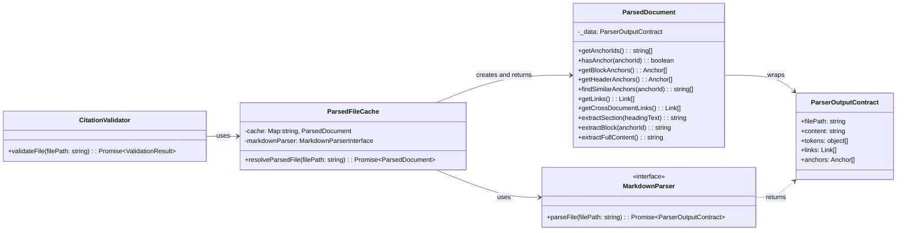

# ParsedFileCache Implementation Guide

This guide provides the Level 4 (Code) details for implementing the **`ParsedFileCache`** component, as defined in user story `us1.5`. It includes the component's structure, pseudocode for its core logic, formal data contracts, and a testing strategy.

## Problem
Components like the `CitationValidator` and the upcoming `ContentExtractor` need access to the parsed structure of multiple files during a single operation. Without a caching mechanism, the same file could be read from disk and parsed by the `MarkdownParser` repeatedly, leading to significant and unnecessary I/O and CPU overhead, creating a severe performance bottleneck.

## Solution
The **`ParsedFileCache`** component acts as an in-memory, per-run singleton that serves as a broker for parsed file data. This component implements the **Read-Through Cache** pattern. It intercepts all requests for a [**`MarkdownParser.Output.DataContract`**](Markdown%20Parser%20Implementation%20Guide.md#Data%20Contracts), calling the `MarkdownParser` only on the first request for a given file ==and wrapping the result in a `ParsedDocument` facade before storing and returning it==. Subsequent requests for the same file are served directly from the cache, ensuring that each file is parsed at most once per command execution. This drastically improves performance and reduces redundant work.

### Caching Technology
We'll use the native JavaScript **`Map`** object. A `Map` is a simple, high-performance, in-memory key-value store that's built into Node.js. It's perfectly suited for our needs and requires no external dependencies, which aligns with our [Simplicity First](../../../../ARCHITECTURE-PRINCIPLES.md#^simplicity-first) principle.

### Key-Value Structure
The key-value structure for the cache will be:
- **Key**: The **absolute, normalized file path** (string) of the document. This ensures that different relative paths pointing to the same file are treated as a single cache entry.
- **Value**: ==The **`ParsedDocument` facade instance**== that ==wraps the `MarkdownParser.Output.DataContract`== for that file. We store the ==facade instance== to ensure consumers receive a stable query interface and are decoupled from parser internals.

## Memory Management
No, we do not need to worry about manual memory cleanup. Because the cache is **ephemeral** (living only for the duration of a single command run), all memory it uses is part of the Node.js process. When the command finishes and the process exits, the operating system will automatically reclaim all of its memory. There's no risk of memory leaks between command executions.

## Structure

The `ParsedFileCache` is a class that holds an in-memory map and has a dependency on the `MarkdownParser` interface. It exposes a single public method, `resolveParsedFile()`, which asynchronously returns ==a `ParsedDocument` facade instance==. It is consumed by any component that needs parsed file data.



1. [**ParserOutputContract**](Markdown%20Parser%20Implementation%20Guide.md#Data%20Contracts): The data object ==wrapped by ParsedDocument==.
2. ==**ParsedDocument**: The facade providing query methods over parser output (US1.7).==
3. [**MarkdownParser**](Markdown%20Parser%20Implementation%20Guide.md): The dependency that produces the `ParserOutputContract` on a cache miss.
4. [**CitationValidator**](CitationValidator%20Implementation%20Guide.md): An example of a consumer of the cache.
5. [**ParsedFileCache**](ParsedFileCache%20Implementation%20Guide.md): The class that orchestrates the caching logic.

## Public Contracts

### Input Contract
1. **`filePath`** (string): The absolute, normalized path to the markdown file to be retrieved.

### Output Contract
The `resolveParsedFile()` method returns a `Promise` that resolves with ==a **`ParsedDocument` facade instance**== that ==wraps the `MarkdownParser.Output.DataContract`==.
- **Success Case**: The `Promise` resolves with ==the **`ParsedDocument` facade instance**==
- **Error Cases**: The `Promise` will reject with an appropriate error if the underlying call to `markdownParser.parseFile()` fails (e.g., due to a `FileNotFoundError` or a `ParsingError`).
- **Cache Key**: The cache internally uses absolute, normalized file paths as keys to prevent ambiguity.
- ==**Facade Wrapping**: The cache wraps `MarkdownParser.Output.DataContract` in `ParsedDocument` facade before caching and returning.==
- **Cache Lifecycle**: The cache is ephemeral and persists only for the duration of a single command execution. It is cleared when the process exits.

## Pseudocode

This pseudocode follows the **MEDIUM-IMPLEMENTATION** abstraction level, showing the core logic for the cache-hit/miss strategy and handling of concurrent requests.

```tsx
// The ParsedFileCache class, responsible for managing the in-memory lifecycle of ParsedDocument instances.
class ParsedFileCache is
  private field cache: Map of string to Promise<ParsedDocument>
  private field markdownParser: MarkdownParserInterface

  // The constructor accepts the MarkdownParser, which it will call on a cache miss.
  constructor ParsedFileCache(parser: MarkdownParserInterface) is
    // Integration: The parser dependency is provided by the factory at runtime.
    this.cache = new Map()
    this.markdownParser = parser

  // The primary public method. It returns a Promise that resolves with a ParsedDocument instance.
  public async method resolveParsedFile(filePath: string): ParsedDocument is
    // Validation: Ensure a valid file path is provided before proceeding.
    if (!filePath) then
      throw new InvalidPathError("File path cannot be null or empty.")

    // Boundary: Normalize the file path to ensure consistent cache keys.
    field cacheKey = this.normalizePath(filePath)

    // Pattern: Check if the request is already in the cache (hit).
    if (this.cache.has(cacheKey)) then
      // Return the existing ParsedDocument instance from cache
      return this.cache.get(cacheKey)

    // Pattern: Handle a cache miss.
    else
      // Boundary: Delegate the actual parsing work to the MarkdownParser.
      field parsePromise = this.markdownParser.parseFile(cacheKey)

      // Pattern: Wrap the parser output in ParsedDocument facade
      field parsedDocPromise = parsePromise.then(contract =>
        new ParsedDocument(contract)
      )

      // Store the ParsedDocument Promise in the cache immediately
      this.cache.set(cacheKey, parsedDocPromise)

      // Error Handling: If the parsePromise rejects, remove it from the cache
      // so that future requests for the same file can be retried.
      parsedDocPromise.catch(() => {
        this.cache.delete(cacheKey)
      })

      return parsedDocPromise
```

## Testing Strategy

Tests for the `ParsedFileCache` must validate its core caching logic and its correct interaction with its dependencies.

```tsx
// Test pattern: BDD-style behavioral validation for the caching component.
class ParsedFileCacheTests is

  // Test that a file is parsed only once on multiple requests.
  method test_caching_shouldParseFileOnlyOnce(): TestResult is
    // Given: A mock MarkdownParser and an instance of the ParsedFileCache.
    // When: The 'resolveParsedFile()' method is called twice with the same file path.
    // Then: The mock MarkdownParser's 'parseFile()' method should only have been called once.
    // Validation: The objects returned from both 'resolveParsedFile()' calls should be identical.
    // Boundary: Verifies the core caching logic.
  
  // Test that the cache correctly handles and propagates errors.
  method test_errorHandling_shouldPropagateParserErrors(): TestResult is
    // Given: A mock MarkdownParser that is configured to throw a 'ParsingError'.
    // When: The 'resolveParsedFile()' method is called.
    // Then: The Promise returned by 'resolveParsedFile()' should reject with the same 'ParsingError'.
    // Validation: Ensures the cache correctly manages and communicates failure states.
    
  // Test that concurrent requests for the same file result in only one parse operation.
  method test_concurrency_shouldHandleConcurrentRequests(): TestResult is
    // Given: A mock MarkdownParser and an instance of the ParsedFileCache.
    // When: 'Promise.all()' is used to call the 'resolveParsedFile()' method for the same file path multiple times concurrently.
    // Then: The mock MarkdownParser's 'parseFile()' method should only have been called once.
    // Validation: All promises returned from the concurrent 'resolveParsedFile()' calls should resolve with the same object instance.
```
