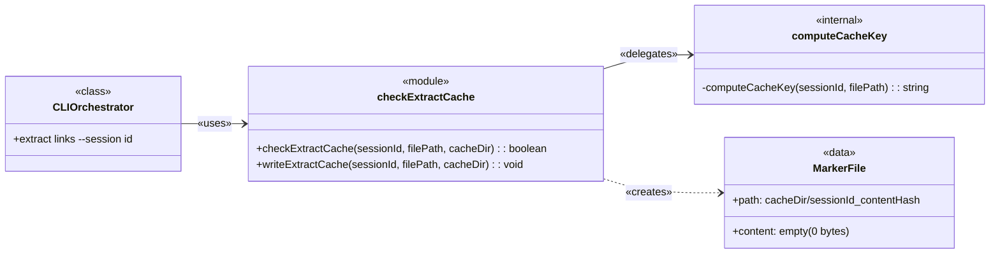

# SessionCache Component Guide

> **Classification**: Level 4 implementation detail of [**CLI Orchestrator**](../ARCHITECTURE-Citation-Manager.md#Citation%20Manager.CLI%20Orchestrator). Documented separately due to cross-concern nature (hook integration).

## Overview

Provides session-scoped deduplication for `extract links` by checking and writing empty marker files keyed on session ID and file content hash.

### Problem

1. The [**`CLI Orchestrator`**](../ARCHITECTURE-Citation-Manager.md#Citation%20Manager.CLI%20Orchestrator) is completely stateless — every `extract links` call performs full extraction regardless of whether the same content was already extracted in the current session. ^P1
2. In a Claude Code session, the PostToolUse hook fires on **every** `.md` file read, causing redundant extractions that bloat context with duplicate citation content. ^P2
3. Cache logic previously lived in ~145 lines of bash (`extractor.sh`), making it untestable with Vitest and invisible to the tool's architecture. ^P3

### Solution

The `checkExtractCache` module provides session-aware caching in TypeScript by:
1. computing a cache key from `session_id + md5(file_content)` and checking for a marker file before extraction runs (addresses [P1](#^P1), [P2](#^P2)) ^S1
2. writing an empty marker file after successful extraction to prevent re-extraction within the same session (addresses [P2](#^P2)) ^S2
3. living in the CLI tool as testable TypeScript, enabling full Vitest coverage (addresses [P3](#^P3)) ^S3

### Impact

| Problem ID | Problem | Solution ID | Solution | Impact | Principles | How Principle Applies |
| :--------: | ------- | :---------: | -------- | ------ | ---------- | --------------------- |
| [P1](#^P1) | Tool is stateless | [S1](#^S1) | Cache check before extraction | Skip redundant work per session | [Tool-First Design](../../../../ARCHITECTURE-PRINCIPLES.md#^tool-first-design) | Deterministic cache via CLI tool |
| [P2](#^P2) | Redundant extractions on re-reads | [S1](#^S1), [S2](#^S2) | File-based marker cache | Each file extracted once per session | [Simplicity First](../../../../ARCHITECTURE-PRINCIPLES.md#^simplicity-first) | Empty marker files, no complex cache |
| [P3](#^P3) | Cache logic in bash, untestable | [S3](#^S3) | TypeScript module with Vitest tests | 4 unit tests + 2 integration tests | [Mechanical Separation](../../../../ARCHITECTURE-PRINCIPLES.md#^mechanical-separation) | Cache is deterministic I/O in tool layer |

### Boundaries

The session cache is exclusively responsible for preventing duplicate `extract links` invocations within a single Claude Code session. Its responsibilities are strictly limited to deduplication of the `extract links` subcommand.

The session cache is **not** responsible for:
- Caching `extract header` or `extract file` subcommands (on-demand only, no hook trigger)
- Content extraction logic (delegated to [**`ContentExtractor`**](../ARCHITECTURE-Citation-Manager.md#Citation%20Manager.ContentExtractor))
- Output formatting for non-hook contexts (tool returns JSON; hook formats for Claude)
- Cache expiration or TTL (manual cleanup only)
- In-memory parsed file caching (separate concern handled by [**`ParsedFileCache`**](../ARCHITECTURE-Citation-Manager.md#Citation%20Manager.ParsedFileCache))

---

## Structure

### Class Diagram

The `checkExtractCache` module exposes two pure functions — `checkExtractCache()` and `writeExtractCache()` — called by the [**`CLI Orchestrator`**](../ARCHITECTURE-Citation-Manager.md#Citation%20Manager.CLI%20Orchestrator) at the command level. Both depend on `node:fs` and `node:crypto` directly (no DI).



1. **`checkExtractCache`**: Returns `true` (cache hit) or `false` (cache miss) based on marker file existence.
2. **`writeExtractCache`**: Creates empty marker file after successful extraction.
3. `computeCacheKey`: Internal function computing `${sessionId}_${md5(fileContent)}`.

---

### File Structure

```text
tools/citation-manager/
├── src/cache/
│   └── checkExtractCache.ts                   // Cache check + write functions (~49 lines)
│       ├── checkExtractCache()                // Public: cache hit/miss check
│       ├── writeExtractCache()                // Public: write marker after extraction
│       └── computeCacheKey()                  // Internal: session_id + md5(content)
│
├── test/cache/
│   └── checkExtractCache.test.ts              // Unit tests (4 tests)
│
├── test/integration/
│   └── extract-links-session-cache.test.ts    // Integration tests (2 tests)
│
.citation-manager/claude-cache/
└── ${session_id}_${content_hash}              // Empty marker files (0 bytes each)

.claude/hooks/citation-manager/
└── extractor.sh                               // Thin hook orchestrator (~145 lines)
    ├── stdin parsing                          // jq: extract session_id + file_path
    ├── CLI invocation                         // citation-manager extract links --session
    ├── exit code handling                     // 0+empty=cached, 1=no-links, 2=error
    ├── formatting                             // JSON → ## Citation: markdown blocks
    └── output                                 // hookSpecificOutput JSON to stdout
```

### Trigger Chain

```text
Claude reads .md file
  → PostToolUse:Read hook fires
    → extractor.sh receives JSON stdin {session_id, tool_input.file_path}
      → citation-manager extract links <file> --session <id>
        → checkExtractCache() — marker file exists?
          → HIT: exit 0, empty stdout (hook sees empty output, exits silently)
          → MISS: run extraction → writeExtractCache() on success
        → Hook formats JSON → ## Citation: markdown
        → Return hookSpecificOutput JSON to Claude
```

### What Gets Cached

| Subcommand | Auto-triggered? | Session cached? | Invocation context |
|---|---|---|---|
| `extract links` | Yes (PostToolUse:Read hook) | Yes (session + content hash) | Hook calls CLI on every `.md` read |
| `extract header` | No | No | Manual CLI call by agent |
| `extract file` | No | No | Manual CLI call by agent |

**Key insight**: Only `extract links` benefits from session caching because it's the only subcommand triggered automatically and repeatedly. `extract header` and `extract file` are called on-demand with explicit intent — no deduplication needed.

---

## Public Contracts

### checkExtractCache(sessionId, filePath, cacheDir)

```typescript
/**
 * Check if extraction results are cached for the given session and file content.
 *
 * Cache key: `${sessionId}_${md5(fileContent)}` — content-hash-based invalidation
 * ensures re-extraction when file changes between reads.
 */
checkExtractCache(sessionId: string, filePath: string, cacheDir: string) → boolean
```

| Type | Value | Comment |
| :------- | :-------------- | :--------------------------- |
| `@param` | `sessionId: string` | Claude Code session identifier from hook stdin |
| `@param` | `filePath: string` | Absolute path to the markdown file being extracted |
| `@param` | `cacheDir: string` | Directory for marker files (default: `.citation-manager/claude-cache`) |
| `@returns` | `boolean` | `true` = cache hit (skip extraction), `false` = cache miss |

---

### writeExtractCache(sessionId, filePath, cacheDir)

- Called by CLI Orchestrator **only** when `process.exitCode !== 1` (successful extraction with content)
- Guarded to prevent caching no-links results, allowing retry when links are added

```typescript
/**
 * Write a cache marker after successful extraction.
 *
 * Creates an empty marker file at `${cacheDir}/${sessionId}_${md5(fileContent)}`.
 * Auto-creates cache directory if missing.
 */
writeExtractCache(sessionId: string, filePath: string, cacheDir: string) → void
```

| Type | Value | Comment |
| :------- | :-------------- | :--------------------------- |
| `@param` | `sessionId: string` | Claude Code session identifier from hook stdin |
| `@param` | `filePath: string` | Absolute path to the file that was extracted |
| `@param` | `cacheDir: string` | Directory for marker files (auto-created if missing) |
| `@returns` | `void` | Side effect: creates empty marker file |

---

## Cache Mechanics

### Cache Key Strategy

```text
cache_key = "${sessionId}_${md5(fileContent)}"
```

| Component | Source | Purpose |
|---|---|---|
| `sessionId` | CLI `--session` flag (from hook stdin `.session_id`) | Scopes cache to current Claude Code conversation |
| `contentHash` | `createHash("md5").update(readFileSync(filePath)).digest("hex")` | Invalidates cache when file content changes |
| Separator | `_` | Joins components |

**Invalidation**: Content-hash-based. If the file is edited between reads, the hash changes, causing a cache miss and re-extraction. This is correct behavior — edited files may have new/changed citations.

### Cache Storage

- **Location**: `.citation-manager/claude-cache/` (project root)
- **Entry format**: Empty marker files (0 bytes) — existence = cached
- **Creation**: `writeFileSync(markerPath, "")` after successful extraction
- **Guard**: Only written when `process.exitCode !== 1` (no-links files don't get cached)
- **Cleanup**: Manual only (no TTL, no auto-expiry)
- **Lifecycle**: Persists across sessions until manually cleared

### CLI Integration

The `--session` flag on `extract links` wraps the extraction call:

```typescript
// citation-manager.ts — extract links action (lines 1168-1191)
if (options.session) {
    if (checkExtractCache(options.session, sourceFile, CACHE_DIR)) {
        process.exitCode = 0;
        return; // Cache hit — empty stdout signals hook to exit silently
    }
}

await manager.extractLinks(sourceFile, options);

// Write cache only after successful extraction (exitCode 0)
if (options.session && process.exitCode !== 1) {
    writeExtractCache(options.session, sourceFile, CACHE_DIR);
}
```

### Exit Code Protocol

| Exit Code | Stdout | Meaning | Hook Behavior |
|---|---|---|---|
| 0 | empty | Cache hit (already extracted this session) | Exit silently |
| 0 | JSON | Fresh extraction with content | Format and inject |
| 1 | — | No eligible links in file | Exit silently |
| 2 | — | System error (file not found, etc.) | Exit silently |

### Output Formatting (extractor.sh)

On cache miss with content, the hook:
1. Receives JSON from `citation-manager extract links --session`
2. Extracts `.extractedContentBlocks` via jq
3. Transforms each block into `## Citation: ${contentId}\n\n${content}` markdown
4. Wraps in `hookSpecificOutput.additionalContext` JSON for Claude

```json
{
  "hookSpecificOutput": {
    "hookEventName": "PostToolUse",
    "additionalContext": "## Citation: abc123\n\n[extracted content]\n\n---\n\n## Citation: def456\n\n[more content]"
  }
}
```

---

## Migration History

Cache logic was migrated from bash to TypeScript in [PR #98](https://github.com/WesleyMFrederick/cc-workflows/pull/98).

| Responsibility | Pre-refactor owner | Post-refactor owner |
|---|---|---|
| Cache check/write | `extractor.sh` (bash) | `checkExtractCache.ts` (TypeScript) |
| Cache key computation | `extractor.sh` | `computeCacheKey()` internal function |
| Session ID awareness | `extractor.sh` | CLI `--session <id>` flag |
| Output formatting | `extractor.sh` | `extractor.sh` (stays in hook) |
| `hookSpecificOutput` wrapping | `extractor.sh` | `extractor.sh` (stays in hook) |

**Design doc**: [cache-refactor-extract-links](../../../../openspec/changes/archive/2026-02-17-cache-refactor-extract-links/design.md)

---

## Testing Strategy

- **Unit tests**: `test/cache/checkExtractCache.test.ts` (4 tests)
  - Cache miss (no marker file)
  - Cache hit (marker exists after write)
  - Cache invalidation (file content changes)
  - Auto-creation of cache directory
- **Integration tests**: `test/integration/extract-links-session-cache.test.ts` (2 tests)
  - End-to-end `--session` flag with cache hit/miss via CLI
- **Pattern**: Real filesystem operations, BDD Given-When-Then structure, no mocks
- **Spec**: [extract-session-cache spec](../../../../openspec/specs/extract-session-cache/spec.md)

---

## Technical Debt

### Unbounded Cache Growth

Marker files accumulate across sessions with no automatic cleanup. See [Cache Growth Characteristics](#Cache%20Growth%20Characteristics) in Whiteboard for details.

**Mitigation**: Manual `rm -rf .citation-manager/claude-cache/` or future `--clear-cache` flag.
**Status**: Documented, low priority.

```github-query
outputType: table
queryType: issue
org: WesleyMFrederick
repo: cc-workflows
query: "is:issue label:component:CLIOrchestrator"
sort: number
direction: asc
columns: [number, status, title, labels, created, updated]
```

---

## Whiteboard

### Why Only `extract links` Is Cached

The three `extract` subcommands have fundamentally different invocation patterns:

| Subcommand | Trigger | Frequency | Dedup value |
|---|---|---|---|
| `extract links` | Automatic (every `.md` Read) | High (same file read multiple times per session) | **High** — prevents context bloat |
| `extract header` | Manual (agent requests specific section) | Low (intentional, targeted) | **None** — agent wants the content |
| `extract file` | Manual (agent requests full file) | Low (intentional, targeted) | **None** — agent wants the content |

The cache exists specifically to solve the "automatic repeated extraction" problem. Manual subcommands don't have this problem because they're called with explicit intent.

### Cache Growth Characteristics

- Marker files are 0 bytes (just filesystem metadata)
- Growth rate: ~1 file per unique `.md` read per session
- Typical session: 10-50 marker files
- Risk: Unbounded growth across sessions (files never auto-deleted)
- Mitigation: Manual `--clear-cache` (post-refactor) or `rm -rf .citation-manager/claude-cache/`
