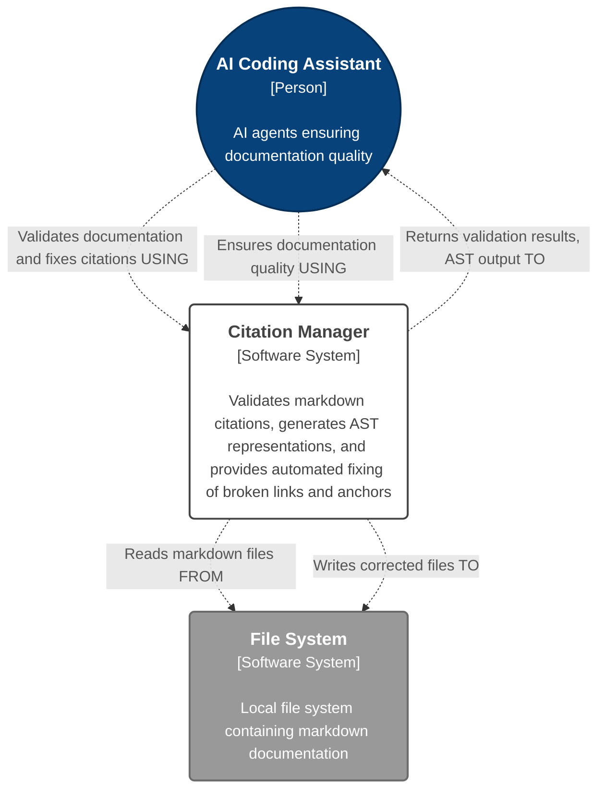
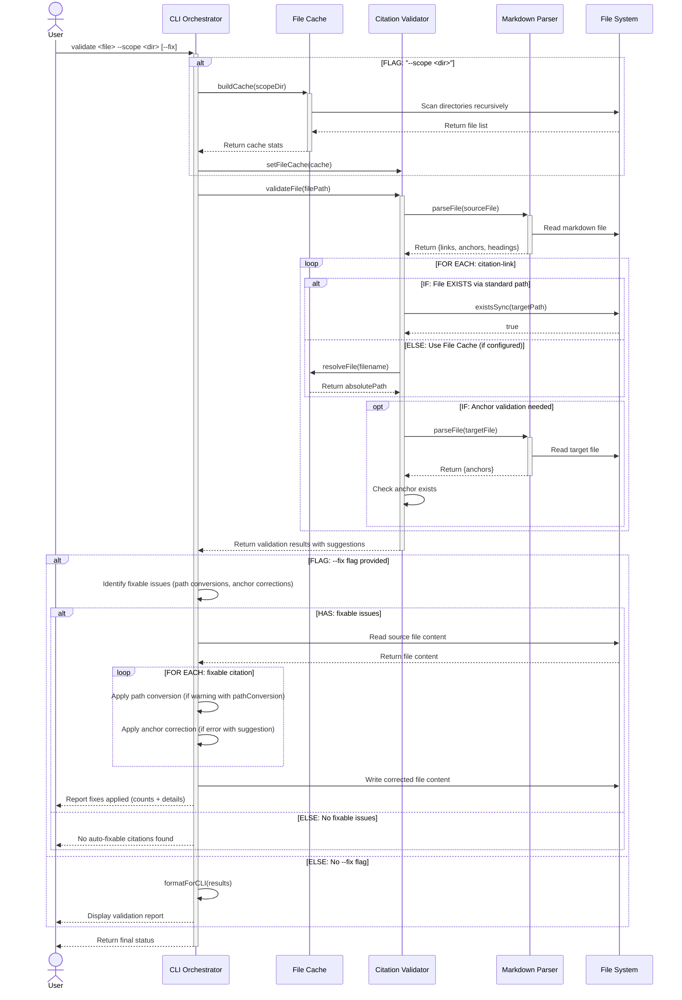
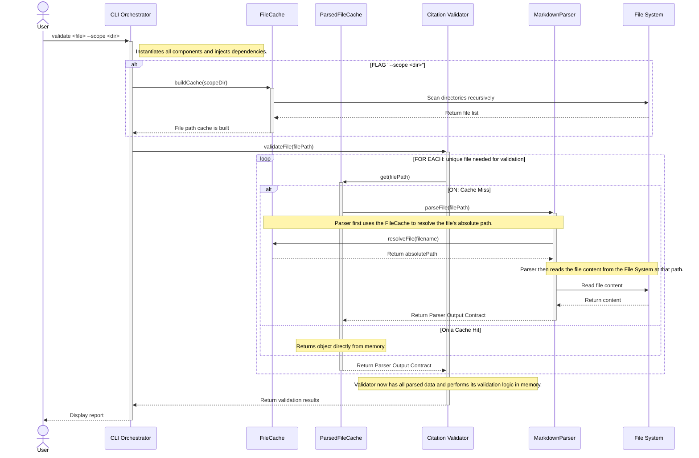

# Citation Manager - Tool Architecture [DRAFT]

**Critical LLM Initialization Instructions**: When first reading this file, you MUST IMMEDIATELY run citation manager to extract base paths: `npm run citation:base-paths <this-file-path> -- --format json`. Read ALL discovered base path files to gather complete architectural context before proceeding.

**Status**: DRAFT - Component-level architecture in development

**Parent Architecture**: [CC Workflows Workspace Architecture](../../../../../design-docs/features/20250928-cc-workflows-workspace-scaffolding/cc-workflows-workspace-architecture.md)

---

## Tool Overview

**Purpose**: Citation-manager validates markdown citation links, generates abstract syntax trees of citation relationships, and provides auto-fix capabilities for broken citations and anchors.

**User Value**:
- Eliminates manual citation validation in documentation
- Prevents broken links and invalid anchors before commits
- Provides automated citation correction and path resolution
- Enables AI agents to understand documentation structure through AST output

**Workspace Role**: First tool migrated into CC Workflows workspace, serving as validation for workspace architecture patterns and shared testing infrastructure.

---

## Level 1: System Context Diagram

This diagram shows the **Citation Manager** as the central system used by developers and AI coding assistants to maintain documentation quality through automated citation validation and correction.

### System Context Diagram



---

## Level 2: Container Context

**Container Classification**: Citation-manager is a **Tool Package Container** within the [CC Workflows Workspace](../../../../../design-docs/features/20250928-cc-workflows-workspace-scaffolding/cc-workflows-workspace-architecture.md#Level%202%20Containers) software system.

**Container Details**:
- **Name**: Citation Manager
- **Technology**: Node.js, Commander.js, ESM modules
- **Deployment**: CLI tool executable via workspace npm scripts
- **Process Model**: Single-process command execution

**Workspace Integration**:
- Testing: Shared Vitest framework from workspace root
- Quality: Shared Biome configuration from workspace root
- Dependencies: Managed via workspace package.json hoisting
- Execution: Via workspace root npm scripts (`npm run citation:validate`, etc.)

---

## Level 3: Components

%%
### Component Level: Impact Analysis

The primary impact is the addition of **Content Extractor** (Epic 2), enabling content aggregation from linked markdown sections. Existing components remain functionally unchanged during migration, with path updates only.

**Current Architecture**: 4 source files with 1:1 component mapping (CitationManager, MarkdownParser, FileCache, CitationValidator). Each file contains a single class representing one component.

#### New Components (Epic 2)
- **ContentExtractor**: Extracts and aggregates content from linked files/sections for AI context management (new standalone file)

#### Modified Components (Migration)
- All existing components: Path migration from legacy location (`src/tools/utility-scripts/citation-links/`) to workspace structure (`tools/citation-manager/src/`) only
%%

Based on analysis of the migrated codebase, here are the actual components with 1:1 file-to-component mapping:

### Citation Manager Components

#### Citation Manager.CLI Orchestrator

- **Path(s):** `tools/citation-manager/src/citation-manager.js`
- **Technology:** `Node.js` class, `Commander.js` CLI framework, ESM modules
- **Technology Status:** Production
- **Description:** CLI entry point orchestrating all citation management operations. Parses commands (validate, ast, base-paths, fix), coordinates workflow execution, formats output for CLI/JSON display, and implements auto-fix logic for broken citations and paths.

##### Interactions
- _creates and coordinates_ `Markdown Parser`, `File Cache`, ==`ParsedFileCache`==, `Citation Validator`, ==and `ContentExtractor`== components (synchronous).
- ==_injects_ dependencies such as the `FileCache` and `ParsedFileCache` into components like the `CitationValidator` at instantiation (synchronous).==
- _delegates to_ the `MarkdownParser` ==for the `ast` command (asynchronous)==.
- _delegates to_ the `CitationValidator` ==for the `validate` command (asynchronous)==.
- ==_delegates to_ the `ContentExtractor` to aggregate document content (asynchronous).==
- _reads and writes_ markdown files directly ==for the `--fix` operation== (synchronous).
- _outputs_ formatted results to stdout/stderr (synchronous).

##### Boundaries
The component's primary responsibility is to delegate core business logic (e.g., parsing, validation) to specialized components. It makes a specific exception for the **`--fix`** operation, where it contains the application-level logic to read a file, apply suggestions generated by the `CitationValidator`, and write the corrected content back to disk. This boundary exception is the basis for the [Scattered File I/O Operations](#Scattered%20File%20I/O%20Operations) Tech Debt

##### Input Public Contract
1. **Command-line arguments** (`process.argv`), provided by the user, which define the requested command and its options.
2. Access to the **component factory** to instantiate and wire together all necessary downstream components.

##### Output Public Contract
1. A **formatted string** (a human-readable report or JSON) written to `stdout`.
2. An **exit code** (`0` for success, non-zero for failure) to signal the outcome of the operation to the calling process.
3. **File system modifications**, which occur only when the `--fix` command is used.

#### Citation Manager.Markdown Parser
- **Path(s):** `tools/citation-manager/src/MarkdownParser.js`
- **Technology:**
  - `Node.js` class
  - `marked` markdown tokenizer library
  - ESM modules
- **Technology Status:** Production
- **Description:** Parses markdown files to extract AST representation of document structure. Identifies cross-document links (multiple pattern types), extracts headings and anchors (including Obsidian block refs and caret syntax), generates multiple anchor format variations for compatibility.
- **Implementation Guide**: [Markdown Parser Implementation Guide](../../component-guides/Markdown%20Parser%20Implementation%20Guide.md) for the detailed data contract schema and examples

##### Interactions
- _reads_ markdown files directly from file system (synchronous)
- _tokenizes_ markdown content using `marked` library (synchronous)
- _provides_ structured AST data to `CLI Orchestrator` and `Citation Validator` (synchronous)

##### Boundaries
The component is exclusively responsible for transforming a raw markdown string into the structured **Parser Output Contract**. Its responsibilities are strictly limited to syntactic analysis. The component is **not** responsible for:
- Validating the existence or accessibility of file paths.
- Verifying the semantic correctness of links or anchors.
- Interpreting or executing any code within the document.

##### Input Public Contract
1. **`File System interface`**, provided at instantiation, which must be capable of reading file contents.
2. **`file path`** `(string)`, provided to its public `parseFile()` method, identifying the document to be parsed.

##### Output Public Contract
The component's `parseFile()` method guarantees a return object (**Parser Output Contract**) that represents the structural composition of the source document.

#### Citation Manager.File Cache
- **Path(s):** `tools/citation-manager/src/FileCache.js`
- **Technology:** `Node.js` class, ESM modules
- **Technology Status:** Production
- **Description:** Maintains an in-memory cache mapping short filenames to absolute file paths within a given directory scope. It handles symlink resolution to avoid duplicates, detects duplicate filenames, and provides fuzzy matching capabilities for common typos.

##### Interactions
- _scans_ directories recursively to build its internal cache upon request (synchronous).
- _provides_ filename-to-absolute-path resolution to the `Citation Validator` (synchronous).
- _warns_ about duplicate filenames to stderr during the cache build process (synchronous).

##### Boundaries
The component is exclusively responsible for mapping short filenames to their absolute file paths within a given directory scope. Its file system access is limited to the initial directory scan when `buildCache()` is called. It is **not** responsible for reading, parsing, or caching the **content** of any files; it only manages their paths.

##### Input Public Contract
1. A **File System interface** and a **Path Module interface**, provided at instantiation.
2. A **`scopeFolder`** (string), provided to its `buildCache()` method to initialize the cache.
3. A **`filename`** (string), provided to its `resolveFile()` method to perform a lookup.

##### Output Public Contract
The component's primary output is from the `resolveFile()` method, which returns a **Resolution Result object**. This object indicates whether a file was `found`, its absolute `path` if successful, and contextual information such as the `reason` for failure (e.g., 'duplicate', 'not_found'). The `buildCache()` method returns a statistics object summarizing the state of the cache after a scan.

#### Citation Manager.Citation Validator
- **Path(s):** `tools/citation-manager/src/CitationValidator.js`
- **Technology:**
  - `Node.js` class
  - ESM modules
- **Technology Status:** Production
- **Description:** ==Validates `Link Objects` by consuming `Parser Output Contract` objects to check for target and anchor existence.== It classifies citation patterns (caret syntax,cross-document, wiki-style), resolves file paths using multiple strategies (relative paths, symlinks, Obsidian absolute paths, cache lookup), generates validation results with actionable suggestions.
- ==**Implementation Guide**: [CitationValidator Implementation Guide](../../component-guides/CitationValidator%20Implementation%20Guide.md) for public contracts and data objects==
  
##### Interactions
- ==_uses_ the `ParsedFileCache` to retrieve parsed data for target files (asynchronous).==
- _uses_ the `FileCache` for filename resolution when a scope is provided (synchronous, optional dependency).
- _validates_ file existence directly via the file system as a fallback (synchronous).
- _returns_ validation results with status and suggestions to the `CLI Orchestrator` (asynchronous).

##### ==Boundaries==
- ==The component is exclusively responsible for the semantic validation of `Link Objects` (e.g., "does this link point to a real target?").==
- ==It is **not** responsible for parsing markdown (delegated to `MarkdownParser` via the cache) or for managing the efficiency of parsing operations (delegated to `ParsedFileCache`).==
- ==It does **not** perform file modifications; it only generates suggestions.==

##### ==Input Public Contract==
==The component's contract requires two inputs for operation:==
1. ==A **`ParsedFileCache` interface** and a **`FileCache` interface**, provided at instantiation.==
2. ==A **`file path`** (string), provided to its public `validateFile()` method.==

##### ==Output Public Contract==
==The `validateFile()` method returns a `Promise` that resolves with a **Validation Result object**. This object contains a `summary` of the validation run and an array of `results`, where each item represents the validation status of a single `Link Object`.==

#### ==Citation Manager.ParsedFileCache==
- ==**Path(s):** `tools/citation-manager/src/ParsedFileCache.js` (_PROPOSED - [Story 1.5](https://www.google.com/search?q=content-aggregation-prd.md%23Story%25201.5%2520Implement%2520a%2520Cache%2520for%2520Parsed%2520File%2520Objects)_)==
- ==**Technology:**==
  - ==`Node.js` class==
  - ==ESM modules==
- ==**Technology Status:** To Be Implemented==
- ==**Description:** Maintains an in-memory cache of parsed file objects (`Parser Output Contract`) for the duration of a single command run. It ensures that each file is read from disk and parsed by the `MarkdownParser` at most once.==
- ==**Implementation Guide**: [ParsedFileCache Implementation Guide](../../component-guides/ParsedFileCache%20Implementation%20Guide.md) for public contracts and data objects==

##### ==Interactions==
- ==_is consumed by_ the `CitationValidator` and `ContentExtractor` to retrieve parsed file data (asynchronous).==
- ==_delegates to_ the `MarkdownParser` to parse files that are not yet in the cache (asynchronous).==
- ==_is instantiated by_ the `CLI Orchestrator` (via its factory) (synchronous).==

##### ==Boundaries==
- ==The component's sole responsibility is to manage the in-memory lifecycle of parsed file objects. It acts as a key-value store mapping file paths to `Parser Output Contract` objects.==
- ==It is **not** responsible for the parsing logic itself (which is delegated) or for any direct file system operations.==

##### ==Error Handling & Cache Correctness==
- ==**Promise Rejection Pattern**: When a parse operation fails (e.g., file not found, permission error), the cache MUST synchronously remove the failed promise before propagating the rejection. This ensures subsequent requests can retry without being blocked by stale failed promises.==
- ==**Retry Support**: Removing failed promises from cache enables retry on transient errors (temporary permission issues, network drive timeouts).==
- ==**Implementation Critical**: The `.catch()` handler must execute `cache.delete(key)` synchronously to prevent race conditions between error handling and new requests.==

#### ==Citation Manager.Content Extractor==
- ==**Path(s):** `tools/citation-manager/src/ContentExtractor.js` (_PROPOSED - [Epic 2](https://www.google.com/search?q=content-aggregation-prd.md%23Feature%2520Epics))_==
- ==**Technology:**==
  - ==`Node.js` class==
  - ==ESM modules==
- ==**Technology Status:** To Be Implemented==
- ==**Description:** Extracts full content from linked documents or specific sections within them. It uses the pre-parsed token stream to reliably identify section boundaries for accurate content aggregation.==

##### ==Interactions==
- ==_is consumed by_ the `CLI Orchestrator` to perform content aggregation (asynchronous).==
- ==_uses_ the `ParsedFileCache` to retrieve the `Parser Output Contract` (which includes the content and tokens) for target documents (asynchronous).==

##### ==Boundaries==
- ==The component's sole responsibility is to extract a string of content from a `Parser Output Contract` based on a given `Link Object`.==
- ==It is **not** responsible for parsing markdown or reading files from disk; it operates on the already-parsed data provided by the cache.==

##### ==Input Public Contract==
1. ==A **`ParsedFileCache` interface**, provided at instantiation.==
2. ==A **`Link Object`**, provided to its public `extract()` method, which specifies the target file and anchor to extract.==

##### ==Output Public Contract==
==The `extract()` method returns a `Promise` that resolves with a **Content Block object**. This object contains the extracted `content` (string) and `metadata` about its source (e.g., the source file path and anchor).==

### Component Interaction Diagram
The following sequence diagram illustrates the primary workflow pattern used by the `validate`, `ast`, `base-paths`, and `fix` commands. This diagram demonstrates component creation, optional dependency injection, parser reuse, validation logic, and the file modification pattern for auto-fix operations.



**Workflow Characteristics**:
- **Component Creation**: CLI Orchestrator creates instances of all components at runtime
- **Optional Dependency**: File Cache is only created and injected when `--scope` option is provided
- **Parser Reuse**: Markdown Parser is used by both Validator (composition) and CLI Orchestrator (delegation)
- **Multi-Level File System Access**: Both Parser and Validator interact directly with file system (no centralized FS manager)
- **Synchronous Communication**: All component interactions are blocking method calls appropriate for CLI batch processing
- **Alternative Paths**: Validation uses standard file resolution first, falling back to cache-based resolution when configured
- **Fix Logic Location**: Auto-fix logic resides in CLI Orchestrator, not a separate component, operating on validation results with suggestions

### ==Component Interaction Diagram After US1.5==



**Workflow Characteristics (Post-`us1.5`)**
- **Component Creation**: The `CLI Orchestrator` (via its factory) creates instances of all components at runtime.
- **Dependency Injection**: Dependencies are injected at instantiation (e.g., `FileCache` into `Parser`, `ParsedFileCache` into `Validator`), decoupling the components.
- **Dual Caching Strategy**: The workflow uses two distinct caches: `FileCache` for mapping short filenames to paths, and `ParsedFileCache` to store the in-memory results of expensive file parsing operations.
- **Layered Data Retrieval**: The `CitationValidator` is decoupled from the `MarkdownParser`; it requests all parsed data from the `ParsedFileCache`, which in turn delegates to the `Parser` on a cache miss.
- **Centralized File System Access**: File System access is more centralized. The `FileCache` scans directories, the `MarkdownParser` reads file content, and the `CLI Orchestrator` writes file modifications for the `--fix` operation.
- **Asynchronous Data Flow**: Core data retrieval operations are **asynchronous** (`Promise`-based) to handle potential file I/O within the `ParsedFileCache`.
- **Fix Logic Location**: The `fix` logic remains within the `CLI Orchestrator`, operating on the final validation results.

### Component Architecture Notes
- **Cross-Cutting Infrastructure**: All components use Node.js `fs` and `path` modules directly for file I/O operations. There is no centralized File System Manager abstraction - this follows a pragmatic approach prioritizing simplicity over layered architecture for this tool's scope.
- **Interaction Style**: All component interactions are synchronous method calls. The tool uses blocking I/O operations appropriate for CLI batch processing.
- **Component Mapping**: Each component corresponds to exactly one source file containing one class (1:1 mapping), following simple modular design principles.

#### Path Normalization Strategy

**ParsedFileCache Approach**:
- Uses Node.js built-in normalization: `path.resolve(path.normalize(filePath))`
- Simple, predictable, no external dependencies
- Handles relative paths, `./` prefixes, redundant separators
- Does NOT handle symlinks (documented limitation)

**Design Rationale**:
- Maintains "Simplicity First" principle - no separate PathResolver component
- Cache needs basic key normalization, not complex multi-strategy resolution
- CitationValidator's 4-strategy resolution (symlinks, Obsidian paths, FileCache) remains separate concern
- Future: If path logic centralization becomes needed, extract PathResolver component

**Trade-offs Accepted**:
- Symlinks: Different symlink paths to same file create separate cache entries
- Mitigation: Users can pass absolute paths if symlink normalization needed
- Real-world impact: Minimal for documentation file use case

---

## Level 4: Code Organization

### Current File Structure

**Source Code Location** (migrated):

```text
tools/citation-manager/
├── src/
│   ├── citation-manager.js          # CLI entry point (EXISTING)
│   └── CitationValidator.js         # Core validation logic (EXISTING)
└── design-docs/
    └── Architecture.md               # This file
```

### Module System

**Type**: ECMAScript Modules (ESM)
- Uses `import`/`export` syntax
- Explicit `.js` extensions in import paths
- Confirmed in [US1.3 Implementation Note](../../../../../design-docs/features/20250928-cc-workflows-workspace-scaffolding/user-stories/us1.3-make-migrated-citation-manager-executable/us1.3-make-migrated-citation-manager-executable.md)

**Import Pattern Example**:

```javascript
import { CitationValidator } from "./src/CitationValidator.js";
```

### Coding Standards

Follows workspace coding standards defined in [Architecture: Coding Standards](../../../../../design-docs/features/20250928-cc-workflows-workspace-scaffolding/cc-workflows-workspace-architecture.md#Coding%20Standards%20and%20Conventions):
- Files: `kebab-case.js`
- Functions/Variables: `camelCase`
- Classes: `TitleCase`
- Test Descriptions: Natural language with spaces in `it()` methods

---

## Testing Strategy

### Framework

**Test Framework**: Vitest (shared workspace framework)
- Configuration: Root `vitest.config.js`
- Execution: `npm test` from workspace root
- Discovery Pattern: `tools/**/test/**/*.test.js`

### Test Organization

**Test Location** (target after migration):

```text
tools/citation-manager/test/
├── validation.test.js               # Core validation tests
├── auto-fix.test.js                 # Auto-fix feature tests
├── enhanced-citations.test.js       # Enhanced citation tests
├── path-conversion.test.js          # Path resolution tests
├── story-validation.test.js         # Story-specific validation
├── cli-warning-output.test.js       # CLI output tests
├── warning-validation.test.js       # Warning system tests
└── fixtures/                        # 16+ test fixture files
    ├── valid-citations.md
    ├── broken-links.md
    └── [additional fixtures]
```

**Current Location** (being migrated from):

```text
src/tools/utility-scripts/citation-links/test/
```

### Testing Principles

Follows workspace testing strategy from [Architecture: Testing Strategy](../../../../../design-docs/features/20250928-cc-workflows-workspace-scaffolding/cc-workflows-workspace-architecture.md#Testing%20Strategy):
- **MVP-Focused**: Target 0.3:1 to 0.5:1 test-to-code ratio
- **Integration-Driven**: Real file system operations, no mocking
- **BDD Structure**: Given-When-Then comment structure required
- **Real Systems**: Zero-tolerance policy for mocking

### Process Management

Citation-manager test suite uses CLI integration testing via `execSync()`, which can leave Vitest worker processes in memory after test completion. See [Workspace Testing Infrastructure - Vitest Process Management](../../../../../design-docs/features/20250928-cc-workflows-workspace-scaffolding/cc-workflows-workspace-architecture.md#Vitest%20Process%20Management%20and%20Cleanup) for configuration best practices and cleanup procedures.

**Quick Cleanup**:

```bash
# Kill hanging Vitest worker processes
pkill -f "vitest"
```

---
## Technology Stack

| Technology | Version | Purpose | Source |
|------------|---------|---------|--------|
| **Node.js** | ≥18.0.0 | Runtime environment | [Workspace Tech Stack](../../../../../design-docs/features/20250928-cc-workflows-workspace-scaffolding/cc-workflows-workspace-architecture.md#Technology%20Stack) |
| **Commander.js** | ^14.0.1 | CLI command parsing and argument handling | Tool-specific dependency |
| **marked** | ^15.0.12 | Markdown tokenization and AST generation | Tool-specific dependency |
| **Vitest** | latest | Testing framework (shared) | [Workspace Tech Stack](../../../../../design-docs/features/20250928-cc-workflows-workspace-scaffolding/cc-workflows-workspace-architecture.md#Technology%20Stack) |
| **Biome** | latest | Linting/formatting (shared) | [Workspace Tech Stack](../../../../../design-docs/features/20250928-cc-workflows-workspace-scaffolding/cc-workflows-workspace-architecture.md#Technology%20Stack) |
| **Node.js built-in modules** | native | File I/O (fs), path operations (path), URL utilities (url) | Node.js standard library |

---

## Cross-Cutting Concerns

As a tool within the CC Workflows Workspace, the Citation Manager inherits all of its cross-cutting architectural patterns from the [parent system](../../../../../design-docs/features/20250928-cc-workflows-workspace-scaffolding/cc-workflows-workspace-architecture.md#Cross-Cutting%20Concerns).

### Code Quality and Consistency
All source code within the `citation-manager` package must adhere to the shared `biome.json` configuration located at the workspace root. This includes standards for **tab indentation** and **double quotes** for strings.

### Testing Infrastructure
The tool's test suite, located in `tools/citation-manager/test/`, is executed by the shared **Vitest framework**. Tests are discovered via the `tools/**/test/**/*.test.js` glob pattern and must follow the workspace's established testing principles, including the **"Real Systems, Fake Fixtures"** approach, BDD-style comments, and `snake_case` test naming.

### Dependency Management
The tool's dependencies, such as `commander` and `marked`, are declared in its local `package.json` but are managed and hoisted by **NPM Workspaces** at the root level.

---

## Design Principles Adherence

This tool follows workspace design principles defined in [Architecture Principles](../../../../../design-docs/Architecture%20Principles.md):

**Key Principles**:
- [**Modular Design**](../../../../../design-docs/Architecture%20Principles.md#Modular%20Design%20Principles): Component-based architecture with clear boundaries
- [**Deterministic Offloading**](../../../../../design-docs/Architecture%20Principles.md#Deterministic%20Offloading%20Principles): Predictable, mechanical citation processing
- [**Safety-First**](../../../../../design-docs/Architecture%20Principles.md#Safety-First%20Design%20Patterns): Backup creation before auto-fix, dry-run capability
- [**Self-Contained Naming**](../../../../../design-docs/Architecture%20Principles.md#Self-Contained%20Naming%20Principles): Descriptive command and component names

---

## Known Risks and Technical Debt

### Redundant File Parsing During Validation

**Risk Category**: Performance / Architecture

**Description**: The [CitationValidator](#Citation%20Manager%2ECitation%20Validator) currently operates without a caching mechanism for parsed files. During a single validation run, if a source document links to the same target file multiple times (e.g., ten different links to `guide.md`), the `CitationValidator` will read and parse `guide.md` from the disk ten separate times. This leads to significant I/O and CPU overhead, especially in documents with many citations to the same few architectural files.

**Impact**:
- **High**: This inefficiency will become a severe performance bottleneck for the upcoming [**Epic 2 Content Aggregation**](content-aggregation-prd.md#Feature%20Epics) feature, as the new [ContentExtractor](#==Citation%20Manager%2EContent%20Extractor==) will also need to read these same files, compounding the redundant operations.
- **Medium**: It is a latent performance issue in the current validation and `--fix` logic that becomes more pronounced in larger documents.
- **Scope**: Primarily affects [CitationValidator](#Citation%20Manager%2ECitation%20Validator) and its interaction with [MarkdownParser](#Citation%20Manager%2EMarkdown%20Parser).

**Rationale for Accepting Risk**: This architectural inefficiency was not identified during the initial tool migration. It became a critical issue only after the design for Epic 2 revealed that a new `ContentExtractor` component would be severely impacted by the lack of a caching layer. The decision was made to formally document this as technical debt and address it before beginning new feature work.

**Mitigation Strategy**: Implement a new user story, **`us1.5: Implement a Cache for Parsed File Objects`**, to introduce an in-memory caching layer for `Parser Output Contract` objects.

**Resolution Criteria**:
- An in-memory cache is implemented to store the results of [MarkdownParser](#Citation%20Manager%2EMarkdown%20Parser)'s `parseFile()` method for the duration of a single command run.
- The [CitationValidator](#Citation%20Manager%2ECitation%20Validator) is refactored to request parsed file objects from this cache instead of calling the parser directly.
- The cache ensures a file is read from disk and parsed at most once per command execution.
- All existing tests pass with zero functional regressions after the caching layer is integrated.

**Timeline**: Address immediately, after fixing stale tests and before beginning Epic 2 (`us2.1`).
**Status**: Documented technical debt, high priority.

### Scattered File I/O Operations

**Risk Category**: Architecture / Maintainability
**Description**: Currently, multiple components perform direct file system operations. The `MarkdownParser` reads files, the `CitationValidator` checks for file existence, and the `CLI Orchestrator` reads and writes files for the `--fix` command. This scatters a core cross-cutting concern throughout the application, violating the Single Responsibility Principle.

**Impact**:
- **High**: This makes the components harder to test in isolation, as the Node.js `fs` module must be mocked or managed in multiple places. It also increases the risk of inconsistent error handling for I/O operations and makes the overall system more brittle.
- **Scope**: Affects `MarkdownParser`, `CitationValidator`, and `CLI Orchestrator`.
  
**Rationale for Accepting Risk**: This pattern is a remnant of the tool's original, simpler design. Formally separating file I/O is a refactoring effort that was not prioritized over the foundational DI and caching work, which are direct blockers for new feature development.

**Mitigation Strategy**: Create a dedicated **`FileSystemManager`** component. This component would centralize all file system interactions (`readFile`, `writeFile`, `exists`, etc.). It would be instantiated by the factory and injected as a dependency into all components that need to interact with the disk.

**Resolution Criteria**:
- A new `FileSystemManager` component is created and integrated via the component factory.
- All direct `fs` module usage is removed from `MarkdownParser`, `CitationValidator`, and `CLI Orchestrator`.
- These components are refactored to use the injected `FileSystemManager` for all file I/O operations.
  
**Timeline**: Address after Epic 2 is complete. This is a valuable refactoring for long-term maintainability but does not block the current feature roadmap.
**Status**: Documented technical debt, medium priority.

### ParsedFileCache Memory Characteristics

**Risk Category**: Performance / Resource Management
**Description**: The `ParsedFileCache` stores complete `Parser Output Contract` objects in memory, including the full file content string. For large architectural documents or multi-file validation runs, this creates measurable memory overhead.

**Memory Profile**:
- **Typical Document**: 50KB per cached file
- **Large Document**: 500KB per cached file
- **Validation Run Example**: 100 files = 5-50MB in memory
- **Additional Overhead**: Token arrays, link objects, anchor objects per file

**Impact**:
- **Low**: Acceptable for CLI tool with ephemeral per-command lifecycle
- **Scope**: Memory released automatically when command process exits
- **Scale Limits**: No production concerns identified for documentation file use cases

**Rationale for Accepting Risk**: The ParsedFileCache follows an ephemeral, per-command caching strategy where the cache exists only during a single CLI command execution. Since the Node.js process exits after command completion, the operating system automatically reclaims all memory. This simple approach eliminates the need for complex memory management (LRU eviction, cache size limits, TTL) while meeting MVP requirements.

**Monitoring Strategy**: If Epic 2 content aggregation shows memory pressure exceeding 100MB during normal operations, consider optimization strategies:
- Lazy content loading (cache metadata without full content)
- LRU eviction policy for large validation runs
- Content streaming for extraction operations

**Resolution Criteria**: No action required unless real-world usage demonstrates memory issues. Current design sufficient for documented use cases.

**Timeline**: Monitor during Epic 2 implementation; optimize only if empirical evidence demonstrates need.
**Status**: Documented architectural characteristic, acceptable trade-off for MVP scope.

## Architecture Decision Records (ADRs)

### ADR-001: Phased Test Migration Strategy

- **Status**: Accepted
- **Date**: 2025-10-04
- **Context**: Analysis of US1.4 scope revealed that test migration involves two distinct, separable work streams with different risk profiles:
 1. **Test Framework Conversion**: Migrating 1,863 lines across 7 test files from `node:test` to Vitest with `expect()` assertions
 2. **Component DI Refactoring**: Restructuring CitationValidator, MarkdownParser, and FileCache for constructor-based dependency injection with factory pattern implementation

 Combining both efforts creates compound risk: test conversion failures could mask DI refactoring issues, and vice versa. Additionally, Epic 2 architecture design will establish DI patterns for new components (ContentExtractor), making it more effective to refactor existing components after new patterns are proven.

- **Decision**: Split US1.4 into two sequential stories:
  - **US1.4a - Test Migration**: Convert test suite to Vitest, update assertions to expect(), fix paths to workspace structure. Accept non-DI component instantiation as temporary technical debt.
  - **US1.4b - DI Refactoring**: Implement constructor-based DI, create factory pattern, update tests for DI usage, add integration tests. Resolves documented technical debt.

- **Alternatives Considered**:
  - **Comprehensive US1.4**: Do both simultaneously - rejected due to compound risk and delayed Epic 2 delivery
  - **Minimal US1.4 with indefinite debt**: Accept non-DI architecture permanently - rejected as violates workspace architecture principles

- **Consequences**:
  - **Positive**: Risk isolation - test conversion validated independently before component refactoring begins
  - **Positive**: Faster Epic 2 start - US1.4a unblocks architecture design for new components
  - **Positive**: Better DI patterns - Epic 2 design informs US1.4b refactoring approach
  - **Positive**: Incremental validation - clear gates between test migration and DI implementation
  - **Negative**: Temporary architectural non-compliance during US1.4a execution (mitigated by time-boxed technical debt)
  - **Negative**: Two-phase migration overhead (mitigated by reduced compound risk)

- **Implementation Timeline**:
  - US1.4a: Immediate (Epic 1 completion)
  - US1.4b: After Epic 2 architecture design, before US2.1 implementation

---

## CLI Commands

**Available Commands** (validated in US1.3):
- `validate` - Validate citation links in markdown files
- `ast` - Generate abstract syntax tree of citations
- `extract` - Extract base paths from citations
- `baseline` - [TBD - functionality to be documented]
- `--fix` - Auto-fix broken citations and anchors
- `--help` - Display help menu

**Execution Pattern**:

```bash
npm run citation:validate <file-path> [options]
npm run citation:ast <file-path> [options]
npm run citation:base-paths <file-path> -- --format json
```

---

## Migration Status

| Component | Source Location | Target Location | Status |
|-----------|----------------|-----------------|---------|
| **Source Code** | `src/tools/utility-scripts/citation-links/` | `tools/citation-manager/src/` | ✓ US1.2 Complete |
| **CLI Executability** | N/A | Via workspace npm scripts | ✓ US1.3 Complete |
| **Test Suite** | `src/tools/utility-scripts/citation-links/test/` | `tools/citation-manager/test/` | ✓ US1.4a Complete |
| **DI Architecture** | N/A | Component constructor injection | ✓ US1.4b Complete |
| **Factory Pattern** | N/A | `src/factories/componentFactory.js` | ✓ US1.4b Complete |
| **Documentation** | Scattered | `tools/citation-manager/design-docs/` | ⏳ In Progress |

---

## Future Enhancements (Epic 2)

**Content Aggregation Feature** (planned):
- Extract full content from linked sections
- Aggregate content into single output file
- Support both section-specific and full-file extraction
- Provide metadata-rich output for AI context management

**Reference**: [Epic 2: citation-manager Content Aggregation Enhancement](content-aggregation-prd.md#Feature%20Epics)

---

## Document Status

**Last Updated**: 2025-10-05
**Version**: 0.2 (Draft)
**Next Steps**:
- ✓ Complete US1.4a test migration to Vitest (DONE)
- ✓ Implement US1.4b DI refactoring with factory pattern (DONE)
- Design Epic 2 architecture with DI patterns for ContentExtractor
- Document component interfaces and data contracts
- Create component interaction diagrams

---

## Related Documentation

- [Architecture Principles](../../../../../design-docs/Architecture%20Principles.md) - Design principles and patterns
- [citation-guidelines](../../../../../agentic-workflows/rules/citation-guidelines.md) - Citation linking guidelines

## Whiteboard

### Anchor Object Definition
