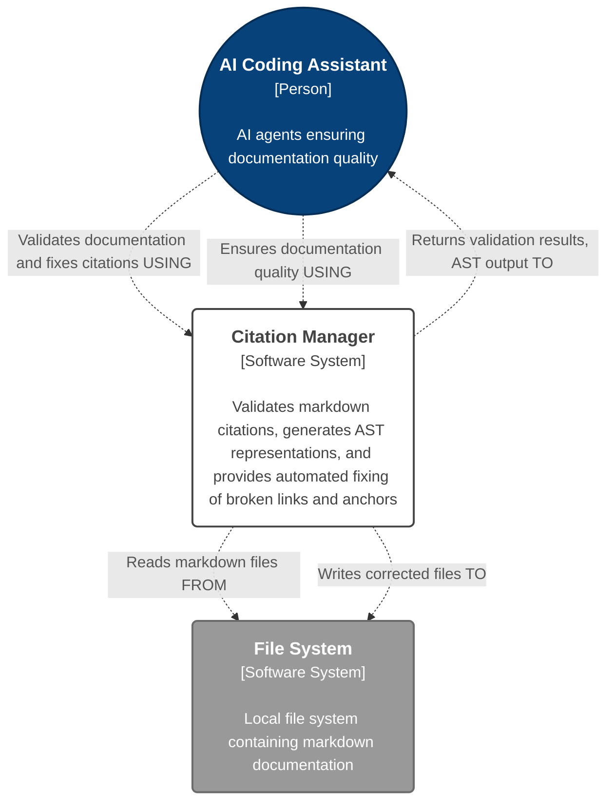
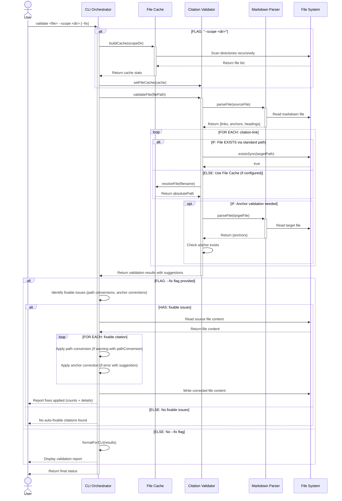

# Citation Manager - Tool Architecture [DRAFT]

**Critical LLM Initialization Instructions**: When first reading this file, you MUST IMMEDIATELY run citation manager to extract base paths: `npm run citation:base-paths <this-file-path> -- --format json`. Read ALL discovered base path files to gather complete architectural context before proceeding.

**Status**: DRAFT - Component-level architecture in development

**Parent Architecture**: [CC Workflows Workspace Architecture](../../../../../design-docs/features/20250928-cc-workflows-workspace-scaffolding/cc-workflows-workspace-architecture.md)

---

## Tool Overview

**Purpose**: Citation-manager validates markdown citation links, generates abstract syntax trees of citation relationships, and provides auto-fix capabilities for broken citations and anchors.

**User Value**:
- Eliminates manual citation validation in documentation
- Prevents broken links and invalid anchors before commits
- Provides automated citation correction and path resolution
- Enables AI agents to understand documentation structure through AST output

**Workspace Role**: First tool migrated into CC Workflows workspace, serving as validation for workspace architecture patterns and shared testing infrastructure.

---

## Level 1: System Context Diagram

This diagram shows the **Citation Manager** as the central system used by developers and AI coding assistants to maintain documentation quality through automated citation validation and correction.

### System Context Diagram



---

## Level 2: Container Context

**Container Classification**: Citation-manager is a **Tool Package Container** within the [CC Workflows Workspace](../../../../../design-docs/features/20250928-cc-workflows-workspace-scaffolding/cc-workflows-workspace-architecture.md#Level%202%20Containers) software system.

**Container Details**:
- **Name**: Citation Manager
- **Technology**: Node.js, Commander.js, ESM modules
- **Deployment**: CLI tool executable via workspace npm scripts
- **Process Model**: Single-process command execution

**Workspace Integration**:
- Testing: Shared Vitest framework from workspace root
- Quality: Shared Biome configuration from workspace root
- Dependencies: Managed via workspace package.json hoisting
- Execution: Via workspace root npm scripts (`npm run citation:validate`, etc.)

---

## Level 3: Components

%%
### Component Level: Impact Analysis

The primary impact is the addition of **Content Extractor** (Epic 2), enabling content aggregation from linked markdown sections. Existing components remain functionally unchanged during migration, with path updates only.

**Current Architecture**: 4 source files with 1:1 component mapping (CitationManager, MarkdownParser, FileCache, CitationValidator). Each file contains a single class representing one component.

#### New Components (Epic 2)
- **ContentExtractor**: Extracts and aggregates content from linked files/sections for AI context management (new standalone file)

#### Modified Components (Migration)
- All existing components: Path migration from legacy location (`src/tools/utility-scripts/citation-links/`) to workspace structure (`tools/citation-manager/src/`) only
%%

Based on analysis of the migrated codebase, here are the actual components with 1:1 file-to-component mapping:

### Citation Manager Components

#### Citation Manager.CLI Orchestrator
- **Path(s):** ==`tools/citation-manager/src/citation-manager.js` (_MIGRATED_)==
  %% Legacy: `src/tools/utility-scripts/citation-links/citation-manager.js` %%
- **Technology:** `Node.js` class, `Commander.js` CLI framework, ESM modules
- **Technology Status:** Production
- **Description:** CLI entry point orchestrating all citation management operations. Parses commands (validate, ast, base-paths, fix), coordinates workflow execution, formats output for CLI/JSON display, and implements auto-fix logic for broken citations and paths.
- **Interactions:**
  - _creates and coordinates_ `Markdown Parser`, `Citation Validator`, and `File Cache` components (synchronous)
  - _delegates to_ `Markdown Parser` for AST generation (synchronous)
  - _delegates to_ `Citation Validator` for citation validation (synchronous)
  - _configures_ `Citation Validator` with `File Cache` when scope provided (synchronous)
  - _reads and writes_ markdown files directly for fix operations (synchronous)
  - _outputs_ formatted results to stdout/stderr (synchronous)

#### Citation Manager.Markdown Parser
- **Path(s):** `tools/citation-manager/src/MarkdownParser.js`
- **Technology:**
	- `Node.js` class
	- `marked` markdown tokenizer library
	- ESM modules
- **Technology Status:** Production
- **Description:** Parses markdown files to extract AST representation of document structure. Identifies cross-document links (multiple pattern types), extracts headings and anchors (including Obsidian block refs and caret syntax), generates multiple anchor format variations for compatibility.

##### Interactions
- _reads_ markdown files directly from file system (synchronous)
- _tokenizes_ markdown content using `marked` library (synchronous)
- _provides_ structured AST data to `CLI Orchestrator` and `Citation Validator` (synchronous)

##### Boundaries
The component is exclusively responsible for transforming a raw markdown string into the structured **Parser Output Contract**. Its responsibilities are strictly limited to syntactic analysis. The component is **not** responsible for:

- Validating the existence or accessibility of file paths.
- Verifying the semantic correctness of links or anchors.
- Interpreting or executing any code within the document.

##### Input Public Contract
The component's contract requires two inputs for operation:

1. **`File System interface`**, provided at instantiation, which must be capable of reading file contents.
2. **`file path`** `(string)`, provided to its public `parseFile()` method, identifying the document to be parsed.

##### Output Public Contract
The component's `parseFile()` method guarantees a return object (**Parser Output Contract**) with the following properties:

- **`filePath`**: The absolute path of the source document.
- **`content`**: The full, unmodified string content of the source document.
- **`tokens`**: An array of raw token objects from the underlying `marked` lexer.
- **`links`**: An array of **Link Objects**, representing every identified outgoing link.
- **`anchors`**: An array of **Anchor Objects**, representing every potential link target.

###### Markdown Parser.Output Contract Data Definition
```json
{
  "$schema": "https://json-schema.org/draft/2020-12/schema",
  "$id": "https://cc-workflows.com/parser-output.schema.json",
  "title": "Parser Output Contract",
  "description": "The complete output from the MarkdownParser's parseFile() method, containing all structural information about a markdown document.",
  "type": "object",
  "properties": {
    "filePath": {
      "description": "The absolute path of the file that was parsed.",
      "type": "string"
    },
    "content": {
      "description": "The full, raw string content of the parsed file.",
      "type": "string"
    },
    "tokens": {
      "description": "An array of raw token objects from the 'marked' library's lexer. The structure of these objects is defined by the external `marked` package and is not controlled by this contract. For example:\n\n```json\n{\n  \"type\": \"list_item\",\n  \"raw\": \"- FR1: Core requirement. ^FR1\",\n  \"text\": \"FR1: Core requirement. ^FR1\",\n  \"tokens\": [...]\n}\n```",
      "type": "array",
      "items": {
        "type": "object"
      }
    },
    "links": {
      "description": "An array of all outgoing links found in the document.",
      "type": "array",
      "items": {
        "$ref": "#/$defs/linkObject"
      }
    },
    "anchors": {
      "description": "An array of all available anchors (targets) defined in the document.",
      "type": "array",
      "items": {
        "$ref": "#/$defs/anchorObject"
      }
    }
  },
  "required": [
    "filePath",
    "content",
    "tokens",
    "links",
    "anchors"
  ],
  "$defs": {
    "linkObject": {
      "title": "Link Object",
      "description": "Represents a single clickable link found within the document.",
      "type": "object",
      "properties": {
        "linkType": {
          "description": "Describes the link's markdown syntax style.",
          "type": "string",
          "enum": [
            "markdown",
            "wiki"
          ]
        },
        "scope": {
          "description": "Specifies if the link points within the same document or to a different one.",
          "type": "string",
          "enum": [
            "internal",
            "cross-document"
          ]
        },
        "anchorType": {
          "description": "Describes the kind of content the anchor targets. It is null for full-file links.",
          "type": [
            "string",
            "null"
          ],
          "enum": [
            "header",
            "block",
            null
          ]
        },
        "source": {
          "type": "object",
          "properties": {
            "path": {
              "type": "object",
              "properties": {
                "absolute": {
                  "description": "The absolute path of the file being parsed.",
                  "type": "string"
                }
              },
              "required": ["absolute"]
            }
          },
          "required": ["path"]
        },
        "target": {
          "type": "object",
          "properties": {
            "path": {
              "type": "object",
              "properties": {
                "raw": {
                  "description": "The raw path string exactly as it appears in the link's markdown.",
                  "type": ["string", "null"]
                },
                "absolute": {
                  "description": "The resolved absolute path to the target file. Null if the path is invalid or internal.",
                  "type": ["string", "null"]
                },
                "relative": {
                  "description": "The correctly calculated relative path from the source file to the target file.",
                  "type": ["string", "null"]
                }
              },
              "required": ["raw", "absolute", "relative"]
            },
            "anchor": {
              "description": "The raw anchor/fragment identifier from the link.",
              "type": ["string", "null"]
            }
          },
          "required": ["path", "anchor"]
        },
        "text": {
          "description": "The display text of the link.",
          "type": ["string", "null"]
        },
        "fullMatch": {
          "description": "The entire raw markdown string that was parsed to create this object.",
          "type": "string"
        },
        "line": {
          "description": "The line number in the source file where the link was found.",
          "type": "integer",
          "minimum": 1
        },
        "column": {
          "description": "The column number on the line where the link begins.",
          "type": "integer",
          "minimum": 1
        }
      },
      "required": [
        "linkType",
        "scope",
        "anchorType",
        "source",
        "target",
        "text",
        "fullMatch",
        "line",
        "column"
      ]
    },
    "anchorObject": {
      "title": "Anchor Object",
      "description": "Represents a potential target for a link within a document.",
      "type": "object",
      "properties": {
        "anchorType": {
          "description": "Describes the kind of anchor.",
          "type": "string",
          "enum": [
            "header",
            "block"
          ]
        },
        "id": {
          "description": "The unique identifier for the anchor used in links (e.g., URL-encoded header text or a block ID).",
          "type": "string"
        },
        "rawText": {
          "description": "The original, un-encoded text of the anchor, if applicable.",
          "type": ["string", "null"]
        },
        "fullMatch": {
          "description": "The full markdown string that defined the anchor (e.g., '## Header' or '^block-id').",
          "type": "string"
        },
        "line": {
          "description": "The line number in the source file where the anchor was found.",
          "type": "integer",
          "minimum": 1
        },
        "column": {
          "description": "The column number on the line where the anchor begins.",
          "type": "integer",
          "minimum": 1
        }
      },
      "required": [
        "anchorType",
        "id",
        "rawText",
        "fullMatch",
        "line",
        "column"
      ]
    }
  }
}
```

###### Markdown Parser.Output JSON Example
```json
{
  "filePath": "/project/tools/citation-manager/test/fixtures/enhanced-citations.md",
  "content": "# Enhanced Citations Test File\n\nThis file tests new citation patterns...\n...",
  "tokens": [
    {
      "type": "heading",
      "depth": 1,
      "text": "Enhanced Citations Test File",
      "raw": "# Enhanced Citations Test File",
      "tokens": [
	      {
		      "type": ... // tokens can be recurrsive
	      }
      ]
    }
  ],
  "links": [
    {
      "linkType": "markdown",
      "scope": "cross-document",
      "anchorType": "header",
      "source": {
        "path": {
          "absolute": "/project/tools/citation-manager/test/fixtures/enhanced-citations.md"
        }
      },
      "target": {
        "path": {
          "raw": "test-target.md",
          "absolute": "/project/tools/citation-manager/test/fixtures/test-target.md",
          "relative": "test-target.md"
        },
        "anchor": "auth-service"
      },
      "text": "Component Details",
      "fullMatch": "[Component Details](test-target.md#auth-service)",
      "line": 5,
      "column": 3
    },
    {
      "linkType": "markdown",
      "scope": "cross-document",
      "anchorType": null,
      "source": {
        "path": {
          "absolute": "/project/tools/citation-manager/test/fixtures/enhanced-citations.md"
        }
      },
      "target": {
        "path": {
          "raw": "test-target.md",
          "absolute": "/project/tools/citation-manager/test/fixtures/test-target.md",
          "relative": "test-target.md"
        },
        "anchor": null
      },
      "text": "Implementation Guide",
      "fullMatch": "[Implementation Guide](test-target.md)",
      "line": 11,
      "column": 3
    }
  ],
  "anchors": [
    {
      "anchorType": "header",
      "id": "Caret%20References",
      "rawText": "Caret References",
      "fullMatch": "## Caret References",
      "line": 26,
      "column": 1
    },
    {
      "anchorType": "block",
      "id": "FR1",
      "rawText": null,
      "fullMatch": "^FR1",
      "line": 28,
      "column": 26
    },
    {
      "anchorType": "header",
      "id": "auth-service",
      "rawText": "Auth Service",
      "fullMatch": "### Auth Service {#auth-service}",
      "line": 32,
      "column": 1
    }
  ]
}
```


#### Citation Manager.File Cache
- **Path(s):** ==`tools/citation-manager/src/FileCache.js` (_MIGRATED_)==
  %% Legacy: `src/tools/utility-scripts/citation-links/src/FileCache.js` %%
- **Technology:** `Node.js` class, ESM modules
- **Technology Status:** Production
- **Description:** Maintains in-memory cache of all markdown files within a scope directory. Handles symlink resolution to avoid duplicates, detects duplicate filenames across directory tree, provides fuzzy matching for filename typos and common errors.
- **Interactions:**
  - _scans_ directories recursively for markdown files (synchronous)
  - _provides_ filename-to-absolute-path resolution to `Citation Validator` (synchronous)
  - _warns_ about duplicate filenames to stderr (synchronous)

#### Citation Manager.Citation Validator
- **Path(s):** ==`tools/citation-manager/src/CitationValidator.js` (_MIGRATED_)==
  %% Legacy: `src/tools/utility-scripts/citation-links/src/CitationValidator.js` %%
- **Technology:** `Node.js` class, ESM modules
- **Technology Status:** Production
- **Description:** Validates citation targets and anchors exist, classifies citation patterns (caret syntax, emphasis-marked, cross-document, wiki-style), resolves file paths using multiple strategies (relative paths, symlinks, Obsidian absolute paths, cache lookup), generates validation results with actionable suggestions.
- **Interactions:**
  - _uses_ `Markdown Parser` for parsing target files during anchor validation (synchronous, composition)
  - _uses_ `File Cache` for filename resolution when configured (synchronous, optional dependency)
  - _validates_ file existence directly via file system checks (synchronous)
  - _returns_ validation results with status and suggestions to `CLI Orchestrator` (synchronous)

#### ==Citation Manager.Content Extractor==
- ==**Path(s):** `tools/citation-manager/src/ContentExtractor.js` (_PROPOSED - Epic 2)_==
- ==**Technology:** `Node.js` class, ESM modules==
- ==**Technology Status:** To Be Implemented==
- ==**Description:** Extracts full content from linked files and sections for aggregation into AI context files. Supports both section-specific extraction and full-file extraction modes.==
- ==**Interactions:**==
  - ==_will use_ `Markdown Parser` to identify extraction targets (synchronous)==
  - ==_will read_ file content directly from file system (synchronous)==
  - ==_will provide_ extracted content to `CLI Orchestrator` (synchronous)==

### Component Interaction Diagram

The following sequence diagram illustrates the primary workflow pattern used by the `validate`, `ast`, `base-paths`, and `fix` commands. This diagram demonstrates component creation, optional dependency injection, parser reuse, validation logic, and the file modification pattern for auto-fix operations.



**Workflow Characteristics**:
- **Component Creation**: CLI Orchestrator creates instances of all components at runtime
- **Optional Dependency**: File Cache is only created and injected when `--scope` option is provided
- **Parser Reuse**: Markdown Parser is used by both Validator (composition) and CLI Orchestrator (delegation)
- **Multi-Level File System Access**: Both Parser and Validator interact directly with file system (no centralized FS manager)
- **Synchronous Communication**: All component interactions are blocking method calls appropriate for CLI batch processing
- **Alternative Paths**: Validation uses standard file resolution first, falling back to cache-based resolution when configured
- **Fix Logic Location**: Auto-fix logic resides in CLI Orchestrator, not a separate component, operating on validation results with suggestions

### Component Architecture Notes

**Cross-Cutting Infrastructure**: All components use Node.js `fs` and `path` modules directly for file I/O operations. There is no centralized File System Manager abstraction - this follows a pragmatic approach prioritizing simplicity over layered architecture for this tool's scope.

**Interaction Style**: All component interactions are synchronous method calls. The tool uses blocking I/O operations appropriate for CLI batch processing.

**Component Mapping**: Each component corresponds to exactly one source file containing one class (1:1 mapping), following simple modular design principles.

---

## Level 4: Code Organization

### Current File Structure

**Source Code Location** (migrated):

```text
tools/citation-manager/
├── src/
│   ├── citation-manager.js          # CLI entry point (EXISTING)
│   └── CitationValidator.js         # Core validation logic (EXISTING)
└── design-docs/
    └── Architecture.md               # This file
```

**Legacy Location** (being migrated from):

```text
src/tools/utility-scripts/citation-links/
├── citation-manager.js
├── src/CitationValidator.js
└── test/                            # 7 test files + fixtures/
```

### Module System

**Type**: ECMAScript Modules (ESM)
- Uses `import`/`export` syntax
- Explicit `.js` extensions in import paths
- Confirmed in [US1.3 Implementation Note](../../../../../design-docs/features/20250928-cc-workflows-workspace-scaffolding/user-stories/us1.3-make-migrated-citation-manager-executable/us1.3-make-migrated-citation-manager-executable.md)

**Import Pattern Example**:

```javascript
import { CitationValidator } from "./src/CitationValidator.js";
```

### Coding Standards

Follows workspace coding standards defined in [Architecture: Coding Standards](../../../../../design-docs/features/20250928-cc-workflows-workspace-scaffolding/cc-workflows-workspace-architecture.md#Coding%20Standards%20and%20Conventions):
- Files: `kebab-case.js`
- Functions/Variables: `camelCase`
- Classes: `TitleCase`
- Test Descriptions: Natural language with spaces in `it()` methods

---

## Testing Strategy

### Framework

**Test Framework**: Vitest (shared workspace framework)
- Configuration: Root `vitest.config.js`
- Execution: `npm test` from workspace root
- Discovery Pattern: `tools/**/test/**/*.test.js`

### Test Organization

**Test Location** (target after migration):

```text
tools/citation-manager/test/
├── validation.test.js               # Core validation tests
├── auto-fix.test.js                 # Auto-fix feature tests
├── enhanced-citations.test.js       # Enhanced citation tests
├── path-conversion.test.js          # Path resolution tests
├── story-validation.test.js         # Story-specific validation
├── cli-warning-output.test.js       # CLI output tests
├── warning-validation.test.js       # Warning system tests
└── fixtures/                        # 16+ test fixture files
    ├── valid-citations.md
    ├── broken-links.md
    └── [additional fixtures]
```

**Current Location** (being migrated from):

```text
src/tools/utility-scripts/citation-links/test/
```

### Testing Principles

Follows workspace testing strategy from [Architecture: Testing Strategy](../../../../../design-docs/features/20250928-cc-workflows-workspace-scaffolding/cc-workflows-workspace-architecture.md#Testing%20Strategy):
- **MVP-Focused**: Target 0.3:1 to 0.5:1 test-to-code ratio
- **Integration-Driven**: Real file system operations, no mocking
- **BDD Structure**: Given-When-Then comment structure required
- **Real Systems**: Zero-tolerance policy for mocking

### Process Management

Citation-manager test suite uses CLI integration testing via `execSync()`, which can leave Vitest worker processes in memory after test completion. See [Workspace Testing Infrastructure - Vitest Process Management](../../../../../design-docs/features/20250928-cc-workflows-workspace-scaffolding/cc-workflows-workspace-architecture.md#Vitest%20Process%20Management%20and%20Cleanup) for configuration best practices and cleanup procedures.

**Quick Cleanup**:

```bash
# Kill hanging Vitest worker processes
pkill -f "vitest"
```

---

## Technology Stack

| Technology | Version | Purpose | Source |
|------------|---------|---------|--------|
| **Node.js** | ≥18.0.0 | Runtime environment | [Workspace Tech Stack](../../../../../design-docs/features/20250928-cc-workflows-workspace-scaffolding/cc-workflows-workspace-architecture.md#Technology%20Stack) |
| **Commander.js** | [TBD] | CLI command parsing | Tool-specific dependency |
| **Vitest** | latest | Testing framework (shared) | [Workspace Tech Stack](../../../../../design-docs/features/20250928-cc-workflows-workspace-scaffolding/cc-workflows-workspace-architecture.md#Technology%20Stack) |
| **Biome** | latest | Linting/formatting (shared) | [Workspace Tech Stack](../../../../../design-docs/features/20250928-cc-workflows-workspace-scaffolding/cc-workflows-workspace-architecture.md#Technology%20Stack) |

---

## Cross-Cutting Concerns

As a tool within the CC Workflows Workspace, the Citation Manager inherits all of its cross-cutting architectural patterns from the [parent system](../../../../../design-docs/features/20250928-cc-workflows-workspace-scaffolding/cc-workflows-workspace-architecture.md#Cross-Cutting%20Concerns).

### Code Quality and Consistency
All source code within the `citation-manager` package must adhere to the shared `biome.json` configuration located at the workspace root. This includes standards for **tab indentation** and **double quotes** for strings.

### Testing Infrastructure
The tool's test suite, located in `tools/citation-manager/test/`, is executed by the shared **Vitest framework**. Tests are discovered via the `tools/**/test/**/*.test.js` glob pattern and must follow the workspace's established testing principles, including the **"Real Systems, Fake Fixtures"** approach, BDD-style comments, and `snake_case` test naming.

### Dependency Management
The tool's dependencies, such as `commander` and `marked`, are declared in its local `package.json` but are managed and hoisted by **NPM Workspaces** at the root level.

---

## Design Principles Adherence

This tool follows workspace design principles defined in [Architecture Principles](../../../../../design-docs/Architecture%20Principles.md):

**Key Principles**:
- [**Modular Design**](../../../../../design-docs/Architecture%20Principles.md#Modular%20Design%20Principles): Component-based architecture with clear boundaries
- [**Deterministic Offloading**](../../../../../design-docs/Architecture%20Principles.md#Deterministic%20Offloading%20Principles): Predictable, mechanical citation processing
- [**Safety-First**](../../../../../design-docs/Architecture%20Principles.md#Safety-First%20Design%20Patterns): Backup creation before auto-fix, dry-run capability
- [**Self-Contained Naming**](../../../../../design-docs/Architecture%20Principles.md#Self-Contained%20Naming%20Principles): Descriptive command and component names

---

## Known Risks and Technical Debt

### Stale Auto-Fix Test Assertions

**Risk Category**: Testing / Maintenance

**Description**: The auto-fix test suite (`auto-fix.test.js`) contains assertions that expect deprecated CLI output format. The CLI has evolved to use emoji-enhanced reporting with detailed fix summaries, but test assertions still check for old format strings like "Fixed 2 kebab-case citation" instead of the current format "✅ Fixed 2 citations in [file]:\n   - 2 anchor corrections".

**Impact**:
- **Low**: Auto-fix functionality works correctly; only test assertions are stale
- **Scope**: Affects 3 tests in auto-fix.test.js
- **Test Maintenance**: Tests fail not due to broken functionality but due to outdated string matching expectations

**Rationale for Accepting Risk**: This technical debt was discovered during US1.4a Vitest migration. The Vitest framework conversion is complete and correct - test failures are due to CLI output evolution, not conversion errors. Updating test assertions is deferred to avoid scope creep during framework migration task.

**Mitigation Strategy**: Update test assertions to match current CLI output format in separate maintenance task

**Resolution Criteria**:
- Update auto-fix.test.js assertions to expect current emoji-enhanced output format
- Replace hardcoded string matches with pattern matching for format flexibility
- All 3 auto-fix tests pass with current CLI implementation

**Timeline**: Address after US1.4a completion, before Epic 2 feature work

**Status**: Documented technical debt, low priority (functionality works, tests report false failures)

---

## Architecture Decision Records (ADRs)

### ADR-001: Phased Test Migration Strategy

- **Status**: Accepted
- **Date**: 2025-10-04
- **Context**: Analysis of US1.4 scope revealed that test migration involves two distinct, separable work streams with different risk profiles:
 1. **Test Framework Conversion**: Migrating 1,863 lines across 7 test files from `node:test` to Vitest with `expect()` assertions
 2. **Component DI Refactoring**: Restructuring CitationValidator, MarkdownParser, and FileCache for constructor-based dependency injection with factory pattern implementation

 Combining both efforts creates compound risk: test conversion failures could mask DI refactoring issues, and vice versa. Additionally, Epic 2 architecture design will establish DI patterns for new components (ContentExtractor), making it more effective to refactor existing components after new patterns are proven.

- **Decision**: Split US1.4 into two sequential stories:
  - **US1.4a - Test Migration**: Convert test suite to Vitest, update assertions to expect(), fix paths to workspace structure. Accept non-DI component instantiation as temporary technical debt.
  - **US1.4b - DI Refactoring**: Implement constructor-based DI, create factory pattern, update tests for DI usage, add integration tests. Resolves documented technical debt.

- **Alternatives Considered**:
  - **Comprehensive US1.4**: Do both simultaneously - rejected due to compound risk and delayed Epic 2 delivery
  - **Minimal US1.4 with indefinite debt**: Accept non-DI architecture permanently - rejected as violates workspace architecture principles

- **Consequences**:
  - **Positive**: Risk isolation - test conversion validated independently before component refactoring begins
  - **Positive**: Faster Epic 2 start - US1.4a unblocks architecture design for new components
  - **Positive**: Better DI patterns - Epic 2 design informs US1.4b refactoring approach
  - **Positive**: Incremental validation - clear gates between test migration and DI implementation
  - **Negative**: Temporary architectural non-compliance during US1.4a execution (mitigated by time-boxed technical debt)
  - **Negative**: Two-phase migration overhead (mitigated by reduced compound risk)

- **Implementation Timeline**:
  - US1.4a: Immediate (Epic 1 completion)
  - US1.4b: After Epic 2 architecture design, before US2.1 implementation

---

## CLI Commands

**Available Commands** (validated in US1.3):
- `validate` - Validate citation links in markdown files
- `ast` - Generate abstract syntax tree of citations
- `extract` - Extract base paths from citations
- `baseline` - [TBD - functionality to be documented]
- `--fix` - Auto-fix broken citations and anchors
- `--help` - Display help menu

**Execution Pattern**:

```bash
npm run citation:validate <file-path> [options]
npm run citation:ast <file-path> [options]
npm run citation:base-paths <file-path> -- --format json
```

---

## Migration Status

| Component | Source Location | Target Location | Status |
|-----------|----------------|-----------------|---------|
| **Source Code** | `src/tools/utility-scripts/citation-links/` | `tools/citation-manager/src/` | ✓ US1.2 Complete |
| **CLI Executability** | N/A | Via workspace npm scripts | ✓ US1.3 Complete |
| **Test Suite** | `src/tools/utility-scripts/citation-links/test/` | `tools/citation-manager/test/` | ✓ US1.4a Complete |
| **DI Architecture** | N/A | Component constructor injection | ✓ US1.4b Complete |
| **Factory Pattern** | N/A | `src/factories/componentFactory.js` | ✓ US1.4b Complete |
| **Documentation** | Scattered | `tools/citation-manager/design-docs/` | ⏳ In Progress |

---

## Future Enhancements (Epic 2)

**Content Aggregation Feature** (planned):
- Extract full content from linked sections
- Aggregate content into single output file
- Support both section-specific and full-file extraction
- Provide metadata-rich output for AI context management

**Reference**: [Epic 2: citation-manager Content Aggregation Enhancement](content-aggregation-prd.md#Feature%20Epics)

---

## Document Status

**Last Updated**: 2025-10-05
**Version**: 0.2 (Draft)
**Next Steps**:
- ✓ Complete US1.4a test migration to Vitest (DONE)
- ✓ Implement US1.4b DI refactoring with factory pattern (DONE)
- Design Epic 2 architecture with DI patterns for ContentExtractor
- Document component interfaces and data contracts
- Create component interaction diagrams

---

## Related Documentation

- [Architecture Principles](../../../../../design-docs/Architecture%20Principles.md) - Design principles and patterns
- [citation-guidelines](../../../../../agentic-workflows/rules/citation-guidelines.md) - Citation linking guidelines

## Whiteboard

### Anchor Object Definition 
