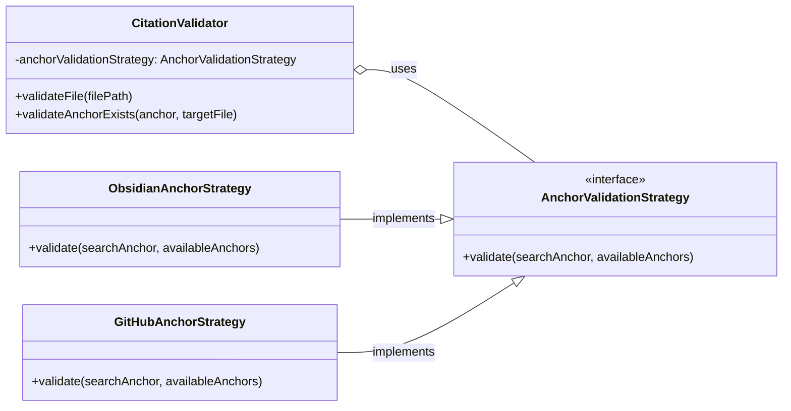

# Story 1.8: Refactor Anchor Validation to Use Strategy Pattern

<critical-llm-Initialization-Instructions>
When first reading this file, you MUST IMMEDIATELY run citation manager to extract base paths: `npm run citation:base-paths "this-file-path" -- --format json`. Read ALL discovered base path files to gather complete architectural context before proceeding.
</critical-llm-Initialization-Instructions>

## Story

**As a** developer,
**I want** to refactor the `CitationValidator` to use a Strategy pattern for anchor validation,
**so that** the system can be easily extended to support different markdown flavors (e.g., GitHub-style anchors) without modifying core validation logic.

_Source: [Architectural Whiteboard Session](../../content-aggregation-architecture-whiteboard.md)_

## Acceptance Criteria

1.  An `AnchorValidationStrategy` interface SHALL be created at `src/strategies/AnchorValidationStrategy.js`, defining a `validate()` method contract. ^US1-8AC1
2.  A default `ObsidianAnchorStrategy` SHALL be implemented, encapsulating the existing logic for validating Obsidian-style URL-escaped anchors. ^US1-8AC2
3.  The `CitationValidator` constructor SHALL be refactored to accept an `AnchorValidationStrategy` dependency, and its `validateAnchorExists()` method SHALL delegate validation logic to the injected strategy. ^US1-8AC3
4.  The `componentFactory` SHALL be updated to instantiate and inject the default `ObsidianAnchorStrategy` into the `CitationValidator`. ^US1-8AC4
5.  GIVEN the refactoring is complete, WHEN the full test suite is executed, THEN all existing tests SHALL pass, confirming zero functional regressions. ^US1-8AC5
6.  The component architecture documentation SHALL be updated to reflect the new Strategy pattern for anchor validation. ^US1-8AC6

## Dev Notes

### Architectural Context (C4)

This story introduces the **Strategy Pattern** to the `citation-manager` architecture, a key step in preparing for the extensibility required by Epic 2. It refactors the `CitationValidator` to decouple it from a single, hard-coded method of anchor validation. This allows us to treat different validation algorithms as interchangeable parts, directly supporting our [Modular Design Principles](../../../../../../../design-docs/Architecture%20Principles.md#^modular-design-principles-definition).

-   **Components Affected**:
    -   [`Citation Manager.CitationValidator`](../../content-aggregation-architecture.md#Citation%20Manager.Citation%20Validator) (MODIFIED) - Will be refactored to delegate validation.
    -   [`Citation Manager.Factories`](../../content-aggregation-architecture.md#Component%20Interaction%20Diagram%20After%20US1.5) (MODIFIED) - Will be updated to wire in the new strategy.
    -   `AnchorValidationStrategy` (NEW) - A new family of components representing validation algorithms.

### Files Impacted

-   `tools/citation-manager/src/strategies/AnchorValidationStrategy.js` (CREATE)
-   `tools/citation-manager/src/strategies/ObsidianAnchorStrategy.js` (CREATE)
-   `tools/citation-manager/src/CitationValidator.js` (MODIFY)
-   `tools/citation-manager/src/factories/componentFactory.js` (MODIFY)
-   `tools/citation-manager/test/strategies/obsidian-anchor-strategy.test.js` (CREATE)
-   `tools/citation-manager/test/integration/citation-validator-strategy.test.js` (CREATE)

### Current vs. Target Architecture

**Current**: The anchor validation logic is hard-coded directly within the `CitationValidator.validateAnchorExists()` method, making it difficult to support new validation styles without modifying the component.

**Target**: The `CitationValidator` will delegate validation to a strategy object that conforms to the `AnchorValidationStrategy` interface. This makes the validator open for extension but closed for modification.

### Dependencies
- **Prerequisite**: [Story 1.7: Implement ParsedDocument Facade](https://www.google.com/search?q=content-aggregation-prd.md%23Story%25201.7%2520Implement%2520ParsedDocument%2520Facade) must be complete. The facade will provide a clean interface for strategies to query anchor data.
- **Enables**: [Story 2.1: Implement Extraction Eligibility using the Strategy Pattern](https://www.google.com/search?q=content-aggregation-prd.md%23Story%25202.1%2520Enhance%2520Parser%2520to%2520Handle%2520Full-File%2520and%2520Section%2520Links). This story establishes the architectural pattern that US 2.1 will reuse for its extraction rules.
    

### Design Principles Adherence
This story directly implements several core architectural principles:
- [suspicious link removed]: We can add new validation flavors (like for GitHub) by adding new strategy classes, not by modifying the `CitationValidator`.
- [suspicious link removed]: The `CitationValidator` will depend on the `AnchorValidationStrategy` abstraction, not a concrete implementation.
- [suspicious link removed]: The `CitationValidator` is responsible for orchestrating validation, while each strategy class has the single responsibility of implementing a specific validation algorithm.
    

### Testing
- **Unit Tests**: New unit tests will be created for the `ObsidianAnchorStrategy` to validate its logic in isolation.
- **Integration Tests**: A new integration test suite will verify that the `CitationValidator` correctly delegates to its injected strategy and that the factory wires everything together correctly.
- **Regression Tests**: The full existing test suite must pass to ensure that this architectural refactoring has not introduced any behavioral changes or regressions [[#^US1-8AC5|AC5]].
    

## Tasks / Subtasks

_Tasks will be generated in a subsequent phase._

## Change Log

|Date|Version|Description|Author|
|---|---|---|---|
|2025-10-09|1.0|Initial story creation.|Application Tech Lead|

