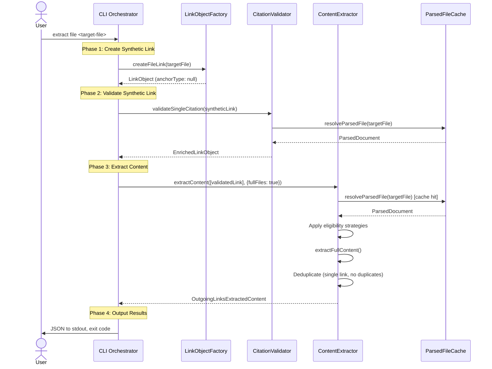

# US2.5 Design Plan: Implement `extract file` Subcommand

## Overview

This design plan implements the `extract file` subcommand, enabling direct extraction of complete file content without requiring a source document containing links.

**User Story Reference:** [US2.5 - Implement `extract file` Subcommand](../../content-aggregation-prd.md#Story%202.5%20-%20Implement%20`extract%20file`%20Subcommand)

**Architecture Pattern:** Reuses synthetic link pattern from US2.4 with `anchorType: null` to signal full-file extraction.

---

## Command Interface

### CLI Signature

```bash
citation-manager extract file <target-file> [options]
```

### Parameters

| Parameter | Type | Required | Description |
|-----------|------|----------|-------------|
| `<target-file>` | string | Yes | Path to markdown file to extract |
| `--scope <folder>` | string | No | Limit file resolution to specified directory |
| `--format <type>` | string | No | Output format (json) - default: "json" |

### Design Decision: No `--full-files` Flag

The `--full-files` flag is set internally (`{ fullFiles: true }`), not exposed to users. Command semantics imply full-file extraction; explicit flag would be redundant.

---

## Architecture

### Four-Phase Workflow

Following the established pattern from US2.4 `extract header`:



### Component Interactions

**LinkObjectFactory** (`src/factories/LinkObjectFactory.js`):
- New method: `createFileLink(targetPath)`
- Returns LinkObject with `anchorType: null` to signal full-file extraction
- No validation metadata (populated by CitationValidator)

**CitationValidator** (`src/CitationValidator.js`):
- Reuses existing `validateSingleCitation()` method
- Validates target file exists and is accessible
- Enriches LinkObject with validation metadata

**ContentExtractor** (`src/core/ContentExtractor/ContentExtractor.js`):
- Reuses existing `extractContent()` method
- Receives `{ fullFiles: true }` flag from CLI
- CliFlagStrategy makes link eligible
- Calls `parsedDoc.extractFullContent()` for content retrieval

---

## Implementation Details

### Phase 1: Synthetic Link Creation

**LinkObjectFactory Extension:**

```javascript
// File: src/factories/LinkObjectFactory.js

createFileLink(targetPath) {
 const absolutePath = path.resolve(targetPath);

 return {
  linkType: 'wiki',
  scope: 'outgoing',
  anchorType: null,  // Signals full-file extraction
  target: {
   path: {
    raw: targetPath,
    absolute: absolutePath
   },
   anchor: null
  },
  validation: null,  // Populated by CitationValidator
  extractionMarker: null
 };
}
```

### Phase 2: Validation

**CitationValidator Usage:**

```javascript
// File: src/citation-manager.js (CLI Orchestrator)

const validatedLink = await citationValidator.validateSingleCitation(syntheticLink);

// Result: EnrichedLinkObject with validation metadata
// { ...syntheticLink, validation: { status: "valid"|"error", error?, suggestion? } }
```

**Validation Outcomes:**
- **File exists:** `status: "valid"` - proceed to extraction
- **File missing:** `status: "error"` - skip extraction, report error
- **File unreadable:** `status: "error"` - skip extraction, report error

### Phase 3: Content Extraction

**Eligibility Strategy Chain:**

With `{ fullFiles: true }` flag:

1. **StopMarkerStrategy:** Returns null (no marker on synthetic link)
2. **ForceMarkerStrategy:** Returns null (no marker on synthetic link)
3. **SectionLinkStrategy:** Returns null (`anchorType: null`, not header/block)
4. **CliFlagStrategy:** Returns `{ eligible: true, reason: "Full-file extraction enabled by CLI flag" }`

**Content Retrieval:**

```javascript
// ContentExtractor internal logic (no changes needed)

if (anchorType === null) {
 content = targetDoc.extractFullContent();
}
```

### Phase 4: Output

**Success Case:**

```javascript
console.log(JSON.stringify(result, null, 2));  // stdout
process.exit(0);
```

**Failure Case:**

```javascript
// Validation error or extraction failure
console.error(`Error: ${errorMessage}`);  // stderr
process.exit(1);  // No content extracted
```

---

## CLI Command Registration

### Commander.js Pattern

```javascript
// File: src/citation-manager.js (around line 890)

program
 .command('extract')
 .description('Extract content from markdown files')
 .addCommand(
  new Command('file')
   .description('Extract entire file content')
   .argument('<target-file>', 'Path to markdown file to extract')
   .option('--scope <folder>', 'Limit file resolution to specified directory')
   .option('--format <type>', 'Output format (json)', 'json')
   .action(async (targetFile, options) => {
    try {
     // Phase 1: Create synthetic link
     const linkFactory = new LinkObjectFactory();
     const syntheticLink = linkFactory.createFileLink(targetFile);

     // Phase 2: Validate synthetic link
     const validatedLink = await citationValidator.validateSingleCitation(syntheticLink);

     // Phase 3: Extract content (force fullFiles flag)
     const result = await contentExtractor.extractContent(
      [validatedLink],
      { ...options, fullFiles: true }
     );

     // Phase 4: Output results
     if (options.format === 'json') {
      console.log(JSON.stringify(result, null, 2));
     }

     // Exit code based on extraction success
     const exitCode = result.stats.uniqueContent > 0 ? 0 : 1;
     process.exit(exitCode);

    } catch (error) {
     console.error(`Error: ${error.message}`);
     process.exit(2);
    }
   })
 );
```

---

## Help Documentation

### Top-Level Help (`extract --help`)

```text
Usage: citation-manager extract [command] [options]

Extract content from markdown files

Commands:
  links <source-file>     Extract content from all links in source document
  header <target-file>    Extract specific header section from target file
  file <target-file>      Extract entire file content

Options:
  -h, --help              Display help for command
```

### Subcommand Help (`extract file --help`)

```text
Usage: citation-manager extract file <target-file> [options]

Extract the complete content of a markdown file without requiring a source document.

Arguments:
  target-file              Path to markdown file to extract

Options:
  --scope <folder>         Limit file resolution to specified directory
  --format <type>          Output format (json) (default: "json")
  -h, --help              Display help for command

Examples:
  # Extract entire file
  citation-manager extract file docs/architecture.md

  # Extract with scope restriction
  citation-manager extract file architecture.md --scope ./docs

  # Pipe to jq for filtering
  citation-manager extract file file.md | jq '.extractedContentBlocks'
```

---

## Error Handling

### Error Scenarios

| Scenario | Detection | Status | Exit Code | Output |
|----------|-----------|--------|-----------|--------|
| File not found | CitationValidator | `validation.status: "error"` | 1 | stderr: "Target file does not exist" |
| File unreadable | ParsedFileCache | Exception caught | 2 | stderr: "Cannot read target file" |
| No content extracted | ContentExtractor | `stats.uniqueContent === 0` | 1 | Empty extractedContentBlocks |
| Invalid arguments | Commander.js | Parsing error | 1 | stderr: Usage help |

### Error Message Formats

**Validation Failure:**

```javascript
{
 contentId: null,
 extractionStatus: "skipped",
 extractionFailureReason: "Link failed validation: Target file does not exist: /path/to/file.md"
}
```

**System Error:**

```javascript
{
 contentId: null,
 extractionStatus: "error",
 extractionFailureReason: "Cannot read target file: /path/to/file.md"
}
```

---

## Testing Strategy

### Unit Tests

**LinkObjectFactory Tests:**

```javascript
// File: test/unit/LinkObjectFactory.test.js

describe('LinkObjectFactory.createFileLink', () => {
 it('should create LinkObject with anchorType null', () => {
  // Given: Target file path
  const factory = new LinkObjectFactory();
  const targetPath = '/path/to/file.md';

  // When: Create file link
  const link = factory.createFileLink(targetPath);

  // Then: LinkObject has correct structure
  expect(link.anchorType).toBe(null);
  expect(link.target.anchor).toBe(null);
  expect(link.target.path.absolute).toBe(path.resolve(targetPath));
 });
});
```

**Eligibility Strategy Tests:**

```javascript
// File: test/unit/CliFlagStrategy.test.js

describe('CliFlagStrategy with fullFiles flag', () => {
 it('should make full-file link eligible when flag is true', () => {
  // Given: Full-file link and fullFiles flag
  const link = { anchorType: null };
  const cliFlags = { fullFiles: true };
  const strategy = new CliFlagStrategy();

  // When: Get eligibility decision
  const decision = strategy.getDecision(link, cliFlags);

  // Then: Link is eligible
  expect(decision.eligible).toBe(true);
  expect(decision.reason).toContain('Full-file extraction enabled');
 });
});
```

### Integration Tests

**CLI Integration Tests:**

```javascript
// File: test/integration/cli-extract-file.test.js

describe('extract file subcommand', () => {
 it('should extract entire file content successfully', () => {
  // Given: Valid markdown file
  const testFile = join(FIXTURES_DIR, 'sample-document.md');

  // When: Execute extract file command
  const output = runCLI(
   `node citation-manager.js extract file "${testFile}"`,
   { captureStderr: false }
  );

  // Then: Output contains complete file content
  const result = JSON.parse(output);
  expect(result.stats.uniqueContent).toBe(1);
  expect(result.extractedContentBlocks).toHaveProperty('_totalContentCharacterLength');

  const contentIds = Object.keys(result.extractedContentBlocks).filter(k => k !== '_totalContentCharacterLength');
  expect(contentIds.length).toBe(1);

  const content = result.extractedContentBlocks[contentIds[0]].content;
  expect(content.length).toBeGreaterThan(0);
 });

 it('should report error when file does not exist', () => {
  // Given: Non-existent file path
  const missingFile = join(FIXTURES_DIR, 'does-not-exist.md');

  // When: Execute extract file command
  const output = runCLI(
   `node citation-manager.js extract file "${missingFile}"`,
   { captureStderr: true, expectError: true }
  );

  // Then: Error reported to stderr, exit code 1
  expect(output).toContain('does not exist');
 });
});
```

### Acceptance Criteria Validation

**US2.5 AC Mapping:**

| AC | Test Type | Test File | Test Name |
|----|-----------|-----------|-----------|
| AC1 | Integration | cli-extract-file.test.js | "should register extract file subcommand" |
| AC2 | Integration | cli-extract-file.test.js | "should extract entire file content successfully" |
| AC3 | Integration | cli-extract-file.test.js | "should respect scope option" |
| AC4 | Integration | cli-extract-file.test.js | "should report error when file does not exist" |
| AC5 | Integration | cli-extract-file.test.js | "should output JSON and exit 0 on success" |
| AC6 | Integration | cli-extract-file.test.js | "should exit non-zero when extraction fails" |
| AC7 | Integration | cli-extract-file.test.js | "should document extract file in help output" |

---

## Implementation Files

### New Files

- `test/integration/cli-extract-file.test.js` - CLI integration tests
- `test/fixtures/extract-file/` - Test fixtures for extract file tests

### Modified Files

| File | Changes |
|------|---------|
| `src/factories/LinkObjectFactory.js` | Add `createFileLink()` method |
| `src/citation-manager.js` | Add `extract file` subcommand registration (~lines 890-920) |
| `test/unit/LinkObjectFactory.test.js` | Add tests for `createFileLink()` |

### Unchanged Components

- `src/core/ContentExtractor/ContentExtractor.js` - Reuses existing `extractContent()`
- `src/CitationValidator.js` - Reuses existing `validateSingleCitation()`
- `src/core/ContentExtractor/eligibilityStrategies/CliFlagStrategy.js` - Already handles `fullFiles: true`
- `src/ParsedFileCache.js` - No changes needed
- `src/ParsedDocument.js` - `extractFullContent()` already implemented

---

## Architecture Decisions

### ADR-US2.5-01: Internal `fullFiles` Flag

**Decision:** Set `fullFiles: true` internally, do not expose `--full-files` flag to users.

**Rationale:**
- Command semantics (`extract file`) clearly imply full-file extraction
- Explicit flag would be redundant and confusing
- Keeps CLI interface clean and intuitive

**Consequences:**
- Users cannot disable full-file extraction (not a use case)
- Internal flag enables reuse of CliFlagStrategy without modification

### ADR-US2.5-02: Reuse CliFlagStrategy vs New Strategy

**Decision:** Reuse existing CliFlagStrategy by passing `fullFiles: true` flag internally.

**Rationale:**
- Avoids creating new strategy class for single command
- CliFlagStrategy already handles `anchorType: null` + flag check
- Maintains existing eligibility precedence chain
- Follows US2.4 pattern (reuse over reinvention)

**Consequences:**
- Internal flag coupling (acceptable - CLI controls flag)
- No strategy chain modifications needed
- Simpler implementation with zero eligibility logic changes

---

## Dependencies

### Depends On
- [US2.4: Implement `extract header` Subcommand](../../content-aggregation-prd.md#Story%202.4%20Implement%20`extract%20header`%20Subcommand) - Synthetic link pattern established

### Enables
- [US2.6: Add Comprehensive Help Documentation](../../content-aggregation-prd.md#Story%202.6%20Add%20Comprehensive%20Help%20Documentation%20to%20CLI%20Commands) - Complete extract command documentation

---

## Related Documentation

- [Content Aggregation PRD - US2.5](../../content-aggregation-prd.md#Story%202.5%20-%20Implement%20extract%20file%20Subcommand)
- [Content Extractor Implementation Guide](../../../../component-guides/Content%20Extractor%20Implementation%20Guide.md)
- [Epic 2 Whiteboard - LinkObjectFactory](../../content-aggregation-prd.md#LinkObjectFactory%20%28Level%204%20Code%20Detail%20of%20CLI%20Orchestrator%29)

---
