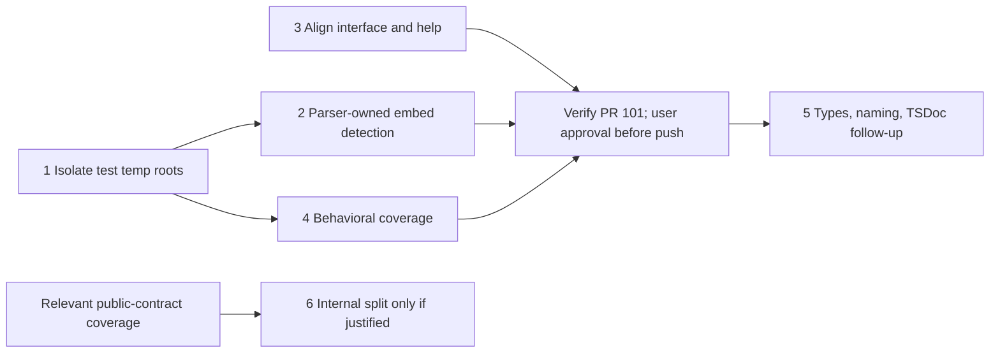

# PR 101 Architecture Evaluation

## Verdict

**Requires revision at published head `dd23741109c1f01a2c22de7dcd56d5317be998a6`.** A folder move can materialize content from outside the declared scope through a symlink. Escaped prose can also incorrectly block a valid move. Both were reproduced against the current published build, despite all 16 rename integration tests passing.

This is a report-only evaluation against the explicitly requested Core, Object-Oriented, TypeScript, and Testing principles. No implementation files were changed by this evaluation.

## Principle Reports

All 27 categories across the four requested sets were evaluated independently. Each report includes category compliance, principle citations, recommendations, priorities, document hygiene, and a current-head update.

| Set | Categories evaluated | Detailed assessment | Current revision |
|---|---|---|---|
| Core | 9 | [Principle compliance](pr-101-core-eval-report.md#Principle%20Compliance) | [Current PR update](pr-101-core-eval-report.md#Current%20PR%20Update) |
| Object-Oriented | 5 | [Principle compliance](pr-101-oop-eval-report.md#Principle%20Compliance) | [Current PR update](pr-101-oop-eval-report.md#Current%20PR%20Update) |
| TypeScript | 6 | [Principle compliance](pr-101-typescript-eval-report.md#Principle%20Compliance) | [Current PR update](pr-101-typescript-eval-report.md#Current%20PR%20Update) |
| Testing | 7 | [Principle compliance](pr-101-testing-eval-report.md#Principle%20Compliance) | [Current PR update](pr-101-testing-eval-report.md#Current%20PR%20Update) |

The per-area recommendations are advisory inputs to this synthesis. For embed recognition, the synthesis chooses the parser-owned correction rather than a second escape-aware regex in rename: the reproduced false refusal already supplies a reason to repair the boundary.

## Revision and Evidence Basis

The review began at `7d627ae6b0ed77b050c0c4ae1a8a09ef27dcc27c`. Local fixes existed at the start and were subsequently committed and published as `dd23741109c1f01a2c22de7dcd56d5317be998a6` during the review. `gh pr view 101 --json headRefOid,url` confirmed the new published head. The per-area reports preserve their original snapshot references and include current-head updates; resolved defects from the original snapshot are not current blockers.

Canonical requirements are the [rename interface](../spec/005-interfaces.md#`jact%20rename%20<source...>%20<destination>`), [rename workflow](../spec/006-behavior.md#Rename%20Workflow%20%28%60jact%20rename%60%29), and [Flavor Extension Collection decision](../adrs/003-adrs.md#ADR-0003%20—%20Flavor%20Extension%20Collection). There is no separate module specification under `src/core/docs/`; the repository living specification applies.

## Confirmed Current Findings

### High — Folder descendants bypass the scope and symlink-identity checks

**Location:** `src/core/rename-markdown-file.ts:309-316`, directory expansion at `:486-491`, and staged replacement in `commitPlan`.

`filesUnder()` includes file symlinks using their lexical paths. Top-level sources are canonicalized and checked against scope, but the descendants of a directory are not individually authorized. The path map claims canonical paths while retaining symlink paths. Parsing and backup copying follow those links; staging and replacing an edited document then replaces the symlink with a regular file.

**Reproduction:** create `scope/notes/a.md`; create `secret.md` outside `scope` containing `# PRIVATE` and a Markdown link to the absolute path of `scope/notes/a.md`; symlink `scope/notes/secret.md` to the external file. Run `rename notes archive --scope <scope> --fix --json` from `scope`.

**Observed on current head:** exit `0`; `scope/archive/secret.md` is a regular file containing the external private content and a rewritten link to `archive/a.md`. The original external file is unchanged. This is content materialization outside the intended authorization model, not a claim that the external original was modified.

**Recommendation:** define and enforce the descendant-symlink policy before parsing or writing. The smallest safe policy is to reject unsupported symlink descendants. If symlinks are supported, authorize their canonical targets and preserve their identities through apply and recovery. Add a CLI regression that verifies refusal and no content or identity changes.

**Principle impact:** scope containment and safety by default; canonical data invariants; accurate boundary contracts; regression tests for consumer-visible failure modes.

### Medium — Escaped prose is reinterpreted as an image embed

**Location:** `src/core/rename-markdown-file.ts:542-548`.

`brokenEmbeds()` searches decoded mdast text with a regular expression. Escaping has already been decoded into a text node, so literal prose can be mistaken for live Markdown syntax. This conflicts with the parser-owned syntax boundary in the [Flavor Extension Collection decision](../adrs/003-adrs.md#ADR-0003%20—%20Flavor%20Extension%20Collection).

**Reproduction:** create `notes/a.md`, `notes/p.png`, and `index.md` containing the literal escaped source `\!\[\[notes/p.png\]\]`. Run `rename notes archive --scope <root> --fix --json`.

**Observed on current head:** exit `1`, reporting an image embed that would break. `notes/a.md` remains in place. There is no data loss, but a valid move is refused.

**Recommendation:** detect actual embed syntax in the parser's flavor extensions and expose structured embed information to rename. Do not re-parse decoded text in the consumer. Add a negative regression for escaped prose alongside the existing real-embed refusal case.

**Principle impact:** parser ownership and module boundaries; avoiding duplicate interpretation; testing failure and negative paths.

### Medium — The canonical interface still promises unconditional recovery

**Location:** `docs/spec/005-interfaces.md:126`, `:154`.

The [rename interface](../spec/005-interfaces.md#`jact%20rename%20<source...>%20<destination>`) still says every failure undoes moves and restores edited files. The published fix instead attempts each recovery step and reports failures and retained backups; the [rename workflow](../spec/006-behavior.md#Rename%20Workflow%20%28%60jact%20rename%60%29), README, and help now describe that limitation. The interface also omits the new existing-literal-path precedence while describing globs as expanded like validation.

**Recommendation:** align the canonical interface with the current published recovery guarantees and literal-path precedence. This is a verified documentation inconsistency, not another independently reproduced transaction defect.

## Priorities

1. Before merge: enforce descendant authorization and symlink identity, with a no-write refusal regression.
2. Before merge: fix the escaped-prose refusal through parser-owned syntax recognition, retaining the real-embed safety guard.
3. Before merge: align the canonical interface with the published recovery and source-selection contracts.
4. Advisory: data-model tightening, naming, targeted coverage gaps, and documentation cleanup below. Do not require broad module restructuring to resolve the demonstrated defects.

## Resolved During Review

| Original defect | Original observation at `7d627ae` | Current published state at `dd23741` |
|---|---|---|
| Existing bracketed source treated as a glob | `rename notes/[ab].md new.md --fix` moved `[ab].md`, `a.md`, and `b.md` into `new.md/`, exit 0 | Fixed. Existing paths take precedence over glob classification. Re-run moved only `[ab].md` to `notes/new.md`; `a.md` remained. Regression passes. |
| Directory-cleanup failure stopped rollback restoration | Injected second-move failure created a foreign file in the new directory. Cleanup failed with `ENOTEMPTY`, moves reversed, but `a.md` and `index.md` retained post-move links | Fixed. Recovery attempts each step independently and aggregates failures. The new CLI regression verifies restored original content and preservation of the foreign file; it passed. |

These are historical findings, not remaining actions against the current PR.

## Additional Recommendations

These are maintainability or test-coverage recommendations, not additional reproduced data-loss defects.

- Encode `RenameMove.kind` and directory-only `movedFiles` as a discriminated union instead of independently optional fields.
- Align the now-batch-capable module name with its public operation; the singular `rename-markdown-file.ts` no longer describes the full responsibility.
- Document exported contracts and module boundaries using the repository's existing TSDoc conventions.
- Add targeted behavioral assertions for preview immutability, destination rules, overlapping plans, unresolved outgoing links, and final backup locations where coverage is missing. Do not add tests of private wiring or duplicated forwarding.
- Use unique temporary roots for integration runs. The newly added batch tests share a fixed temporary path, so concurrent invocations can interfere; this concurrency risk was identified statically, not reproduced.
- Clarify the image-embed wording. A reference-style image `![picture][pic]` with `[pic]: notes/p.png` successfully moves and its definition is rewritten to `archive/p.png`. It is not a broken-image finding, but broad wording that no image embed is rewritten is inaccurate.

## Verification

| Revision | Exercised check | Observed result |
|---|---|---|
| Original published `7d627ae`, isolated Git archive | `npm run build` | Passed |
| Original published `7d627ae`, isolated Git archive | `npx vitest run test/cli-integration/rename-command.test.ts` | 14/14 passed |
| Current published `dd23741`, branch checkout | `npm run build` | Passed |
| Current published `dd23741`, branch checkout | `npx vitest run test/cli-integration/rename-command.test.ts` | 16/16 passed |
| Both revisions | Actual CLI symlink-descendant and escaped-prose probes | Both remaining defects reproduced |
| Both revisions | Actual CLI literal-bracket probe | Defect at original head; correct single-file behavior at current head |
| Current published `dd23741` | Actual CLI unsafe `![[notes/p.png]]` incoming embed probe | Correct refusal, exit 1 |
| Current published `dd23741` | Actual CLI reference-style image probe | Successful move; definition rewritten correctly |
| Original published `7d627ae` | Actual CLI injected rollback cleanup failure | Edited documents were not restored |
| Original published `7d627ae` | Changed capability citation validation (`008-capabilities.md`, line 13) | 1 citation valid |

Only the rename integration suite and the listed runtime probes were exercised; the full repository suite was not run. No PR comments were posted and no code fixes were applied by this evaluation.

## Implementation Effort Estimate

An independent Claude Opus advisor read the four reports and implementation. These are planning estimates, not measured implementation durations. They assume one engineer familiar with TypeScript and this repository, and de-duplicate the same findings across principle sets.

### Merge-Blocking Scope

| Work | Estimated engineering effort | Included |
|---|---|---|
| Reject symlink descendants safely | 40–60 minutes from the evaluated snapshot | Guard, no-write regression using an actual symlink, refusal documentation and path-contract comment |
| Recognize actual wiki embeds in the parser | 90–150 minutes | Existing tokenizer reuse or dedicated embed construct, structured parser output, consumer migration, escaped-vs-real syntax regressions, existing image behavior preservation |
| Align the canonical interface | 20–30 minutes | Literal-path precedence and truthful recovery guarantees; cross-check workflow, README and help |
| Shared verification | 15–20 minutes | Build, targeted tests and actual CLI safety probes |
| **Total from evaluated snapshot** | **Approximately 3–4.5 hours** | Three blockers, regressions and verification |

**Revision update:** the symlink-refusal guard is now committed and published in `5975560a004b97e2cbb869ab982350b585fb8b3b` ("Reject shortcuts inside renamed folders (#101)"). Source inspection found that `filesUnder()` explicitly rejects symlinks at `src/core/rename-markdown-file.ts:313-317`, and the workflow documentation describes that refusal. `gh pr view 101 --json headRefOid` confirmed the published revision. The full estimate above includes implementation work already completed. This effort assessment did not check the new regression coverage or exercise the new guard. The earlier confirmed findings remain historical evidence for `dd23741`, not a new claim that the symlink defect remains in `5975560`.

The dominant uncertainty is embed tokenization. The advisor proposed using the wikilink tokenizer's preceding-character context, but did not demonstrate that this distinguishes escaped punctuation correctly. Treat that shortcut as **[INFERENCE]**, not an approved implementation. Verify escaping behavior with a small throwaway probe first; a dedicated construct starting at `!` is the fallback. Consumer-side escape-aware regex is not the chosen correction.

The already-published bracketed-filename and rollback-continuation fixes are excluded from this estimate.

### Optional Work and Totals

| Scope | Incremental engineering effort | Cumulative from evaluated snapshot |
|---|---|---|
| Additional behavioral coverage: destination/refusal boundaries, preview immutability, backup locations | Approximately 1–1.25 hours | Approximately 4–6 hours with blockers |
| Small type, naming, documentation and test-isolation improvements | Approximately 1.5–2.25 hours | Approximately 5.5–8 hours with blockers and coverage |
| Split the module and add focused planner unit tests | Approximately 2.5–3.5 hours | Approximately 8–12 hours for every recommendation |

Small improvements include a discriminated move union (25–35 minutes), explicit destination mode (15–25), plural operation filename (10–15), TSDoc and boundary documentation (15–25), unique temporary test roots (10–15), and accurate image-embed wording (10–15). Type invariants and isolated fixtures are deterministic safeguards; naming and prose are clarity improvements, not equivalent safety enforcement.

**Recommendation:** finish the remaining blockers plus high-value behavioral coverage in one focused pass. Reserve roughly one working day including review and interruptions, rather than treating the individual report minute estimates as a delivery promise. Defer broad module splitting until a concrete change makes it useful. The published symlink guard reduces the remaining implementation work, but does not remove the need to prove refusal and no-write behavior.

**Remaining-work estimate after `5975560`: approximately 2–4 engineering hours** for parser-owned embed recognition, canonical-interface alignment and final regression/CLI verification, allowing for any missing symlink regression assertions. With the additional behavioral coverage, reserve approximately 3–5 engineering hours. These narrower ranges are the parent synthesis of the advisor estimate and the newly confirmed published fix; they are not a new implementation measurement.

Engineering effort is not agent runtime or guaranteed elapsed time. No implementation, new tests, or runtime verification were performed for this estimate.

## Fix Sequencing Plan

Covers every finding in the four principle reports, deduplicated, against PR head `5975560`. Order and grouping were cross-checked by an independent GPT-6.1 advisor that read the reports and current sources; effort figures are planning estimates, not measurements.

Phases 5 and 6 were subsequently reviewed by an Anthropic/OpenAI committee. The agreed corrections below clarify scope; they do not authorize implementation, worker assignments, exported-symbol changes, or a push. Pending user gates remain in force.

### Finding Disposition

| Finding | Source reports | Disposition |
|---|---|---|
| Symlink descendants escape scope | Core, OOP, TypeScript, Testing | Resolved in `5975560`; file and folder refusal regressions exist in `test/cli-integration/rename-command.test.ts` |
| Bracketed literal treated as glob; rollback stops at first error | Core, OOP, TypeScript, Testing | Resolved in `dd23741` ([Resolved During Review](#Resolved%20During%20Review)) |
| Escaped prose blocks a move (regex over decoded text) | All four | Phase 2, this PR |
| Interface spec promises unconditional recovery; omits literal-path precedence | OOP, synthesis | Phase 3, this PR |
| Image-embed wording too broad (README, 005, `src/cli.ts` help) | Core, TypeScript, synthesis | Phase 3, this PR |
| Fixed temp roots shared across runs | Testing, synthesis | Phase 1, this PR |
| Missing refusal rows, directory-to-new-path, preview immutability, backup final location | Testing, synthesis | Phase 4, this PR |
| Discriminated `RenameMove`, request classification currently named `batch`, paired single-file result fields | Core, TypeScript | Phase 5, follow-up PR; preserve destination handling and JSON shape while choosing the classification name/type separately |
| Plural module filename; repeated production Markdown-path checks | Core, TypeScript | Phase 5, follow-up PR; plural filename is a candidate matching the existing export; consolidate equivalent checks in one local production predicate |
| Module preamble, export TSDoc, `Contract:` markers | OOP, TypeScript | Phase 5, follow-up PR |
| `MovePlan.moved` comment | OOP | Already correct in the current source: canonical old path → canonical new path (`src/core/rename-markdown-file.ts:108-109`); no repair |
| `CliRenameOptions` in core signature | TypeScript (pre-existing debt) | Phase 5, follow-up PR; core-owned options contain only consumed fields |
| Concrete deps instead of `*Like` interfaces | TypeScript (pre-existing debt) | Drop automatic conversion; retain concrete types unless a verified consumer need warrants a correctly owned capability contract |
| Split module by responsibility | OOP | Phase 6, conditional follow-up; private implementation within one caller-facing rename operation |
| Mirrored core test file | Testing | Replace folder-symmetry obligation with direct-call tests of distinct public behavior; independent of Phase 5 and any split |
| Interim consumer-side backslash check for embeds | OOP | Dropped: superseded by Phase 2 parser fix |
| `verifyRelationships` bypasses the DI factory | TypeScript (pre-existing debt) | Closed: source already uses `createFileCache`, `createMarkdownParser`, and `createParsedFileCache` (`src/core/rename-markdown-file.ts:658-667`); preserve fresh post-move caches |
| Document hygiene | All four | No violations reported; nothing to fix |

### Phases



| Phase | PR | Work | Acceptance | Effort |
|---|---|---|---|---|
| 1. Isolate test temp roots | 101 | Replace fixed `workDir`/`batchDir` with `mkdtempSync` roots; derive dependent paths | Two concurrent runs of the rename suite pass; cleanup removes only its own root | 15–25 min |
| 2. Parser-owned embed detection | 101 | Throwaway probe first (real embed, fully escaped, escaped `!`, escaped brackets, inline and fenced code, plain wikilink); choose tokenizer-context reuse or a dedicated `!` construct per [ADR-0003](../adrs/003-adrs.md#ADR-0003%20—%20Flavor%20Extension%20Collection); expose typed embed output; replace the decoded-text scanner in `brokenEmbeds` in one atomic commit | Escaped prose moves; real unsafe wiki and inline embeds still refuse with exit 1 and no writes; reference-style definitions still rewrite; existing validate/extract wikilink results unchanged | 2–3 h |
| 3. Align public contracts | 101 | Update the [rename interface](../spec/005-interfaces.md#`jact%20rename%20<source...>%20<destination>`) for literal-path precedence, best-effort recovery with reported backups, symlink refusal, and narrowed image-embed wording; cross-check README, [rename workflow](../spec/006-behavior.md#Rename%20Workflow%20%28%60jact%20rename%60%29), and CLI help | Each documented outcome matches the literal-file, failed-recovery, symlink, and reference-image scenarios; citations validate | 30–45 min |
| 4. Behavioral coverage | 101 | Add refusal rows (unresolved outgoing link, source inside directory source, destination inside moved directory, destination equals source, missing batch source), directory-to-new-path success, preview immutability for batch/glob/folder, backup at reported final path | Refusals and previews leave the tree byte-identical, including `.bak` and temp artifacts (current `snapshot()` excludes `.bak`); backup path and content exact | 1–1.5 h |
| Verify; request push approval | 101 | `npm run build`, full `npm test`, actual CLI escaped-vs-real embed probes; push only after user approval | All checks pass; probes match acceptance above; approval remains a separate gate | 20–30 min |
| 5. Types, naming, TSDoc | Follow-up | Commit A: discriminated `RenameMove`, paired single-file result fields, core-owned options, and clearer request classification preserving both destination handling and legacy JSON fields; choose classification name/type separately. Retain concrete dependencies unless an actual consumer need justifies a correctly owned contract; no mechanical `*Like` conversion. Commit B: candidate plural filename matching existing `renameMarkdownFiles`, LSP reference checks and clean import/spec-path migration without renaming the export, and one local production Markdown-path predicate for equivalent checks. Commit C: preamble, export TSDoc, and `Contract:` markers explaining invariants, errors, ordering, recovery, and performance. Keep private helpers local and shared contracts with their owner. | Build, rename Vitest coverage, and actual CLI scenarios pass; JSON, human output, destination rules, refusals, verification, and recovery remain unchanged | 2–3 h, provisional |
| 6. Conditional internal split | Conditional follow-up | Only split when a concrete change demonstrates improved locality: keep planning, rewriting, and transaction private within one cohesive rename module. Use omp capability-folder conventions if needed, not recursive `src/<module>/src` wrappers. Preserve one caller-facing operation; no pass-through layers, speculative adapters, new public stage interfaces, or new barrels by default. | End-to-end outcomes, rollback, and backup locations unchanged; callers need not coordinate additional stages; relevant public-contract tests precede extraction; build, Vitest, and actual CLI scenarios pass | Re-estimate when triggered; prior 2.5–3.5 h estimate is provisional, not scheduled work |
| Direct-call core tests | Independent coverage work | Add tests through the existing public `renameMarkdownFiles` operation only for distinct consumer-visible behavior; retain CLI tests for arguments, previews, output, and exit codes. No private-helper exports, copied scenarios, or test-folder matching requirement. | Each test protects a plausible behavioral failure or safety invariant; no split or type migration required. A source-supported candidate is stale cached content refusing before any write while preserving an external edit; verify the gap before adding it. | Estimate after selecting an uncovered public contract |

### Ordering Rationale

- Phase 1 precedes 2 and 4 because every new regression uses the shared fixtures.
- Phase 3 is independent and can run alongside 1 and 2.
- Phase 2 precedes any module split: extracting today's scanner first would move the wrong boundary twice.
- Within Phase 5, types precede TSDoc, and the filename change precedes path-bearing docs and tests.
- Phase 5 is not a technical prerequisite for core tests or conditional decomposition. Naming/type migration may precede decomposition to reduce churn, but relevant public-contract coverage precedes any extraction.
- Request classification must not be inferred from destination kind or final move count. A literal single-file request can retain legacy top-level `source`/`destination` fields while a one-match glob omits them, even when both make the same move (`src/core/rename-markdown-file.ts:335-373,848-854`).
- Phases 5 and 6 remain follow-up work to avoid enlarging the safety-critical diff. The current rename operation already hides substantial behavior behind a small caller-facing interface; file size alone does not justify splitting. Core tests are justified by uncovered behavior, not by the split.

**Biggest risk:** changing wikilink tokenization can alter ordinary link extraction for `validate` and `extract`, not only rename. `src/core/MarkdownParser/extractWikilinks.ts` converts every wikilink node into a link. Phase 2 must prove embed-versus-link classification across those commands before committing to tokenizer reuse.

**Estimates:** about 4.5–6 hours to make PR 101 merge-ready (Phases 1–4 plus verification); Phase 5 remains a provisional 2–3 hours. Phase 6 is not scheduled without a concrete trigger, and independent core-test work needs a selected behavioral gap before estimation. There is no fixed total for all follow-up work.

## Parser Embed Probe — 2026-10-06

Parent-observed characterization of the current branch parser, before any parser changes. The probe calls `createMarkdownParser().parseContent()` with seven inputs; it does not repeat the already-reported rename failure.

| Input | Current parser result |
|---|---|
| Real `![[notes/p.png]]` | Plain text, no wikilink |
| Fully escaped `\!\[\[notes/p.png\]\]` | Plain text with the same decoded value as the real embed |
| Escaped `!`: `\![[notes/p.png]]` | Text `!` followed by an ordinary wikilink |
| Escaped brackets: `!\[\[notes/p.png\]\]` | Plain text with the same decoded value as the real embed |
| Inline code containing an embed | Inline-code node, no wikilink |
| Fenced code containing an embed | Code node, no wikilink |
| Ordinary `[[notes/p.png]]` | Wikilink node and ordinary link output |

Evidence: `.scratch/20261006T081324-rename-pr101/sessions/2026-10-06T08-05-29-874Z_01a1103f-0c92-7000-a2c6-799786c2acb0.c533655ac11a.jsonl:L480`; its producing probe is at `L478`.

**Recommendation, not yet approved:** use a dedicated Obsidian embed construct starting at `!`, then expose the smallest typed embed result to rename. The current `[` wikilink tokenizer never emits a node for the real embed, so annotating only existing wikilink nodes cannot classify that input. Reusing it would require changing the surrounding image-tokenization interaction; a dedicated construct keeps ordinary wikilink recognition separate.

This follows micromark's established [character-code extension hooks](https://github.com/micromark/micromark#syntaxextension), rather than recovering syntax from decoded text. `src/core/MarkdownParser/extensions/wikilink.ts:75-78` shows the existing `[` hook; `src/core/rename-markdown-file.ts:547-554` shows the decoded-text scan to remove.

The existing user gate remains: approve the parser design before production parser edits. Phases 1, 3, and 4 do not depend on that decision; Phases 5 and 6 remain outside this PR's implementation scope.

## Implementation Checkpoint — 2026-10-06

Phases 1, 3, and 4 are implemented, verified, and committed locally on `feat/bulk-rename`. Phase 2 remains at the explicit parser-design approval gate; no parser production edits, settings changes, or push occurred. Phases 5 and 6 remain excluded. This is not a merge-ready receipt: final simplification, independent review, and whole-plan verification still depend on the parser change.

| Phase | Local commit | Completed scope |
|---|---|---|
| 1 | `946c244` | Unique temporary roots for each rename test |
| 3 | `445840e` | README, interface, behavior specification, and CLI help aligned with current safety behavior |
| 4 | `752e65e` | Unresolved outgoing links; overlapping, missing, unchanged, and self-nested sources; exact missing-directory destination; immutable previews; relocated backup path and original content |

Parent verification:

- `npm run build` passed; the built branch CLI's rename help was inspected.
- Two simultaneous rename-suite runs each passed all 18 tests after fixture isolation.
- The expanded rename suite passed all 24 tests.
- `npm test` passed all 132 files: 931 tests passed, one skipped.
- Actual built-CLI smoke passed for literal bracketed filenames and reference-image definition rewrites.
- Actual built-CLI smoke passed for an unchanged directory preview, exact new nested destination, incoming/outgoing link rewrites, and a reported relocated backup retaining original content. The throwaway harness initially failed; normalizing its temporary root with `realpathSync` made the same scenario pass without a production change. Temporary trees were removed.
- Parent inspected the first-wave and safety-test diffs. No formal final review is claimed.

Checkpoint evidence archive: `.scratch/20261006T081324-rename-pr101/sessions/2026-10-06T08-05-29-874Z_01a1103f-0c92-7000-a2c6-799786c2acb0.bcb61e92c7de.jsonl`. Observed result lines: build `L520`, concurrent runs `L525`, literal/reference-image smoke `L534`, full suite `L633`, directory/backup smoke `L644`, safety-test commit `L661`. Each result's producing command is recoverable with `transcript-reader --dir <archive> --lines <line> --all --cite`.

### Explicit Codex Worker Measurements

Both workers received the implementer persona and explicit `openai-codex/gpt-6.1-sol` selection through Paseo. The fixture worker handled Phase 1 and was reused for Phase 4 only after Phase 1 passed; the contract worker handled Phase 3 concurrently with Phase 1. Parent owned checks and commits.

| Role | Model | Recorded span (seconds) | Cost (USD) | Input | Output | Cache read | Cache write | Total tokens | Caught / missed / false flag / correct pass |
|---|---|---:|---:|---:|---:|---:|---:|---:|---|
| Fixture and safety-test implementer | `openai-codex/gpt-6.1-sol` | 452.358 | 0.3869 | 109301 | 6918 | 991232 | 0 | 1107451 | n/a — no answer key |
| Contract/help implementer | `openai-codex/gpt-6.1-sol` | 122.911 | 0.2043 | 51066 | 4012 | 620416 | 0 | 675494 | n/a — no answer key |
| Worker totals | Codex only | 575.269 | 0.5912 | 160367 | 10930 | 1611648 | 0 | 1782945 | n/a — no answer key |

Measured with `transcript-reader --usage`; outputs are at checkpoint archive `L641` and `L607`, respectively. Costs are rounded as reported. Recorded spans include idle time between prompts and overlap across workers; their sum is not elapsed project time. These totals exclude parent orchestration, whose session also contains earlier work and was not isolated for this checkpoint.

## Micromark Guidance and Embed-Rule Tradeoffs

**Bottom line:** this is a reproduced, bounded jact correctness bug, not evidence that micromark mishandles escapes. The case blocks a valid rename; it did not lose data. How frequently users encounter it is unknown. A dedicated embed rule remains a proposal requiring approval, not an upstream recommendation or a verified implementation.

### What Upstream Actually Says

- [CommonMark backslash escapes](https://spec.commonmark.org/0.31.2/#backslash-escapes) says escaped punctuation is treated as regular characters without its usual Markdown meaning. Removing escape characters from the resulting text is consistent with that behavior.
- [Micromark syntax extensions](https://github.com/micromark/micromark#syntaxextension) documents character-code hooks for custom syntax. That supports the mechanism of an embed rule starting at `!`; it does not endorse this specific jact design.
- [Micromark's extension guidance](https://github.com/micromark/micromark#extending-markdown) explicitly says alternatives are often better. Its examples distinguish transforming already-recognized structure from writing an extension for a separate Markdown-like flavor. It does not say every edge case needs another tokenizer.
- The [local parser probe](#Parser%20Embed%20Probe%20—%202026-10-06) is the reason a transformation of decoded text is insufficient here: real embeds and fully escaped prose have the same text value. Distinguishing them requires original-syntax information, whether captured during parsing or inspected afterward.

### Is the Edge Case Worth Treating as a Bug?

The [recorded reproduction](#Medium%20—%20Escaped%20prose%20is%20reinterpreted%20as%20an%20image%20embed) uses escaped embed notation in a document, then moves the referenced directory. Rename exits 1 and leaves the files in place even though the notation is literal prose, not a live dependency.

This is narrow: it requires embed-looking literal text and a move that would invalidate that path if it were a real embed. Code spans and fenced examples do not trigger the current decoded-text scanner in the [probe](#Parser%20Embed%20Probe%20—%202026-10-06). There is no measured prevalence, security impact, or demonstrated data loss. Using code formatting for examples can avoid the trigger, but that workaround does not make escaped Markdown invalid.

### Adding a Dedicated Embed Rule

| Benefit | Cost or risk |
|---|---|
| Distinguishes syntax before escape information disappears from text values | Adds tokenizer behavior and a structured result that rename must consume |
| Lets rename check identified embeds instead of interpreting prose with a second regex | Requires removing the existing decoded-text scan, not keeping two competing detectors |
| Gives real embeds an explicit representation while leaving ordinary wikilinks separately recognizable | Must prove interaction with ordinary `` images, escaped characters, malformed input, and code contexts |
| Fits the existing parser-owned flavor boundary | Changes shared parsing used outside rename; preserving `validate` and `extract` behavior is a release requirement |

The expected maintenance benefit is one place interpreting syntax. The cost is maintaining another construct and its behavioral boundaries. No implementation-size estimate, runtime overhead measurement, or collision-free guarantee has been established.

### Why Not a Smaller Post-Parse Fix?

Checking the original source around matching text could avoid introducing a new construct. The tradeoff is another syntax interpreter that must respect escapes, code contexts, and source boundaries. The observed bug establishes that decoded text alone is wrong; it does not prove that a dedicated construct is the only correct implementation.

Extending the existing wiki-link rule might share parsing code, but the [probe](#Parser%20Embed%20Probe%20—%202026-10-06) shows real embeds currently produce no wikilink node to annotate. That option also needs a change in recognition, not just an extra flag.

The recommendation remains parser-owned recognition, with a dedicated `!` entry rule as the clearer proposed boundary. Its simplicity relative to reuse is a design hypothesis to verify, not an observed result. No parser implementation is authorized by this clarification.

### Approval Framing

The existing [parser ownership decision](../adrs/003-adrs.md#ADR-0003%20—%20Flavor%20Extension%20Collection) settles the architectural boundary: recognize Markdown constructs while parsing, not by scanning decoded prose afterward. The user does not need to choose that boundary again.

The previously presented approval gate still stands. The proposed dedicated `!` recognition rule has not been approved or implemented. Frame approval around the user-visible outcome—stop literal examples from blocking valid moves while retaining the refusal for genuinely broken embedded-file references—and disclose the cost of maintaining the rule and checking image/link behavior. Deferring that proposal leaves the known false refusal in place; it is not an automatic reduction of the agreed scope.

## Approved Embed Fix — 2026-10-06

**Status:** implemented, verified, and saved locally. The user selected the dedicated raw-`!` recognition rule; this supersedes the earlier unapproved checkpoint.[^embed-approval] No push, merge, global-settings change, or excluded phase 5/6 work is authorized.

**Checkout:** `/Users/wesleyfrederick/.paseo/worktrees/3bzq2cjn/jact-bulk-rename`, branch `feat/bulk-rename`. Commands and root-relative evidence paths below use this checkout.

The canonical contracts are the [parser component specification](../spec/002-architecture.md#MarkdownParser%20(%60src/core/MarkdownParser/%60)), [typed embed references](../spec/004-domain-model.md#EmbedReference), and [rename behavior](../spec/006-behavior.md#Rename%20Workflow%20(%60jact%20rename%60)). Rename planning now consumes parser-owned references rather than scanning decoded text. `micromark-core-commonmark` is declared directly for the image-recognition helpers.

### Post-Fix Quality

**Scope:** the 14 fix-owned production, dependency, and test files only. The five documentation files were updated separately. This was a targeted manual correctness review because the branch contains unrelated committed work, not a full-PR CE review pipeline.

**Simplify:** all three scoped Codex reviewers read their full rubrics and inspected the settled implementation. Reuse and quality reported no actionable findings.[^embed-reuse][^embed-quality] Efficiency identified one unused inner lookahead token.[^embed-efficiency] Its enter/exit operations and unused type declaration were removed; the required outer token remains. No speedup measurement is claimed.

**Review:** implementation-time runtime checks exposed image-precedence, event-array-identity, and image-description-decoding regressions. Each was repaired before the source commit. Final tests cover bracketed image descriptions, inline and reference images, formatting, escapes, entities, nested links, raw embed literals, and trailing/following text. Full-tree compatibility comparisons confirm that the new rule does not change the eight checked non-embed image/link/code cases.[^embed-runtime] The three simplify reports are limited to their rubrics, not independent correctness verdicts.

**Residuals:** no known defect remains in the exercised fix scope. Project-wide ESLint still reports **44 errors in 21 files**. All were on unchanged injectable-dependency declarations when compared with added/replaced lines, including deliberately invalid fixtures.[^embed-lint-lines] The final project-wide output is byte-for-byte identical to the earlier output.[^embed-lint-equality] The complete error output is retained, not suppressed.[^embed-full-lint] The new tokenizer's scoped lint check passes.[^embed-tokenizer-lint] These unrelated declarations and the lint configuration were left unchanged; project-wide lint must not be described as clean.

**Re-verification:** after the efficiency cleanup, build, type-check, the full suite, scoped tokenizer lint, and all runtime proof groups passed.[^embed-checks][^embed-tokenizer-lint][^embed-runtime] The new checks use this branch's built CLI, not the globally linked command.

### Verification Results

| Check | Observed result |
|---|---|
| Focused parser/adapter/assembly/anchor tests | 4 files; 64 tests passed before the final allocation-only cleanup; included in the final full run[^embed-parser-tests] |
| Rename integration tests | 34 tests passed; included in the final full run[^embed-rename-tests] |
| Final `npm run build` | Passed[^embed-checks] |
| Final `npm run type-check` | Passed[^embed-checks] |
| Final `npm test` | 132 files passed; 973 tests passed, 1 skipped[^embed-checks] |
| Final tokenizer ESLint | Passed[^embed-tokenizer-lint] |
| Project-wide ESLint | 44 unchanged errors; not a clean run[^embed-full-lint][^embed-lint-equality] |
| Requested real CLI behavior | 8 fixture scenarios passed: literal/code examples remain unchanged; dangerous real embeds refuse without writes; ordinary wiki links and reference definitions rewrite; validation/extraction succeed; stable intratree embeds remain unchanged[^embed-runtime] |
| Real CLI image-overlap behavior | 4 fixture scenarios passed: inline-image protection, unresolved/invalid suffix protection, and reference-definition-only rewrites[^embed-runtime] |
| Complete parser-tree compatibility | All 8 checked trees equal the same assembled parser with only the new embed extension excluded[^embed-runtime] |

The full-suite output also prints the following error messages, while reporting the passing result above. The complete output is retained in the final-check receipt.[^embed-checks]

```text
Validation errors found:
  Line 11: Anchor not found: #Deep%20Nested%20Section
ERROR: --stdin requires exactly one <path> (intended path for scope/links); batch selection (multiple paths, glob, --changed, --json) is not supported with --stdin
```

### Measured Codex Worker Usage

Measured from each completed native session with `transcript-reader --usage`; model names are observed, not assigned labels. Wall time spans each entire worker session, including idle intervals between review or repair prompts. The workers overlap, so their wall times must not be summed into elapsed implementation time. No alternative implementation was benchmarked.

| Role / name | Model(s) actually used | Wall time (s) | Cost (USD) | Caught / Missed / False flag / Correct pass | Tokens in / out / cache read / cache write / total |
|---|---|---|---|---|---|
| Test writer[^embed-test-usage] | openai-codex/gpt-6.1-sol | 106.389 | 0.1373 | n/a (no answer key) | 38137 / 3224 / 288256 / 0 / 329617 |
| Parser implementer[^embed-implementation-usage] | openai-codex/gpt-6.1-sol | 4227.101 | 2.1068 | n/a (no answer key) | 329801 / 71250 / 7347456 / 0 / 7748507 |
| Reuse reviewer[^embed-reuse-usage] | openai-codex/gpt-6.1-sol | 3951.028 | 0.4560 | n/a (no answer key) | 117264 / 6699 / 1544576 / 0 / 1668539 |
| Quality reviewer[^embed-quality-usage] | openai-codex/gpt-6.1-sol | 3883.902 | 0.3236 | n/a (no answer key) | 85273 / 4584 / 1072000 / 0 / 1161857 |
| Efficiency reviewer[^embed-checks] | openai-codex/gpt-6.1-sol | 3914.261 | 0.3622 | n/a (no answer key) | 101277 / 4404 / 1156096 / 0 / 1261777 |
| Worker subtotal; parent excluded | openai-codex/gpt-6.1-sol | n/a (overlapping sessions) | 3.3859 | n/a (no answer key) | 671752 / 90161 / 11408384 / 0 / 12170297 |
| Parent orchestration for this phase | openai-codex/gpt-6.1-sol | unknown (not isolated) | unknown (not isolated) | n/a (no answer key) | unknown / unknown / unknown / unknown / unknown |

The subtotal sums the displayed rounded worker costs and token counts; it is not the complete run cost. The long parent session also contains earlier work and user waits, and the usage command cannot combine usage reporting with phase filters. Parent-phase usage remains unknown rather than presenting whole-session usage as this fix's cost. Review findings are reported above; no accuracy score is inferred without an answer key.

### Local Delivery

- `90a4540` — Recognize wiki embeds without blocking escaped examples: 13 production, dependency, and parser-test files.[^embed-parser-commit]
- `084c8c8` — Cover escaped examples and embed safety during rename: the integration regression file.[^embed-regression-commit]
- This documentation update records the current contracts, verification, review scope, residual lint errors, and measured usage.

The tracked commit hook intentionally skipped refreshing the global CLI outside canonical main.[^embed-parser-commit][^embed-regression-commit] That did not affect branch-local verification or change the global installation. All workers were Codex; no push or merge was performed.

### Final Evidence Receipts

These are immutable local transcript snapshots. Each pointer names the result or report, not merely the producing call. Full output is available with `transcript-reader --dir <archive> --lines <line> --all`, or raw JSON with its `L3` mode.

[^embed-approval]: Source: `.scratch/20261006T081324-rename-pr101/sessions/2026-10-06T08-05-29-874Z_01a1103f-0c92-7000-a2c6-799786c2acb0.b3fb93b01ab1.jsonl:L810`
[^embed-parser-tests]: Source: `.scratch/20261006T081324-rename-pr101/sessions/2026-10-06T08-05-29-874Z_01a1103f-0c92-7000-a2c6-799786c2acb0.b3fb93b01ab1.jsonl:L1170`
[^embed-rename-tests]: Source: `.scratch/20261006T081324-rename-pr101/sessions/2026-10-06T08-05-29-874Z_01a1103f-0c92-7000-a2c6-799786c2acb0.b3fb93b01ab1.jsonl:L1171`
[^embed-checks]: Source: `.scratch/20261006T081324-rename-pr101/sessions/2026-10-06T08-05-29-874Z_01a1103f-0c92-7000-a2c6-799786c2acb0.b3fb93b01ab1.jsonl:L1315`
[^embed-runtime]: Source: `.scratch/20261006T081324-rename-pr101/sessions/2026-10-06T08-05-29-874Z_01a1103f-0c92-7000-a2c6-799786c2acb0.b3fb93b01ab1.jsonl:L1318`
[^embed-tokenizer-lint]: Source: `.scratch/20261006T081324-rename-pr101/sessions/2026-10-06T08-05-29-874Z_01a1103f-0c92-7000-a2c6-799786c2acb0.b3fb93b01ab1.jsonl:L1314`
[^embed-full-lint]: Source: `.scratch/20261006T081324-rename-pr101/sessions/2026-10-06T08-05-29-874Z_01a1103f-0c92-7000-a2c6-799786c2acb0.b3fb93b01ab1.jsonl:L1241`
[^embed-lint-lines]: Source: `.scratch/20261006T081324-rename-pr101/sessions/2026-10-06T08-05-29-874Z_01a1103f-0c92-7000-a2c6-799786c2acb0.b3fb93b01ab1.jsonl:L1071`
[^embed-lint-equality]: Source: `.scratch/20261006T081324-rename-pr101/sessions/2026-10-06T08-05-29-874Z_01a1103f-0c92-7000-a2c6-799786c2acb0.b3fb93b01ab1.jsonl:L1277`
[^embed-reuse]: Source: `.scratch/20261006T081324-rename-pr101/sessions/2026-10-06T15-00-59-647Z_01a111bb-727f-7000-9563-0a6fa837bb02.42a48729c023.jsonl:L210`
[^embed-quality]: Source: `.scratch/20261006T081324-rename-pr101/sessions/2026-10-06T15-00-59-629Z_01a111bb-726d-7000-a98d-6b61f4009b6c.e7f8dc814bdd.jsonl:L167`
[^embed-efficiency]: Source: `.scratch/20261006T081324-rename-pr101/sessions/2026-10-06T15-00-59-636Z_01a111bb-7274-7000-9d90-e3f74d492011.2c21f4e8587e.jsonl:L153`
[^embed-test-usage]: Source: `.scratch/20261006T081324-rename-pr101/sessions/2026-10-06T08-05-29-874Z_01a1103f-0c92-7000-a2c6-799786c2acb0.b3fb93b01ab1.jsonl:L931`
[^embed-implementation-usage]: Source: `.scratch/20261006T081324-rename-pr101/sessions/2026-10-06T08-05-29-874Z_01a1103f-0c92-7000-a2c6-799786c2acb0.b3fb93b01ab1.jsonl:L1235`
[^embed-reuse-usage]: Source: `.scratch/20261006T081324-rename-pr101/sessions/2026-10-06T08-05-29-874Z_01a1103f-0c92-7000-a2c6-799786c2acb0.b3fb93b01ab1.jsonl:L1242`
[^embed-quality-usage]: Source: `.scratch/20261006T081324-rename-pr101/sessions/2026-10-06T08-05-29-874Z_01a1103f-0c92-7000-a2c6-799786c2acb0.b3fb93b01ab1.jsonl:L1243`
[^embed-parser-commit]: Source: `.scratch/20261006T081324-rename-pr101/sessions/2026-10-06T08-05-29-874Z_01a1103f-0c92-7000-a2c6-799786c2acb0.b3fb93b01ab1.jsonl:L1336`
[^embed-regression-commit]: Source: `.scratch/20261006T081324-rename-pr101/sessions/2026-10-06T08-05-29-874Z_01a1103f-0c92-7000-a2c6-799786c2acb0.b3fb93b01ab1.jsonl:L1343`

