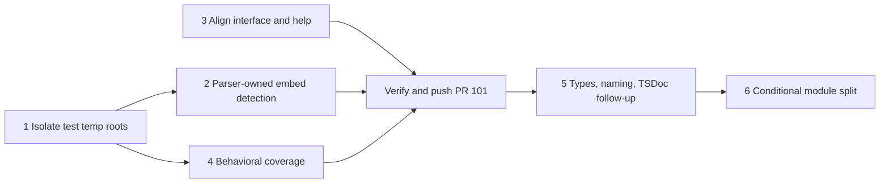

# PR 101 Architecture Evaluation

## Verdict

**Requires revision at published head `dd23741109c1f01a2c22de7dcd56d5317be998a6`.** A folder move can materialize content from outside the declared scope through a symlink. Escaped prose can also incorrectly block a valid move. Both were reproduced against the current published build, despite all 16 rename integration tests passing.

This is a report-only evaluation against the explicitly requested Core, Object-Oriented, TypeScript, and Testing principles. No implementation files were changed by this evaluation.

## Principle Reports

All 27 categories across the four requested sets were evaluated independently. Each report includes category compliance, principle citations, recommendations, priorities, document hygiene, and a current-head update.

| Set | Categories evaluated | Detailed assessment | Current revision |
|---|---|---|---|
| Core | 9 | [Principle compliance](pr-101-core-eval-report.md#Principle%20Compliance) | [Current PR update](pr-101-core-eval-report.md#Current%20PR%20Update) |
| Object-Oriented | 5 | [Principle compliance](pr-101-oop-eval-report.md#Principle%20Compliance) | [Current PR update](pr-101-oop-eval-report.md#Current%20PR%20Update) |
| TypeScript | 6 | [Principle compliance](pr-101-typescript-eval-report.md#Principle%20Compliance) | [Current PR update](pr-101-typescript-eval-report.md#Current%20PR%20Update) |
| Testing | 7 | [Principle compliance](pr-101-testing-eval-report.md#Principle%20Compliance) | [Current PR update](pr-101-testing-eval-report.md#Current%20PR%20Update) |

The per-area recommendations are advisory inputs to this synthesis. For embed recognition, the synthesis chooses the parser-owned correction rather than a second escape-aware regex in rename: the reproduced false refusal already supplies a reason to repair the boundary.

## Revision and Evidence Basis

The review began at `7d627ae6b0ed77b050c0c4ae1a8a09ef27dcc27c`. Local fixes existed at the start and were subsequently committed and published as `dd23741109c1f01a2c22de7dcd56d5317be998a6` during the review. `gh pr view 101 --json headRefOid,url` confirmed the new published head. The per-area reports preserve their original snapshot references and include current-head updates; resolved defects from the original snapshot are not current blockers.

Canonical requirements are the [rename interface](../spec/005-interfaces.md#`jact%20rename%20<source...>%20<destination>`), [rename workflow](../spec/006-behavior.md#Rename%20Workflow%20%28%60jact%20rename%60%29), and [Flavor Extension Collection decision](../adrs/003-adrs.md#ADR-0003%20—%20Flavor%20Extension%20Collection). There is no separate module specification under `src/core/docs/`; the repository living specification applies.

## Confirmed Current Findings

### High — Folder descendants bypass the scope and symlink-identity checks

**Location:** `src/core/rename-markdown-file.ts:309-316`, directory expansion at `:486-491`, and staged replacement in `commitPlan`.

`filesUnder()` includes file symlinks using their lexical paths. Top-level sources are canonicalized and checked against scope, but the descendants of a directory are not individually authorized. The path map claims canonical paths while retaining symlink paths. Parsing and backup copying follow those links; staging and replacing an edited document then replaces the symlink with a regular file.

**Reproduction:** create `scope/notes/a.md`; create `secret.md` outside `scope` containing `# PRIVATE` and a Markdown link to the absolute path of `scope/notes/a.md`; symlink `scope/notes/secret.md` to the external file. Run `rename notes archive --scope <scope> --fix --json` from `scope`.

**Observed on current head:** exit `0`; `scope/archive/secret.md` is a regular file containing the external private content and a rewritten link to `archive/a.md`. The original external file is unchanged. This is content materialization outside the intended authorization model, not a claim that the external original was modified.

**Recommendation:** define and enforce the descendant-symlink policy before parsing or writing. The smallest safe policy is to reject unsupported symlink descendants. If symlinks are supported, authorize their canonical targets and preserve their identities through apply and recovery. Add a CLI regression that verifies refusal and no content or identity changes.

**Principle impact:** scope containment and safety by default; canonical data invariants; accurate boundary contracts; regression tests for consumer-visible failure modes.

### Medium — Escaped prose is reinterpreted as an image embed

**Location:** `src/core/rename-markdown-file.ts:542-548`.

`brokenEmbeds()` searches decoded mdast text with a regular expression. Escaping has already been decoded into a text node, so literal prose can be mistaken for live Markdown syntax. This conflicts with the parser-owned syntax boundary in the [Flavor Extension Collection decision](../adrs/003-adrs.md#ADR-0003%20—%20Flavor%20Extension%20Collection).

**Reproduction:** create `notes/a.md`, `notes/p.png`, and `index.md` containing the literal escaped source `\!\[\[notes/p.png\]\]`. Run `rename notes archive --scope <root> --fix --json`.

**Observed on current head:** exit `1`, reporting an image embed that would break. `notes/a.md` remains in place. There is no data loss, but a valid move is refused.

**Recommendation:** detect actual embed syntax in the parser's flavor extensions and expose structured embed information to rename. Do not re-parse decoded text in the consumer. Add a negative regression for escaped prose alongside the existing real-embed refusal case.

**Principle impact:** parser ownership and module boundaries; avoiding duplicate interpretation; testing failure and negative paths.

### Medium — The canonical interface still promises unconditional recovery

**Location:** `docs/spec/005-interfaces.md:126`, `:154`.

The [rename interface](../spec/005-interfaces.md#`jact%20rename%20<source...>%20<destination>`) still says every failure undoes moves and restores edited files. The published fix instead attempts each recovery step and reports failures and retained backups; the [rename workflow](../spec/006-behavior.md#Rename%20Workflow%20%28%60jact%20rename%60%29), README, and help now describe that limitation. The interface also omits the new existing-literal-path precedence while describing globs as expanded like validation.

**Recommendation:** align the canonical interface with the current published recovery guarantees and literal-path precedence. This is a verified documentation inconsistency, not another independently reproduced transaction defect.

## Priorities

1. Before merge: enforce descendant authorization and symlink identity, with a no-write refusal regression.
2. Before merge: fix the escaped-prose refusal through parser-owned syntax recognition, retaining the real-embed safety guard.
3. Before merge: align the canonical interface with the published recovery and source-selection contracts.
4. Advisory: data-model tightening, naming, targeted coverage gaps, and documentation cleanup below. Do not require broad module restructuring to resolve the demonstrated defects.

## Resolved During Review

| Original defect | Original observation at `7d627ae` | Current published state at `dd23741` |
|---|---|---|
| Existing bracketed source treated as a glob | `rename notes/[ab].md new.md --fix` moved `[ab].md`, `a.md`, and `b.md` into `new.md/`, exit 0 | Fixed. Existing paths take precedence over glob classification. Re-run moved only `[ab].md` to `notes/new.md`; `a.md` remained. Regression passes. |
| Directory-cleanup failure stopped rollback restoration | Injected second-move failure created a foreign file in the new directory. Cleanup failed with `ENOTEMPTY`, moves reversed, but `a.md` and `index.md` retained post-move links | Fixed. Recovery attempts each step independently and aggregates failures. The new CLI regression verifies restored original content and preservation of the foreign file; it passed. |

These are historical findings, not remaining actions against the current PR.

## Additional Recommendations

These are maintainability or test-coverage recommendations, not additional reproduced data-loss defects.

- Encode `RenameMove.kind` and directory-only `movedFiles` as a discriminated union instead of independently optional fields.
- Align the now-batch-capable module name with its public operation; the singular `rename-markdown-file.ts` no longer describes the full responsibility.
- Document exported contracts and module boundaries using the repository's existing TSDoc conventions.
- Add targeted behavioral assertions for preview immutability, destination rules, overlapping plans, unresolved outgoing links, and final backup locations where coverage is missing. Do not add tests of private wiring or duplicated forwarding.
- Use unique temporary roots for integration runs. The newly added batch tests share a fixed temporary path, so concurrent invocations can interfere; this concurrency risk was identified statically, not reproduced.
- Clarify the image-embed wording. A reference-style image `![picture][pic]` with `[pic]: notes/p.png` successfully moves and its definition is rewritten to `archive/p.png`. It is not a broken-image finding, but broad wording that no image embed is rewritten is inaccurate.

## Verification

| Revision | Exercised check | Observed result |
|---|---|---|
| Original published `7d627ae`, isolated Git archive | `npm run build` | Passed |
| Original published `7d627ae`, isolated Git archive | `npx vitest run test/cli-integration/rename-command.test.ts` | 14/14 passed |
| Current published `dd23741`, branch checkout | `npm run build` | Passed |
| Current published `dd23741`, branch checkout | `npx vitest run test/cli-integration/rename-command.test.ts` | 16/16 passed |
| Both revisions | Actual CLI symlink-descendant and escaped-prose probes | Both remaining defects reproduced |
| Both revisions | Actual CLI literal-bracket probe | Defect at original head; correct single-file behavior at current head |
| Current published `dd23741` | Actual CLI unsafe `![[notes/p.png]]` incoming embed probe | Correct refusal, exit 1 |
| Current published `dd23741` | Actual CLI reference-style image probe | Successful move; definition rewritten correctly |
| Original published `7d627ae` | Actual CLI injected rollback cleanup failure | Edited documents were not restored |
| Original published `7d627ae` | Changed capability citation validation (`008-capabilities.md`, line 13) | 1 citation valid |

Only the rename integration suite and the listed runtime probes were exercised; the full repository suite was not run. No PR comments were posted and no code fixes were applied by this evaluation.

## Implementation Effort Estimate

An independent Claude Opus advisor read the four reports and implementation. These are planning estimates, not measured implementation durations. They assume one engineer familiar with TypeScript and this repository, and de-duplicate the same findings across principle sets.

### Merge-Blocking Scope

| Work | Estimated engineering effort | Included |
|---|---|---|
| Reject symlink descendants safely | 40–60 minutes from the evaluated snapshot | Guard, no-write regression using an actual symlink, refusal documentation and path-contract comment |
| Recognize actual wiki embeds in the parser | 90–150 minutes | Existing tokenizer reuse or dedicated embed construct, structured parser output, consumer migration, escaped-vs-real syntax regressions, existing image behavior preservation |
| Align the canonical interface | 20–30 minutes | Literal-path precedence and truthful recovery guarantees; cross-check workflow, README and help |
| Shared verification | 15–20 minutes | Build, targeted tests and actual CLI safety probes |
| **Total from evaluated snapshot** | **Approximately 3–4.5 hours** | Three blockers, regressions and verification |

**Revision update:** the symlink-refusal guard is now committed and published in `5975560a004b97e2cbb869ab982350b585fb8b3b` ("Reject shortcuts inside renamed folders (#101)"). Source inspection found that `filesUnder()` explicitly rejects symlinks at `src/core/rename-markdown-file.ts:313-317`, and the workflow documentation describes that refusal. `gh pr view 101 --json headRefOid` confirmed the published revision. The full estimate above includes implementation work already completed. This effort assessment did not check the new regression coverage or exercise the new guard. The earlier confirmed findings remain historical evidence for `dd23741`, not a new claim that the symlink defect remains in `5975560`.

The dominant uncertainty is embed tokenization. The advisor proposed using the wikilink tokenizer's preceding-character context, but did not demonstrate that this distinguishes escaped punctuation correctly. Treat that shortcut as **[INFERENCE]**, not an approved implementation. Verify escaping behavior with a small throwaway probe first; a dedicated construct starting at `!` is the fallback. Consumer-side escape-aware regex is not the chosen correction.

The already-published bracketed-filename and rollback-continuation fixes are excluded from this estimate.

### Optional Work and Totals

| Scope | Incremental engineering effort | Cumulative from evaluated snapshot |
|---|---|---|
| Additional behavioral coverage: destination/refusal boundaries, preview immutability, backup locations | Approximately 1–1.25 hours | Approximately 4–6 hours with blockers |
| Small type, naming, documentation and test-isolation improvements | Approximately 1.5–2.25 hours | Approximately 5.5–8 hours with blockers and coverage |
| Split the module and add focused planner unit tests | Approximately 2.5–3.5 hours | Approximately 8–12 hours for every recommendation |

Small improvements include a discriminated move union (25–35 minutes), explicit destination mode (15–25), plural operation filename (10–15), TSDoc and boundary documentation (15–25), unique temporary test roots (10–15), and accurate image-embed wording (10–15). Type invariants and isolated fixtures are deterministic safeguards; naming and prose are clarity improvements, not equivalent safety enforcement.

**Recommendation:** finish the remaining blockers plus high-value behavioral coverage in one focused pass. Reserve roughly one working day including review and interruptions, rather than treating the individual report minute estimates as a delivery promise. Defer broad module splitting until a concrete change makes it useful. The published symlink guard reduces the remaining implementation work, but does not remove the need to prove refusal and no-write behavior.

**Remaining-work estimate after `5975560`: approximately 2–4 engineering hours** for parser-owned embed recognition, canonical-interface alignment and final regression/CLI verification, allowing for any missing symlink regression assertions. With the additional behavioral coverage, reserve approximately 3–5 engineering hours. These narrower ranges are the parent synthesis of the advisor estimate and the newly confirmed published fix; they are not a new implementation measurement.

Engineering effort is not agent runtime or guaranteed elapsed time. No implementation, new tests, or runtime verification were performed for this estimate.

## Fix Sequencing Plan

Covers every finding in the four principle reports, deduplicated, against PR head `5975560`. Order and grouping were cross-checked by an independent GPT-6.1 advisor that read the reports and current sources; effort figures are planning estimates, not measurements.

### Finding Disposition

| Finding | Source reports | Disposition |
|---|---|---|
| Symlink descendants escape scope | Core, OOP, TypeScript, Testing | Resolved in `5975560`; file and folder refusal regressions exist in `test/cli-integration/rename-command.test.ts` |
| Bracketed literal treated as glob; rollback stops at first error | Core, OOP, TypeScript, Testing | Resolved in `dd23741` ([Resolved During Review](#Resolved%20During%20Review)) |
| Escaped prose blocks a move (regex over decoded text) | All four | Phase 2, this PR |
| Interface spec promises unconditional recovery; omits literal-path precedence | OOP, synthesis | Phase 3, this PR |
| Image-embed wording too broad (README, 005, `src/cli.ts` help) | Core, TypeScript, synthesis | Phase 3, this PR |
| Fixed temp roots shared across runs | Testing, synthesis | Phase 1, this PR |
| Missing refusal rows, directory-to-new-path, preview immutability, backup final location | Testing, synthesis | Phase 4, this PR |
| Discriminated `RenameMove`, destination mode replacing `batch`, single-file pair | Core, TypeScript | Phase 5, follow-up PR |
| Plural module filename; one Markdown-path helper in tests | Core, TypeScript | Phase 5, follow-up PR |
| Module preamble, export TSDoc, `Contract:` markers, `MovePlan.moved` comment | OOP, TypeScript | Phase 5, follow-up PR |
| `CliRenameOptions` in core signature; concrete deps instead of `*Like` interfaces | TypeScript (pre-existing debt) | Phase 5, follow-up PR |
| Split module by responsibility; mirrored core test file | OOP, Testing | Phase 6, conditional follow-up |
| Interim consumer-side backslash check for embeds | OOP | Dropped: superseded by Phase 2 parser fix |
| `verifyRelationships` bypasses the DI factory | TypeScript (pre-existing debt) | Disputed: advisor found it already uses the factory (`src/core/rename-markdown-file.ts:658-667`); confirm in Phase 5, no change otherwise |
| Document hygiene | All four | No violations reported; nothing to fix |

### Phases

| Phase | PR | Work | Acceptance | Effort |
|---|---|---|---|---|
| 1. Isolate test temp roots | 101 | Replace fixed `workDir`/`batchDir` with `mkdtempSync` roots; derive dependent paths | Two concurrent runs of the rename suite pass; cleanup removes only its own root | 15–25 min |
| 2. Parser-owned embed detection | 101 | Throwaway probe first (real embed, fully escaped, escaped `!`, escaped brackets, inline and fenced code, plain wikilink); choose tokenizer-context reuse or a dedicated `!` construct per [ADR-0003](../adrs/003-adrs.md#ADR-0003%20—%20Flavor%20Extension%20Collection); expose typed embed output; replace the decoded-text scanner in `brokenEmbeds` in one atomic commit | Escaped prose moves; real unsafe wiki and inline embeds still refuse with exit 1 and no writes; reference-style definitions still rewrite; existing validate/extract wikilink results unchanged | 2–3 h |
| 3. Align public contracts | 101 | Update the [rename interface](../spec/005-interfaces.md#`jact%20rename%20<source...>%20<destination>`) for literal-path precedence, best-effort recovery with reported backups, symlink refusal, and narrowed image-embed wording; cross-check README, [rename workflow](../spec/006-behavior.md#Rename%20Workflow%20%28%60jact%20rename%60%29), and CLI help | Each documented outcome matches the literal-file, failed-recovery, symlink, and reference-image scenarios; citations validate | 30–45 min |
| 4. Behavioral coverage | 101 | Add refusal rows (unresolved outgoing link, source inside directory source, destination inside moved directory, destination equals source, missing batch source), directory-to-new-path success, preview immutability for batch/glob/folder, backup at reported final path | Refusals and previews leave the tree byte-identical, including `.bak` and temp artifacts (current `snapshot()` excludes `.bak`); backup path and content exact | 1–1.5 h |
| Verify and push | 101 | `npm run build`, full `npm test`, actual CLI escaped-vs-real embed probes | All pass; probes match acceptance above | 20–30 min |
| 5. Types, naming, TSDoc | Follow-up | Commit A: discriminated `RenameMove`, destination mode, core-owned options and `*Like` deps. Commit B: plural filename, imports, spec path, shared test helper. Commit C: preamble, export TSDoc, `Contract:` markers | Build and rename suite pass; JSON and human output unchanged | 2–3 h |
| 6. Module split and core tests | Conditional follow-up | Split planning, rewriting, and transaction once a concrete change needs it; add mirrored core tests for public behavioral contracts only | End-to-end outcomes, rollback, and backup locations unchanged | 2.5–3.5 h |

### Ordering Rationale

- Phase 1 precedes 2 and 4 because every new regression uses the shared fixtures.
- Phase 3 is independent and can run alongside 1 and 2.
- Phase 2 precedes any module split: extracting today's scanner first would move the wrong boundary twice.
- Within Phase 5, types precede TSDoc, and the filename change precedes path-bearing docs and tests.
- Phases 5 and 6 move to follow-up PRs because they change no behavior and would enlarge a safety-critical diff under review.

**Biggest risk:** changing wikilink tokenization can alter ordinary link extraction for `validate` and `extract`, not only rename. `src/core/MarkdownParser/extractWikilinks.ts` converts every wikilink node into a link. Phase 2 must prove embed-versus-link classification across those commands before committing to tokenizer reuse.

**Totals:** about 4.5–6 hours to make PR 101 merge-ready (Phases 1–4 plus verification); about 4.5–6.5 hours more for both follow-ups.
